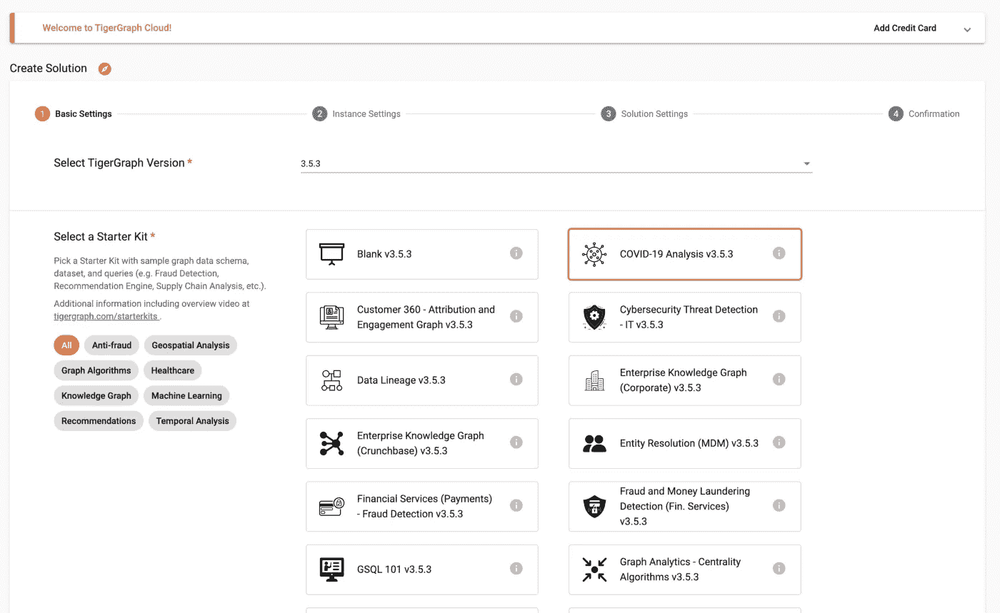
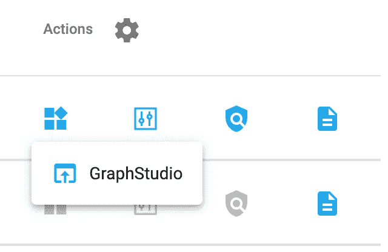
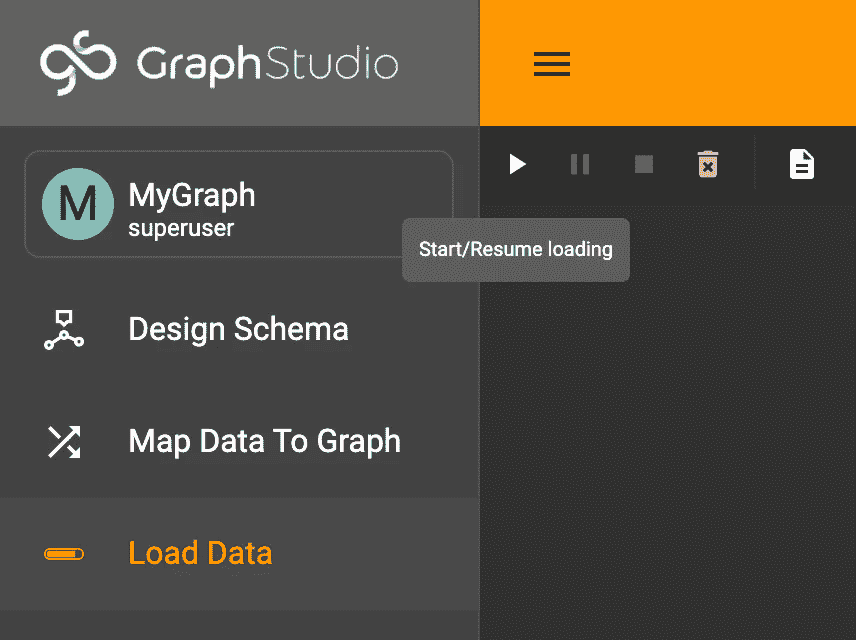

# 将 TigerGraph 与 Go 结合使用简介:探索新冠肺炎患者案例

> 原文：<https://towardsdatascience.com/an-introduction-to-using-tigergraph-with-go-exploring-covid-19-patient-cases-f2c0e45849e4>

## 通过 TigerGraph REST 端点和 TigerGo 使用 TigerGraph 和 Golang 查询图形数据库


图片来自 [Pixabay](https://pixabay.com/illustrations/nature-reserve-environment-6734180/)

# 概观

## 介绍

最近，我学习了 Go (Golang)的基础知识，并决定用我的新知识构建一个名为 TigerGo 的 TigerGraph Go 包。在这篇博客中，我将介绍使用新库的基础知识，以及如何使用 Go 创建查询 TigerGraph 图形数据库。

## 工具

*   [TigerGo](https://github.com/GenericP3rson/TigerGo) (v0.0.2):今天创建了一个新的 TigerGraph Go 包装器，通过 Go 与 TigerGraph 图形数据库进行交互。
*   [TigerGraph Cloud](https://tgcloud.io/) :免费创建和托管一个 TigerGraph 解决方案
*   [Go](https://go.dev/) :谷歌创造的语言。

# 第一部分:创建并准备一个 TigerGraph 解决方案

## 第一步:创建解决方案

首先，在 [TG Cloud](https://tgcloud.io/) 上创建一个 TigerGraph 解决方案。在那里，导航到“我的解决方案”选项卡，然后按蓝色的“创建解决方案”按钮。


选择“我的解决方案”,然后按“创建解决方案”

在第一页上，选择任何初学者工具包。对于这个例子，我将使用新冠肺炎分析初学者工具包。



选择初学者工具包

第二页保持原样；这将建立一个免费的 TigerGraph 实例。在第三页上，适当地配置解决方案。


适当配置设置

> 注意:请记住您的子域和初始密码！

最后，在最后一页，验证所有信息都是正确的，然后按“提交”！您需要给解决方案几分钟时间来启动。

## 第二步:加载数据

解决方案启动并运行后，单击“应用程序”按钮启动 GraphStudio，然后从下拉菜单中选择“GraphStudio”。一旦启动，您可能需要登录。



打开 GraphStudio

在 GraphStudio 中，单击左上角的“MyGraph ”,导航到加载数据，然后按播放按钮加载所有数据。



加载所有数据

完美！这样，您就可以在 Go 中与解决方案进行交互了！

# 第二部分:创建一个 Go 项目并导入 TigerGo

## 第一步:导入包

有了创建的信息，接下来您需要创建一个新的 Go 项目，然后导入 TigerGo 包。首先，创建一个新的 Go 项目:

```
mkdir GoProject && cd GoProjectgo mod init GoProject
```

接下来，为代码创建一个主文件并导入库，`github.com/GenericP3rson/TigerGo`。

```
package mainimport(
   "fmt"
   "github.com/GenericP3rson/TigerGo"
)func main() { // Main code will be here}
```

> 注意:当使用 Visual Studio 代码时，上面的代码会自动删除导入，因为它们没有被使用。

然后，您可以通过两种方式导入该库。您可以通过以下方式手动获取软件包:

```
go get github.com/GenericP3rson/TigerGo
```

或者，您可以使用以下命令让 go mod 自动导入它:

```
go mod tidy
```

> 注意:TigerGo 正处于实验阶段，在这篇博客之后将经历发展。然而，一般语法应该保持不变，镜像 [pyTigerGraph](https://docs.tigergraph.com/pytigergraph/current/intro/) 。

## 第二步:建立联系

首先，通过创建一个 TigerGraphConnection 开始。这将需要您的解决方案的用户名(默认为“tigergraph”)和密码、图形名称和您的主机。这也需要一个令牌，但是您可以将其留空，创建一个名为`GetToken`的令牌，然后填充这个令牌。

```
package mainimport(
   "fmt"
   "github.com/GenericP3rson/TigerGo"
)func main() { conn := TigerGo.TigerGraphConnection{ Token: "", // Leaving it empty for now
      Host: "https://SUBDOMAIN.i.tgcloud.io",
      GraphName: "GRAPHNAME",
      Username: "tigergraph",
      Password: "PASSWORD" } fmt.Println(conn.GetToken())}
```

对于我的例子，代码看起来像这样，密码被编辑:

```
package mainimport(
   "fmt"
   "github.com/GenericP3rson/TigerGo"
)func main() { conn := TigerGo.TigerGraphConnection{ Token: "", // Leaving it empty for now
      Host: "https://golang.i.tgcloud.io",
      GraphName: "MyGraph",
      Username: "tigergraph",
      Password: "PASSWORD" } fmt.Println(conn.GetToken())}
```

生成令牌后，在 token 下替换它，因为它是所有其他函数工作所必需的。

```
package mainimport(
   "fmt"
   "github.com/GenericP3rson/TigerGo"
)func main() { conn := TigerGo.TigerGraphConnection{ Token: "TOKEN",
      Host: "https://golang.i.tgcloud.io",
      GraphName: "MyGraph",
      Username: "tigergraph",
      Password: "PASSWORD" }}
```

完美！这样，您就可以开始运行命令了。

# 第三部分:命令

## 顶点命令

有几个 TigerGo 函数用于检索和操纵顶点。例如，使用 TigerGo，您可以获得某种类型的所有顶点。例如，如果您想要抓取所有患者顶点，您可以使用:

```
conn.GetVertices("Patient")
```

REST 等价查询`/graph/{graph_name}/vertices`端点。

```
client := &http.Client{ Timeout: time.Second * 10, } req, err := http.NewRequest("GET", fmt.Sprintf("%s:9000/graph/%s/vertices/%s", HOST, GRAPHNAME, vertex_type), nil) if err != nil { return err.Error() }req.Header.Set("Authorization", "Bearer "+TOKEN) 
response, err := client.Do(req)if err != nil { return err.Error() }
```

## 边缘命令

同样，TigerGo 提供了涉及边缘的函数。例如，假设我想看看病人如何与周围环境互动。为此，我可以抓住所有与病人相连的边。

```
conn.GetEdges("Patient", "SOME_PATIENT_ID")
```

REST 等价物将向`/graph/{graph_name}/edges`端点发出请求。

```
client := &http.Client{ Timeout: time.Second * 10, }req, err := http.NewRequest("GET", fmt.Sprintf("GET", fmt.Sprintf("%s:9000/graph/%s/edges/%s/%s/_", HOST, GRAPHNAME, source_vertex, source_vertex_id), nil)if err != nil { return err.Error() }req.Header.Set("Authorization", "Bearer "+TOKEN) 
response, err := client.Do(req)if err != nil { return err.Error() }
```

## 查询命令

最后，使用 TigerGo 包，您可以运行已安装的查询。新冠肺炎初学者工具包带有许多预安装的查询。例如，让我们运行`ageDistribution`，一个返回患者年龄分布的查询。

> 注意:请确保在运行查询之前安装了 ageDistribution。

```
conn.RunInstalledQuery("ageDistribution")
```

REST API 版本向`/graph/{graph_name}/{query_name}`发送 GET 请求。

```
client := &http.Client{ Timeout: time.Second * 10, }req, err := http.NewRequest("GET", fmt.Sprintf("%s:9000/query/%s/%s", conn.Host, conn.GraphName, queryName), nil)if err != nil { return err.Error() }req.Header.Set("Authorization", "Bearer "+TOKEN) 
response, err := client.Do(req)if err != nil { return err.Error() }
```

# 第四部分:结论、资源和后续步骤！

这就是 TigerGo 的快速介绍！想做点贡献？随时向[回购](https://github.com/GenericP3rson/TigerGo)提出拉取请求！

[](https://github.com/GenericP3rson/TigerGo) [## GitHub-generic 3 rson/tiger go

github.com](https://github.com/GenericP3rson/TigerGo) 

对围棋感兴趣？我之前写了一篇关于进入 Go 和创建一个包的博客，你可以看看！

[](https://shreya-chaudhary.medium.com/creating-and-deploying-your-first-go-package-eae220905745) [## 创建和部署您的第一个 Go 包

### 创建 TigerGraph 包装器 Go 库的分步指南

shreya-chaudhary.medium.com](https://shreya-chaudhary.medium.com/creating-and-deploying-your-first-go-package-eae220905745) 

有兴趣创建自己的 TigerGraph 包装器吗？点击查看官方端点[的完整文档。](https://docs.tigergraph.com/tigergraph-server/current/api/built-in-endpoints)

[](https://docs.tigergraph.com/tigergraph-server/current/api/built-in-endpoints) [## 内置端点- TigerGraph 服务器

### 这些端点是简单的诊断实用程序，如果 RESTPP 服务器启动，它们会响应以下消息…

docs.tigergraph.com](https://docs.tigergraph.com/tigergraph-server/current/api/built-in-endpoints) 

最后，如果您在开发项目时有任何问题或想与 TigerGraph 开发人员聊天，请加入 [the Discord](https://discord.gg/DMHabbX3BA) ！

[](https://discord.gg/DMHabbX3BA) [## 加入 TigerGraph Discord 服务器！

### 查看 Discord 上的 TigerGraph 社区-与 1，280 名其他成员一起玩，享受免费的语音和文本聊天。

不和谐. gg](https://discord.gg/DMHabbX3BA) 

> 注:除特别注明外，所有图片均由作者创作。