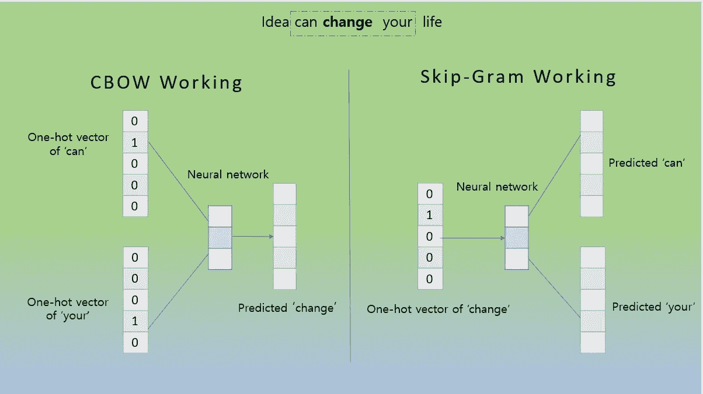
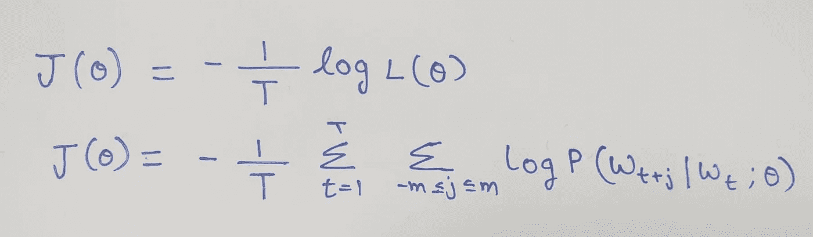
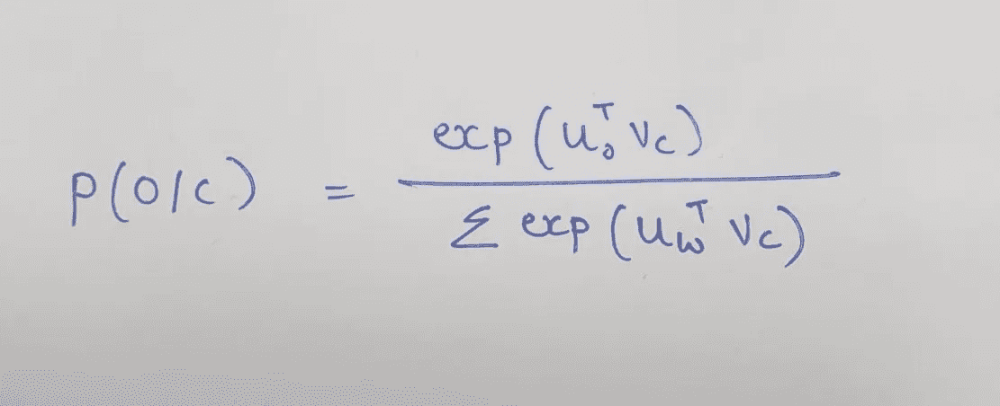
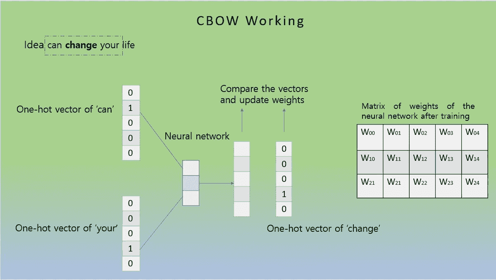

# 自然语言处理中的 Word2Vec 介绍

> 原文：<https://towardsdatascience.com/an-introduction-to-word2vec-in-nlp-854e1c288894>

## Word2Vec 的直观数学解释

斯文·布兰德斯马在 [Unsplash](https://unsplash.com?utm_source=medium&utm_medium=referral) 上的照片

> 裁缝向她展示如何在她的夹克上缝制一颗**纽扣**。与此同时，她的朋友在外面等着看电梯按钮。

作为人类，本能的会注意到上面两句话中“按钮”这个词的不同含义。但是机器学习模型如何实现这一点呢？

任何使用自然语言的人的首要任务是用数字来表示单词。在过去的十年中，已经使用了许多技术，例如一键编码、TF-IDF、N-grams。但是这些技术没有包含单词语义，并且通常是稀疏表示。本文介绍了一种名为 Word2Vec 的单词嵌入技术。

# Word2Vec

> “从一个人和什么样的人交往，你就可以知道他说了什么。”——约翰·鲁珀特·弗斯

Word2Vec 是一种最先进的算法，用于在庞大的语料库中生成所有单词的固定长度分布式向量表示。Word2Vec 的有效性有两个原因——第一，使用固定大小的向量，这意味着向量大小不依赖于语料库中唯一单词的数量。第二，在向量表示中加入语义信息。Word2Vec 向量在将相似的单词组合在一起时非常有效。该算法可以基于单词在语料库中的位置做出强有力的估计。例如，“Kid”和“Child”是相似的，因此它们的向量表示将非常相似。

Word2Vec 可以在两种架构中实现— **连续单词包(CBOW)和 Skip-Gram。**word 2 vec 的主要思想围绕着在固定大小的窗口中基于中心单词预测上下文(外部)单词，反之亦然。

例如，考虑语料库的以下部分:

> *…。做梦的可能性* ***来了*** *真的让生活变得有趣…..*

在上面的例子中，固定窗口为 3，让“*”为中心词，“ ***梦*** ”和“ ***真*** ”为外词。给定中心词*来*，CBOW 预测*做梦*和*真*的概率，给定上下文词*做梦*和*真*，Skip-Gram 预测中心词来。*

*   *CBOW —根据上下文(外部)单词预测中心单词。*
*   *skip-Gram-根据中心词预测上下文词*

**

*CBOW 和 Skip Gram 体系结构。例句——“想法可以改变你的生活”。图片作者。*

# *目标函数*

*目标函数也称为误差函数或成本函数。在反向传播期间，神经网络使用梯度下降计算目标函数的最小值。下面是固定大小窗口中每个单词的概率的示例表示。*

**

*大小为 1 的示例窗口。使用中心单词“come”来预测上下文单词。图片作者。*

*考虑大小为 t 的语料库。给定中心单词 Wₜ，对于 t (1，2…，t)的每个位置，预测固定窗口大小 m 内的上下文单词。可能性由下式给出:*

**

*似然函数。图片作者。*

*似然函数取决于参数θ。θ是所有要优化的变量，它是 word 的向量表示。目标函数(也称为成本函数或损失函数)是对数似然的平均负值。*

**

*目标函数(损失函数)-平均负对数损失。图片作者。*

*该函数对所有中心单词进行平均，因此该函数不依赖于语料库中唯一单词的数量。使用称为梯度下降的方法最小化目标函数。*

***如何计算 P(Wₜ₊ᴊ /Wₜ)？***

*每个单词有两个向量:*

*   **v* 当单词是中心词时*
*   **u* 当单词是上下文(外部)单词时*

*对于中心词 *c* 和上下文词 *o、**

**

*给定作者的中心词 *c.* 图像，外部词 o 的概率。*

*因为我们需要正值，所以使用指数。点积给出了 o 和 c 的相似性，在这种情况下，更大的点积意味着更大的概率。分母在整个语料库中归一化以给出概率分布，即分子除以语料库中每个词的相似度。事实上，上述函数是一个 SoftMax 函数，它是有意义的，因为:*

*   *Max:放大最大可能变量的概率。*
*   *软变量:给最小的可能变量赋值。*

*我们希望上下文单词肯定与中心单词一起出现，也就是说，具有高概率。因此，SoftMax 函数是一个不错的选择。*

***最终向量是如何形成的？***

*在用上述目标函数训练神经网络之后，为每个窗口获得权重。这些权重存储在一个矩阵中。为了获得每个单词的最终密集向量，将权重矩阵乘以每个单词的对应的独热向量。*

**

*获得经训练的神经网络的权重矩阵。图片作者。*

# *结论*

*单词嵌入是自然语言处理的关键步骤。使用 Word2Vec 获得单词的向量表示是非常高效的，因为这样形成的向量是密集的，并且携带对任何 NLP 应用程序都至关重要的语义信息。*

**感谢您阅读这篇文章！如果你有任何问题，请在下面留言。请务必关注我，获取我关于机器学习和数据科学的最新媒体帖子的更新:)。有问题可以在* [*LinkedIn*](http://www.linkedin.com/in/saipavanyekula) *联系我。**