# 贝叶斯统计入门

> 原文：<https://towardsdatascience.com/an-introductory-primer-to-bayesian-statistics-3415ffa28488>

## 贝叶斯统计世界的数学介绍

照片由[媒体修改器](https://unsplash.com/@mediamodifier?utm_source=medium&utm_medium=referral)在 [Unsplash](https://unsplash.com?utm_source=medium&utm_medium=referral) 上拍摄

1748 年，哲学家大卫·休谟写了一篇名为《论奇迹》的文章，认为过去写的不可信的奇迹故事不应该被相信，因为它们违背了自然法则。15 年后，托马斯·贝叶斯牧师的遗作提出了一个更重要的问题，“我们需要多少证据来支持任何主张？”

虽然他的论文确实有神学目的，但它也有许多数学含义，可以说在今天甚至更相关。

250 年后，他的简单公式仍然广泛适用，甚至创造了一个全新的统计学分支。它不仅是任何概率入门课程中的一个基本概念，也是我们今天拥有的许多重要算法和技术的动力。

# **贝叶斯公式的数学直觉**

让我们以一个简单的参数估计问题为背景来看看贝叶斯公式。我们收集一些数据 ***x*** 并且我们确定这些数据是基于某个参数 ***θ生成的。***

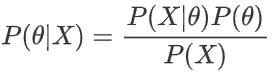

贝叶斯公式

在这种情况下，概率不是发生的概率，而是确定的程度。如果概率为 0，我们确定该主张为假，而如果概率为 1，我们完全确定该主张为真。

随着视角的改变，P(x|θ)是我们对θ值的确定性。请注意，这是一个以 x 为条件的概率。因此，后验概率本质上陈述了**“假设我们已经收集了数据 x，我们对θ的确定性如下”**

这个后部由 3 部分组成

*   **P(x|θ) —似然**:在给定当前模型的情况下，观察到证据的概率。这个模型可以看作是对数据设置了某些假设。例如，如果我们假设山洪暴发的速率为泊松分布，速率参数为 **λ** ，则可能性将基于泊松分布的**概率质量函数**。
*   **P(θ) —先验**:我们参数的初始分布。使用前面的泊松例子，我们可以近似地得出速率参数λ遵循从 1 到 3 的均匀分布
*   **P(X) —模型证据**:所有参数观察到证据**的概率。在大多数情况下，它的主要目的是作为一个标准化常数的后验。有效的概率分布的总和必须等于 1，而归一化常数有助于确保这一点。**

这个公式的有用之处在于，当额外的证据被引入时，我们可以将我们的后验概率作为新的先验概率。这就产生了一个反复的过程，在这个过程中，我们慢慢地使我们的后验概率适应证据，以评估我们对某一主张的确定性程度。

由于 **P(X)** 是一个归一化常数，在大多数情况下，我们可以将后验概率表示为一个更简单的比例方程。这允许我们将贝叶斯公式改写如下:

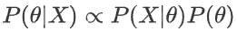

贝叶斯公式——比例

现在我们已经理解了贝叶斯公式，让我们重新回顾一下 frequentist 线性回归，看看它与贝叶斯方法有什么不同。

# **频率主义者线性回归**

在普通(简单)线性回归中，我们有一个模型，可以表述为:

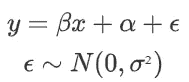

线性回归模型

我们的目标变量 y 可以分解成确定性分量 ***β x +α*** 和被建模为随机噪声的随机分量ϵ。

由此，我们还可以得到 y 的条件分布，即 **P(Y|X，β) ~ N(β x +α，ϵ)**

> 在频率统计中，我们只关心可能性。在这种情况下，我们已经标记了数据，它略有不同，因为我们关注的是**条件似然 P(Y|X，β)**

由于似然性是以 X 和β为条件的，这个条件似然性就是正态分布的概率密度函数。

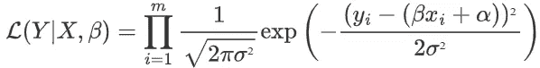

条件似然的概率分布

像往常一样，我们将其转换为更容易优化的对数似然。

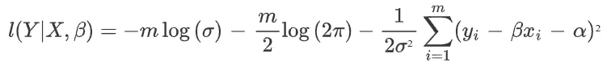

条件对数似然

现在我们有了对数似然函数，我们可以执行优化，并找到使该似然函数最大化的β。注意，前两项与β无关，可以省略。同样，由于 **1/2σ** 是常数，所以不会影响优化，可以省略。剩下的就是下面的优化目标了。

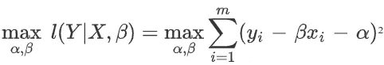

如果这个目标看起来很熟悉，那是因为它是我们都非常熟悉的最小二乘目标。

对线性回归数据集执行最小二乘法就是进行最大似然估计。本质上，这给了我们一个线性回归的统计解释！

# **贝叶斯线性回归**

在频率统计中，我们相信每个未知参数都有一个“真值”或“正确答案”。然后使用最大似然估计来获得这些参数的最佳估计。在贝叶斯统计中，参数本身是一个随机变量，我们试图从观测值中获得这个随机变量的分布。

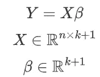

一般线性回归方程

对于贝叶斯回归，我们将展示一般情况，从方程 **Y = Xβ** 开始。对于一个有 ***k*** 特征和 ***n*** 数据点的回归问题，β是一个 k+1 大小的向量(包括截距)，X 是一个 ***n × k+1*** 矩阵。

然而，这与前一种情况有一个关键的区别。我们的参数 **β** 不再是点估计，但是**有自己的分布**。我们首先将其初始化为先验分布或 **P(θ)。**为了简化我们的计算，我们将从正态分布开始，以均值向量 **μ₀** 作为我们的先验，我们的协方差矩阵将是单位矩阵 ***I*** 。

由此，我们现在可以求解后验分布。这是通过对模型中的所有变量应用贝叶斯公式来求解后验概率来实现的。

## **为后路求解**

由于我们先前的假设，我们可以推导出这个特殊问题的解析解。回想一下，我们能够将后验概率表示为一个比例方程，它将先验概率和似然概率结合在一起。

我们的似然和先验都是多元正态分布，可以这样表示

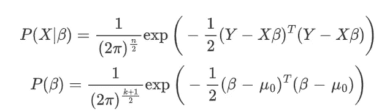

似然和先验分布

现在，让我们把重点放在指数项上，把可能性和先验结合起来。

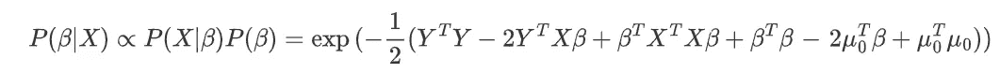

我们可以去掉不包含β的项，因为它们是常数，可以被吸收到归一化常数项中

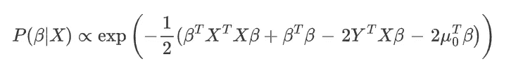

从这里我们看到后验可以表示为一般形式的
**C exp(-Q(β))** 其中 **Q(β)** 是二次多项式。这意味着后验概率必须是正态分布。现在我们的目标是将指数部分转换成(β—μ**ₙ**)ᵀσ⁻(β—μₙ).)的形式

二次部分可以分解成 **βᵀ(XᵀX+I)β** 。这给了我们**∑**一定是**【βᵀ(xᵀx+i)β】**⁻

下一部分是**-2μₙᵀσ⁻β**。这对应于 **2(YᵀX + μ₀)β** 。通过一些操作和匹配，我们也可以导出一个表达式。

> 注意:使用这个因式分解会有一个μₙᵀσ⁻μₙ项，但是它可以被去掉，因为它不是β的函数

这给了我们最后的 PDF

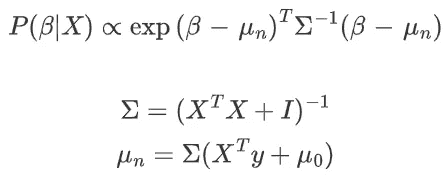

其中 **μₙ** 和**σ**分别是均值向量和协方差矩阵。

有趣的是，如果我们将初始均值 **μ₀** 设为 0 向量，我们会得到一个非常熟悉的解。如果我们添加一个正则项， **μₙ** 的值将是( **XᵀX + I)⁻ XᵀY** ，这是[岭回归解](https://en.wikipedia.org/wiki/Ridge_regression)。这意味着，从贝叶斯的角度来看，岭回归可以被视为具有以 0 为中心的先验！

贝叶斯统计告诉我们如何在证据面前调整我们先前的信念。如果我们的观察值不是正态分布的，或者我们想要不同的起始参数，我们可以自由地这样做。贝叶斯统计为我们提供了一种计算(或至少近似)参数 ***θ*** 分布的方法

# **为什么要贝叶斯学习？**

1.  **合并先前信息**

先验是非常有用的，因为它帮助我们根据数据之外的一些知识来引导我们的模型达到不同的目标。贝叶斯统计为我们提供了一种整合这些信息的数学方法。事实上，流行的正则化技术，如 L2 权重惩罚，可以从贝叶斯的角度来看，具有特定类型的先验。

**2。获得参数值的分布** 贝叶斯技术的一个巨大优势是这些模型返回参数值的分布。然后，这些参数值可用于计算预测的置信区间。在错误预测会产生巨大后果的情况下，拥有这些置信区间可以帮助决策者更好地估计错误预测的概率。

**3。数据不足** 虽然 MLE 被证明是给定足够大数量样本的最佳估计量，但在许多情况下，我们没有足够的数据点。

一种可能性是，由于难以获得样本，数据很少。另一个更常见的可能性是数据是高维的。随着维数的增加，我们需要的样本数呈指数增长，导致我们的 MLE 估计不够精确。

对参数进行点估计会将所有的概率分布折叠成一个点，这会导致模型对错误的预测非常有把握。

使用贝叶斯方法有助于模型在观察外来数据点时降低可信度，并降低产生高可信度错误预测的可能性。

然而，贝叶斯技术有一个很大的弱点，那就是它们很难计算。在许多情况下，获得 P(X)在数学上是困难的，我们不能解析地求解后验概率。在这些情况下，贝叶斯推理是通过**逼近**后验来完成的。在下一篇博文中，我将深入研究这些方法，并展示它们是如何工作的。

如果你喜欢这篇文章，请在 Medium 上关注我！
在 LinkedIn 上连接:[https://www.linkedin.com/in/reo-neo/](https://www.linkedin.com/in/reo-neo/)

## 参考

I .古德费勒、y .本吉奥和 a .库维尔，2016 年。*深度学习*。剑桥(EE。UU。):麻省理工学院出版社，pp .第 5.6 节贝叶斯统计。

珀尔朱迪亚和丹娜麦肯齐。*为什么之书*。企鹅图书，2019。