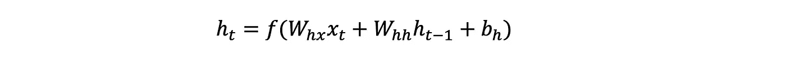
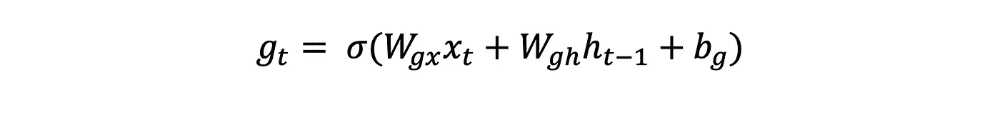
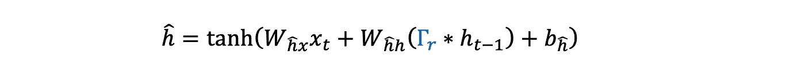
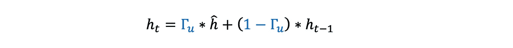
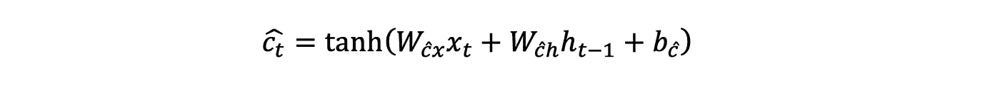
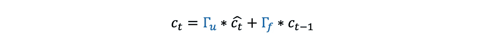
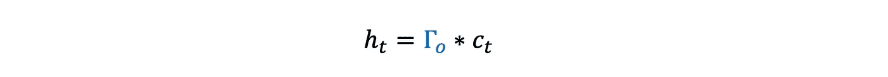
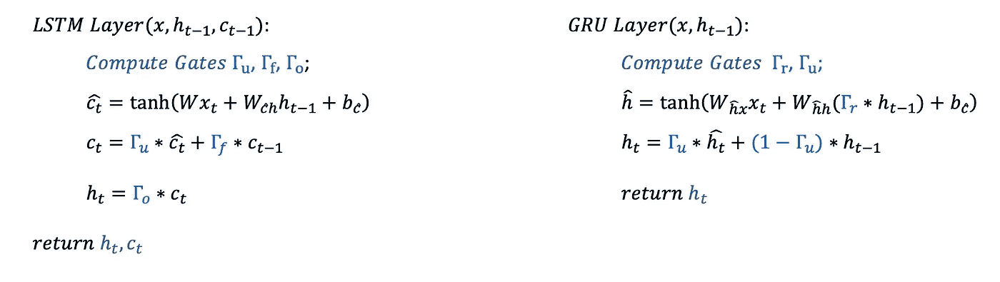

# 理解 LSTMs & GRUs —直观的方式

> 原文：<https://towardsdatascience.com/an-intuitive-approach-to-understading-of-lstms-and-grus-c2191611a37d>

## 我们将继续证明 LSTMs & GRU 比你想象的要容易

虽然当你听到自然语言处理或序列模型时，RNNs 可能是你脑海中首先闪过的东西，但该领域的大多数成功并不归功于它们，而是(在很长一段时间内)归功于解决其消失梯度问题的改进版本。即，LSTM(长短期记忆)网络或不太常见的 GRU(门控循环单元)网络。

在[之前的故事](/unriddling-rnns-with-depth-and-in-both-directions-9ed336c4b392)中，我们展示了 rnn 如何工作，以及为什么它们会受到消失梯度的影响，这限制了它们处理序列数据中长相关性的能力。我们还暗示，这样的问题可以通过**设计一个更复杂的循环层来解决。**这正是 LSTM/GRU 网络所做的事情！它用一个更复杂的版本取代了标准的递归层，该版本可以用数学方法表示，以克服消失梯度问题；从而解决了 rnn 的长期依赖性问题，提高了 rnn 的整体性能。

## 但是什么是轮回层呢？

正如我们在前面的故事中所描述的，这是一个

1-接收前一层的激活并乘以一个权重矩阵( **W** ₕ ***ₓ*** )，就像 FFNNs 中使用的密集层一样

2-获取其自身由于序列中的先前输入而产生的**激活，然后将其乘以权重矩阵( **W** ₕₕ).对于序列中的第一个字，激活向量通常被初始化为零，并且通常被称为“隐藏状态”。**

3-将偏差添加到前面两个结果中

4-对其应用激活函数并提供结果(hₜ)as 输入到其他层，就像 ffnns 中使用的密集层一样

这在数学上等同于写作

递归层使用的激活函数 ***f*** 一般是***【tanh(x)***。它可能比 ReLU(和 Sigmoid)具有更好的收敛特性，如这里的[和](https://qr.ae/pvOLbF)。

[天舒刘](https://unsplash.com/@tianshu?utm_source=medium&utm_medium=referral)在 [Unsplash](https://unsplash.com?utm_source=medium&utm_medium=referral) 上拍照

## “门”的概念

我们之前已经讨论过，LSTM 或 GRU 网络改进 RNNs 的方式是用 LSTM 或 GRU 层代替标准的循环层；这两种方法都是经过精心设计的，用来处理渐变消失的问题。但是在我们揭示每一层的结构之前，我们需要理解“门”的概念，它在两种类型的层中都被用作构建块。

数学上，我们可以把门表示为

这意味着它只是一个循环层，但有两个根本的区别

1-我们不需要跟踪它的状态；它将始终使用其所在的 LSTM/GRU 图层的先前隐藏状态。这就是为什么我们稍后会删除 *g* 中的下标。

2-它使用乙状结肠激活。

事实上，它使用 Sigmoid 是什么使它的功能作为一个门； *gₜ* 的值将总是从 0 到 1，因此当它按元素乘以另一个向量比如 *v* 时，就好像 *v*gₜ* 是 *v* 经过门 *gₜ* 的结果；例如，如果 *gₜ* 全为 1，则 *v* 将完全通过，如果全为 0，则 *gₜ* 不会通过，并且如果需要，根据 *gₜ* 的值， *v* 的一些元素可能通过，而其他一些元素不会通过，程度不同。

最后要注意的是，从现在开始，一个门将用**γ**表示，无论何时使用多个门，它们都是相互独立的；这意味着每一个都与其自身的权重和偏好相关联。

[汤姆陈](https://unsplash.com/@tomcchen?utm_source=medium&utm_medium=referral)在 [Unsplash](https://unsplash.com?utm_source=medium&utm_medium=referral) 上的照片

## GRU 层(门控循环单元)

GRU 网络用 GRU 层代替 RNNs 中的循环层。GRU 层使用两个门，一个称为关联门**(γᵣ)**，另一个称为更新门**(γᵤ)**。

一旦计算出两个门，GRU 层以下面的方式产生它的隐藏状态。

1-通过递归层计算一个**候选隐藏状态** ( **ĥ** )，该递归层在通过关联门**(γᵣ)**后使用该层的先前隐藏状态。

2-使用**更新门(γᵤ)**计算 GRU 层的隐藏状态，如下所示

为了获得一些直觉，我们先假设没有关联门(设置为全 1)。在这种情况下，每次迭代，更新门决定 GRU 层是否将作为标准递归层(基于输入学习新的隐藏状态)或者跳过学习新的隐藏状态并保留在前一次迭代中所学习的。你可以通过代入上式，确认前者成立是**γᵤ**全 1，后者成立是**γᵤ**全 0。

这意味着，如果我们有一个具有长期相关性的序列，例如“我今天早上看到的**猫****非常饥饿】,那么网络有一种方法来保留它已经学习了“猫”,方法是从该点开始将更新门设置为低，这样当它必须在是/是之间做出决定时，它会记住它。当然，在现实中，更新门采用连续的值(它不必 100%保留或 100%更新它所学习的内容),你可以认为它只是简单地决定我们应该在多大程度上保留旧信息，以及我们应该在多大程度上用新信息替换旧信息。**

关联门有一个更简单的角色，它回答“在生成候选状态时，应该在多大程度上依赖于最后一个隐藏状态？我们应该强烈依赖它吗？或者，即使更新门决定它需要涉及当前令牌的新信息，那么先前的状态是不重要的，并且我们可以假装当前令牌是序列中的第一个(即，通过将**γᵣ**设置为 0 来重置)，这是真的吗？”

最后，值得强调的是，虽然人们可以很容易地从方程中看出，门有助于 GRU 改善 RNN 的短期记忆，但网络必须自己找出答案。有了足够的训练数据和最小化损失的目标，神经网络将有希望能够学习如何设置权重，以便在给定输入序列的情况下，使用门，例如通过改善短期记忆问题来改善网络的性能。在我们进行修改之前，RNN 没有办法通过解决这个问题来提高其性能。

德里克·汤姆森在 [Unsplash](https://unsplash.com?utm_source=medium&utm_medium=referral) 上拍摄的照片

## LSTM 层(长短期记忆)

您可以将 LSTM 图层视为 GRU 图层的更复杂版本。主要区别在于

1-除了隐藏状态之外，它还有一个“单元格状态”

2-它放弃了相关性门，而是使用一个**输出门**用于类似的目的。

3-除了**更新门**之外，它还有一个**遗忘门**。

一旦**更新，** **忘记**和**输出**门被计算，LSTM 以如下方式进行

1-通过使用层的先前隐藏状态的递归层来计算候选单元状态

2-决定应该通过更新门保留多少候选状态，以及应该通过忘记门忘记多少先前的单元状态

这可以被认为是对 GRU 的改进，在 GRU，如果网络决定保留%的先前隐藏状态，那么这意味着将引入(100-A)%的候选隐藏状态。在这里，网络有单独的更新和遗忘门，所以它不会被迫做出这样的决定。如果它愿意，它可以更新 0%的候选小区状态，并完全忘记之前的小区状态。

3-决定有多少单元状态应该通过输出门激活该层

这很像 GRUs 中的关联门。事实上，我们可以消除这个等式，但是将三个门、单元状态和进一步的层输入中的 h *ₜ_₁* 的每个实例替换为(γₒ*h*ₜ_₁).*不同之处在于，它不仅适用于候选隐藏状态计算，还适用于所有其他计算。

## 让我们结束吧！

以下是针对 LSTM 和 GRU 图层中的每个令牌执行的公式:

虽然你可能会认为 lstm 总是做得更好，因为它们的复杂性和更多的可训练参数，有一些情况下 gru 往往比它们更好，但总的来说 lstm 是更占优势的选择。为了将大量的参数和计算包含在一个 LSTM 图层中，我绘制了下面图层的低层次表示。看一看它，以确保你理解流程。

作者绘图。实际上，x 和 h 只有一个来源

在我们结束之前，有一件小事我想弄清楚。尽管我们上面提供了所有的直觉，无论是 LSTM 还是 GRU，你总是可以[通过时间](/a-true-story-of-a-gradient-that-vanished-in-an-rnn-56437c1eea45)进行反向投影，以显示他们解决/改善了消失梯度问题。你甚至可以假设，研究人员想出的方法包括通过时间进行反向投影，并思考如何修改方程以缓解梯度消失的问题。

我们的故事到此结束。希望它能帮助你更好地理解 LSTMs 和 GRUs 是如何工作的。下次见，再见。