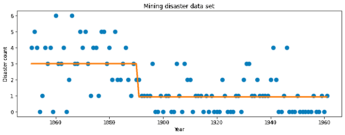
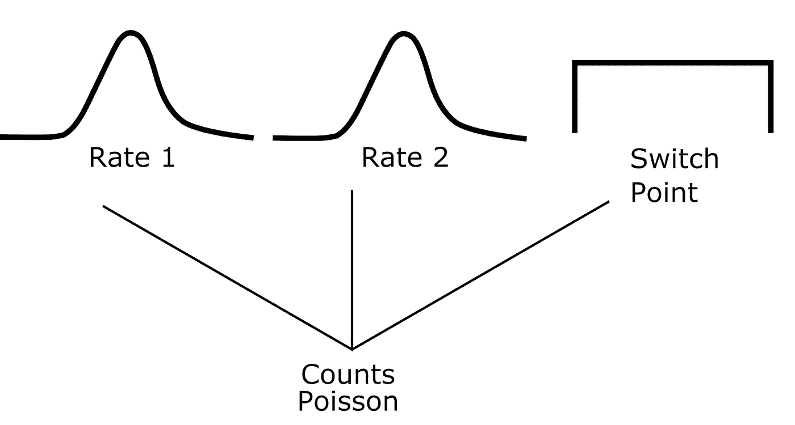
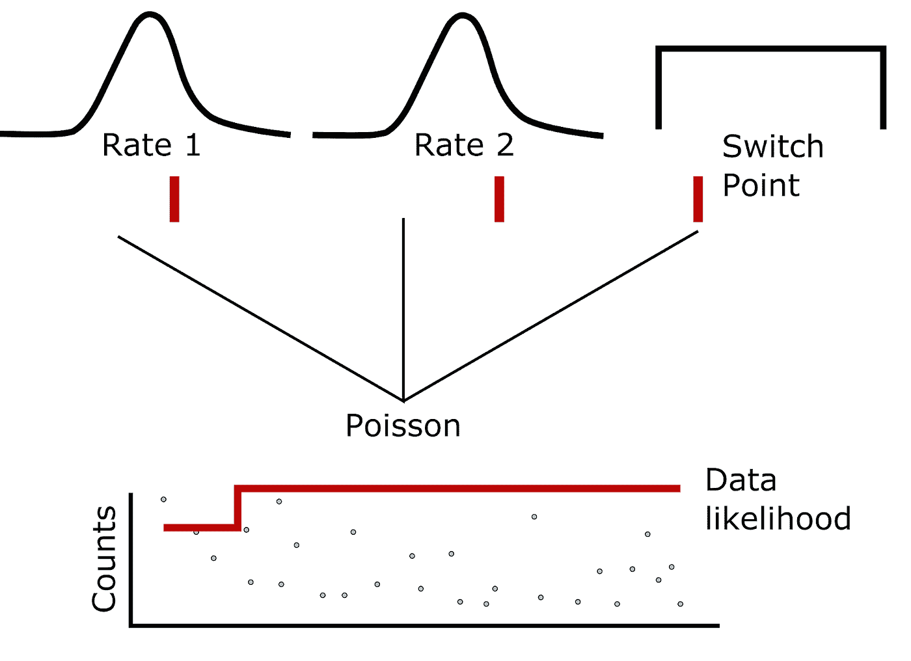
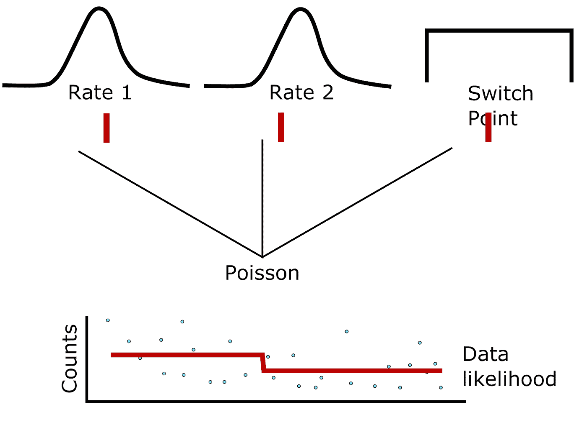
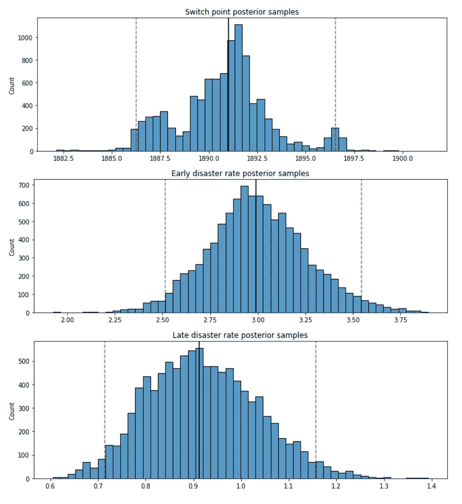
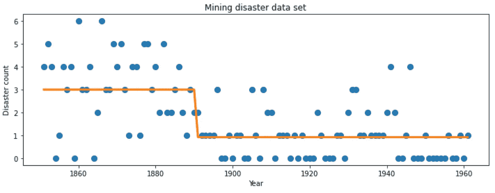
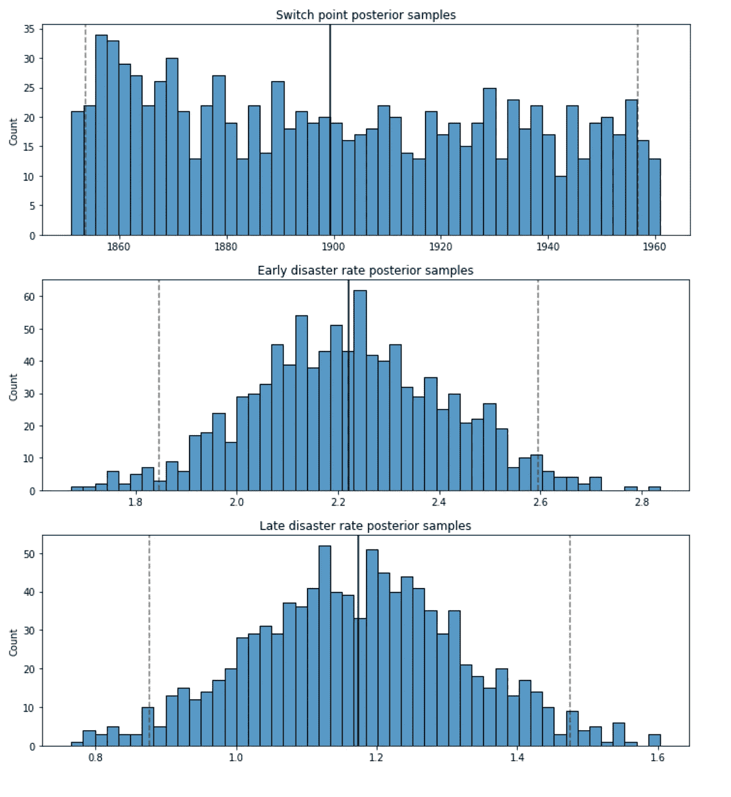
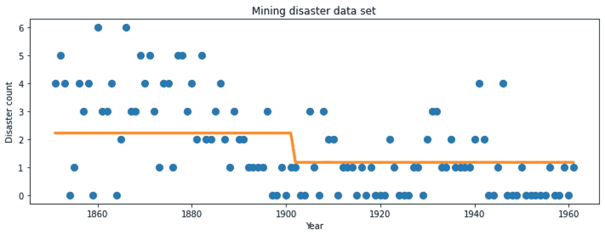

# MCMC 与变分推理的直观比较

> 原文：<https://towardsdatascience.com/an-intuitive-comparison-of-mcmc-and-variational-inference-8122c4bf37b>

## 估计未观测变量的两种巧妙方法


Yannis Papanastasopoulos 在 [Unsplash](https://unsplash.com?utm_source=medium&utm_medium=referral) 拍摄的照片

我最近开始研究“[概率编程和黑客贝叶斯方法](https://github.com/CamDavidsonPilon/Probabilistic-Programming-and-Bayesian-Methods-for-Hackers)”，这在我的任务清单上已经有很长时间了。作为一个参加过统计学和机器学习课程(包括贝叶斯统计)的人，我发现我正在通过这种编码优先的方法理解一些以前从来不清楚的事情。我强烈推荐这本书！

一些慷慨的人更新了代码以使用 TensorFlow 概率库，这是我在工作中经常使用的。因此，我的大脑终于开始通过反向传播在贝叶斯潜在变量分析和机器学习之间建立联系。我正在将马尔可夫链蒙特卡罗(MCMC)的世界与神经网络联系起来。回想起来，这似乎是我应该早点明白的事情，但是，好吧。如果你和我一样，脑子里没有这种联系，让我们现在就解决它。

**贝叶斯潜在变量分析**

“潜变量”=隐藏；没有被直接观察或者测量。

在这种情况下，“分析”是建立概率模型来表示数据生成过程的过程。一个常见的例子是开关点分析。假设我们有一段时间间隔内的统计数据(例如，一个世纪以来每年发生的[起矿难](https://www.tensorflow.org/probability/examples/Bayesian_Switchpoint_Analysis))。我们想估计新的安全条例实施的年份。我们预计事故率将在这一点后下降，之前给出一个事故率，之后给出一个不同的(希望更低的)事故率。



矿难发生率变化的例子。图片作者。

这是与神经网络的第一个联系:我们用来拟合数据的模型在某种程度上是任意的。“任意”可能是一个强烈的词——你可以说模型结构是合理选择的，带有一些艺术许可。



卡通模特。图片作者。

我们观察的是计数数据，因此泊松分布对于生成我们观察的数据是有意义的。但是，实际上，有两个泊松分布，或者至少有两个利率参数——一个在转换点之前，一个在转换点之后。然后是切换点本身，它是我们数据范围内的一个时间值。

但是像任何建模一样，这是一个任意的模型结构。我们希望它足够简单，具有有用的表达能力，但仅此而已。这非常类似于聚类(想想 [K-means](https://en.wikipedia.org/wiki/K-means_clustering) 或者 [EM 算法](https://en.wikipedia.org/wiki/Expectation%E2%80%93maximization_algorithm)，所以你可以想象添加更多的开关点(即更多的聚类)。你可以像对待线性函数而不是固定比率一样对待之前和之后的事故率，把它变成一个在转换点斜率发生变化的回归问题。使这个模型变得复杂或丰富的选择是无穷无尽的。神经网络也是如此。选择正确的模型架构和大小是一个反复试验的问题，艺术许可，避免过度拟合，但允许足够丰富的模型表达。

下一个相似性，我们有我们想要估计的隐藏变量。从某种意义上来说，我们希望为数据“拟合一个模型”。我们希望选择最大化观察数据可能性的参数。我们有一个模型，允许我们计算 *p(X|Z)* (给定一些参数 *Z* ，数据 *X* 的概率)，我们想要 *p(Z|X)* (也就是“后验概率”)。这可以用一种经典的统计方法来完成，即受人喜爱的 MCMC。等效地，可以在称为变分推理的过程中使用梯度下降来学习参数。我们将从较高的层面来讨论这两个问题。

**MCMC:采样(非“拟合”)模型参数**

MCMC 是一种抽样方法。对于从潜在(未观察到的)模型参数的分布中取样，这是一个非常聪明的算法。重要的是，它不是一种估计参数化分布的方法。MCMC 只是生成参数样本，然后您可以将其绘制成直方图，并以分布图的形式查看。但是你没有“拟合”数据。您正在对可能生成数据的模型参数进行采样。

这种工作方式非常巧妙。更多细节，请查看 RitVikMath 的视频或阅读[大都会算法](https://en.wikipedia.org/wiki/Metropolis%E2%80%93Hastings_algorithm)。你从产生一些随机的候选人开始。一般来说，这不是完全随机的，尽管它可能是。通常你是使用先验分布来生成这些值的(现在是贝叶斯)。例如，为了成为有效的泊松参数，速率参数必须是非负的，并且它们应该生成看起来类似于我们的输入数据的计数，因此一个好的起点是以观察到的计数数据的平均值为中心的指数分布。但是，最终，它只是一种生成速率的开始猜测的方法。开关点也是如此。它可以由我们数据的起始年和结束年之间的均匀分布产生。

我们设置了一些合理的先验，并为模型中的每个参数随机抽取了一个候选样本(在我们的例子中是 3 个)。这允许我们估计给定这些随机生成的值 *p(X|Z)* 的数据的可能性。在下面的漫画中，图中的红线表示事故率转换点，如果您沿着这条线在每个数据点可视化泊松分布，您可以想象如何在此模型下获得数据的可能性。在这种情况下，第二个速率(切换点右侧)看起来太高，数据将被评定为不太可能。



生成模型的动画。有两个速率参数，分布为指数分布(因为它们必须为正)和切换点，分布为均匀分布。每个分布下的小红线显示当前的样本。散点图中的红线显示了这些参数如何转化为计数数据。在这种情况下，模型不能很好地解释数据，这意味着样本还不是很好。图片作者。

这就是事情变得有趣的地方。从最后一个样本(完全随机的)开始，我们将一个核函数(通常是正态分布)集中在这些点上，并再次采样，但现在我们从核分布中采样。如果数据的可能性比上次猜测的高，我们立即接受新的参数样本。如果数据的可能性等于或低于我们当前的步骤，我们按比例接受概率。换句话说，我们绝对、永远、永远接受能更好地解释我们数据的可变样本。我们只是有时会接受更差的。

随着时间的推移，你可以看到马尔可夫链是如何从最合理的参数分布开始采样的，即使我们不知道那个分布是什么。因为我们可以评估数据的可能性，所以我们能够越来越接近对参数的良好猜测。因为我们会在 100%的时间里接受更好的猜测，只是有时会接受不太好的猜测，所以总的趋势是更好的猜测。因为我们仅基于最后的猜测进行采样，所以趋势是样本向相对于数据更可能的参数漂移。



具有更好的可变样本的卡通模型。这些数据比第一张图中的数据更能说明问题。图片作者。

因为进入“合理猜测”的空间需要几个样本，通常 MCMC 在使用前要被采样很多次。这就是所谓的“老化”，老化的适当长度也是一种猜测(就像许多建模是…**叹息** )。您还可以看到核函数的选择如何影响最终结果。比如你的核函数是超分散的，那么采样的参数也会更分散。

最终结果是，您可以对合理的参数进行采样，这些参数与您的数据非常“吻合”。你可以将这些采样参数绘制成直方图，估计它们的平均值或中值，以及所有这些好东西。你要去比赛了！

**变分推理:新算法，同样的目标**

如果你花时间在神经网络，反向传播领域，那么像我一样，你可能会看到各种各样的相似之处。向损失函数的最优值迈进的一小步？听起来像梯度下降！事实上，同样的模型可以在一个叫做[变分推理](https://www.tensorflow.org/probability/examples/Variational_Inference_and_Joint_Distributions) (VI)的过程中使用梯度下降来“拟合”。

同样，如前所述，我们有一个模型可以用来计算 *p(X|Z)* ，我们想要的是逆运算: *p(Z|X)* 。后验描述了使观察数据的可能性最大化的参数。VI 背后的思想是通过最大化[证据下限(ELBO)](https://en.wikipedia.org/wiki/Evidence_lower_bound) 损失函数来拟合 *p(Z|X)* 的代表性分布。我们将依次讨论这些作品。

当然，我们不知道后验概率， *p(Z|X)* ，提前，所以我们用一个足够灵活的分布来表示它。在[本教程](https://www.tensorflow.org/probability/examples/Variational_Inference_and_Joint_Distributions)中，他们展示了几个选项，包括独立正态分布(模型中的每个潜在变量都有一个)，多元正态分布(分布及其协方差是可学习的)，以及最奇特的选项，作为替身的神经网络，也称为[自回归流](https://en.wikipedia.org/wiki/Flow-based_generative_model)。关键是，很多分布可以用来近似后验概率。

厄尔巴岛本身就是一个话题，值得关注。[维基百科的文章挺好的](https://en.wikipedia.org/wiki/Evidence_lower_bound)，还有机器学习&模拟的[系列 YouTube 视频。从发展直觉的角度来看，ELBO 是 Z 的先验估计值和最优点估计值之间的平衡行为，可最大化观测数据 x 的似然性。这是通过损失函数同时激励高数据似然性和惩罚偏离先验的大偏差来实现的。](https://www.youtube.com/watch?v=HxQ94L8n0vU&list=PLISXH-iEM4JloWnKysIEPPysGVg4v3PaP)

通过最大化 ELBO，我们可以从后面采样，类似于 MCMC 方法。

**示例**

现在你已经知道 MCMC 和 VI 是什么了，这里有一个使用张量流概率的例子。我将在这里强调一些片段。完整的例子是 GitHub 上的[。](https://github.com/mbi2gs/mcmc_and_vi)

我坚持使用上面描述的灾难计数模型。在 MCMC 示例中，模型是这样建立的:

```
disaster_count = tfd.JointDistributionNamed(
    dict(
        early_rate=tfd.Exponential(rate=1.),
        late_rate=tfd.Exponential(rate=1.),
        switchpoint=tfd.Uniform(low=tf_min_year, high=tf_max_year),
        d_t=lambda switchpoint, late_rate, early_rate: tfd.Independent(
            tfd.Poisson(
                rate=tf.where(years < switchpoint, early_rate, late_rate),
                force_probs_to_zero_outside_support=True
            ),
            reinterpreted_batch_ndims=1
        )
    )
)
```

结果是一个联合分布，在给定一些参数的情况下，它可以评估我们的数据的概率。我们根据一组特定的参数评估数据的对数概率，如下所示:

```
model.log_prob(
  switchpoint=switchpoint,
  early_rate=early_rate,
  late_rate=late_rate,
  d_t=disaster_data
)
```

接下来，我们建立一个 MCMC 对象，如下所示:

```
tfp.mcmc.HamiltonianMonteCarlo(
    target_log_prob_fn=target_log_prob_fn,
    step_size=0.05,
    num_leapfrog_steps=3
)
```

我们用一个`TransformedTransitionKernel`包装 MCMC 对象，这样我们就可以在连续的空间中进行采样，同时将学习限制在支持我们的模型(例如，没有负的年份值)。我们定义了烧入步骤的数量，以及我们希望抽取的样本数量。然后，不到一分钟后，我们就有了样品。



MCMC 抽样的模型变量的分布。图片作者。



MCMC-根据灾难数据绘制的估计开关点。图片作者。

在 VI 示例中，我们再次设置了一个联合分布:

```
early_rate = yield tfd.Exponential(rate=1., name='early_rate')
late_rate = yield tfd.Exponential(rate=1., name='late_rate')
switchpoint = yield tfd.Uniform(low=tf_min_year, high=tf_max_year, name='switchpoint')
yield tfd.Poisson(
    rate=tf.where(years < switchpoint, early_rate, late_rate),
    force_probs_to_zero_outside_support=True,
    name='d_t'
)
```

这次它被设置为一个生成器(因此有了`yield`语句)。我们确保模型通过锁定来评估数据的对数似然性:

```
target_model = vi_model.experimental_pin(d_t=disaster_data)
```

我们建立了一个灵活的分布，可以优化，以代表后验。我选择了自回归流(一种神经网络)，但正如所讨论的，有许多选项。

```
tfb.MaskedAutoregressiveFlow(
    shift_and_log_scale_fn=tfb.AutoregressiveNetwork(
        params=2,
        hidden_units=[hidden_size]*num_hidden_layers,
        activation='relu'
    )
)
```

同样，我们使用双投影器将连续的数值优化转化为我们模型的支持。最后，我们像这样拟合我们的模型:

```
optimizer = tf.optimizers.Adam(learning_rate=0.001)
iaf_loss = tfp.vi.fit_surrogate_posterior(
    target_model.unnormalized_log_prob,
    iaf_surrogate_posterior,
    optimizer=optimizer,
    num_steps=10**4,
    sample_size=4,
    jit_compile=True
)
```



VI 抽样的模型变量的分布。图片作者。



VI-灾难数据上绘制的估计切换点。图片作者。

在这种情况下，VI 不像 MCMC 那样适合切换点，我也不完全确定为什么。如果您有任何想法，请对本文进行评论或在 GitHub 上提出问题！但是，无论如何，你明白了。

**结论**

我希望这个简短的练习有启发性。MCMC 用于从潜在变量中取样。VI 用于使用梯度下降来拟合潜在变量。两者都可以用张量流概率来完成。现在我们知道了。