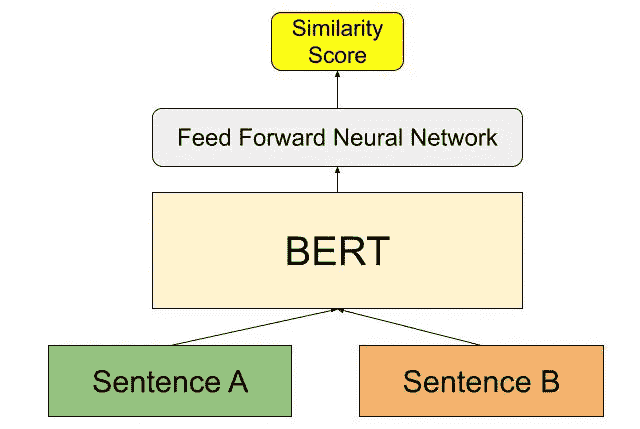
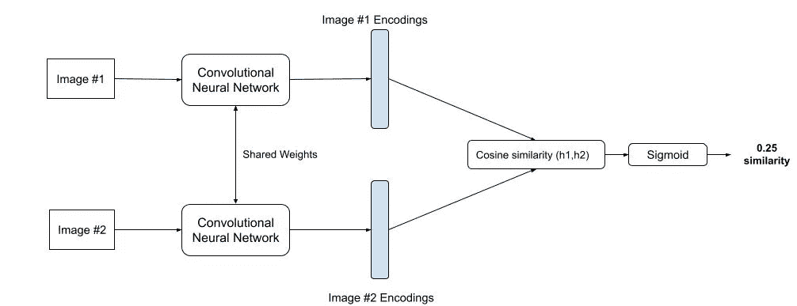
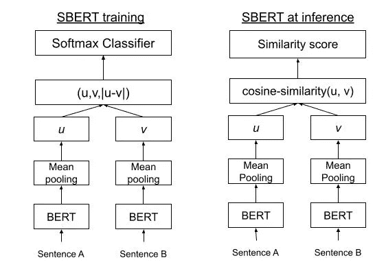

# 句子的直观解释——伯特

> 原文：<https://towardsdatascience.com/an-intuitive-explanation-of-sentence-bert-1984d144a868>

## 使用暹罗伯特(SBERT)网络的句子嵌入的直观解释以及如何编码


哈米什·道森在 [Unsplash](https://unsplash.com?utm_source=medium&utm_medium=referral) 上拍摄的照片

在这篇文章中，我将解释你需要知道的关于句子背后的基本机制——BERT 模型。我还将详细介绍其独特的架构如何用于特定的、独特的任务，如语义相似性搜索，以及如何对此进行编码。

如今，许多广泛用于大量 NLP 任务的转换器，如问题回答、语言建模和摘要，都是单词级的转换器。例如，像 BERT、RoBERTa 和原始 transformer 这样的 transformer 通过计算单词级嵌入来解决许多不同的任务，它们还被训练来执行像掩蔽语言建模这样的任务。然而，对于像语义搜索这样需要强大的句子级理解的任务，仅使用单词级转换器在计算上变得不可行。

语义搜索是一项任务，包括找到与目标/给定句子在意义上相似的句子。例如，在包含 10 个句子的段落中，语义搜索模型会返回前 *k* 个彼此意思最接近的句子对。使用像 BERT 这样的转换器需要将两个句子都输入到网络中，当我们比较大量的句子(几百个/几千个)时，所需的计算使 BERT 成为不可行的选择(需要几个小时的训练)。

[这篇](https://aclanthology.org/D19-1410.pdf)文章旨在通过句子-BERT (SBERT)来克服这一挑战:这是标准预训练 BERT 网络的一种修改，它使用连体和三元网络为每个句子创建句子嵌入，然后可以使用余弦相似度进行比较，使大量句子的语义搜索变得可行(只需要几秒钟的训练时间)。

## 伯特是做什么的？

BERT 以成对的方式解决语义搜索。它使用一个交叉编码器:将两个句子传递给 BERT，并计算相似性得分。然而，当被比较的句子数量超过数百/数千个句子时，这将导致总共进行 *(n)(n-1)/2* 次计算(我们本质上是将每个句子与其他每个句子进行比较；即强力搜索)。在现代 V100 GPU 上，这将需要几个小时的训练时间(具体来说是 65 个小时)。下图显示了 BERT 的交叉编码器网络:



作者图片

BERT 交叉编码器由一个标准的 BERT 模型组成，它将两个句子 A 和 B 作为输入，由一个[SEP]标记分隔。在 BERT 的顶部是前馈层，它输出相似性得分。

为了克服这个问题，研究人员试图使用 BERT 来创建句子嵌入。最常见的方法是向 BERT 输入单个句子——记住 BERT 计算单词级嵌入，所以句子中的每个单词都有自己的嵌入。在句子被输入到 BERT 之后，由于 BERT 的单词级嵌入，生成句子嵌入的最常见方式是通过平均所有单词级嵌入或者通过使用第一个标记(即[CLS]标记)的输出。然而，这种方法经常导致糟糕的句子嵌入，通常平均比平均手套嵌入更差。

## 什么是暹罗网络？

连体神经网络是包含两个(或更多)相同子网/模型的特殊网络，其中(通常)两个模型共享/具有相同的参数/权重。参数更新反映在两个子模型中。连体网络最常用于计算输入的相似性得分，因此有许多应用。

暹罗网络如此强大和多功能的一个原因是，它们主要通过计算两个事物(通常是图像，但在我们的情况下是句子)之间的相似性来训练。因此，添加新的类(用于分类任务)或比较两个事物(例如，两种类型的图像)变得容易，其中一个项目具有在训练期间不存在的分类。这是一个表示暹罗网络架构的图表。该模型使用暹罗网络/共享权重/2 个 CNN 来计算两个图像的编码，然后使用相似性函数和激活函数来计算两个编码之间的相似性。



作者图片

## 那么具体怎么训练暹罗网络呢？

你可能会想，如果暹罗网络也是以成对的方式训练的，它们的计算效率不也应该很低吗？

这是不正确的。虽然暹罗网络是以成对的方式训练的，但它们不像 BERT 那样用项目组中每个可能的成对组合来训练。本质上，SBERT 网络使用称为三重损失的概念来训练其连体结构。为了解释三重损失，我将使用比较/找到相似图像的例子。首先，网络随机选择一个锚图像。此后，它找到一个正对(属于同一类的另一个图像)和一个负对(属于不同类的另一个图像)。然后，网络使用相似性得分计算每对图像的 2 个图像之间的相似性得分(这因您使用的函数而异)。使用这两个相似性分数，网络然后将计算损失分数，然后基于该损失更新其权重/运行反向传播。数据集中的所有图像被分配到这些三元组中，因此网络能够在数据集中的每个图像上被训练，而不必运行计算效率低的强力/在每个图像组合/对上被训练。

SBERT 论文的作者使用了类似的东西，但不是确切的机制。毕竟不像图像分类，在语义搜索中，句子并没有一个可以关联的类。作者使用了一种独特的技术，包括找到并最小化句子之间的欧几里德距离，并使用这种度量来找到哪些句子对被认为是积极的，哪些句子对被认为是消极的。你可以在他们的论文[这里](https://aclanthology.org/D19-1410.pdf)中读到更多。

## SBERT 是做什么的，它是如何工作的？

如果你看看 BERT 最初的交叉编码器架构，SBERT 与此类似，但去掉了最后的分类头。与 BERT 不同，SBERT 使用连体架构(正如我在上面解释的那样)，其中包含两个基本相同并共享相同权重的 BERT 架构，SBERT 在训练期间将两个句子成对处理。

假设我们在 SBERT 中把句子 A 喂给了 BERT A，把句子 B 喂给了 BERT B。每个 BERT 输出汇集的句子嵌入。虽然最初的研究论文尝试了几种汇集方法，但他们发现均值汇集是最好的方法。池化是一种概化网络中要素的技术，在这种情况下，意味着池化通过对 BERT 中的要素组进行平均来工作。

在池化完成后，我们现在有 2 个嵌入:1 个用于句子 A，1 个用于句子 b。当模型正在训练时，SBERT 连接这 2 个嵌入，然后它们将通过 softmax 分类器运行，并使用 softmax-loss 函数进行训练。在推断时——或者当模型实际开始预测时——然后使用余弦相似度函数来比较两个嵌入，这将输出两个句子的相似度得分。这里是 SBERT 在微调和 at 推断时的示意图。



作者图片

## 你如何使用 SBERT？

SBERT 有自己的 Python 库，你可以在这里找到。使用它就像使用拥抱脸变形库中的模型一样简单。例如，要计算句子嵌入，您可以这样做:

```
**from** **sentence_transformers** **import** SentenceTransformer
model = SentenceTransformer('paraphrase-MiniLM-L6-v2')sentences = ['The quick brown fox jumps over the lazy dog', 
             'Dogs are a popular household pet around the world']embeddings = model.encode(sentences)
for embedding in embeddings:
  print(embedding)
```

在这里，我使用了“释义-MiniLM-L6-v2”预训练模型，但还有许多其他预训练模型可以使用，你可以在这里找到。

使用 SBERT 计算句子相似度也很容易。下面是你如何计算/找到句子列表中句子之间的最高相似度分数。

```
**from** **sentence_transformers** **import** SentenceTransformer, util
model = SentenceTransformer('all-MiniLM-L6-v2')sentences = ['The cat sits outside',
             'A man is playing guitar',
             'I love pasta',
             'The new movie is awesome',
             'The cat plays in the garden',
             'A woman watches TV',
             'The new movie is so great',
             'Do you like pizza?']#encode the sentences 
embeddings = model.encode(sentences, convert_to_tensor=**True**)#compute the similarity scores
cosine_scores = util.cos_sim(embeddings, embeddings)#compute/find the highest similarity scores
pairs = []
**for** i **in** range(len(cosine_scores)-1):
    **for** j **in** range(i+1, len(cosine_scores)):
        pairs.append({'index': [i, j], 'score': cosine_scores[i] 
                                                             [j]})#sort the scores in decreasing order 
pairs = sorted(pairs, key=**lambda** x: x['score'], reverse=**True**)**for** pair **in** pairs[0:10]:
    i, j = pair['index']
    print("**{}** **\t\t** **{}** **\t\t** Score: **{:.4f}**".format(sentences[i],
                                  sentences[j], pair['score']))
```

这些代码片段取自 SBERT 图书馆网站。你可以在这里探索更多[。上面的代码输出:](https://www.sbert.net/index.html)

```
The new movie is awesome The new movie is so great    Score: 0.8939 The cat sits outside    The cat plays in the garden    Score: 0.6788 I love pasta    Do you like pizza?    Score: 0.5096 
I love pasta    The new movie is so great    Score: 0.2560 
I love pasta    The new movie is awesome    Score: 0.2440 
A man is playing guitar The cat plays in the garden   Score: 0.2105 The new movie is awesome    Do you like pizza?    Score: 0.1969 
The new movie is so great    Do you like pizza?   Score: 0.1692 
The cat sits outside    A woman watches TV    Score: 0.1310 
The cat plays in the garden    Do you like pizza?    Score: 0.0900
```

我希望您觉得这些内容很容易理解。如果你认为我需要进一步阐述或澄清什么，请在下面留言。

## 参考

使用连体伯特网络的句子嵌入:[https://aclanthology.org/D19-1410.pdf](https://aclanthology.org/D19-1410.pdf)

SBERT 库:[https://www . SBERT . net/#:~:text = sentence transformers % 20 is % 20a % 20 python % 20 framework，for % 20 more % 20 than % 20100% 20 languages](https://www.sbert.net/#:~:text=SentenceTransformers%20is%20a%20Python%20framework,for%20more%20than%20100%20languages)