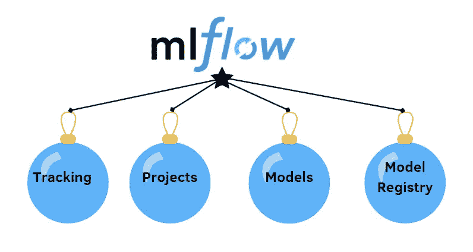
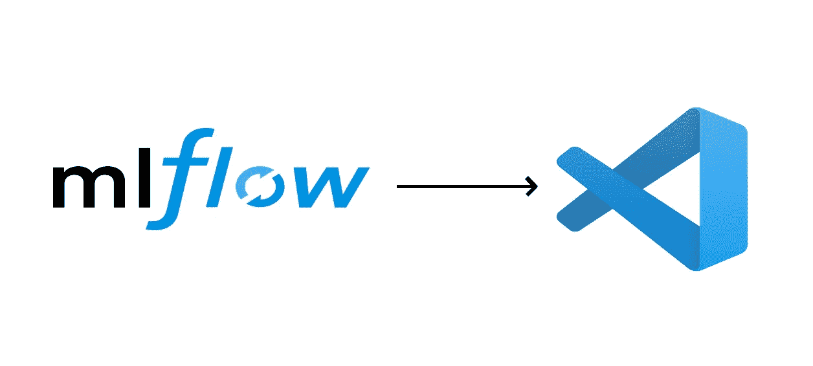
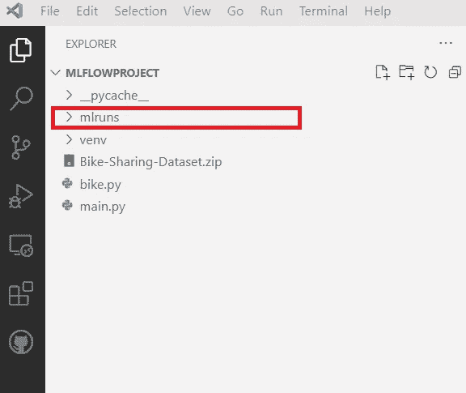
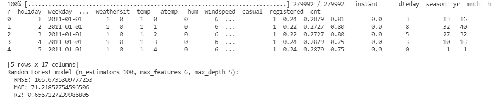
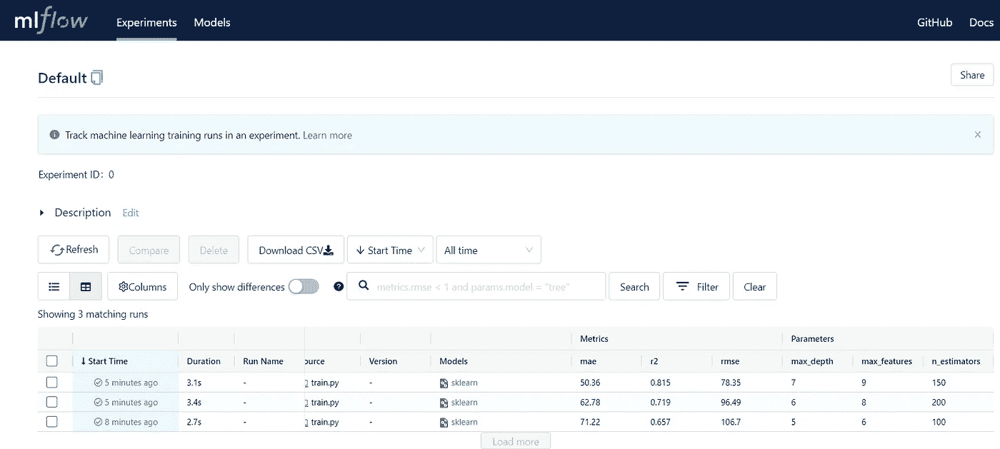

# 使用 MLflow 跟踪您的 ML 实验的直观指南

> 原文：<https://towardsdatascience.com/an-intuitive-guide-to-track-your-ml-experiments-with-mlflow-7ac50e63b09>

## 帮助您改进 Sklearn 模型的重现性、管理和实验跟踪


Artem Maltsev 在 [Unsplash](https://unsplash.com/photos/3n7DdlkMfEg) 拍摄的照片

我已经浪费了很多时间来运行我的 Jupiter 笔记本，以建立一个具有最佳性能的机器学习模型。最佳解决方案主要取决于超参数的特定组合，在走到隧道尽头之前，很难记住我尝试过的所有实验。

最近，我发现了 MLflow，这是一个非常有效的开源平台，用于完整管理机器学习生命周期，其中的主要阶段是收集数据、数据准备、创建模型、模型训练和模型部署。它有非常好的功能，我将在下一节解释。

在这篇文章中，我将重点关注 MLflow 跟踪训练跑步指标和每次跑步实验的模型超参数的能力**。我将通过一个用 Sklearn 训练回归器的简单例子向您展示如何利用这个强大的工具。这些步骤如下:**

1.  **简介**
2.  **先决条件**
3.  **在 train.py 上训练一个 MLflow 模型**
4.  **在本地主机上可视化结果**

# 介绍



作者插图

如前所述，MLflow 是一个管理机器学习生命周期的平台。它提供了四个组件，可以一起工作，也可以单独工作，这取决于应用程序。

*   **MLflow Tracking** 用于跟踪/记录实验。首先，在运行代码时存储日志记录参数、指标和输出文件，然后可以在本地主机上可视化所有实验的结果。在本文中，我们将重点关注使用 Python 的日志记录和查询实验。
*   **MLflow 项目**是一个组件，用于以可重用和可复制的方式打包数据科学代码。
*   **MLflow Models** 用于封装机器学习模型。有多种方法可以保存和加载 MLflow 模型。例如，我们训练一个 Sklearn 模型，然后使用函数`log_model`将其记录为当前运行的 MLflow 人工制品
*   **Model Registry** 是专门用于将模型添加到模型注册表中的工具。它允许提供从试生产到生产的模型的年表。它还允许在每次运行时向模型添加描述。

# 先决条件



作者插图

在本教程中，我使用 Visual Studio 代码作为 IDE。它是免费开源的，支持多种语言，每种语言都需要安装扩展。此外，它能够处理 Jupyter 笔记本，这对于操纵和分析代码中的数据是不可或缺的。它还集成了一个终端，需要这个终端来编写一些命令行来使用 MLflow。除了这些优点之外，它还可以管理项目文件夹中的文件和文件夹。我建议你查看这个简单的[教程](https://code.visualstudio.com/docs/languages/python)，开始使用 VSCode 和 Python。主要步骤是:

*   如果您的本地机器上没有来自 python.org 的 Python，请安装它
*   在 VSCode 中添加扩展名“Python”
*   创建新的 Python 环境

配置完 Python 环境后，就该安装 MLflow 了:

```
pip install mlflow
```

为了确保安装运行良好，您应该检查是否在项目的文件夹中找到了名为“mlruns”的文件夹。



作者插图

无论何时运行用 Python 编写的程序，MLflow Python API 日志都会运行到 mlruns 目录中的文件中。

# 在 train.py 上训练 MLflow 模型

在本例中，我们使用自行车共享数据集，根据温度、风速和湿度等特征来预测每小时租赁自行车的数量。数据集存储在 [UCI 的机器学习知识库](https://archive.ics.uci.edu/ml/datasets/bike+sharing+dataset)【2】。此外，我们将训练一个随机森林回归器，它采用三个超参数，n 估计量，最大特征和最大深度。所有代码都保存在一个带有格式的文件中。py，名为 train.py，如下所示:

当您右键单击代码选项“在终端中运行 Python 文件”时，您应该得到类似的输出:



作者插图

我们应该关注的最基本的部分是从`with mlflow.start_run()`行开始，它允许在程序块结束时自动结束运行。方法`mlflow.log_param`和`mlflow.log_metric`提供了在当前运行下记录参数和度量的方法。

为了试验超参数的其他值，我们可以在下面的命令中将它们作为参数传递:

```
python train.py 200 8 6
```

我建议你试探一下其他价值观，对 MLflow 的效率有更好的认识。

# 在**本地主机**上可视化结果

为了比较超参数和模型的不同组合，我们可以在终端上运行命令:

```
mlflow ui
```

它返回一个 URL，您可以在其中找到一个记录所有超参数和相应的结果指标的表( [http://localhost:5000](http://localhost:5000/) )。



作者插图

您可以注意到，您所有的实验现在都存储在这个表中。如果您有相同试验的副本，您也可以删除其中一个。此外，您可以将所有结果下载到一个 CSV 文件中，以便快速分析模型的性能。

# 最终想法:

在这篇文章中，我们看到了 MLFlow 是什么，以及如何利用它来跟踪和存储我们的试验。我希望这篇教程对你开始使用它有所帮助。如果你有兴趣发现其他平台来跟踪实验，请查看[本指南](/a-quick-guide-for-tracking-pytorch-experiments-using-neptune-ai-6321e4b6040f?sk=73805058dde5264ff4631ef1568efa6c)，其中介绍了 Neptune.ai，感谢阅读。祝您愉快！

**参考文献:**

[1][https://www.mlflow.org/](https://www.mlflow.org/)

[https://www.capitalbikeshare.com/data-license-agreement](https://www.capitalbikeshare.com/data-license-agreement)

[3] [训练、服务和评分线性回归模型](https://www.mlflow.org/docs/latest/tutorials-and-examples/tutorial.html)

你喜欢我的文章吗？ [*成为会员*](https://eugenia-anello.medium.com/membership) *每天无限获取数据科学新帖！这是一种间接的支持我的方式，不会给你带来任何额外的费用。如果您已经是会员，* [*订阅*](https://eugenia-anello.medium.com/subscribe) *每当我发布新的数据科学和 python 指南时，您都可以收到电子邮件！*