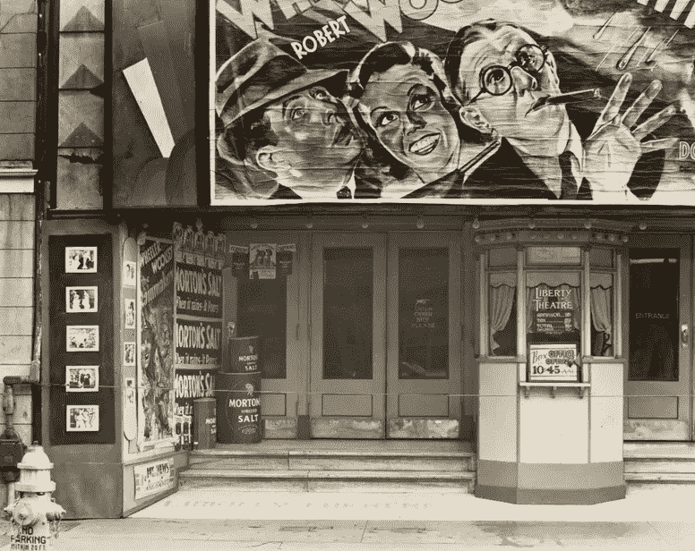
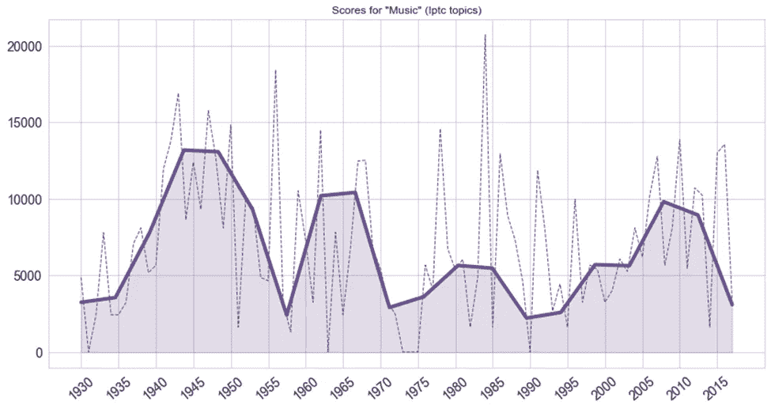
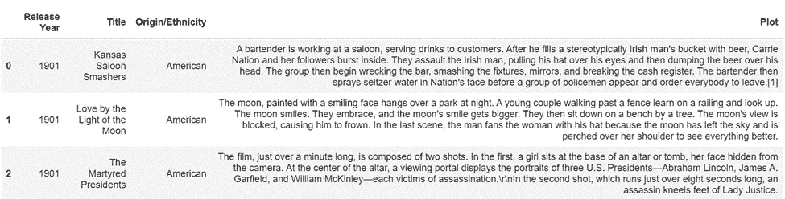
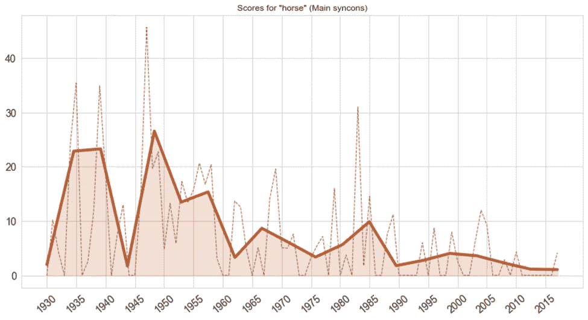
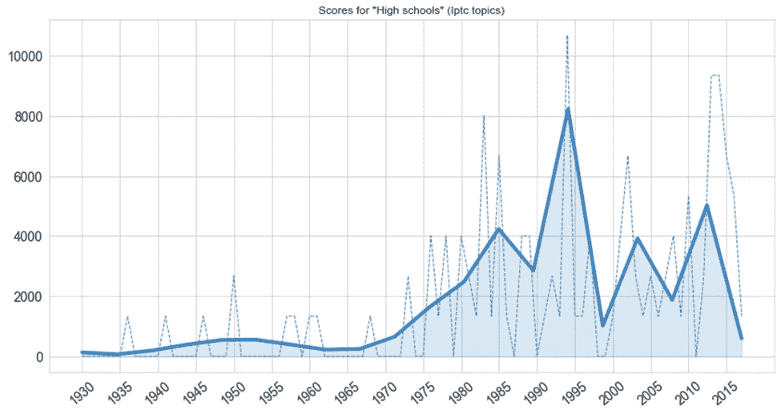
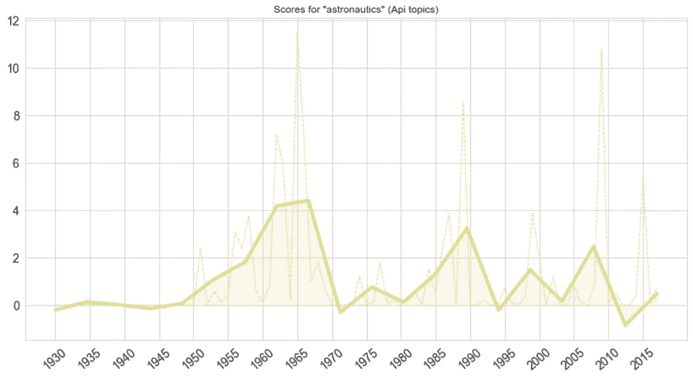
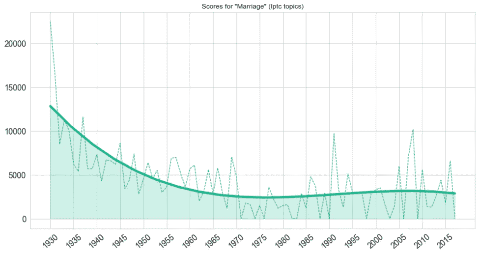
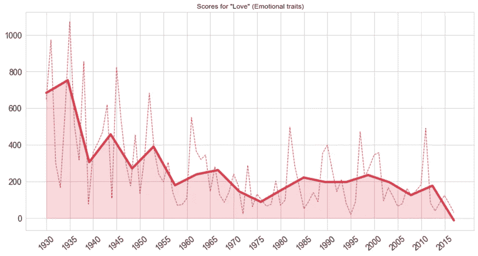
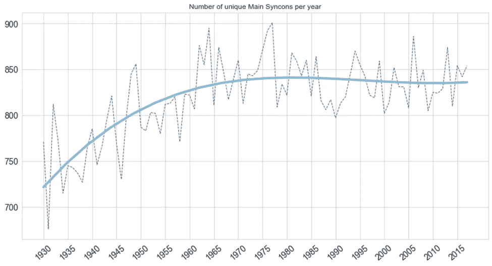
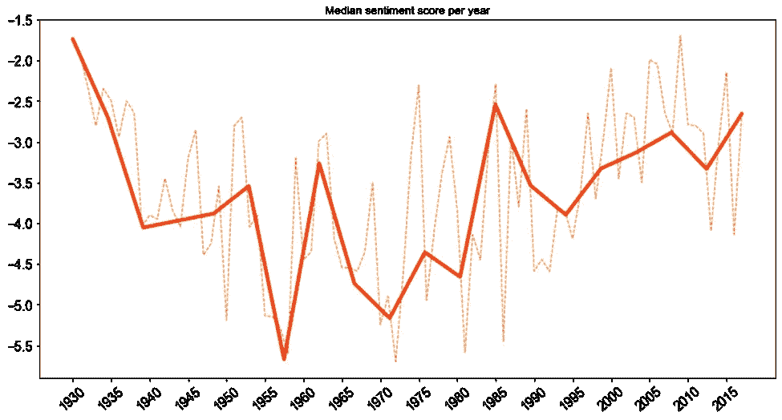

# NLP 电影史

> 原文：<https://towardsdatascience.com/an-nlp-movie-history-44487ec0144f>

## 绘制电影潮流的起伏

自由剧院在新奥尔良，路易斯安那州，加利福尼亚州。1936.来自纽约公共图书馆

超级英雄电影会过时吗？漫威的粉丝可能会怀疑是否能在票房上看到黑寡妇或雷神炸弹这样的电影——他们的态度肯定是有道理的，因为像 [*【蜘蛛侠：英雄无归】*](https://www.the-numbers.com/box-office-records/worldwide/all-movies/cumulative/released-in-2021) 或 [*【蝙蝠侠】*](https://www.the-numbers.com/market/2022/summary) 这样的电影取得了巨大成功。尽管如此，电影历史充满了曲折:类型上升到流行，保持在聚光灯下一段时间，然后悄悄地离开舞台。例如，想想 20 世纪 30 年代诙谐的古怪喜剧，20 世纪 40 年代复杂的黑色电影，或者 20 世纪 70 年代轰动一时的灾难电影。

数据科学能否帮助我们理解电影品味的这些突然变化，并预测什么类型的电影可能很快就会出现在我们身边的屏幕上？

为了回答这个问题，我们可以求助于自然语言处理——对于这种分析来说，这是一个非常有用的策略。在本文中，我将使用 expert . ai NL API——一个返回一套 NLP 分析的 API——来探索用于描述电影的语言如何根据电影制作的年份而变化。

作者图片

在接下来的内容中，我将向你展示如何创建如上图所示的情节。这张线图展示了“音乐”作为电影概要中一个主题的受欢迎程度的变化，它与音乐电影(1930-1950)的所谓[黄金时代整齐地对齐，伴随着由](https://en.wikipedia.org/wiki/Musical_film#1930-1950:_The_first_classical_sound_era_or_First_Musical_Era) [*【西区故事】*](https://en.wikipedia.org/wiki/West_Side_Story_(1961_film)) (1961)预示的百老汇改编的短暂复兴，以及由 [*红磨坊开创的这种类型的当代复兴！*](https://en.wikipedia.org/wiki/Moulin_Rouge!) (2001)和 [*芝加哥*](https://en.wikipedia.org/wiki/Chicago_(2002_film)) (2002)。

我用来生成该图的数据和代码以及下面的数据和代码可在本 [Jupyter 笔记本](https://github.com/coprinus-comatus/nlp_movie_history/blob/main/movieHistoryNLP.ipynb)中获得。请随意跟随。

# 1.设置

## 1.1.数据集

我们以前都读过电影情节:或多或少详细的电影回顾，作为评论、杂志特写或维基百科文章的一部分写下来。为了开始用 NLP 探索电影趋势，我使用了一个 [Kaggle 数据集](https://www.kaggle.com/datasets/jrobischon/wikipedia-movie-plots)，它包含了来自维基百科的大约 35，000 个电影情节。这些概要被安排在一个. csv 文件中，该文件还列出了上映年份、原产国以及每部电影的类型——从一分钟长的无声讽刺片 [*堪萨斯沙龙粉碎者*](https://en.wikipedia.org/wiki/Kansas_Saloon_Smashers) (1901 年)到费尔赞·奥兹皮特克的土耳其-意大利游记 [*红色伊斯坦布尔*](https://en.wikipedia.org/wiki/Red_Istanbul) (2017 年)。

作者图片

为了保持一致，我决定只考虑标记为“美国”的 17，377 个情节，这是数据集中最大的电影份额。同样，由于这个数据集中的前三十年包含的情节(平均而言)明显少于随后的三十年，我只选择了 1930 年至 2017 年之间制作的电影。

## 1.2.该工具

由于我打算一次检查几个特性(包括，例如，主要词条和主题的列表，**在每个电影情节中检测到的主要概念和感觉的分解**，以及情感分析分数)，我已经决定为这个项目使用 [expert.ai NL API](https://developer.expert.ai/ui) 。这套文本处理工具可以从 Jupyter 笔记本中调用，以便接收一组分析，然后可以使用当前的 Python 库对其进行操作和可视化。

## 1.3.预处理数据集

我们可以从按发行年份分组开始。在此步骤中，我们还应该对文本本身进行快速清理，删除圆括号和方括号之间的所有字符串(通常用于脚注引用或与图形本身无关的信息)。

# 2.分析

## 2.1.调用 API

要对您的数据调用 expert.ai NL API，您需要[在 expert.ai 开发者网站](https://developer.expert.ai/ui/login)上注册(该工具免费使用，注册过程只需几秒钟)。我建议将您的凭证存储在一个. env 文件中，并使用 [Python-dotenv](https://pypi.org/project/python-dotenv/) 将它们加载到您的环境中。一旦你这样做了，处理文本和检索你需要的分析只需要几行代码。

例如，下面两个函数中的第一个将允许您对一个文本块执行完整的分析(包括语义和形态学解析、主要标记和实体的提取、情感分析等等)。第二个函数将根据 API 提供的四个分类法中的一个来执行分类分析(“T8”IPTC 媒体主题“T9”在这里是默认的，但是在这个实验中我们还将执行“**情感特征**分析)。

处理单个文本块来检索这些统计信息需要的时间相对较少；然而，对整个数据集这样做将非常耗时。为了加速这个过程，我创建了一组函数来处理数据集中的随机文本样本。对于我们感兴趣的范围内的每一年，这些函数随机选择 100 个电影情节，然后从每个情节中随机提取 500 个字符的样本。通过使用这种方法，我已经处理了来自 8，800 个电影情节的样本——约占该分析可用样本总数的 53%。

这个函数将每个样本发送给 API 三次:一次用于完整分析，一次用于 IPTC 主题分类，一次用于情绪特征分类。API 每年返回的 300 个 JSON 对象存储在三个单独的列表中，然后收集在一个专用的字典中。

## 2.2.提取数据

我们主要对 expert.ai NL API 考虑的几个特征中的七个感兴趣:主要引理、主要概念(或*同步子*)、主要主题、情感分析得分、IPTC 媒体主题分类和情感特征分类。一组简单的函数可以帮助我们从 API 返回的 JSON 对象中提取所有这些特性。例如，下面两个函数提取情感得分和与每个绘图样本相关的主要词条列表。

## 2.3.绘制数据

有了按年收集和汇总的所有数据，我们现在可以继续**将这些值绘制到图表**上，以发现电影情节可能如何随着时间的推移而变化。

人们当然应该记住，这些价值并不是指电影本身，也不是指它们发行或制作的实际时刻。我们看到的结果来自于关于这些电影的文字，但是是在不同的时间，由不同的人写的；所以，他们应该半信半疑。然而，尽管是间接的，他们可能会让我们了解他们描述的电影的整体情绪、主题和主题可能发生了怎样的变化。

我创建了三个函数来可视化 expert.ai NL API 返回的不同类型的特征:特定词条、主题或概念的得分；唯一词条、主题或概念的数量；和情感分析分数。为了增加结果图的可读性，并最小化任何潜在异常值的影响，我使用了 [SciPy 的 UnivariateSpline 函数](https://docs.scipy.org/doc/scipy/reference/generated/scipy.interpolate.UnivariateSpline.html)来归一化和平滑这些值，在结果图中绘制原始值和归一化值。

# 3 结果

## 3.1 从马到航天飞机

这些函数生成的一些图显示了可以很容易解释的趋势。

作者图片

例如，在上面的图表中，我们看到“马”的 syncon 在数据集中变得越来越不频繁，这与几十年来西部片的成功下降以及汽车的优势增加相呼应。

其他情节突出了特定电影和特许经营的成功可能决定了某些主题和背景的出现或复兴。

作者图片

在上图中，我们可以看到高中一直是一个相对不受欢迎的话题，直到 20 世纪 80 年代初，波奇的《T2》和《T3》(1981)开创了猥亵青少年喜剧的类型。“高中”电影似乎在 20 世纪 90 年代末(继 1999 年的 [*【美团】*](https://en.wikipedia.org/wiki/American_Pie_(film)) )和 2000 年代末至 2010 年代初(继 2006 年的 [*高中音乐剧*](https://en.wikipedia.org/wiki/High_School_Musical) )再次达到顶峰。

其他趋势可能受到历史事件的影响。

作者图片

例如，在上面的图表中，我们可以看到在 1969 年第一次登月[之前的几年里,](https://en.wikipedia.org/wiki/Apollo_11)以及 20 世纪 80 年代后期——1986 年挑战者号灾难[之后,“宇宙航行”的话题是如何流行起来的。](https://en.wikipedia.org/wiki/Space_Shuttle_Challenger_disaster#Media)

## 3.2 未婚情节

其他图表就不那么容易解读了。

作者图片

例如，在上面的图表中，我们看到“婚姻”这个话题在电影情节中逐渐变得不那么突出，特别是在 20 世纪 30 年代到 80 年代之间。在 20 世纪 90 年代，这个话题似乎有了短暂的复苏——也许是由以婚姻为中心的喜剧 [*《当哈利遇见莎莉……】*](https://en.wikipedia.org/wiki/When_Harry_Met_Sally...)(1989)的成功引领的。

作者图片

更令人惊讶的是，上面的图表记录了“爱”从我们的屏幕上消失的轨迹。API 在许多电影情节中发现，这种情感特征似乎在几十年间变得不那么普遍了——尤其是在 20 世纪 60 年代之后。如果有的话，是什么让“爱情”和“婚姻”对电影制作人不那么有吸引力？

## 3.3 美国电影已经变得无聊了吗？

我们还可以考虑每年记录的唯一令牌的数量。这一指标可能会让我们了解电影主题的多样性是随着时间的推移而增加还是减少。电影年复一年处理的话题和概念是多了还是少了？

作者图片

你在上面看到的图表显示了一个清晰的模式。数据集中独特同步的数量稳步增长:20 世纪 50 年代制作的电影与 20 世纪 30 年代制作的电影相比，与更多概念相关联。这种趋势一直持续到 20 世纪 70 年代中期，然后在 20 世纪 80 年代和 21 世纪 10 年代之间趋于平稳，甚至略有下降。如果这些短文以任何方式代表了它们所讲述的电影，我们可以说，在 1930 年至 1975 年之间，被搬上银幕的主题、人物和环境的多样性稳步增加，但这种增加已经放缓。在过去的几十年里，美国制作的电影是否变得不那么多样化或冒险了？

## 3.4 感伤的过山车

我想分享的最后一个结果可能是最令人费解的。

作者图片

上面的图表显示了 API 处理的每年收集的样本的平均情绪分析分数。这个分数反映了一篇文章所谓的消极或积极——消极的评价与较低的分数相关，而积极的陈述与较高的分数相关。该数据集中的值变化很大，平滑线的形状可能是归一化过程的产物。

然而，有两个趋势非常突出。首先，中位数分数似乎几乎周期性地下降和上升，每二十年下降一次——在 20 世纪 30 年代中期和 50 年代中期，然后在 70 年代初和 90 年代初。第二，总体模式似乎是一条曲线——2010 年的电影回到了 20 世纪 30 年代电影的积极向上。在世纪之交，电影普遍变得更轻松了吗？我们会迎来新一波的阴郁电影吗？

电影史上的下一件大事是什么？超级英雄大片的日子算吗？我们是否应该期待一些其他旧类型的电影重新出现——也许是对[霸气电影](https://en.wikipedia.org/wiki/Swashbuckler_film)的新一轮，或者是期待已久的[全球经典怪物](https://en.wikipedia.org/wiki/Universal_Classic_Monsters)的回归？这些情节中的一些给了我们一个电影可能走向的想法——并提醒我们，无论如何，“这将是一个颠簸的夜晚”

[1]:贾斯汀·罗比雄，[维基百科电影剧情](https://www.kaggle.com/datasets/jrobischon/wikipedia-movie-plots) (2019)，第一版，[卡格尔](https://www.kaggle.com/)。
数据集通过[知识共享署名-共享 4.0 国际许可](https://creativecommons.org/licenses/by-sa/4.0/)获得许可。