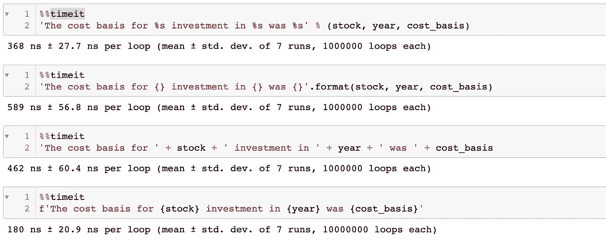
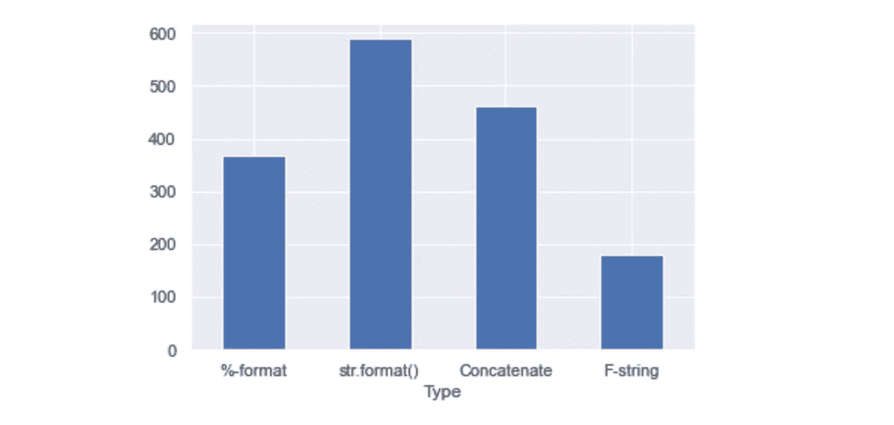

# F-stings 颂歌

> 原文：<https://towardsdatascience.com/an-ode-to-f-stings-dcb0fb4fc67a>

## 格式化字符串的显而易见的(也是最好的)方法

> 应该有一种——最好只有一种——显而易见的方法来做这件事。
> 
> Python 的禅

照片由[Tj·霍洛韦丘克](https://unsplash.com/@tjholowaychuk?utm_source=medium&utm_medium=referral)在 [Unsplash](https://unsplash.com?utm_source=medium&utm_medium=referral) 上拍摄

# 所有字符串格式化方法概述

当我第一次学习编码时，我犯了许多错误。像任何新手一样，我专注于输出，而不是担心最佳实践。因此，我的指纹中不乏类似这样的代码:

如果我需要格式化某些变量，它看起来像这样:

以这种方式连接字符串是我打印语句、绘图标题甚至文件路径的常用方法。这很有效，为什么要质疑呢？我有太多破碎的脚本要修复，知识空白要填补。我没有花时间去考虑是否有更好的办法。

通过教程和堆栈溢出问题，我了解了`%-formatting`和`str.format()`方法。但是我发现这些方法很难读懂。它们需要来回移动。我想要像我的连接方法一样的东西，可以从左到右阅读的东西。

最终，我偶然发现了格式化字符串的最好也是最明显的方法:f-strings。Python 3.6 中引入的 f 字符串(又名格式化字符串)允许嵌入表达式。所有需要做的就是在字符串前加上一个`f`或`F`，并用括号将表达式分组。f 字符串可以用单引号`’`或双引号`“`初始化。这里有一个简单的例子:

# 爱上 F 弦的 5 个理由

## 1.可读性📚

> 可读性很重要。Python 的禅

在所有的字符串格式化方法中，f-strings 的可读性最强，因为它使用了最少的语法和嵌入式表达式。例如，考虑这些例子:

所有的打印语句产生相同的输出。然而，f 弦将三个变量嵌入到弦中，因此眼睛不需要来回扫视。你可以像读日常散文一样从左到右读 f 弦。

## 2.速度⚡️

f 字符串是许多字符串格式化方法中最快的。Jupyter 笔记本上的一个简单测试证实了这一点:

图片作者。

这是它的图像:

图片作者。

## 3.嵌入表达式和函数💯

除了变量，还可以嵌入数学表达式。它们被视为常规 Python 表达式。例如:

Lambda 函数也适用于 f 字符串。下面是上面重写为 lambda 函数的示例:

## 4.格式精度和 Type✂️

f 字符串使得格式化嵌入的表达式变得容易。只需在表达式后添加`‘:’`和一个格式说明符。格式规范是一种确定如何表示表达式的小型语言。除了其他属性之外，它还控制表达式的精度和类型。

要控制表达式的**精度，请在格式说明符中的`‘.’`后添加所需的位数。例如:**

精度不需要存储在变量中，然后用大括号嵌入。上面的例子是为了清楚起见。

格式规范还通过添加类型代码**定义了表达式类型**。例如，`‘e’`是科学记数法的类型代码。默认表达式类型是字符串或`‘s’`。

对于定点符号(`‘f’`和`‘F’`类型)，精度值控制小数点后的位数。对于通用格式(`‘g’`和`‘G’`类型)，精度值决定小数点前后显示的位数。

以下是演示不同表达式类型的一些示例:

**百分比**

**科学符号**

**不带尾随零**

**带尾随零**

## 5.间距和对齐🗂

> 漂亮总比难看好。Python 的禅

格式规范还定义了 f 字符串中的间距和对齐方式。这在输出列表或格式化模板时非常有用。首先，通过使用对齐选项之一来定义对齐。`‘<’`左对齐，`‘>’`右对齐，`‘=’`居中对齐。对齐选项位于精度和类型参数之前。

接下来，使用整数指定嵌入表达式的宽度。宽度定义了表达式的字符长度。如果宽度比表达式本身长，那么表达式将用空格填充。如果宽度较短，则没有填充。如果没有定义宽度，则表达式确定字符串的长度。没有宽度参数，就没有理由定义对齐。

输出。图片作者。

阅读文档了解更多使用格式规范的方法[这里](https://docs.python.org/3/library/string.html#grammar-token-format-spec-grouping_option)。

# 结论

感谢您阅读我的文章。如果您喜欢我的内容，*请考虑关注我*。此外，欢迎所有反馈。我总是渴望学习新的或更好的做事方法。请随时留下您的评论或联系我 katyhagerty19@gmail.com。

 