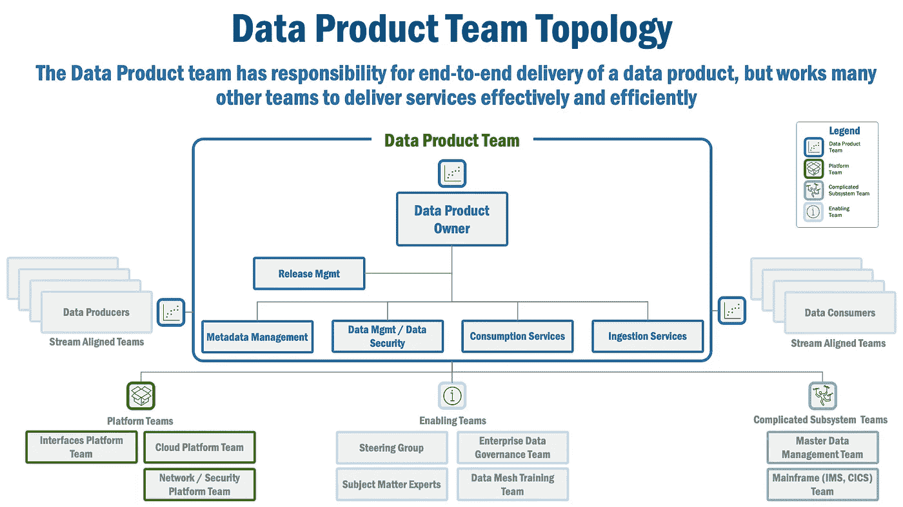
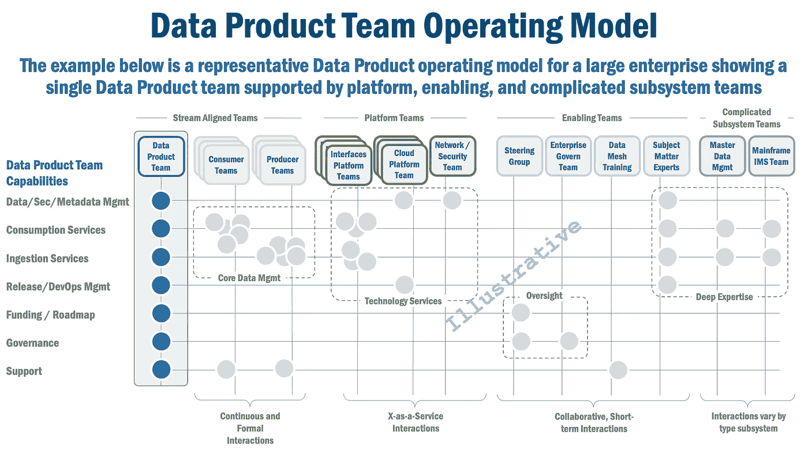
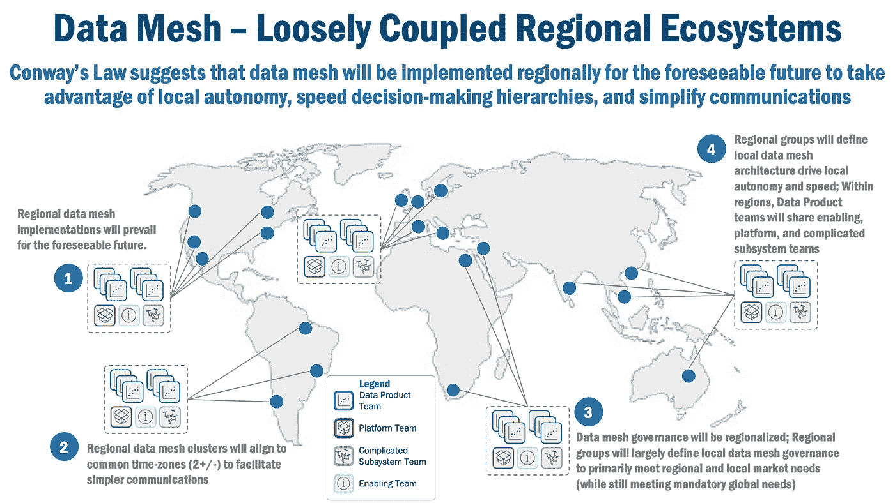

# 数据产品的运营模式

> 原文：<https://towardsdatascience.com/an-operating-model-for-data-products-fba6b268f698>

您的运营模式是数据网格之旅的速度和成功的主要指标。下面是在您的企业数据网格中为数据产品设置一个操作模型所需了解的内容。

János Venczák 在 [Unsplash](https://unsplash.com/s/photos/clock-vintage?utm_source=unsplash&utm_medium=referral&utm_content=creditCopyText) 上拍摄的照片

# 迈向有效的数据产品运营模式

实现数据网格所需的组织变化比技术更难解决。简单明了地说，改变一个人的行为比引进新技术更难，更不用说改变一个团体或一个企业了。

在本文中，我将介绍数据产品团队运营模型的关键要素，然后将其扩展为数据产品生态系统的运营模型，也称为数据网格。沿着这些思路，我将提出几个有助于您建立数据产品和数据网格运营模型的考虑因素，并希望使您组织的数据网格之旅更容易、更快:

*   数据产品微观世界(一小组数据产品)中的团队类型和关键交互，
*   数据产品的操作模型，
*   更广泛的数据产品生态系统的运营模式(即数据网格)，以及，
*   管理企业内数据网格可能发展的运营模式选择的含义。

我以一些关于康威定律对大型企业中数据网格发展的影响的观察来结束这篇文章:

*   数据网格将从本地实现开始，然后发展到区域实现，可能在同一时区内(2+/-)。
*   在可预见的未来，区域性数据网格实现将会盛行。
*   本地数据产品所有者将定义由通用区域技术平台支持的他们自己的技术足迹
*   企业数据治理任务将变得“轻量级”,大部分数据网格治理将根据本地和区域问题进行优先排序

# 数据产品团队的拓扑结构

在之前的[文章](/topology-of-a-data-product-team-75dc5471fccf)中，我总结了有远见的作者 [Skelton、Pais](https://www.amazon.com/Team-Topologies-Organizing-Business-Technology/dp/1942788819/) 和 [Dehghani](https://www.amazon.com/Data-Mesh-Delivering-Data-Driven-Value/dp/1492092398) 所提倡的独特的数据产品团队结构。总而言之，有几个不同的团队:

*   **与流程一致的团队**对软件产品或服务的交付负有端到端的责任。
*   **平台团队**通过提供有用的工具、实用程序和技术服务，使与流程一致的团队更容易完成他们的工作。
*   **赋能团队**充当“顾问”，帮助流程一致的团队克服障碍。
*   **复杂的子系统团队**拥有帮助流程一致的团队消费或集成复杂的企业系统所需的深厚专业知识。

*图 1，数据产品团队拓扑*

在大多数现代企业中，数据产品团队是与流程一致的团队。这个团队有责任、权力和技能来实现数据产品。团队通过建立清晰的数据边界来识别由数据产品管理的数据。数据产品团队由授权所有者运营，拥有本地自主权、资金和决策权来创建和运营数据产品。此外，该团队还与生产者和消费者合作，为数据产品建立合同和 SLA，并确保数据产品提供价值。

每个数据产品团队通常由一个或多个“平台团队”支持，其目标是使数据产品团队更容易使用组织内的通用技术能力。平台团队的例子包括:

*   **云平台团队**，该团队提供符合企业要求的云平台即服务(PaaS ),使得以企业规定的安全、可操作和可观察的方式消费云能力变得容易；云的复杂性，尤其是当企业考虑“多云”环境(以及有效执行该功能所需的各种技能和人员)时，使得容纳在单个数据产品团队中是不切实际的。
*   **Interfaces Platform Team** ，提供标准模板框架和运行时环境，使数据产品能够轻松构建支持数据产品摄取、消费、发现、可观察性和可操作性需求所需的互操作接口。大型企业通常有团队来标准化和简化(并使 X 即服务)API、事件流、数据管道和联合查询技术。
*   **网络和安全平台团队**，这使得与企业网络上的其他系统(和人员)的交互变得更加容易，同时还提供服务使数据产品中的数据更容易保护(静态和动态)。

每个数据产品通常还由一个或多个“支持团队”支持，这些团队提供咨询和建议来帮助数据产品团队。我在企业中见过几种类型的赋能团队:

*   **指导小组**，根据需要提供行政级别的监督和资金批准；我发现这个团队在影响高级管理人员、解决组织惰性和为数据网格建立势头方面非常有价值。
*   **主题专家**，他们在数据产品团队可能需要的特定主题方面具有丰富的经验；在许多情况下，这不是一个正式的团队，而是基于数据产品团队成员可能拥有的松散的同事网络。
*   **企业数据治理团队**，为数据产品团队提供所需的指导，以保持符合企业政策和要求。
*   **培训团队**，帮助教育和建立企业内部对数据网格和数据产品的认识；最初，我认为培训是由第一批数据产品团队提供的，但随着数据产品数量的增长和培训需求的增长，最终这个团队会发展成一个独立的团队。

虽然“复杂子系统团队”不像其他团队那样常见，但他们在数据产品生态系统内提供专业技能方面也发挥着非常重要的作用。以下是大型企业中常见的这种团队的几个例子:

*   **主数据管理团队**，他们拥有所需的深厚技能，例如，执行所需的数据匹配，以确保重要数据资产的准确性、统一性和语义一致性。
*   **大型机团队**，比如那些管理 IMS 或 CICS 大型机数据库技术的团队。

# 数据产品团队运营模式

维基百科[将](https://en.wikipedia.org/wiki/Operating_model)运营模型定义为“一个组织如何运行自身的可视化表示(模型)。”运营模型中有许多组件，但对于我们的目的来说，运营模型描述的是“谁在组织中做什么”。

现在，让我们详细阐述我们之前的数据产品团队结构，以确定典型企业中普遍存在的核心交互模式(图 2)。

*图 2，数据产品团队运营模式*

在我们的示例企业(图 2)中，我们有几种类型的团队，包括流对齐的、平台的、使能的和复杂的子系统团队，并且每个团队分别使用连续的正式的长期的、“X 即服务”、协作的短期的和依赖于子系统的交互模型。

每一个深蓝色的点代表一个主要的责任，每一个都是数据产品团队的责任，这并不奇怪。每个浅灰点代表数据产品团队和另一个团队之间的实质性交互。

如您所见，有几个交互集群:

*   **核心数据管理**，显示数据产品团队和其他团队(源系统团队、分析团队或其他数据产品团队)之间需要的广泛互动，以安全、可靠地允许数据产品团队接收和消费数据。
*   **技术服务**，构成支持核心数据管理能力的基础服务。
*   **深厚的专业知识**，由主题团队和我们复杂的子系统团队提供，如主数据管理和大型机 IMS 团队，两者在大型企业中都很常见。
*   **监督**，我们的指导小组提供指导、战略建议和资金援助，企业数据治理团队提供隐私、监管和内部企业要求。

# 数据网格操作模型

但是，建立高性能运营模型的关键是了解重要的交互发生在哪里，并使用这些信息来优化和简化这些交互。那么，我们该怎么做呢？

要理解的第一点有点反直觉。

虽然数据流以及数据网格中数据产品之间的交互决定了数据网格的 ***技术前景*** ，但行为动态和决策层级决定了数据网格的实际 ***组织结构*** 。

这意味着数据网格操作模型不是数据产品的随意组合。**更确切地说，数据网格运营模式——企业网格中的团队结构和数据产品——将围绕企业内的组织动态而结合起来**。

康威定律[、](https://en.wikipedia.org/wiki/Conway%27s_law)、*、*对此做了最好的阐述，解释为“你的系统和数据将遵循你的组织结构”。康威定律是“基于这样的推理，为了使产品发挥作用，其组成部分的作者和设计者必须相互沟通，以确保组件之间的兼容性。”

换句话说，系统——在我们的情况下是数据产品——将在定义的组织边界内构建，在该边界内，它促进最简单的通信、最清晰的责任、最大的资金效率和最快速的决策。

简而言之，每个数据产品团队，以及它的支持、平台和复杂的子系统团队合作伙伴，将自然地形成——很大程度上靠自己——一个有些自给自足的微观世界(一个小的生态系统)，由围绕共同业务目标的通信模式和交互联系在一起。换句话说，数据产品集群将在一个企业内的单个群体的边界内形成。

这些不同的数据产品团队微观世界之间的交互形成了一个更大的业务单元或区域组的生态系统，它们被更高级别的组织单元(地理区域或业务线)所规定的通信模式和交互所约束。

# 数据网格——松散耦合的区域生态系统

简而言之，这些相互依赖的生态系统被实际的组织动态所束缚。其中最常见的是将大型企业按国家和区域分组，以适应每个市场不同的客户偏好或监管限制。

*图 3，数据网格——松散耦合的区域生态系统*

例如，许多大型组织都有北美、欧洲和亚洲小组，这些小组反映了每个地区独特的法律和市场需求。甚至在一个国家内的较小组织中，通常也有一些集团或业务线拥有本地(省、州等)业务单位。因此，总而言之，在可预见的未来，数据网格很可能由松散耦合的区域生态系统组成。但这有着深远的影响。

**含义# 1——在可预见的未来，区域性数据网格实施将会盛行。**

仅康威定律就强烈表明，纯粹的企业数据网格可能是不切实际的。我认为大多数交互(人员和数据流)都发生在“紧密”的实体之间(从组织的角度来看。接近度。我认为，实际的决策和资金通常局限于业务线或地理单元(毕竟，这就是为什么组织有一个层次结构)，这种动态自然会创建数据产品集群(又名。数据网格)。

此外，以我的经验，我没有见过多少真正的企业计划。事实上，除了重大危机情况(疫情、收购等。)很少有情况具有全球利益、结果或必要性，足以保证更广泛的全球协调。即便如此，当我经历过这些事情时，事情通常都是从小事开始发展的。我怀疑，即使在这些情况下，第一个数据网格也可能是一组区域性的交互数据产品。

事实上，我怀疑任何试图促进跨区域决策的人(例如，有一个跨越北美和欧洲业务单位的数据网格)都知道决策是困难和艰巨的，有时几乎是不可能的。

但是其他情况也支持这个结论。监管环境，尤其是与安全和隐私相关的监管环境，因地区而异，对地区间的数据共享造成了限制。

不同的业务优先级也是如此。快速增长的地区可能有必要快速引入新产品，而成熟地区可能专注于保护现有的市场份额，每种产品都推动不同的投资和决策，这可能不利于推动不同地区的数据产品之间的一致性。

技术成熟度和变化速度也很重要。一些地区可能背负着难以发展的旧系统，从而难以建立新的数据产品，而其他地区拥有更新的技术，可以轻松快速地创建数据产品。

相反，数据产品微观世界和区域数据网格生态系统将成为企业内部数据网格增长的主要机制。

**含义# 2——数据网格将从本地实施开始，然后发展到区域实施，可能在共同时区内(2+/-)。在可预见的未来，真正的企业级数据网格实现可能是一个令人向往的目标。**

一个简单的事实是，较小的团队(5-10 人，最多 15 人)合作得更好，行动更快，并且更有效地建立创建软件所需的信任。显而易见的是，企业将利用这种由少量敏捷的数据产品团队组成的动态的、更小的数据网格实现。并且为了简化通信，很有可能第一个数据网格实现将被局限于相似/接近的时区。

现在，可以有把握地说，远程工作文化和工具可能为建立跨时区的可靠沟通提供机会。但即使这样也有实际的局限性。除非人们真正准备好鼓励全天工作，否则大多数数据产品将被构建到 2 +/-时区内的区域数据网格集群中，以促进跨公共营业时间的通信。

这意味着企业范围内的同构数据网格实现可能不会成为规范。更有可能的是，在可预见的未来，企业可能会采用由较少相关数据产品组成的独立区域数据网格实现。

**影响# 3——企业数据治理任务将变得“轻量级”,大部分数据网格治理将根据本地和地区问题进行优先排序**

如前所述，监管环境因地区而异。考虑隐私:欧盟有 [GDPR](https://gdpr-info.eu/) (一般数据保护条例)，而北美的隐私条例更宽松。同样，不同地区、不同国家的医疗保健数据法规也有很大差异，在许多情况下，甚至州与州或省与省之间也是如此。

然而，这确实导致了一个困惑。传统的数据治理不一定会考虑这种地区差异。在由[Mohammad Syed](https://www.linkedin.com/in/mohammadsyed1509/)(Caruthers and Jackson 的首席策略师)和 [Scott Hirleman](https://www.linkedin.com/in/scotthirleman/) (播客采访者)在 [Data Mesh 广播播客](https://daappod.com/)上的[陈述](https://daappod.com/data-mesh-radio/micro-and-macro-data-governance-mohammad-syed/)也许是最好的，当前的企业数据治理实践“以牺牲地区或本地市场微观需求为代价来解决宏观问题”。

Syed 和 Hirleman 继续强调了非常重要的一点:数据治理，以及与数据质量相关的核心元素，是根据当地市场的需求“情境化”的。因此，有理由期待数据产品治理也将认识到其运营所在的当地市场的背景。

简单来说，没有放之四海而皆准的办法。这也意味着数据产品治理(如果不是更广泛的数据治理)必须包含更高程度的本地化。那么，数据治理如何才能本地化呢？

首先，主要在当地市场运营的数据产品所有者必须能够响应当地的治理需求。他们必须敏捷、灵活，并且有选择技术平台和治理方法的自由。

其次，企业数据治理将会变得更加轻松。除了少数强制性的企业治理规则之外，区域数据产品所有者可能会领导、指导和验证治理。

**含义# 4——本地数据产品所有者将定义由通用区域技术平台支持的他们自己的技术足迹**

现代“实时”企业是由数据推动的，而数据现在在推动企业发展中起着核心作用。过去，企业 IT 团队在很大程度上针对成本进行了优化。如今，敏捷性和速度是重中之重。

换句话说，地方自治带来的灵活性胜过了中央集权的指挥控制结构。整体架构变得分布式。一刀切的治理变得联合和本地化。

为了应对这些变化，数据产品所有者将定义自己的技术前景。这最大限度地提高了当地的自主权、决策权和对当地市场的反应能力。

因此，技术足迹很有可能由当地或区域数据产品所有者决定。是的，显而易见的企业平台应该在适当的地方加以利用，但是除非绝对必要，否则不应该强制使用。

# 总结想法

希望在阅读完本文后，您现在能够更全面地了解在数据网格生态系统中实现数据产品所需的组织考虑。现在，希望您已经获得了开始构建数据产品团队和数据网格运营模型的洞察力，这是加速您的数据网格之旅所必需的。

***

本文假设您对数据网格有很高的理解。如果您需要一些关于数据产品的背景信息，有许多文章可供参考:此处(数据产品)、此处(数据网格模式)、此处(数据网格架构)、此处(数据网格原则)和此处(经验教训)。对于感兴趣的读者，全套数据网格模式可在此处[和](/data-mesh-solution-and-accelerator-patterns-acffbf6e350)处[获得。](/data-mesh-architecture-patterns-98cc1014f251)

***

*除非另有说明，本文中的所有图片均由 Eric Broda(本文作者)创作。图像中使用的所有图标都是普通的 PowerPoint 图标和/或不受版权保护。*

*本文表达的观点仅代表我个人，不一定代表我的客户的观点。*