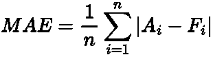
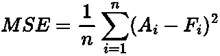
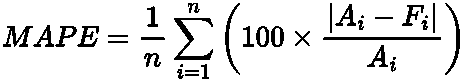
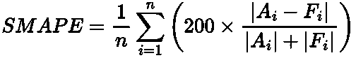
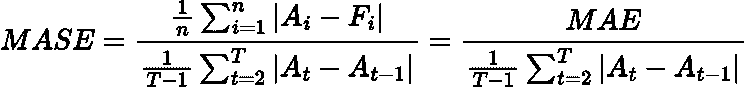
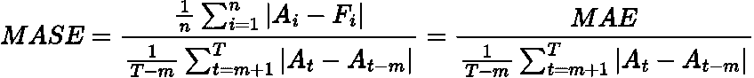
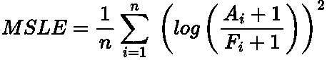

# 预测绩效指标概述

> 原文：<https://towardsdatascience.com/an-overview-of-forecasting-performance-metrics-ef548dad0134>

## 时间序列预测的一些基本性能指标概述

[斯科特·格雷厄姆](https://unsplash.com/@homajob?utm_source=medium&utm_medium=referral)在 [Unsplash](https://unsplash.com?utm_source=medium&utm_medium=referral) 上拍照

# 介绍

对于您的机器学习或统计模型，有许多错误和性能指标。更不用说每年都在开发新的了。

一个指标并不比另一个更好，毕竟它们只是一个单一的数字。然而，为您的模型选择最合适的模型非常重要，这样您就可以正确地优化模型。

在这篇文章中，我想回顾一下经典指标和一些特定的预测指标，以及它们的优缺点。这将有助于您更好地理解在工作中何时何地使用某些指标。

# 经典作品

## 平均绝对误差

作者用 LaTeX 写的方程式。

[平均绝对误差](https://en.wikipedia.org/wiki/Mean_absolute_error)就是预测值 ***F*** 和实际值 ***A.*** 之差的平均值

**优点:**

*   容易理解
*   误差存在于数据和预测的单位中

**缺点:**

*   不惩罚异常值(如果你的模型需要的话)
*   尺度相关，因此无法与使用不同单位的其他时间序列模型进行比较

## 均方误差

作者用 LaTeX 写的方程式。

[均方误差](https://en.wikipedia.org/wiki/Mean_squared_error)与 MAE 类似，但这次我们对预测值和实际值之间的差异进行平方。

赞成者:

*   离群值会受到严重惩罚(如果您的模型需要的话)

**缺点:**

*   误差不会出现在时间序列的原始单位中，因此可能更难解释
*   尺度相关，因此无法与使用不同单位的其他时间序列模型进行比较

## 均方根误差(RMSE)

作者用 LaTeX 写的方程式。

[均方根误差](https://en.wikipedia.org/wiki/Root-mean-square_deviation)与 MSE 相同，只是最后我们对结果求平方根。

**优点:**

*   仍然严重惩罚异常值(如果你的模型需要的话)
*   误差将以时间序列的原始单位表示
*   算是 MSE 和 MAE 两个世界中最好的

**缺点**:

*   不太好解释，因为你还在纠正错误
*   尺度相关，因此无法与使用不同单位的其他时间序列模型进行比较

# 特定预测

## 平均绝对百分比误差(MAPE)

作者用 LaTeX 写的方程式。

[平均绝对百分比误差](https://en.wikipedia.org/wiki/Mean_absolute_percentage_error)是实际值和预测值之间的百分比差。这通常是用于测量大多数预测模型的基线指标。

**优点:**

*   容易理解
*   规模独立，因此可以跨不同的时间序列进行比较

**缺点:**

*   如果实际值接近或为零，则误差无限
*   较低的预测必然会有 100%的误差，但较高的预测可能会有无限的误差，因此它会被低估

## 对称平均绝对百分比误差

作者用 LaTeX 写的方程式。

[对称平均绝对百分比误差](https://en.wikipedia.org/wiki/Symmetric_mean_absolute_percentage_error)是 MAPE 的扩展，但考虑到其对负误差的惩罚多于正误差的限制。

**优点**:

*   不再倾向于预测不足，因为输出现在完全限制在 0 到 200%之间

**缺点:**

*   仍然有无限值的机会，因为分母仍然可以接近或为零
*   0 到 200%之间的百分比误差很难解释
*   实际上并不是对称的，因为它没有平等地对待低估和高估的错误([见此处](https://en.wikipedia.org/wiki/Symmetric_mean_absolute_percentage_error))

## 平均绝对标度误差

无季节性:

作者用 LaTeX 写的方程式。

带有季节性:

作者用 LaTeX 写的方程式。

这是季节性和非季节性时间序列的[平均绝对比例误差](https://en.wikipedia.org/wiki/Mean_absolute_scaled_error)，可能是最好也是最公平的使用指标。

如果你想了解更多关于季节性的知识，可以看看我以前的博客:

</seasonality-of-time-series-5b45b4809acd>  

如果误差小于 1，则该预测优于对长度为*的训练数据的平均[简单预测](https://en.wikipedia.org/wiki/Forecasting#Na.C3.AFve_approach)。另一方面，如果它大于 1，则预测比平均的简单预测差。上式中 ***m*** 指季节性指数。*

> *一个简单的预测是将你的预测设定为最新的实际观察值。对于简单的季节性预测，您可以将其设置为预测季节的前一个观测值。*

***优点:***

*   *比例无关，因为分子和分母有相同的单位*
*   *当实际值接近或为零时的可预测行为*
*   *预测不足和预测过度同样会受到惩罚*

***缺点:***

*   *可能很难向利益相关者解释*

## *均方对数误差(MSLE)*

**

*作者用 LaTeX 写的方程式。*

*[均方对数误差](https://scikit-learn.org/stable/modules/model_evaluation.html#mean-squared-log-error)衡量预测值与实际值之间的比率或相对差异。*

***优点**:*

*   *比过度预测更多地惩罚预测不足(如果您的模型需要的话)*

***缺点:***

*   *不容易解释*
*   *可能会有被等于或接近于零的值除的问题*

# *总结和进一步的思考*

*在这篇文章中，我们回顾了经典的误差指标:MAE、MSE 和 RMSE，以及一些特定的预测指标:MAPE、SMAPE、MASE 和 MSLE。所有这些指标都有不同的利弊，无论是独立于规模，能够被零除还是惩罚预测不足。要记住的关键是，不要一刀切，你最好使用一系列指标来评估你的预测模型。*

# *参考资料和进一步阅读*

*   **预测:原理与实践:*[https://otexts.com/fpp2/](https://otexts.com/fpp3/accuracy.html)*

# *和我联系！*

*   *要在媒体上阅读无限的故事，请务必在此注册！ 💜*
*   *[*在我发布注册邮件通知时获得更新！*](/subscribe/@egorhowell) 😀*
*   *[*LinkedIn*](https://www.linkedin.com/in/egor-howell-092a721b3/)*👔**
*   **[*推特*](https://twitter.com/EgorHowell) 🖊**
*   **[*github*](https://github.com/egorhowell)*🖥***
*   ***<https://www.kaggle.com/egorphysics>**🏅*****

> ***(所有表情符号都是由 [OpenMoji](https://openmoji.org/) 设计的——开源的表情符号和图标项目。许可证: [CC BY-SA 4.0](https://creativecommons.org/licenses/by-sa/4.0/#)***