# 嵌套和非嵌套回归模型的模型选择测试概述

> 原文：<https://towardsdatascience.com/an-overview-of-model-selection-tests-for-nested-and-non-nested-regression-models-5edfa00a12bc>


图片由 [Tumisu](https://pixabay.com/users/tumisu-148124/) 发自 [Pixabay](https://pixabay.com/illustrations/compare-comparison-scale-balance-643305/) ( [Pixabay 牌照](https://pixabay.com/service/license/))

## 如何比较所有或部分变量相同的回归模型

通常，回归建模者面临着在两个或多个竞争模型中选择相同的问题。诸如 [**R 平方**](/the-complete-guide-to-r-squared-adjusted-r-squared-and-pseudo-r-squared-4136650fc06c) (或 [**伪 R 平方**](/the-complete-guide-to-r-squared-adjusted-r-squared-and-pseudo-r-squared-4136650fc06c) )和用于回归分析的 [**F 检验**](/fisher-test-for-regression-analysis-1e1687867259) 之类的拟合优度测量可用于指示单个模型与训练数据集的拟合程度，而 [**AIC**](/the-akaike-information-criterion-c20c8fd832f2) 或 BIC 这两个模型的分数可进行比较，以查看哪一个更好地拟合数据集。

然而，这种测试本身不能用来决定在两个模型 A 和 B 之间，其中一个是否明显优于另一个。

例如，如果模型 A 的调整后 R 平方值为 0.67，而模型 B 报告的调整后 R 平方值为 0.76，那么 0.09 的差异是否大到足以具有统计学意义？或者模型 A 只是不幸地在一个不合适的数据样本上被训练？

模型选择测试就是为了解决这个问题。具体来说，给定两个回归模型 A 和 B，模型选择测试将帮助您决定 A 更好还是 B 更好。正如我们将看到的，从一对候选模型中选择一个合适的模型可能是一个有趣的练习，有时会以两个模型都被接受或拒绝而告终！

# 型号选择程序概述

模型选择的过程基于 H1 和 H2 两个假设的形成，使得 H1 倾向于模型 A 和模型 b，而 H2 倾向于模型 b。选择测试由测试统计量 ***X*** (随机变量)的公式组成，如果两个假设中的一个假设(比如 H1)为真，则该统计量服从某个已知的概率分布*。这个分布给了我们对于不同的观察值***X***H1 为真的概率。一旦计算出这个检验统计量 ***X*** 的值，我们就可以使用 ***X*** 的概率分布来“读出”H1 为真的概率。然后，我们根据这个概率是大于还是小于某个临界概率 *α* 来接受或拒绝 H1。*

# 嵌套与非嵌套回归模型

模型选择测试的性质取决于两个模型 A 和 B 是否嵌套。

如果模型 B 包含模型 A 的所有回归变量(以及参数)加上至少一个，那么 A 被认为嵌套在 B 中。模型 A 被称为**限制**(或**限制**)模型，而模型 B 被称为**非限制**(或**非限制**)模型。下图说明了这种情况:

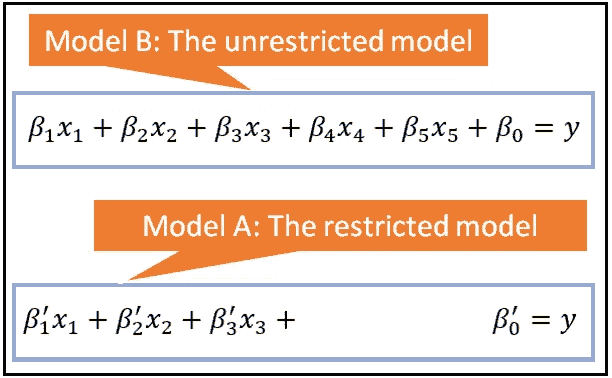

受限制的模型 A 嵌套在不受限制的模型 B 中(图片由作者提供)

如果模型以上述方式嵌套，诸如用于回归分析的 [**F 检验**](/fisher-test-for-regression-analysis-1e1687867259) 和**似然比检验**之类的检验可用于在约束和非约束模型之间进行选择。

f 检验和 LR 检验的好处在于，与调整后的 R 平方相比，它们还可以用于比较嵌套的*非线性*模型。还有一点需要注意的是(这也适用于调整后的 R 平方和 AIC)，候选模型必须具有相同的响应变量 ***y*** 。不能使用这些测试中的任何一个来比较两个模型，其中模型 A 将 ***y*** 作为响应变量，而模型 B 将*log****y***或*sqrt(****y****)*作为响应变量。

当模型 A 和 B 仅共享一些回归变量或它们不共享任何回归变量时，即当它们不嵌套时，f 检验和 LR 检验不能用于模型选择。我们需要查看一组不同的模型选择测试来比较这种非嵌套模型。

有大量关于非嵌套模型的模型选择测试的研究文献。我们将检验一个由 Davidson 和 MacKinnon (1984)设计的称为 **J 检验**的检验，并且我们将说明它在现实世界数据集的两个非嵌套回归模型之间进行选择的用途。

# 型号选择程序的图示

为一个问题选择一个合适的模型的过程最好用一个例子来描述。在本文中，我们将在真实数据集上比较两个固定效应回归模型的性能。我们将使用的真实数据集是一个面板数据集，包含了从 1992 年到 2014 年测量的七个国家人均 GDP 的同比增长百分比。除了 GDP 增长数据，该面板还包含每个国家总资本形成和人均二氧化碳排放量的同比增长数据。数据集可以从这个 [**下载链接**](https://gist.github.com/sachinsdate/67b12abd253c571b73c42eae8ea79f91) 下载。

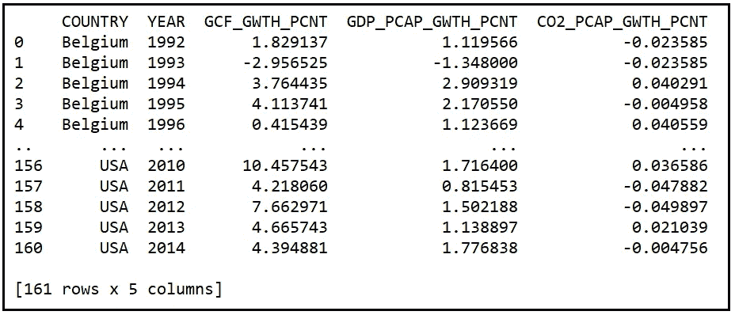

a 面板数据集(来源:[世界发展指标](https://databank.worldbank.org/metadataglossary/world-development-indicators/series)数据 [CC BY 4.0 license](https://www.worldbank.org/en/about/legal/terms-of-use-for-datasets) )(图片由作者提供)

如果你是固定效果模型的新手，我建议你回顾一下我关于固定效果模型的文章。对于考虑中的数据集，您可以将 FE 模型视为包含虚拟变量(即 1/0 值变量)的线性回归模型，数据集中的 7 个国家/地区各有一个虚拟变量。虚拟模型应该能够捕捉特定国家的“效应”。

我们来看看上面数据集的两个竞争有限元模型。

模型 A 是一个 FE 模型，在该模型中，我们假设每年人均 GDP 的变化受到总资本形成变化的高度影响(“解释”)。

模型 B 也是一个有限元模型。模型 B 认为人均国内生产总值的变化与其说是由资本形成总额的变化来解释，不如说是由二氧化碳排放量的年度变化来解释。

作为固定效应模型的 A 和 B 都同意使用 6 个虚拟变量来表示数据面板中 7 个国家的效应。我们使用少一个变量来避免完美的多重共线性。

模型 A 和 B 的方程可以表述如下:

对于型号 A:

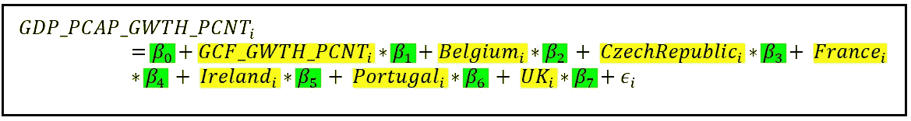

固定效果模型 A 的模型方程(图片由作者提供)

对于型号 B:

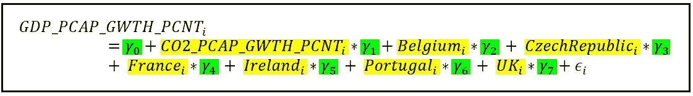

固定效果模型 B 的模型方程(图片由作者提供)

在这两个等式中，下标 *i* 指的是数据集的第*I*行。特定于国家的变量是虚拟变量，其值为 1 或 0，取决于第*行与第*行是否与该国家相关。***β****=【β_ 0，β_1，…β_ 7】*是模型 A 中回归系数的向量，而***γ****=【γ_ 0，γ_1，…γ_ 7】***是模型 b 中系数的向量 ***β*** 和 ***γ* 在这两种模型中， *ϵ_i* 是第*行和第*行的误差项。误差项是 GDP_PCAP_GWTH_PCNT 的观测值与其模拟值之差。****

**使用 Python 和 [statsmodels](https://www.statsmodels.org/stable/index.html) ，让我们使用经典的 OLS 技术在同一个数据集上训练 A 和 B。**

**让我们从导入我们将需要的所有包开始:**

```
**import** pandas **as** pd
**import** statsmodels.formula.api **as** smf
**from** patsy **import** dmatrices
**import** scipy.stats **as** st
```

**让我们在固定效应模型中定义感兴趣的单位:**

```
unit_names = [**'Belgium'**, **'CzechRepublic'**, **'France'**, **'Ireland'**, **'Portugal'**, **'UK'**, **'USA'**]unit_names.sort()
```

**标记数据集中包含单位名称的列:**

```
unit_col_name=**'COUNTRY'**
```

**对于模型 A，定义 ***y*** 和 ***X*** 变量。 ***X*** 尚不包括假人。我们将很快添加它们。**

```
y_var_name = **'GDP_PCAP_GWTH_PCNT'** X_var_names = [**'GCF_GWTH_PCNT'**]
```

**将世界银行公布的发展指标的面板数据载入熊猫数据框架:**

```
df_panel = pd.read_csv(**'wb_data_panel_4ind_7units_1992_2014.csv'**, **header**=0)
```

**打印出前 30 行:**

```
**print**(df_panel.**head**(30))
```

**我们看到以下输出:**

**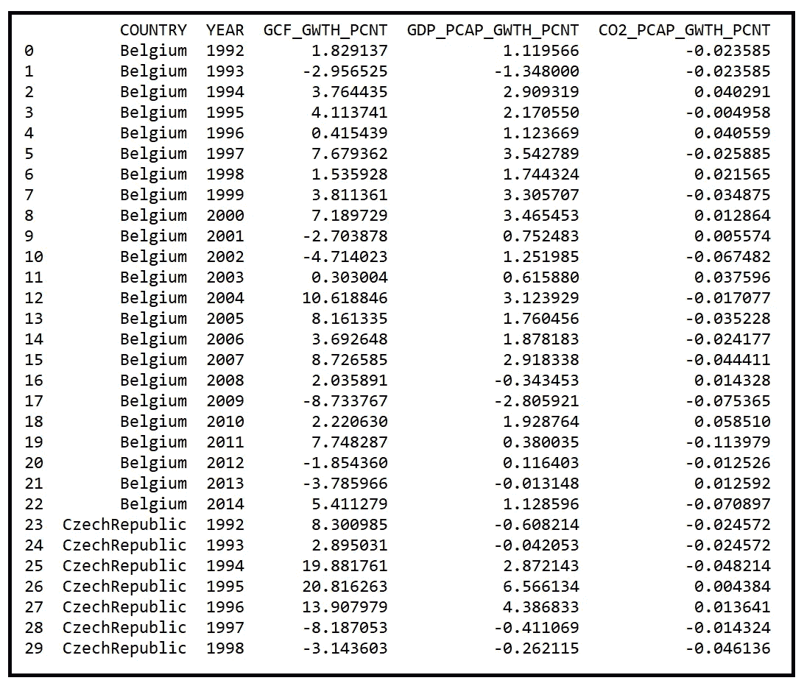**

**世界银行数据集的前 30 行(图片由作者提供)**

**创建虚拟变量，每个国家一个虚拟变量:**

```
df_dummies = pd.**get_dummies**(df_panel[unit_col_name])
```

**将虚拟数据框与数据集的其余部分连接起来:**

```
df_panel_with_dummies = df_panel.**join**(df_dummies)
```

**让我们看看扩充数据集是什么样子的:**

```
**print**(df_panel_with_dummies.**head**())
```

**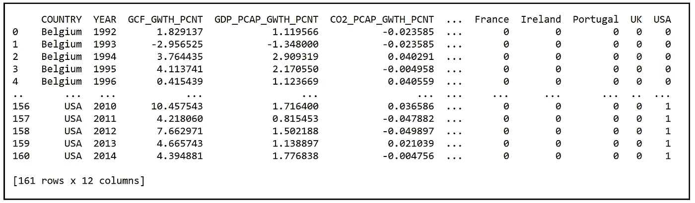**

**世界银行数据集增加了虚拟变量(图片由作者提供)**

**现在让我们构建模型 A 的回归方程。回想一下，模型 A 使用总资本形成作为回归变量之一。请注意，我们在回归方程中遗漏了一个虚拟变量，以避免 7 个虚拟变量之间的多重共线性。回归模型的截距将包含被忽略的虚拟变量的系数值(在我们的例子中，为美国):**

```
model_a_expr = y_var_name + **' ~ '**i = 0**for** X_var_name **in** X_var_names:
    **if** i > 0:
        model_a_expr = model_a_expr + **' + '** + X_var_name
    **else**:
        model_a_expr = model_a_expr + X_var_name
    i = i + 1**for** dummy_name **in** unit_names[:-1]:
    model_a_expr = model_a_expr + **' + '** + dummy_name
```

**打印出回归方程(用 Patsy 语法):**

```
print(**'Regression expression for model A=\n'** + model_a_expr)
```

**我们看到以下输出(截距在模型创建期间由 statsmodels 静默包含):**

```
**Regression expression for model A=** GDP_PCAP_GWTH_PCNT ~ GCF_GWTH_PCNT + Belgium + CzechRepublic + France + Ireland + Portugal + UK
```

**建立和训练固定效果模型 A:**

```
fe_model_a = smf.**ols**(**formula**=model_a_expr, **data**=df_panel_with_dummies)fe_model_a_results = fe_model_a.**fit**()
```

**打印出培训总结:**

```
print(fe_model_a_results.**summary**())
```

**我们看到以下输出:**

**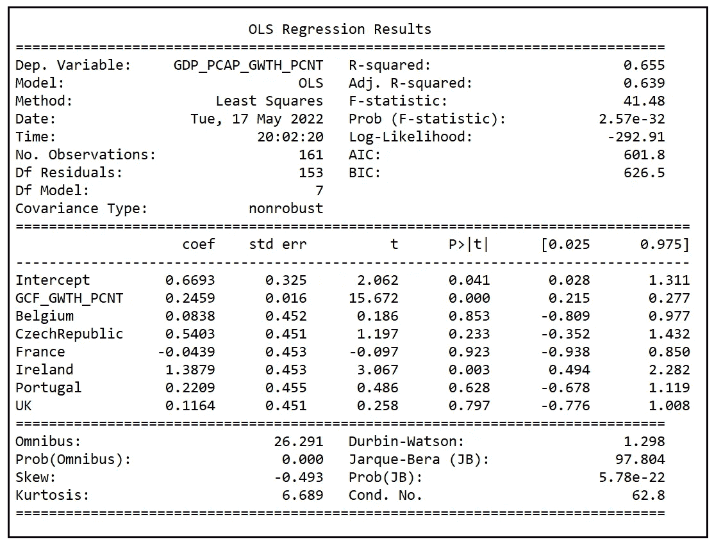**

**固定效果模型 A 的模型训练总结(图片由作者提供)**

**让我们快速记下模型报告的调整后的 R 平方为 0.639，以及 [**F 检验**](/fisher-test-for-regression-analysis-1e1687867259) 的 p 值为 2.57e-32。p 值几乎为零，这意味着该模型在解释 ***y*** 的方差方面比均值模型做得好得多，均值模型基本上是一条穿过 ***y*** 均值的平线。这是好消息。**

**现在，让我们对固定效果模型 B 重复上述所有步骤:**

```
***#Construct the regression equation.*** X_var_names = [**'CO2_PCAP_GWTH_PCNT'**]model_b_expr = y_var_name + **' ~ '** i = 0
**for** X_var_name **in** X_var_names:
    **if** i > 0:
        model_b_expr = model_b_expr + **' + '** + X_var_name
    **else**:
        model_b_expr = model_b_expr + X_var_name
    i = i + 1**for** dummy_name **in** unit_names[:-1]:
    model_b_expr = model_b_expr + **' + '** + dummy_name

print(**'Regression expression for model B=\n'** + model_b_expr)

***#Build and train model B*** fe_model_b = smf.**ols**(**formula**=model_b_expr, **data**=df_panel_with_dummies)fe_model_b_results = fe_model_b.**fit**()***#Print the model training summary*** print(fe_model_b_results.**summary**())
```

**我们看到以下输出:**

****

**固定效果模型 B 的模型训练总结(图片由作者提供)**

**请注意，模型 B 报告的调整后 R 平方为 0.272。同样，f 检验的 p 值(8.5e-10)实际上为零，这意味着模型 B 在解释 ***y*** 的方差方面也比均值模型做得更好。**

## **模型 A 和模型 B 的拟合优度比较**

**模型 B 的调整后 R 平方(0.272)远小于模型 A 的(0.639)。这似乎是模型 A 优于模型 B 的必然结果。其他拟合优度指标似乎也倾向于模型 A 优于模型 B。模型 A 的对数似然性(-292.91)高于模型 B (-349.43)。模型 A 的 AIC 得分(601.8)低于模型 B 的得分(714.9)。对于 AIC 分数，分数越低越好。**

**在这种情况下，A 和 B 之间看起来没有太大的竞争。但想象一下，模型 B 的 R 平方、Log-LL 和 AIC 分数碰巧与 A 的相似。在这种情况下，如何比较 A 和 B 的拟合度呢？**

**回想一下，模型 A 和 B 只有一些共同的回归变量，具体来说，它们只有共同的虚拟变量。因此，A 没有嵌套在 B 中，B 也没有嵌套在 A 中。因此，不能使用 f 检验或似然比检验在 A 和 B 之间进行选择。**

**在这种情况下，我们可以用 J 检验。我们来举例说明它的用法。**

# **J 检验**

**J 测试基于组合所谓的**综合模型**的原理，具体如下:**

1.  **我们假设模型 A 和 B 预计能够单独解释响应变量 ***y*** 中的一些方差。**
2.  **模型 a 由方程描述:***y****=****xβ****+****ϵ*****
3.  **模型 b 由方程描述:***y****=****zγ****+****ϵ*****
4.  **我们创建一个综合模型 c，它使用按比例加权和来组合模型 a 和 b，如下所示:
    ***y****=(1-λ)****xβ****+λ****zγ****+****ϵ****，其中λ从 0 变化到 1***
5.  ****现在这里的关键是:如果模型 A 能够解释模型 B 能够解释的 ***y*** 中的所有差异，加上一些更多的差异，那么模型 B 实际上包含在模型 A 中。我们不需要模型 B。在这种情况下，当你在数据集上训练综合模型 C 时，系数 *λ* 的拟合值应该计算为零**。******
6.  ****另一方面，如果模型 B 恰好能够解释模型 A 能够单独解释的 ***y*** 中的所有方差，那么模型 A 就是多余的，拟合系数 *λ* 应该算出为 1。****
7.  ****在所有其他情况下，拟合的 *λ* 既不是零也不是一，这意味着每个模型 A 和 B 都能够单独解释*y 中总方差的一部分，而另一个模型无法解释。任何一种模式都不能为了另一种模式而被彻底抛弃。*****
8.  *****有趣的是，还有第四种情况，在综合模型 C 中交换 A 和 B 之后， *λ仍然计算为零。在这种情况下，我们最终拒绝了型号 A 和型号 B！******

*****在最后两个场景中，测试在 A 和 b 之间的选择是不确定的。*****

*****综合模型方法有一个严重问题。鉴于 *λ* 的指定方式，它会乘以模型 A 和 b 的系数。因此，不可能将 *λ* 与模型系数的相互作用隔离开来，从而使 *λ* 实际上不可测量。*****

*****Davidson 和 MacKinnon 提出的 J 检验解决了这个问题，同时仍然保留了综合模型方法的精神。我们在 J 测试中所做的是用模型 B 的*预测值* ***y*** 【拟合】值代替模型 B 对综合模型的贡献。这样做为模型 C 提供了以下更新的等式:*****

********y****=****xβ****+****zγ_ cap****λ+****ϵ****，其中λ从 0 到 1 不等******

*****我们将综合模型中的 ***Zγ*** 替换为 ***Zγ_cap*** 其中 ***γ_cap*** 为 B 在数据集上自行拟合后模型 B 的拟合系数向量。*****

*****使用 J 测试的过程如下:*****

1.  *****将模型 B 单独拟合到数据集上。这是 ***y*** 对*的回归，从中我们得到拟合系数 ***γ_cap*** 。******
2.  ******通过拟合的模型运行训练数据集 ***Z*** 以产生拟合模型的预测***y _ cap****=****Zγ_ cap***。******
3.  ******现在，构建模型 C 作为模型 A 的扩充版本，其中一个回归变量是 ***y_cap*** 。由此，我们对**x***y _ cap****y****=****xβ****+***********
4.  ******如果在这个扩充的模型中， ***y_cap*** 的系数 *λ* 被发现为零，那么模型 B 已经无法解释任何超出模型 A 所能解释的*y 的方差。因此，模型 A 包含模型 B，我们选择 A 而不是 B。*******
5.  *******如果增强模型中的 *λ* 不为零，那么模型 B 有能力解释 ***y*** 中超出 A 所能捕捉的一些差异。在这种情况下，我们不能选择 A 而不是 b。我们很快就会看到在这种情况下该怎么做。*******
6.  ******我们也可以通过如下方式构造模型 c 来逆向测试:
    ***y****=****xβ_ cap****λ+****zγ****+****【ϵ*** 即我们在**【t3t 上倒退 ***y*** 从这个模型中得到预测***y _ cap****=****xβ_ cap***并将这些预测作为一个变量加入到 ***y*** 对 ***Z*** 的回归中。 如果 ***y_cap*** 的拟合系数为零，我们得出结论，A 无法解释任何超出 B 所能解释的*y 的方差。所以我们选择 B 而不是 a。*********

*****在 J 测试中，在两种情况下，拟合的 *λ* 都可能为零，从而表明 A 和 B 都不适合数据集。*****

## ****J 测试的图示****

****让我们对之前构建的两个固定效应模型进行 J 测试。在 J 测试的语言中，我们将 ***X*** 和 ***Z*** 定义如下:****

*******X*** 是固定效应模型 A 的回归变量矩阵:****

********

****固定效应模型 A 的回归变量矩阵(图片由作者提供)****

*******Z*** 是固定效应模型 B 的回归变量矩阵:****

****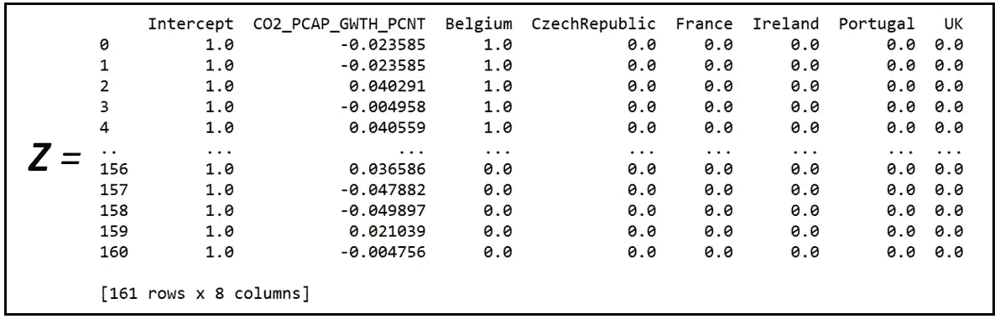****

****固定效应模型 B 的回归变量矩阵(图片由作者提供)****

*******y*** 是 **GDP_PCAP_GWTH_PCNT** 。****

****在前面的部分中，我们已经在数据集上拟合了模型 B。让我们在 **Z** 得到它的预测。为此，我们需要首先从 Pandas 数据帧中切出 ***Z*** 。Patsy 的`dmatrices`类将使用模型 B 的回归方程帮助我们做到这一点:****

```
**y_train, Z_train = **dmatrices**(model_b_expr, df_panel_with_dummies, **return_type**='dataframe')**
```

****在 ***Z_train*** 上运行拟合的模型 B，以获得预测值:****

```
**y_cap = fe_model_b_results.**predict**(Z_train)**
```

****通过添加来自模型 B 的预测来扩充数据集:****

```
**df_panel_with_dummies[**'**y_cap**'**] = y_cap**
```

****现在构建综合模型(模型 C)的回归方程。回想一下，模型 C 的表达式如下:****

*******y****=****y _ cap****λ+****xβ****+****ϵ*******

****其中 ***X*** 是模型 a 的回归矩阵， ***y_cap*** 是来自模型 b 的预测， ***ϵ*** 是回归的误差项。****

```
**X_var_names = [**'y_cap'**, **'GCF_GWTH_PCNT'**]comprehensive_model_expr = y_var_name + **' ~ '** i = 0
**for** X_var_name **in** X_var_names:
    **if** i > 0:
        comprehensive_model_expr = comprehensive_model_expr + **' + '** + X_var_name
    **else**:
        comprehensive_model_expr = comprehensive_model_expr + X_var_name
    i = i + 1**for** dummy_name **in** unit_names[:-1]:
    comprehensive_model_expr = comprehensive_model_expr + **' + '** + dummy_nameprint(**'Regression expression of the comprehensive model=\n'** + comprehensive_model_expr)**
```

****我们看到以下输出:****

```
****Regression expression of the comprehensive model=**
GDP_PCAP_GWTH_PCNT ~ y_cap + GCF_GWTH_PCNT + Belgium + CzechRepublic + France + Ireland + Portugal + UK**
```

****让我们在扩充数据集上构建和训练这个模型:****

```
**comprehensive_model = smf.**ols**(formula=comprehensive_model_expr, data=df_panel_with_dummies)comprehensive_model_results = comprehensive_model.**fit**()print(comprehensive_model_results.**summary**())**
```

****我们看到以下结果:****

****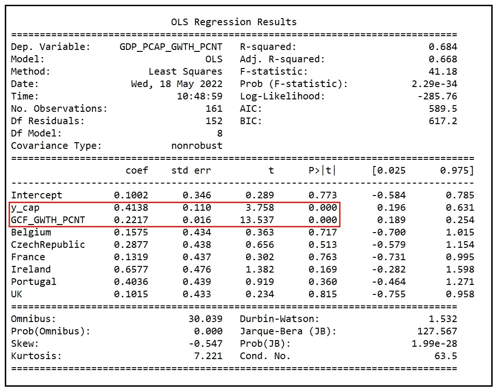****

****综合模型训练总结(图片由作者提供)****

****在训练总结中，我们看到除了 y_cap 和 GCF_GWTH_PCNT 的系数外，所有变量的系数在统计上均不显著(即为零)。****

****综合模型中代表模型 B 的系数 *y_cap* 非常显著。这突出了一个重要的发现:**模型 B 具有模型 A 所没有的解释力。我们不应该为了 a 模式而完全抛弃 B 模式******

****这一决定与我们之前通过简单比较两个模型的调整后 R 平方值以及 Log-LL 和 AIC 分数所做的决定背道而驰。****

****但它回避了一个问题，B 中的哪些变量具有超出模型 A 所能提供的解释力？我们可以这样回答这个问题:****

****在综合模型中包含*y _ cap*——B 的代表——导致 A 和 B 共有的每一个变量的系数在拟合的综合模型中变得统计上不重要。因此，B 中唯一可能具有额外解释力的变量是那些与 A 不常见的变量，即 **CO2_PCAP_GWTH_PCNT** 。****

****为了检验这一假设，我们将在模型 A 中加入 CO2_PCAP_GWTH_PCNT 以构建如下新模型(我们称之为模型 D) **:******

****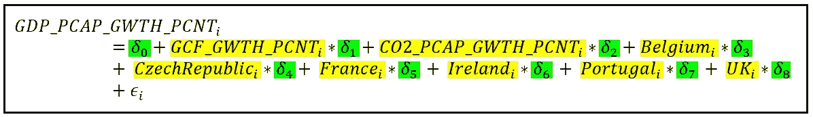****

****固定效应模型 D 的回归方程(图片由作者提供)****

****让我们在训练数据集上拟合模型 D:****

```
*****#Formulate model D by adding CO2_PCAP_GWTH_PCNT to model A*** X_var_names = [**'GCF_GWTH_PCNT'**, **'CO2_PCAP_GWTH_PCNT'**]fe_model_d_expr = y_var_name + **' ~ '**i = 0**for** X_var_name **in** X_var_names:
    **if** i > 0:
        fe_model_d_expr = fe_model_d_expr + **' + '** + X_var_name
    **else**:
        fe_model_d_expr = fe_model_d_expr + X_var_name
    i = i + 1**for** dummy_name **in** unit_names[:-1]:
    fe_model_d_expr = fe_model_d_expr + **' + '** + dummy_name

print(**'Regression expression of model D=\n'** + fe_model_d_expr)

***#Build and train FE model D*** fe_model_d = smf.**ols**(formula=fe_model_d_expr, **data**=df_panel_with_dummies)fe_model_d_results = fe_model_d.**fit**()
**print**(fe_model_d_results.**summary**())**
```

****我们看到以下输出:****

```
****Regression expression of model D=**
GDP_PCAP_GWTH_PCNT ~ GCF_GWTH_PCNT + CO2_PCAP_GWTH_PCNT + Belgium + CzechRepublic + France + Ireland + Portugal + UK**
```

****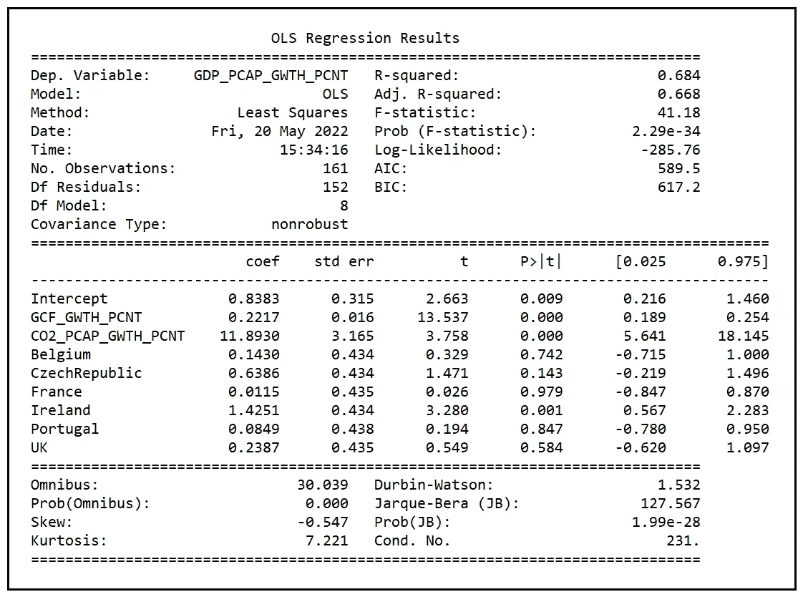****

****固定效果模型 D 的训练总结(图片由作者提供)****

****我们来回忆一下 A 型的训练总结:****

********

****固定效果模型 A 的模型训练总结(图片由作者提供)****

****以下是固定效应模型 A 和 D 的拟合优度的比较:****

********

****固定效应模型 A 和 D 的拟合优度的比较(图片由作者提供)****

****我们看到，模型 A 和 D 之间的三个拟合优度非常相似，尽管 D 似乎比 A 略胜一筹。****

****我们还注意到，模型 A 嵌套在 D 中，因为模型 D 包含模型 A 的所有变量，再加上一个变量。因此，为了知道模型 D 是否在统计意义上优于 A，我们可以使用 [**F 检验进行回归分析**](/fisher-test-for-regression-analysis-1e1687867259) 。****

# ****使用 f 检验****

****我们将使用 f 检验来检验假设，即模型 D 比模型 a 在数据集上产生了更好的统计拟合。****

****具体来说，我们对 f 检验的两个假设如下:****

****H1:D 型并不比 A 型更合适 H2:D 型比 A 型更合适****

****如果发现 H1 是正确的，我们将得出结论，将二氧化碳 _PCAP_GWTH_PCNT 添加到模型 A 不会导致更好的拟合，因此我们接受模型 A 并拒绝 d****

****如果 H1 被证伪，我们将得出结论，将二氧化碳 _PCAP_GWTH_PCNT 添加到模型 A 中会导致拟合优度的显著改善。因此，我们将拒绝 A 而支持 d。****

****f 检验的检验统计如下:****

****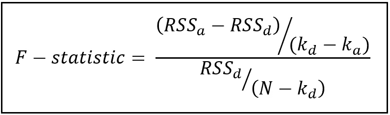****

****f 检验的检验统计量(图片由作者提供)****

****在上面的公式中，****

****RSS_a =拟合模型 A 的残差平方和(也称为残差误差).
RSS_d =拟合模型 b 的残差平方和.
k_a =模型 A 的参数个数(k_a=8)
k_d =模型 D 的参数个数(k_d=9)
N =训练数据集中的行数(N=161)****

****让我们计算 F 统计量的值，并将其值与在 *α* =.05 时的临界 F (1，152)值进行比较:****

```
**k_a = **len**(fe_model_a_results.**params**)
k_d = **len**(fe_model_d_results.**params**)
N = **len**(df_panel_with_dummies)
rss_a = fe_model_a_results.**ssr**
rss_d = fe_model_d_results.**ssr**f_statistic = ((rss_a-rss_d)/(k_d-k_a))/(rss_d/(N-k_d))

print(**'F-statistic='**+str(f_statistic))

alpha=0.05f_critical_value=st.**f**.**ppf**((1.0-alpha), (k_d-k_a), (N-k_d))print(**'F test critical value at alpha of 0.05='**+str(f_critical_value))**
```

****我们看到以下输出:****

```
****F-statistic=**14.12366072014461
**F test critical value at alpha of 0.05=**3.9033664964061314**
```

****由于统计值(14.12)的计算值远大于临界值(3.90)，我们拒绝 H1，接受临界*α***. 05 的 H2，即(1 — .05)100%=95%的置信水平。******

******因此，我们确定，对于所考虑的数据集，固定效应模型 D 确实比固定效应模型 A 更适合。******

# ******似然比检验******

******由于模型 A 嵌套在 D 中，我们也可以使用 LR 测试来比较两个模型的拟合优度。让我们使用 LRT 检验，并用它的结果来交叉验证 f 检验的结果。******

******似然比检验的检验统计量如下:******

******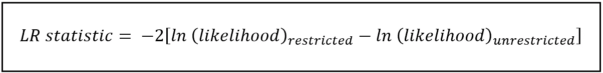******

******似然比检验的检验统计量(图片由作者提供)******

******在上面的公式中:******

******受限模型是具有较少参数的模型。在我们的例子中，它是模型 a。******

******无限制模型是带有附加参数的模型，在我们的例子中，模型 d。******

******对于这两个模型，我们计算最大化的对数似然，从限制模型的对数似然中减去非限制模型的对数似然，并取负 2 倍的差值作为统计量。******

******这两个竞争假设与 f 检验相同，即:******

******H1:D 型不比 A 型更合适
H2:D 型比 A 型更合适******

******在假设 H1 为真的情况下，LR 检验统计量是卡方分布的，其自由度等于两个模型之间的参数数之差。在我们的例子中，这个差值是(k _ d—k _ a)=(9–8)= 1。******

******让我们计算测试统计量，并将其值与. 05 的 *α* 处的临界卡方(1)值进行比较:******

```
*******#Get the maximumed log likelihoods of models A and D*** log_ll_a = fe_model_a_results.**llf**
log_ll_d = fe_model_d_results.**llf*****#Calculate the LR test statistic*** lrt_statistic = -2*(log_ll_a - log_ll_d)
print(**'LRT-statistic='**+**str**(lrt_statistic))***#Calculate the critical Chi-squared(1) value at alpha=0.05*** alpha=0.05chi2_critical_value=st.**chi2**.**ppf**((1.0-alpha), (k_d-k_a))print(**'Chi-squared critical value at alpha of 0.05='**+**str**(chi2_critical_value))****
```

******我们看到以下输出:******

```
******LRT-statistic**=14.305161418177136
**Chi-squared critical value at alpha of 0.05**=3.841458820694124****
```

******在 *α* =.05 时，测试统计值(14.31)远大于临界卡方(1)值 3.84，这导致我们拒绝 H1，接受 H2，即有限元模型 D 比有限元模型 a 产生更好的拟合优度。LR 测试与 f 检验一致。******

# ******摘要******

******我们检验了两个相互竞争的非嵌套固定效应模型 A 和 B 解释 7 个国家人均 GDP 增长差异的能力。******

******在 FE 模型 A 中，我们假设人均 GDP 增长很大程度上是由人均总资本形成的增长(以及特定国家的影响)来解释的。在 FE 模型 B 中，我们采用了一个不同的假设，假设人均 GDP 的增长是由人均二氧化碳排放量的增长来解释的(除了特定国家的影响之外)。******

******我们在面板数据集上训练了两个模型，发现模型 A 似乎产生了明显更好的拟合。******

******然而，当我们使用 **J 检验**在模型 A 和 B 之间进行选择时，我们发现模型 B 也能够解释模型 A 所不能解释的回归因变量中的一些方差。因此，不能为了 a 而完全抛弃 B。******

******对 J 检验结果的分析表明，用模型 b 中的人均二氧化碳排放量变量来扩充模型 A 可能对我们有益。******

******我们继续这样做，从而构建了一个新的模型 D，我们继续在数据集上训练 D。******

******D 的拟合优度，通过其**调整后的 R 平方**、**最大化对数似然**和 **AIC 得分**来证明，被发现与 A 非常相似，尽管比 A 稍有优势。这提出了一个问题:D 是否可能偶然受益于一个有益的数据样本，即一个恰好被调整到 D 的优势的数据面板？******

******由于 A 嵌套在 D 中，我们能够通过使用用于回归分析的 **F 检验**和**似然比检验**来客观地比较 A 和 D 的拟合优度，并得出 D 确实是比 A 更好的拟合模型的结论。******

******下面是本文中使用的完整源代码:******

# ******参考文献、引文和版权******

## ******数据集******

******[世界发展指标](https://databank.worldbank.org/metadataglossary/world-development-indicators/series)世界银行数据 [CC BY 4.0 license](https://www.worldbank.org/en/about/legal/terms-of-use-for-datasets) 。 [**下载链接**](https://gist.github.com/sachinsdate/67b12abd253c571b73c42eae8ea79f91)******

## ******纸质和图书链接******

******佩萨兰博士和韦克斯博士(1999 年)。[非嵌套假设检验:概述](https://ideas.repec.org/p/cam/camdae/9918.html)、[、*剑桥经济学工作论文*、 *9918* ，剑桥大学经济学院。](https://ideas.repec.org/s/cam/camdae.html) [**下载链接**](https://www.econ.cam.ac.uk/people-files/emeritus/mhp1/nnest.pdf)******

******戴维森和麦金农(1984 年)。基于人工线性回归的模型规格测试。*国际经济评论*， *25* (2)，485–502。[https://doi.org/10.2307/2526210](https://doi.org/10.2307/2526210)******

## ******形象******

******本文中的所有图片版权归 [CC-BY-NC-SA](https://creativecommons.org/licenses/by-nc-sa/4.0/) 所有，除非图片下面提到了不同的来源和版权。******