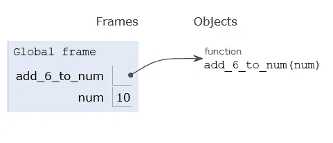
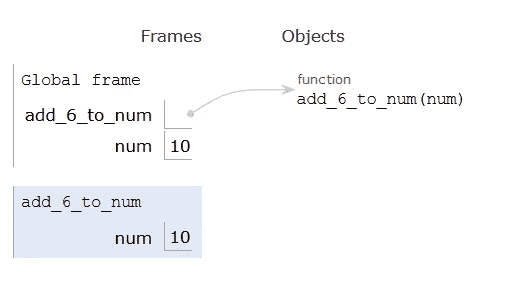
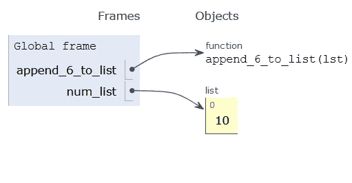
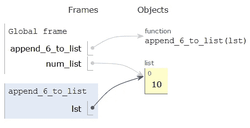
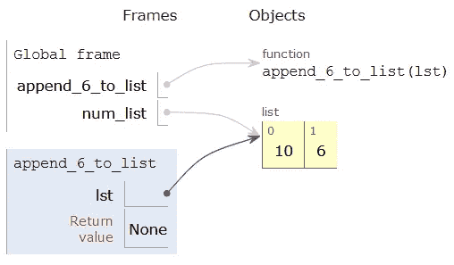

# Python 对象可变性概述

> 原文：<https://towardsdatascience.com/an-overview-of-mutability-in-python-objects-8efce55fd08f>

## 一个重要的编程概念，在不是正式的“计算机科学”的课程和教程中经常被忽略


[帕卡塔·高](https://unsplash.com/@pakata?utm_source=medium&utm_medium=referral)在 [Unsplash](https://unsplash.com?utm_source=medium&utm_medium=referral) 上的照片

理解对象可变性是一个重要的概念，几乎肯定会在计算机科学课程或训练营中涉及到。然而，在专注于数据科学、统计学、用户体验、生物工程或任何其他以某种方式使用代码的相关领域的培训中，它经常被忽略。

这是一个问题，因为这是一个影响程序员如何编写和开发代码的重要概念。对可变性如何工作的错误理解或缺乏认识会导致令人困惑的错误，甚至是看似正常工作的代码在以后会崩溃。

在本文中，我将给出可变性的概述以及一些详细的例子。

## 什么是可变性？

在技术编程术语中，可变对象是一种在定义后其状态可以被修改的对象。与可变对象相反的是不可变对象，它的状态在最初定义后不能改变。

Python 中不可变对象的例子包括整数、浮点、字符串和元组。在用 Python 编程时，您可能最常处理的两种类型的可变对象是[列表](/whats-in-a-list-comprehension-c5d36b62f5)和[字典](/whats-in-a-dictionary-87f9b139cc03)。

让我们看一个具体的例子来说明可变性和不可变性之间的区别。假设我定义了一个歌曲列表。如果我想通过替换其中一首歌曲来改变列表，这完全没问题，因为列表是可变的:

```
>>> my_songs = ["All Too Well", "No Tears Left to Cry", "Cruel Summer"]
>>> my_songs[1] = "Champagne Problems"
>>> my_songs
['All Too Well', 'Champagne Problems', 'Cruel Summer']
```

相比之下，假设我定义了一个字符串，它是一个不可变的对象，但是我不小心拼错了。如果我试图修改字符串，Python 会报错:

```
>>> my_song = "All Too Wall"
>>> my_song[9] = 'e'
Traceback (most recent call last):
  File "<stdin>", line 1, in <module>
TypeError: 'str' object does not support item assignment
```

一旦定义了字符串，就不能更改其内容。如果我想修改拼写，我需要定义一个新的字符串。

如果你考虑列表和字典的功能，你会意识到你一直在利用它们的可变性，即使你可能没有意识到。像`append`、`extend`和`update`这样的函数都可以修改它们引用的列表或字典，对于跟踪数据或完成某个编程任务非常有用。

然而，尽管可变对象在某些情况下很有用，但是如果程序员不知道它们是如何工作的，它们通常会导致错误。在下一节中，我将探索一个详细的例子来解释如果可变性被误解会导致什么问题。

## 为什么这很重要的详细例子

在这一节中，我将编写两个函数——一个操作整数，一个操作列表。通过探索每个函数的输出并解释幕后发生的事情，我将说明为什么在处理可变对象时必须小心。

第一个函数将数字`6`加到一个整数上，第二个函数将数字`6`追加到一个列表中:

```
# Add 6 to a number
def add_6_to_number(num):
     num = num + 6# Append 6 to the end of a list
def append_6_to_list(lst):
     lst.append(6)
```

现在，我将利用上面的函数编写一小段代码。请密切注意初始整数的值，并在调用函数前后列出变量:

```
>>> num = 10
>>> add_6_to_number(num)
>>> print(num) # num remains unchanged
10>>> list_num = [10]
>>> append_6_to_list(list_num)
>>> print(list_num) # list_num, however, changes
[10, 6]
```

就我个人而言，我第一次学习时就发现这很有趣。变量`num`保持不变，但是变量`list_num`发生了变化。为什么会这样？它与如何将可变对象传递给函数有关。这个更容易目测。

下面，我从 [Python Tutor](https://pythontutor.com/) 复制了三张图片，这是一个很棒的在线工具，可以帮助你可视化你的 Python 代码。它们显示了在我调用函数`add_6_to_num`之前、期间和之后发生的事情。



作者图片



作者图片


作者图片

这里关键的观察是，当调用`add_6_to_num`时，它创建了变量`num`的*副本*，并且该副本是函数内部被更改的内容。但是我们定义的初始变量`num`在函数之外保持不变。所有不可变对象都是如此:当它们被传递到函数中时，Python 会复制它们。

现在，让我们来看看列表对应的三个图表:



作者图片



作者图片



作者图片

看到最重要的区别了吗？因为列表是可变的，所以 Python 在将它们传递给函数时不会复制它们。因此，在上面，对*相同的*列表的引用(用箭头表示)被传递到`append_6_to_list`函数中。函数内部和函数外部的变量引用的是同一个链表，所以当它在函数内部发生变化时，函数外部的变量`num_list`的值也会发生变化。

所有可变对象都是如此——当它们被传递到一个函数中时，Python 不会复制它们，而只会传递一个对已经存在的对象的引用。这是一个人在编写代码时应该特别注意的事情，因为它甚至会绊倒最有经验的程序员。如果您的代码中有一堆对列表、字典或其他可变对象的引用，这可能会导致许多问题并导致意外的值。

## 最后的想法

因为数据科学是在统计学的基础上发展起来的，所以相应的数据科学教育场所有时会忽略教授计算机科学中的重要概念。然而，这可能导致难以维护的低质量代码。

列表和字典是 Python 中数据科学的重要组成部分——它们都是 Python 的数据科学模块 Pandas 广泛使用的数据结构。因此，在编写利用和依赖这些对象的代码时，理解 Python 如何处理这些对象是很重要的。了解本文中的概念对我很有帮助，我希望对你也有帮助。

下次见，伙计们！

**想擅长 Python？** [**获取独家，免费获取我简单易懂的攻略**](https://witty-speaker-6901.ck.page/0977670a91) **。**

*请考虑使用我下面的推荐链接注册成为正式的媒体会员。你一个月就能看无限的故事，你的会员费直接支持我和其他作家。*

[](https://murtaza5152-ali.medium.com/?source=entity_driven_subscription-607fa603b7ce---------------------------------------) 