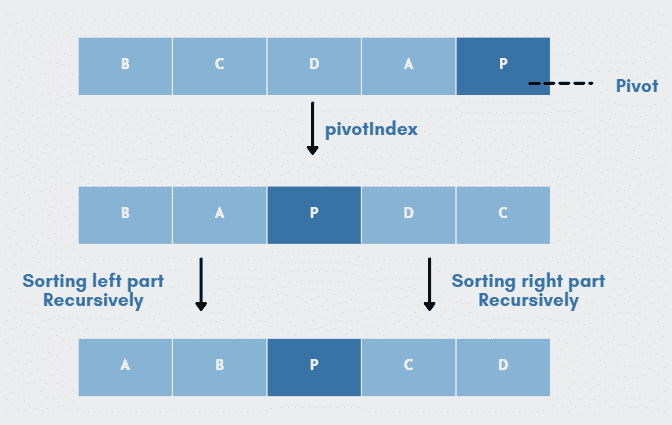
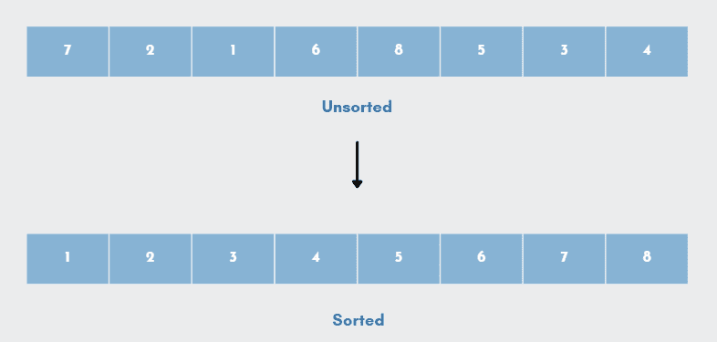
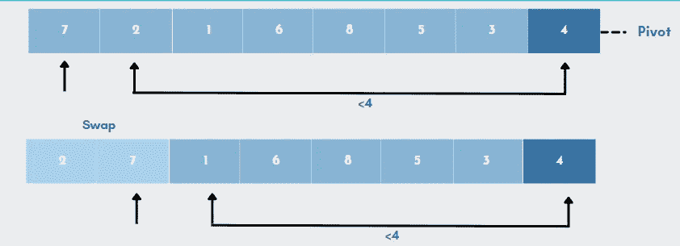
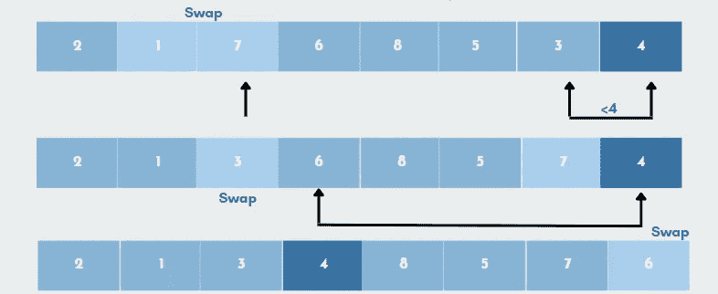
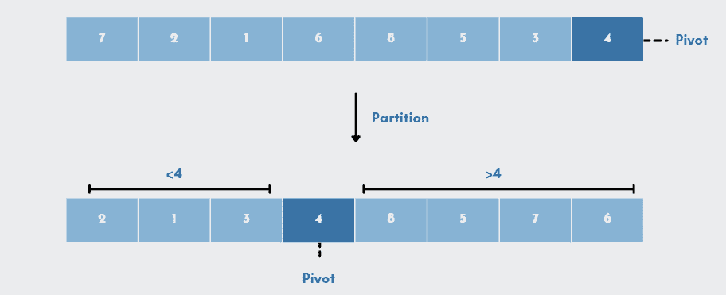
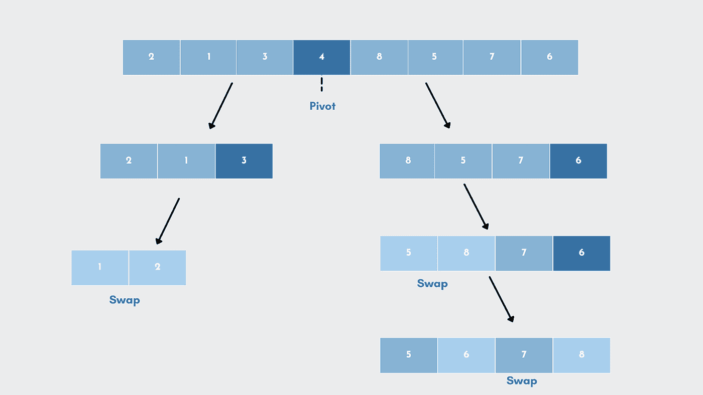
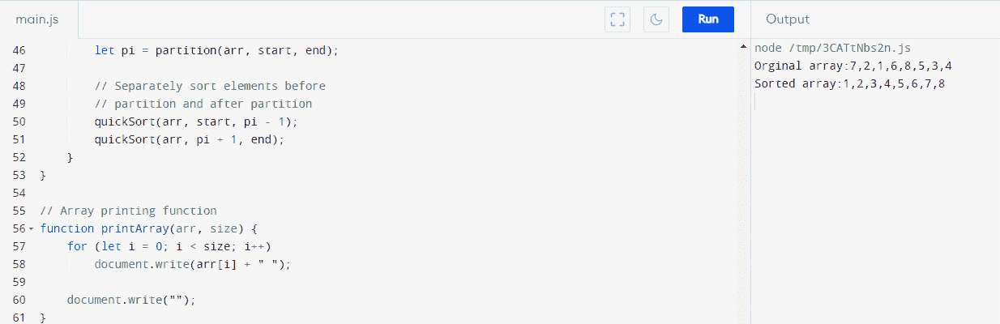
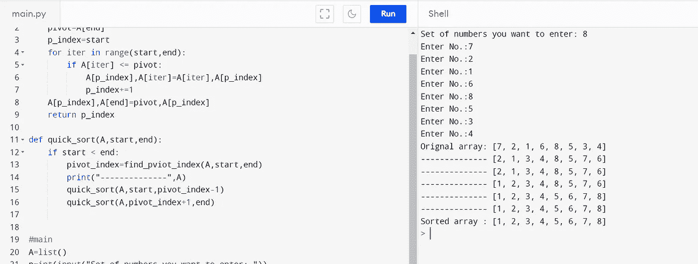
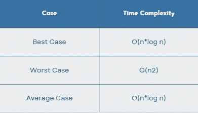
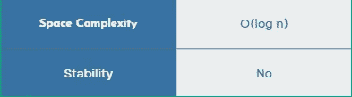

# 快速排序算法综述

> 原文：<https://towardsdatascience.com/an-overview-of-quicksort-algorithm-b9144e314a72>

排序是以结构化的方式组织元素的过程。Quicksort 是最流行的排序算法之一，它在典型情况下使用`nlogn`比较来对 n 个元素的数组进行排序。快速排序基于**分治策略。**我们将在本教程中看看快速排序算法，看看它是如何工作的。



快速排序算法概述|作者图片

# 快速排序的想法

快速排序是一种快速排序算法，它通过将一个大的数据数组拆分成更小的子数组来工作。**这意味着每一次迭代都是通过将输入分成两个部分，对它们进行排序，然后再重新组合来实现的。**对于大型数据集，该技术非常高效，因为其平均和最佳情况的复杂度为`O(n*logn).`

它是由东尼·霍尔在 1961 年创建的，至今仍是最有效的通用排序算法之一。它的工作方式是递归地将子列表排序到给定中枢的任一侧，并围绕该中枢动态地移动列表中的元素。

因此，快速排序方法可以概括为三个步骤:

*   **选择:**选择一个元素。
*   **Divide:** 拆分习题集，将较小的部分移到枢轴的左边，将较大的项目移到右边。
*   **重复合并:**重复上述步骤，合并之前已经排序的数组。

## 快速排序的优势

让我们来了解一下使用快速排序的几个主要好处:

*   它工作迅速有效。
*   与其他排序算法相比，它具有最好的时间复杂度。
*   快速排序的空间复杂度为`O(logn)`，对于空间有限的情况，这是一个很好的选择。

## 快速排序的局限性

尽管快速排序是最快的算法，但它也有一些缺点。让我们来看看快速排序的一些缺点。

*   这种排序技术被认为是不稳定的，因为它不能保持键值对的初始顺序。
*   当枢轴元素最大或最小时，或者当所有组件具有相同的尺寸时。快速排序的性能会受到这些最坏情况的显著影响。
*   这很难实现，因为这是一个递归过程，尤其是在递归不可用的情况下。

# 运行中的快速排序算法

让我们通过一个例子来更好地理解快速排序算法。在本例中，数组*(如下图所示)*包含未排序的值，我们将使用 Quicksort 对其进行排序。



未排序和排序的数组|按作者排序的图像

## **1)。选择枢轴**

该过程从从列表中选择**一个元素(称为枢纽)**开始；这可以是任何元素。枢轴可以是:

*   任意元素
*   第一个或最后一个元素
*   中间分子

对于这个例子，我们将使用最后一个元素`4,`作为我们的枢纽。

## **2)。重新排列阵列**

现在，这里的目标是重新排列列表，使得所有小于枢轴的元素都朝向它的左边，所有大于枢轴的元素都朝向它的右边。

*   从第一个索引开始，**枢轴元素与所有项目**进行比较。如果元素大于 pivot 元素，则追加第二个指针。
*   当与其他元素比较时，**如果找到一个比 pivot 元素更小的元素，这个更小的元素将与之前识别的更大的元素进行交换。**



重新排列元素|按作者排列图像

让我们简化上面的例子，

*   从`7`开始的每一个元素都将与轴心(`4`)进行比较。因为`7`比`4`大，所以第二个指针将放置在`7`处。
*   下一个元素，元素`2`现在将与枢轴进行比较。由于`2`小于`4`，所以会被之前找到的更大的数字`7`所代替。
*   数字`7`和`2`互换。现在，pivot 将与比`4`小的下一个元素`1`进行比较。
*   所以再一次，`7`会和`1`对调。
*   **该过程继续，直到到达倒数第二个元素，**并且在最后，枢轴元素然后被第二个指针替换。此处，编号`4`(枢轴)将替换为编号`6`。



重新排列元素|按作者排列图像

> 由于元素`2`、`1`和`3`少于 4 个，它们位于枢轴的左侧。元素可以按任何顺序排列:`‘1’,’2’,’3’, or ‘3’,’1’,’2’, or ‘2’,’3’,’1’`。唯一的要求是所有的元素必须少于主元素。同样，在右侧，不管它们的顺序如何，所有组件都应该大于轴心。



在已排序的位置进行透视|按作者排序的图像

简而言之，该算法搜索每一个小于中枢的值。小于 pivot 的值将放在左边，而大于 pivot 的值将放在右边。一旦值被重新排列，它将把轴心设置在它的排序位置。

**③。划分子阵列**

一旦我们划分了数组，我们可以将这个问题分解成两个子问题。首先，**将数组**的段排序到枢轴的左边，然后将数组的段排序到枢轴的右边。



按作者对子数组|图像进行排序

*   与我们在步骤 2 中重新排列元素的方式相同，**我们将分别为左右子部分中的每一个选择一个枢轴元素。**
*   现在，我们将重新排列子列表，使所有元素都小于轴心点，轴心点向左。例如，元素`3`在三个元素中最大，满足条件，因此元素`3`处于其排序位置。
*   以类似的方式，我们将再次处理子列表，并对元素`2`和`1`进行排序。当我们最后得到一个元素时，我们将停止这个过程。
*   对右侧子列表重复相同的过程。**子阵列被细分，直到每个子阵列只包含一个元素。**
*   至此，数组已排序:)

# 快速排序算法

## 快速排序函数算法

```
//start –> Starting index,  end --> Ending index
Quicksort(array, start, end)     
{  
   if (start < end)     
   {  
      pIndex = Partition(A, start, end)
      Quicksort(A,start,pIndex-1)
      Quicksort(A,pIndex+1, end)
   }
}
```

## **分区**函数算法

使用分区方法以一定的顺序重新排列子阵列。你会发现各种各样的分区方法。这里我们将看到一个最常用的方法。

```
partition (array, start, end)
{
    // Setting rightmost Index as pivot
    pivot = arr[end];  

    i = (start - 1)  // Index of smaller element and indicates the 
                   // right position of pivot found so farfor (j = start; j <= end- 1; j++)
    {
        // If current element is smaller than the pivot
        if (arr[j] < pivot)
        {
            i++;    // increment index of smaller element
            swap arr[i] and arr[j]
        }
    }
    swap arr[i + 1] and arr[end])
    return (i + 1)
}
```

# 快速排序实现

让我们看看用 JavaScript 和 Python 编程语言编写的快速排序程序。

**Javascript**

让我们从创建一个允许你交换两个组件的函数开始。

```
function swap(arr, i, j) 
{    let temp = arr[i];
    arr[i] = arr[j];
    arr[j] = temp;
}
```

现在，让我们添加一个函数，该函数使用最后一个元素(最后一个值)作为透视，将所有较小的项目移动到透视的左侧，将所有较大的元素移动到透视的右侧，并将透视放在排序后的数组中的适当位置。

```
function partition(arr, start, end) {

    // pivot
    let pivot = arr[end];

/* Index of a smaller element that specifies the pivot's correct position so far. */

 let i = (start - 1);

    for (let j = start; j <= end - 1; j++) {

        // If current element is smaller than the pivot
        if (arr[j] < pivot) {

            i++;
            swap(arr, i, j);
        }
    }
    swap(arr, i + 1, end);
    return (i + 1);
}
```

接下来，让我们添加 main 函数，它将对元素进行分区和排序。

```
function quickSort(arr, start, end) {
    if (start < end) {

        // The partitioning index is represented by pi.

        let pi = partition(arr, start, end);

        // Separately sort elements before and after partition
        quickSort(arr, start, pi - 1);
        quickSort(arr, pi + 1, end);
    }
}
```

最后，让我们添加一个函数来打印数组。

```
function printArray(arr, size) {
    for (let i = 0; i < size; i++)
        document.write(arr[i] + " ");

    document.write("");
}

// Let's start by sorting the unsorted.

let arr = [7, 2, 1, 6, 8, 5, 3, 4];
let n = arr.length;

document.write("Orginal array:" + arr);
quickSort(arr, 0, n - 1);
document.write("Sorted array:"+arr);
```

这里是快速排序实现(Js)的完整代码

JavaScript 中的快速排序实现



代码输出(Javascript) |作者截图

***Python***

让我们首先创建一个函数，它负责对数组的第一个和最后一个元素进行排序。

```
def find_pviot_index(A,start,end):
    pivot=A[end]
    p_index=start
    for iter in range(start,end):
        if A[iter] <= pivot:
            A[p_index],A[iter]=A[iter],A[p_index]
            p_index+=1
    A[p_index],A[end]=pivot,A[p_index]
    return p_index
```

接下来，我们将添加实现 QuickSort 的主函数。

```
def quick_sort(A,start,end):
    if start < end:
        pivot_index=find_pviot_index(A,start,end)
        print("--------------",A)
        quick_sort(A,start,pivot_index-1)
        quick_sort(A,pivot_index+1,end)
```

最后，让我们添加一个函数来打印数组。

```
A=list()
n=int(input("Set of numbers you want to enter: "))
for x in range(0,n):
    num=int(input("Enter Num:"))
    A.append(num)
print("Orignal array:",A)     
quick_sort(A,0,n-1)
print("Sorted array :",A)
```

*这里是用 Python 实现 Quicksort 的完整代码。*

Python 中的快速排序实现



代码输出(Python) |作者截图

# 快速排序复杂性

让我们看看快速排序在最好、一般和最坏情况下的空间和时间复杂度。一般来说，QuickSort 消耗的时间可以写成如下。

```
T(n) = T(k) + T(n-k-1) + O(n)
```

这里，`T(k)`和`T(n-k-1)`指的是两次递归调用，而最后一项`O(n)`指的是分区过程。小于 pivot 的项目数用`k`表示。

## 时间复杂度

**1)。最佳情况复杂度:**当划分算法总是选择中间元素或中间元素附近作为支点时，最佳情况场景发生。快速排序的最佳时间复杂度是 `O (n*logn)`。以下是最佳情况下的重现。

```
T(n) = 2T(n/2) + O(n)//solution O(nLogn)
```

**2)。平均情况复杂性:**当数组元素处于无序序列中，没有适当地增加或减少时，就会出现这种情况。Quicksort 的平均案例时间复杂度为`O(n*logn)`。以下是平均情况下的重现。

```
T(n) = T(n/9) + T(9n/10) + O(n)//solution O(nLogn)
```

**3)。最差情况复杂性:**最差情况是分区算法每次都选择最大或最小的元素作为枢纽元素。快速排序最坏情况下的时间复杂度是`O (n2)`。以下是最差情况下的复发。

```
T(n) = T(0) + T(n-1) + O(n)//solution O(n2)
```



时间复杂度|快速排序|作者图片

## 空间复杂性

快速排序的空间复杂度为`O(log n).`



空间复杂性|快速排序|作者图片

# 快速排序应用程序

排序算法用于查找信息，因为快速排序是最快的，所以它经常被用作更有效的搜索方法。

*   它适用于不需要稳定排序的地方。
*   因为它是尾递归的，所以每次调用优化都可以进行。
*   它在事件驱动的模拟和运筹学中是有用的。

# 快速排序是否优于其他算法？

快速排序可能有一些缺点，但它是最快、最有效的排序算法。快速排序具有`O (logn)`空间复杂度，这使得它成为空间受限情况下的绝佳选择。

虽然最坏情况下的运行时间总是一样的，但是 Quicksort 往往比 HeapSort `(nlogn)`要快。快速排序比堆排序占用更少的空间(因为堆是一个几乎满的二叉树，有指针开销)。所以，在对数组进行排序时，quicksort 是首选。

# 结论

快速排序可能有一些缺点，但它是最快的排序算法。快速排序是一种有效的算法，在实践中表现良好。

在本文中，我们学习了什么是快速排序，它的优点和缺点，以及如何实现它。如果你想要任何算法的详细解释或者算法对比，欢迎在下面随意评论。

# 参考资料和推荐读物

*   [https://www . tutorialspoint . com/data _ structures _ algorithms/quick _ sort _ algorithm . htm](https://www.tutorialspoint.com/data_structures_algorithms/quick_sort_algorithm.htm)
*   https://www.geeksforgeeks.org/quick-sort/
*   【https://www.cs.dartmouth.edu/~thc/cs5-F96/lec28.html 
*   [https://towardsdatascience . com/quick sort-in-python-db EFA 7 DC F9 cc](/quicksort-in-python-dbefa7dcf9cc)
*   [https://github . com/its-harshil/Hacktoberfest _ 2021/blob/9b7b c 632d 47 df 33 e 70 f 1649451 f1 b 887 c 13d 4 EC 3/quick _ sort . py](https://github.com/its-harshil/Hacktoberfest_2021/blob/9b7bc632d47df33e70f1649451f1b887c13d4ec3/quick_sort.py)