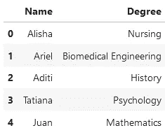

# Python 中使用 JSON 数据的各种方法概述

> 原文：<https://towardsdatascience.com/an-overview-of-various-ways-to-work-with-your-json-data-in-python-772b53c9d06a>

## Python 提供了许多不同的方法来处理这种常见的数据存储格式。


由 [Unsplash](https://unsplash.com?utm_source=medium&utm_medium=referral) 上的 [Shubham Dhage](https://unsplash.com/@theshubhamdhage?utm_source=medium&utm_medium=referral) 拍摄的照片

如果你从事技术工作——特别是作为一名软件工程师或数据科学家——你可能经常听到 JSON 这个术语。事实上，我敢打赌，你自己也曾在某个时候不得不这样做。

## 什么是 JSON 数据？

JSON 代表 JavaScript 对象符号。从技术上讲，它是由一位名叫道格拉斯·克洛克福特的程序员(他实际上仍在从事 JavaScript 的开发工作)[1]从专注于数组和文字的 JavaScript 子集派生出来的。

然而，这个名字可能有点误导。尽管 JSON 起源于 JavaScript，但它是一个独立于语言的实体。它本质上只是一种指定和传输数据的便捷方式。它也是人类可读的，尤其是与 XML 等替代格式相比。

好了，介绍够了。如果你对更多的历史细节感兴趣，可以随时查看官方网站:【json.org[。](http://www.json.org)

在本文中，我们将专门讨论 Python 领域中的 JSON。JSON 无处不在——因此，无论是作为一名进行服务器端开发的软件工程师，还是作为一名试图将信息读入表格的数据科学家，您都很有可能在某个时候不得不处理它。

在我们开始以不同的方式使用 Python 中的 JSON 之前，我们需要知道它实际上是什么样子。在其核心，JSON 数据只是一个大的键值对数组。如果你不熟悉这个术语，它实际上意味着数据是通过给单个值一个引用名或*键*来组织的。

这通过例子更容易看出。例如，假设我们想要存储学生期末考试成绩的信息。我们的 JSON 对象可能如下所示(可怜的 Kaylee):

```
{
  "John": 92,
  "Kaylee": 44,
  "Akshay": 78,
  "Zahra": 100
}
```

这种结构可以更复杂和嵌套(有可能使值数组甚至它们自己的对象具有更多的键-值对)，但这是基本的思想。一旦你掌握了它，剩下的只是运用和一些精神上的奉献。

这里的关键问题是:这看起来熟悉吗？如果你熟悉 Python 中的数据结构，那么你大脑的神经通路现在应该已经疯狂了。

这基本上只是一个 [Python 字典](https://medium.com/towards-data-science/whats-in-a-dictionary-87f9b139cc03)【2】，有一个重要的警告:JSON 中的字符串必须包含在双引号中，而 Python 字典允许单引号或双引号。

## 方法 1:用熊猫

事实上，JSON 的结构与 Python 字典完全相同，这对像我们这样的熊猫程序员来说是一个很好的礼物。回想一下直接从字典中制作熊猫数据框的最简单方法之一:

```
my_dict = {
           "Name": ["Alisha", "Ariel", "Aditi", "Tatiana", "Juan"],
           "Degree": ["Nursing", "Biomedical Engineering", "History", "Psychology", "Mathematics"]
          }
df = pd.DataFrame(my_dict)
df
```



作者图片

正如我们在上面看到的，JSON 的结构实际上和字典一样。因此，Pandas 带有一个实用方法，使得将 JSON 文件读入数据帧变得非常简单，这一点也不奇怪。

如果您习惯于使用 CSV 文件，那么您可能以前运行过类似下面的内容:

```
my_df = pd.DataFrame('path/to/data.csv')
```

使用 JSON 遵循同样的模式。如果我们将上面的数据保存为 JSON 文件，我们可以将它读入数据帧，如下所示:

```
my_json_df = pd.DataFrame('path/to/data.json')
my_json_df
```


作者图片

仅此而已。请记住，JSON 数据的格式与 Python 字典相同，是一组键值对。因此，这个数据帧与我们之前使用原生 Python 展示的示例相同。

## 方法 2:原生 Python

如果你不熟悉熊猫，但仍然需要一种使用 JSON 的方法，不用担心。Python 有一个很棒的库可以帮助完成这个任务:`json`(我知道很聪明)。

你将需要这个库中的两个主要函数:`load`和`dump`。

`load`函数让您从 JSON 文件中读入数据。然而，它不会像熊猫的`read_json`功能那样将其转换为字典，而是将数据作为 Python 字典提供给你。在对文件调用`load`函数之前，我们还需要使用 Python 内置的`open`函数打开它:

```
>>> import json
>>> my_file = open('path/to/example.json', 'r') # 'r' for read mode
>>> data_dict = json.load(my_file)
>>> my_file.close() # Don't forget to close the file
>>> data_dict
{
 "Name": ["Alisha", "Ariel", "Aditi", "Tatiana", "Juan"],
 "Degree": ["Nursing", "Biomedical Engineering", "History", "Psychology", "Mathematics"]
}
```

`dump`函数的作用正好相反:它让您用 Python 定义一个字典，然后将其写入 JSON 文件。请注意，如果您以写模式打开文件，用“w”表示，您将覆盖任何现有的内容。如果您想要添加到文件中，请使用 append 模式(用“a”表示)。

```
>>> data_dict = {
             "Name": ["Alisha", "Ariel", "Aditi", "Tatiana", "Juan"],
             "Degree": ["Nursing", "Biomedical Engineering", "History", "Psychology", "Mathematics"]
            }

>>> my_file = open('path/to/example.json', 'w') # 'w' for write mode
>>> json.dump(data_dict, my_file)
>>> my_file.close() # Don't forget to close the file
```

这里有两个相关的函数值得一提:`loads`和`dumps`。令人困惑的是，这些应该被理解为“load-s”和“dump-s”。末尾的“s”代表“string”

这些函数的工作方式与它们的对应函数类似，只是它们没有被配置为处理文件。很多时候，在编程时，我们直接从某个服务器接收 JSON 字符串形式的数据，而不需要文件作为中间人。要将这些数据读入 Python 字典，我们可以使用`loads`函数。或者，要将字典转换成我们需要发送给服务器的 JSON 字符串，我们可以使用`dumps`。

## 回顾+最终想法

这里有一个小型 JSON 备忘单:

1.  在熊猫中，使用`read_json`功能。
2.  如果你正在使用 JSON 模块，如果你正在处理 JSON 文件，使用`load`和`dump`，如果你正在直接处理 JSON 字符串，使用`loads`和`dumps`。

至此，您应该已经准备好在野外处理 JSON 了。下次再见，节日快乐！

**想擅长 Python？** [**获取独家、免费获取我简单易懂的指南点击**](https://witty-speaker-6901.ck.page/0977670a91) **。想在介质上无限阅读故事？用我下面的推荐链接注册！**

<https://murtaza5152-ali.medium.com/?source=entity_driven_subscription-607fa603b7ce--------------------------------------->  

## 参考

[1][https://blog.sqlizer.io/posts/json-history/](https://blog.sqlizer.io/posts/json-history/)
【2】[https://medium . com/forward-data-science/whats-in-a-dictionary-87 f9b 139 cc 03](https://medium.com/towards-data-science/whats-in-a-dictionary-87f9b139cc03)