# 用 Python 分析 Strava 数据

> 原文：<https://towardsdatascience.com/analysing-strava-data-with-python-b8a5badb019f>

## 使用 Python 分析 Strava 数据的分步指南

几年前，我通过分析我的 Strava 数据自学了如何使用 R。这是一种有趣的学习方式，结合了我的两大爱好——数据和跑步(一般来说是运动)。

现在，我在用 Python 做同样的事情。在这篇文章中，我将分享我在对我的 Strava 数据进行一些数据争论和探索性数据分析(EDA)时采取的步骤，同时希望从中得出一些有趣的见解，并为其他 Python 初学者分享有用的技巧。我相对来说是 Python 的新手，但是我发现记录过程有助于我学习，也可能帮助你！

**下载你的 Strava 数据**

首先，我们需要获取数据集。我从 [Strava 网站](https://www.strava.com/)下载了我的 CSV 格式的数据，但是你也可以直接连接到 [Strava API](https://developers.strava.com/docs/getting-started/) 。

要从 Strava 网站获取数据，请将鼠标悬停在页面右上角的图标上，导航至“设置”。导航到“我的帐户”，点击页面底部的“开始”。

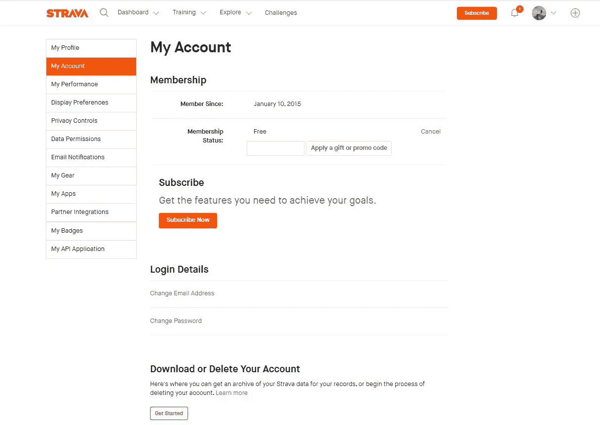

作者提供的图片—除非另有说明，所有图片均由作者创作

在下一页，您将看到三个选项。在选项 2“下载请求”下，点击“请求存档”。不久之后(通常不到一个小时，取决于存档的大小)，与您的 Strava 帐户相关的电子邮件将收到您的 zip 文件格式的存档。您想要的文件将被称为 activities.csv，我倾向于忽略那里的其余文件。

导航到您的 Jupyter 笔记本，点击“查看”下方的“上传文件”按钮上传 CSV。


现在，您应该可以在 Jupyter 笔记本左侧的文件浏览器中看到您的 CSV 文件。

**导入库**

现在我们需要下载将用于分析的库。

```
import pandas as pd 
import matplotlib.pyplot as plt
import numpy as np
import seaborn as sns
from datetime import datetime as dt
```

接下来，我们需要使用 Pandas 库将上传到 Jupyter 中的 CSV 转换为表格格式，Pandas 库是一个非常强大和流行的数据分析和操作框架。

```
df = pd.read_csv('strava_oct_22.csv') #read in csv
df.columns=df.columns.str.lower() #change columns to lower case
```

**数据角力**

根据过去的经验，我知道从 Strava 下载的活动包含了一大堆无意义和不相关的领域。因此，我想在开始之前稍微清理一下数据集。

以下是几个帮助您了解数据集的函数:

```
df.shape(818, 84)
```

shape 函数告诉您数据集中的行数和列数。我可以看到我有 818 行数据(每行对于一个单独的活动是唯一的)和 84 列(也称为变量或特性)。我知道这些列中的大部分对我来说都没用，因为它们要么是 NaN 值(不是数字)，要么就是没用，但是为了确认我们可以使用。head()函数，它返回数据集中每一列的前 5 个值。

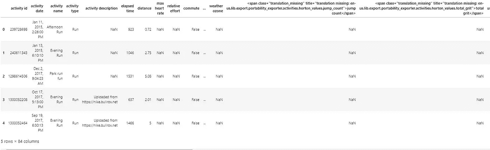

我们也可以使用。info()返回数据集中变量的所有列标题。

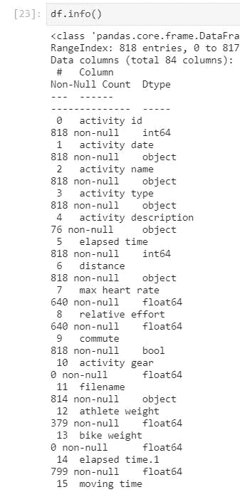

在上面的输出中，您还可以看到每个变量下面的“非空计数”,这可以让您了解该变量填充了多少行。让我们通过只选择我们认为相关的列来消除不必要的干扰。

```
 #Create new dataframe with only columns I care about
cols = ['activity id', 'activity date', 'activity type', 'elapsed time', 'moving time', 'distance',   
         'max heart rate', 'elevation gain', 'max speed', 'calories'
       ]
df = df[cols] 
df
```

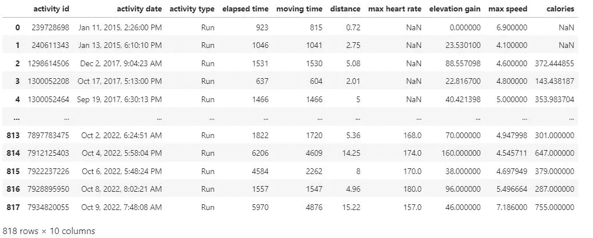

这看起来更好，但数据集缺少一些关键变量，我想在我的分析中包括这些变量，默认情况下它们不是提取的一部分，例如平均速度和每小时公里数。因此，我需要自己计算它们。在此之前，我需要仔细检查新数据框中的数据类型，以确保每个字段都是我需要的格式。我们可以利用。为此，请键入。

```
df.dtypes
```

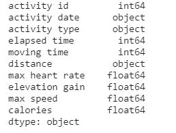

我可以看到数据集中的大多数字段都是数值(int64 是一个数值，float64 也是，但有小数)。然而，我可以看到活动日期是一个对象，当我开始查看时间序列分析时，我需要将它转换为日期数据类型。类似地，距离是一个对象，我需要将它转换成一个数值。

我可以使用 datetime 库将我的活动日期从 object 转换为 date 数据类型。我们还可以从活动日期创建一些额外的变量，即提取月、年和时间，我们将在后面的分析中使用这些变量。

```
#Break date into start time and date
df['activity_date'] = pd.to_datetime(df['activity date'])
df['start_time'] = df['activity_date'].dt.time
df['start_date_local'] = df['activity_date'].dt.date
df['month'] = df['activity_date'].dt.month_name()
df['year'] = df['activity_date'].dt.year
df['year'] = (df['year']).astype(np.object) #change year from numeric to object
df['dayofyear'] = df['activity_date'].dt.dayofyear
df['dayofyear'] = pd.to_numeric(df['dayofyear'])
df.head(3)
```

接下来，我们需要使用 Pandas 库中的 to_numeric 函数将距离转换为数值。这将允许我们有效地创建分析所需的新变量。

```
#convert distance from object to numeric
df['distance'] = pd.to_numeric(df['distance'], errors = 'coerce')
```

现在距离是一个数值，我可以创建一些附加变量来包含在我的数据框中。

```
#Create extra columns to create metrics which aren't in the dataset already
df['elapsed minutes'] = df['elapsed time'] /60 
df['km per hour'] = df['distance'] / (df['elapsed minutes'] / 60)
df['avg pace'] = df['elapsed minutes'] / df['distance']
```

因为我已经添加和修改了一些变量，所以让我们使用。再次键入数据以检查数据帧的格式是否正确。

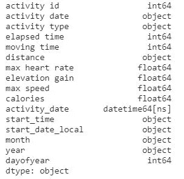

那看起来好多了。最后，在我们进入 EDA 之前，我希望我的数据集只包含运行，因为我知道我的大多数活动都是这种类型的。为了确认这一点，我可以使用。value_counts()。

```
df['activity type'].value_counts()
```

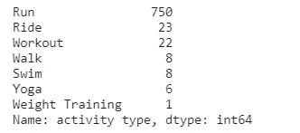

如你所见，我的大部分活动都是跑步，所以我将创建一个名为“跑步”的新数据框架，并专注于此。我还知道数据中有一些错误的数据条目，可能是我忘记停表了，或者是 Strava 崩溃了，所以我也要过滤掉一些极端的结果。

```
runs = df[df['activity type'] == 'Run']
runs = runs[runs['distance'] <= 500]
runs = runs[runs['elevation gain'] <= 750]
runs = runs[runs['elapsed minutes'] <= 300]
runs = runs[runs['year'] >= 2018]
```

**探索性数据分析**

我们现在有了一个干净的数据集，我们可以开始可视化并从中提取有趣的见解。在 EDA 中，一个好的第一步是创建一个 pairs 图，它可以让你快速地看到单个变量的分布和两个变量之间的关系。这是确定后续分析趋势的一个很好的方法。如果你的数据集中有很多变量，这可能会变得混乱，所以我将选择几个作为重点。

```
pp_df = runs[['distance', 'elevation gain', 'km per hour', 'max heart rate', 'calories']]
sns.pairplot(pp_df);
```

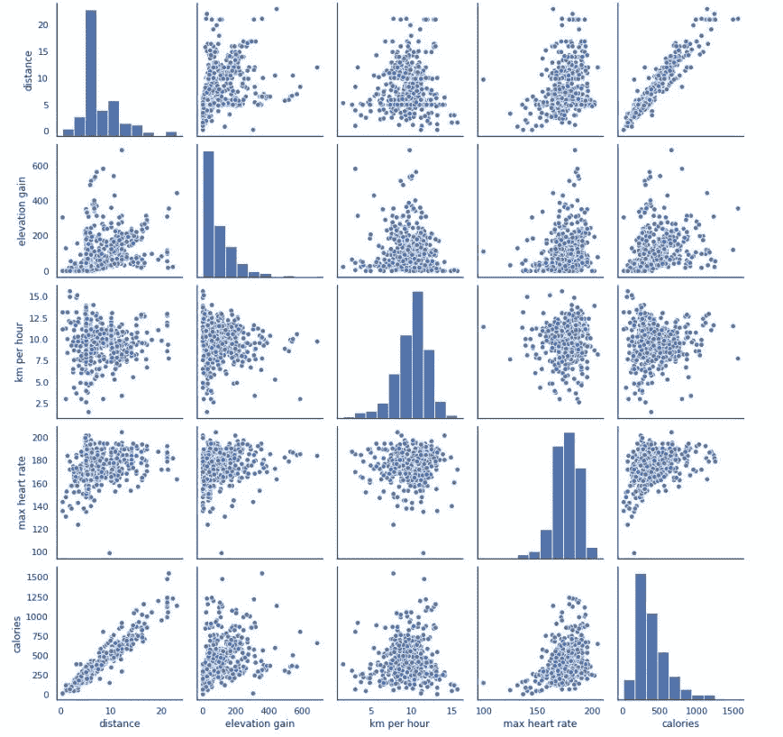

这一行代码非常强大，我们已经可以从中得出一些有用的见解。对角线上的直方图允许我们看到单个变量的分布，而上下三角形上的散点图显示了两个变量之间的关系(或缺乏关系)。我能看出距离和卡路里之间是正相关的。我可以在距离直方图上看到有一个左偏斜，这意味着我跑的距离更短。有趣的是，卡路里与每小时公里数和最大心率成反比——让自己更努力并不一定意味着失去更多卡路里。

pairs 图是一种很好的可视化数据的方式，但是您可能希望查看数据集的一些汇总统计数据，以了解平均值、中值、标准偏差等。为此，请使用。描述功能。

```
runs.describe().round(0)
```

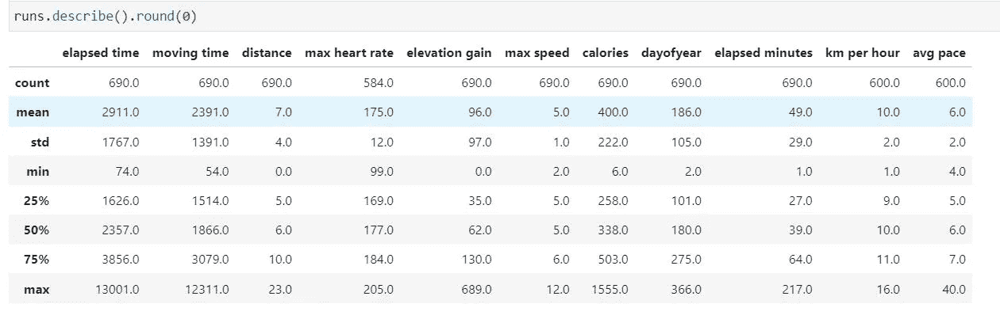

我真的很喜欢描述功能，这是一种快速获取数据摘要的方法。当我看到上面的输出时，我的第一反应是惊讶于距离，我跑步的中位数(或第 50 百分位)只有 6 公里！但话说回来，我想我只是在去年左右才加大了距离。EDA 的美妙之处在于，当您对数据进行初步调查时，您能够发现模式、发现异常、测试假设和检查假设，因此，让我们更深入地了解距离变量。

我将使用一个箱线图来可视化一年中距离的分布，看看我关于去年我增加了距离的假设是否正确。箱线图是显示数据的可视化摘要的一种很好的方式，使我们能够识别平均值、数据集的分散性和偏斜的迹象。

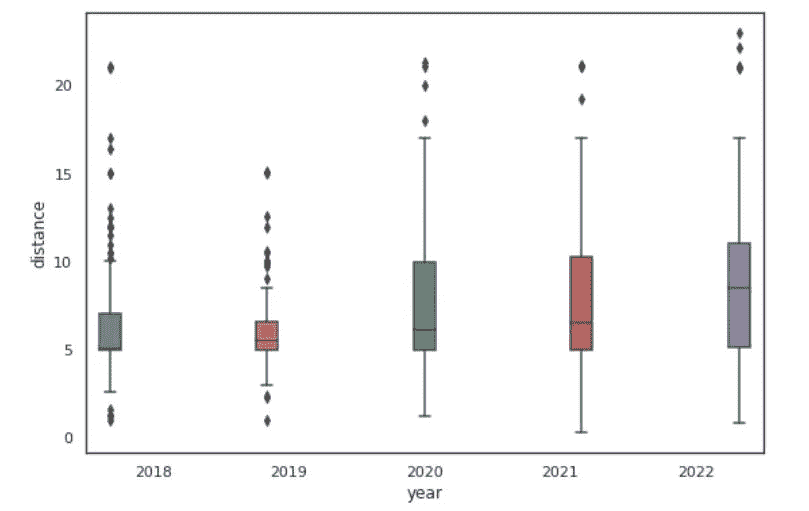

```
fig, ax = plt.subplots()
sns.set(style="whitegrid", font_scale=1)
sns.boxplot(x="year", y="distance", hue="year", data=runs)
ax.legend_.remove()
plt.gcf().set_size_inches(9, 6)
```

正如我所想，在过去的几年里，我的跑步距离确实增加了，从 2018 年到 2022 年，中值距离每年都略有增加，但增加幅度更大。

让我们按月划分年份，看看一年中所走的距离是如何变化的。我们可以通过使用 seaborn 库中的条形图来实现这一点。

```
sns.set_style('white')
sns.barplot(x='month', y='distance', data=runs, hue='year', ci=None, estimator=np.sum, palette = 'hot',
           order =["January", "February", "March", "April", "May", "June", "July", "August", "September", "October", "November", "December"])
plt.gcf().set_size_inches(17, 6)
plt.legend(loc='upper center')
#plt.legend(bbox_to_anchor=(1.05, 1), loc='upper right', borderaxespad=0)
;
```

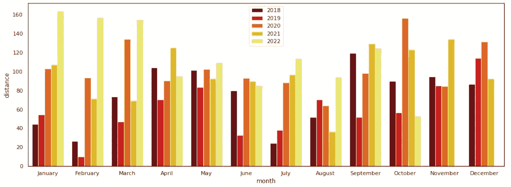

从上面的柱状图可以清楚地看出，我的距离是在夏天的几个月里下降的。以 2022 年为例，在 2022 年 1 月、2 月和 3 月，我跑的距离超过 150 公里，明显超过我在 4 月至 8 月跑的距离。这种趋势在其他年份也很明显。

让我们创建一个名为 season 的新变量，方法是使用。isin()。

```
runs['season'] = 'unknown'
runs.loc[(runs["month"].isin(["March", "April", "May"])), 'season'] = 'Spring'
runs.loc[(runs["month"].isin(["June", "July", "August"])), 'season'] = 'Summer'
runs.loc[(runs["month"].isin(["September", "October", "November"])), 'season'] = 'Autumn'
runs.loc[(runs["month"].isin(["December", "January", "February"])), 'season'] = 'Winter'
```

我们现在可以创建另一个箱线图来显示季节距离。

```
ax = sns.boxplot(x="season", y="distance", palette="Set2",
                    data=runs,
                    order =["Spring", 'Summer', 'Autumn', 'Winter'])
plt.gcf().set_size_inches(9, 7)
```

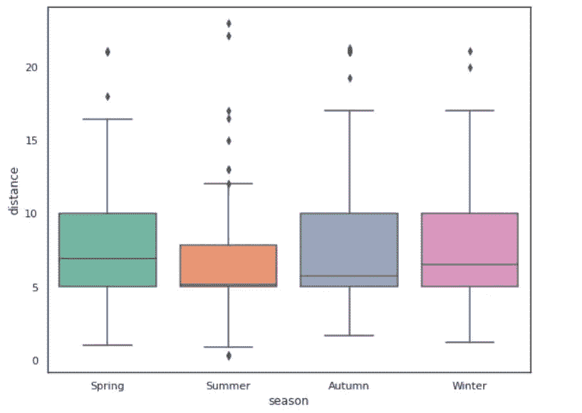

对于那些不熟悉箱线图的人来说，粗线代表中值，方框代表四分位数范围(数据的中间 50%)，下面和上面的线代表最小值和最大值，黑点代表异常值。我发现观察我的行为如何随季节变化真的很有趣，看起来我真的不喜欢长时间的夏季跑步，我 75%的跑步都在 7k 以下。

**结束注释**

在 Python 的介绍中，我们已经介绍了很多，包括如何开始将文件读入 pandas，清理数据集以优化性能，以及创建额外的变量以包含在我们的分析中。为了更好地理解我们的数据，我们生成了一些汇总统计数据，并开始使用 matplotlib 和 seaborn 可视化我们的数据集。

现在数据集已经清理干净，我们有了更好的理解。我期待着对数据进行进一步的分析，并引入一些数据科学技术。例如，我计划建立一个线性回归模型来预测我的下一个 5 公里时间，这取决于一些变量，如今天是什么日子/季节/时间，或者路线的海拔是多少，如果我包括一些天气数据，甚至是温度和风速。

感谢阅读，直到下一篇！