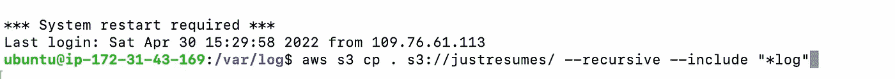
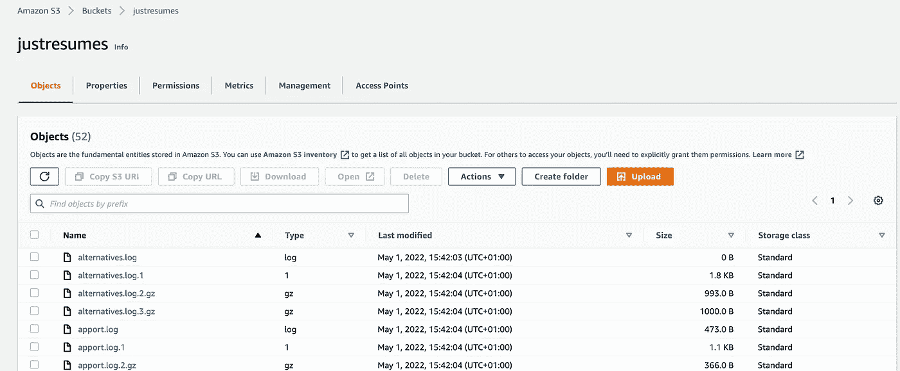
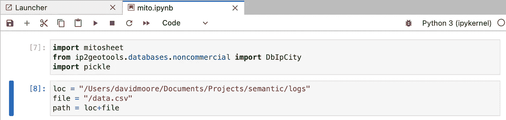
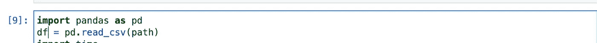
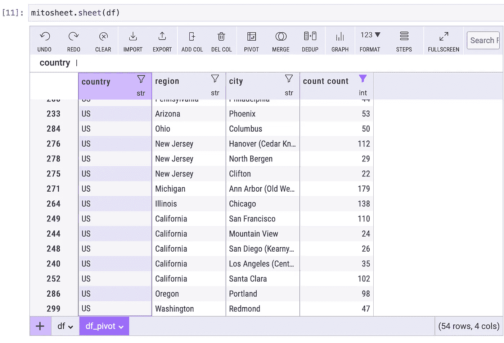
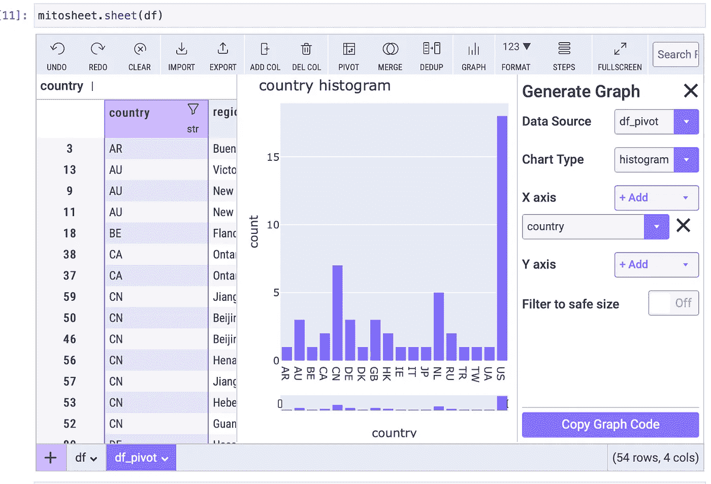
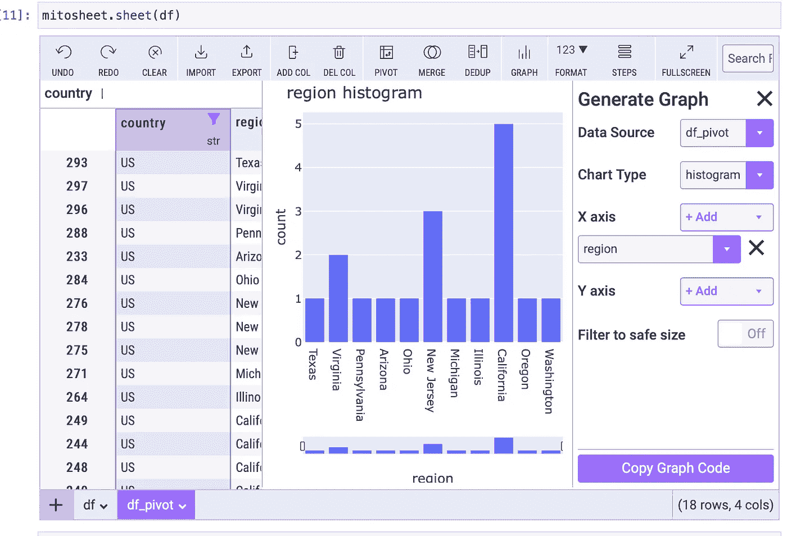
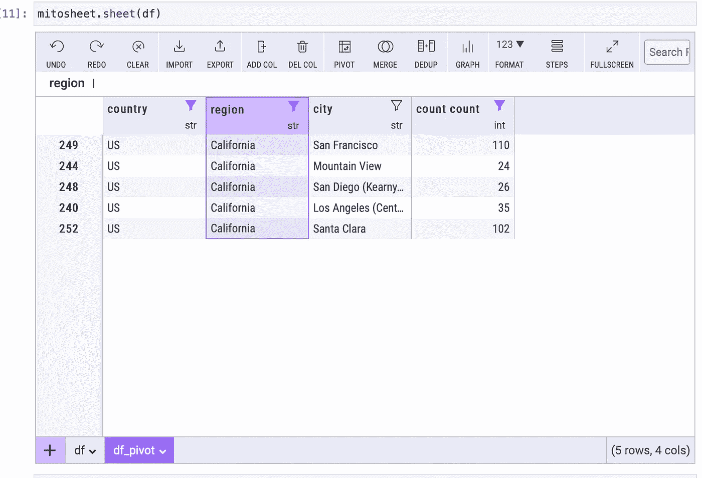
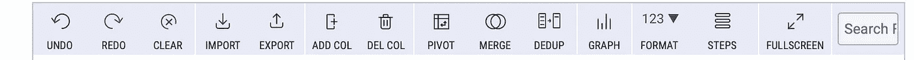

# 分析网络访问者

> 原文：<https://towardsdatascience.com/analysing-web-visitors-38be175f35c9>

## 使用代码和低代码米托方法进行探索性数据分析


Alexander Schimmeck 在 [Unsplash](https://unsplash.com?utm_source=medium&utm_medium=referral) 上的照片

混合方法的美妙之处在于根据具体情况提供不同的方法。蟒蛇熊猫可以被视为汽油或柴油发动机；电动汽车可以被视为一个完全无代码的解决方案。我们知道熊猫的编码限制，但是我们对无编码方法的交换感到舒服吗，比如[米托](https://www.trymito.io/plans)？代码方法中有太多的操作，用用户界面构建可能会很耗时。继续读下去，让我们进入混合动力的世界，看看我们是如何发展的？

## 概述

我的任务是向求职者揭露 NLP 程序，安全是我的首要任务。如果你是第一次收听，那么需要注意的是[我已经使用 FastAPI 和 vue.js](https://medium.com/towards-data-science/from-nlp-prototype-to-production-c2b555488dc5) 构建了一个应用程序，并且[在 AWS](https://www.justresumes.net/) 上托管了它。应用程序基础结构已经就绪，我已经对安全性进行了分类；我相信是合理的！前一段时间我已经制定出了 NLP 战略。几个月过去了，因为我最初创建服务器和托管网站，所以我想检查和看看什么样的交通模式已经发展。由于这是一个数据分析的挑战，我致力于在我的工作中使用米托作为试验。

## 检索服务器日志、解析和创建数据框

在我的[上一篇文章](/monitoring-to-protect-data-890b21a186c1)中，我安装了 AWS 命令行并设计了一个命令，该命令将日志文件从服务器复制到一个 [S3 桶](https://www.techtarget.com/searchaws/definition/AWS-bucket)。这是第一步——将日志从虚拟服务器检索到 S3 存储桶。



登录到虚拟服务器并发出拷贝到 S3 命令—图片由作者从一个活动的 SSH 会话创建。

通过从/var/log 目录发出命令，我复制了文件名中包含“log”的所有文件，这种方法既快又脏，但在混合环境中已经足够了。一个简单的命令行调用可以节省大量的点击和拖放操作。如果你不熟悉 S3 水桶，这里有一个快速截图。



此项目的相关 S3 存储桶的屏幕截图—图片由作者在活动登录会话中提供。

现在文件已经在 S3 存储桶上了，我可以运行我的脚本将文件传输到我的 Mac Mini M1。自从上一篇文章以来，我确实对我的脚本做了一些改进。

```
import os
import boto3
from s3, import AmazonS3 as AmazonS3
s3worker = AmazonS3()
s3worker.show_contents_s3_bucket()
s3worker.download_contents_s3_buckeet()
s3worker.empty_bucket()
```

因为将文件从 S3 转移到本地机器的所有机制都很无聊，所以我使用了一个类，将这些无聊的东西抽象出来。创建一个 AmazonS3 的实例作为 s3worker 并调用这些方法:-

*   下载内容 s3 存储桶()
*   empty_bucket()

将日志文件提取到本地机器并清除存储桶。那么，为什么要为你不需要的存储付费呢？日志解析策略和代码没有变化，但是我做了一些整理。

```
import pandas as pddf = pd.DataFrame(records)
out = store+"data.csv"
df.to_csv(out)for log in logs:
    fullpath=store+log
    if ('data.csv' not in log or 'pickle' not in log):
        os.remove(fullpath)
```

一旦日志解析完成，我仍然构建数据帧，但是我将数据存储为 CSV 格式，并删除复制到本地机器上的所有文件。始终保持环境清洁是安全和隐私的核心。我的本地环境中现在有一个 CSV 文件，我可以用它来探索米托。我们现在就去那里吧！

## 和米托一起探索

米托有一个合适的主页，并且有该工具的开源、专业和企业版本。请随意点击查看网站[。](https://www.trymito.io)

[安装](https://docs.trymito.io/getting-started/installing-mito)是通过传统的 PIP 方法，但是有一个额外的步骤。

```
python -m pip install mitoinstaller
python -m mitoinstaller install
```

在 Mac 上，我无法使用 Jupyter 笔记本，但在 Jupyter Lab 上却能流畅运行！我使用 Anaconda，Jupyter Lab 只需点击 Anaconda Navigator。



朱庇特实验室的一些早期细胞——作者图片

7 号和 8 号牢房处理一些内务。使用 mito 需要加载 mitosheet 包。 [ip2geotools 包](https://pypi.org/project/ip2geotools/)允许将 ip 地址翻译成城市。Nginx 日志只给了我一个 IP 地址，这在 EDA 中并不容易。

单元格 8 设置了一组变量，指向上一节中的 CSV 文件。下面的单元格 9 将 CSV 读入一个名为 df 的数据帧。



Jupyter 实验室的 9 号细胞——图片由作者提供。将 CSV 文件加载到数据框

移动到类似电子表格的界面就像调用传递数据框对象的 sheet 方法一样简单。



像 Excel 一样，我们可以在屏幕底部使用不同的工作表。点击加号按钮打开文件导入向导。我已经展示了加载的 df 和 df_pivot 表。创建视觉效果很简单。



使用米托创建直方图很容易。图片由作者提供。

我可以很容易地看到，我的大部分网络流量或访客来自美国注册的 IP 地址。在美国设置一个过滤器，我可以深入到该地区，注意到加州的流量，也许硅谷想要购买我的网站；嗯，我们可以祈祷！



在加州过滤让我看看有没有机会！



事实上，来自旧金山的人一直在访问我的网站。万岁！创建这些视觉效果非常方便，我喜欢无代码的方法。

但是等一下！这一切似乎太容易了。


[凯·皮尔格](https://unsplash.com/@kaip?utm_source=medium&utm_medium=referral)在 [Unsplash](https://unsplash.com?utm_source=medium&utm_medium=referral) 上的照片

在开源版本中，操作是最少的。下面是显示类似于 Microsoft Excel 功能区的功能的工具栏



类似 Excel 功能区的美图工具栏

由于电子表格界面不支持，我不得不通过代码完成大多数传统的清理和丰富工作。以下代码中的一些示例

*   将包含日期的字符串转换为日期和时间列
*   调用函数从 IP 地址中检索国家、地区、城市
*   处理缺失值
*   将字段拆分成组件以提取 HTTP 方法

```
df = df[['remote_addr', 'remote_user', 'time_local', 'request',
       'status', 'bytesSent', 'referrer', 'agent']]
#05/Mar/2022:00:06:55 +0000
df['date_time'] = pd.to_datetime(df['time_local'], format='%d/%b/%Y:%H:%M:%S %z')
del df['time_local']
df['date'] = df.date_time.dt.date
df['time'] = df.date_time.dt.time
df['request'] = df['request'].fillna(" ")
df = df.fillna(" ")
df['action'] = df.request.apply(lambda x: x.split(" ")[0])
#Mozilla/5.0 (X11; Linux x86_64) AppleWebKit/537.36 (KHTML, like Gecko) Chrome/81.0.4044.129 Safari/537.36
df['browser'] = df.agent.apply(lambda x: x.split(" "))
#df['os'] = df.agent.apply(lambda x: x.split(" ")[1])
df['elems'] = df.agent.apply(lambda x: splitter(x))
df['count'] = 1ips = df['remote_addr'].unique()
#print(len(ips))
#res = iped(ips[0:10],ip_country, ipsed)
#df = df[(df['date'] > pd.to_datetime('2021-03-01'))]
ips = df['remote_addr'].unique()
print(len(ips))
res = iped(ips,ip_country)
df['country'] = df.remote_addr.apply(lambda x: country(x, res, 'country'))
df['region'] = df.remote_addr.apply(lambda x: country(x, res, 'region'))
df['city'] = df.remote_addr.apply(lambda x: country(x, res, 'city'))
```

因此，使用 Python、Jupyter Labs、Pandas 和米托是一种真正的混合方法。数据集的清理和准备似乎适合代码方法，而干净数据的探索和可视化似乎非常适合米托。

尽管如此，我知道来自旧金山的人们正在访问我的网站，所以也许是时候我把我的电梯推介放在一起，在旧金山的一些电梯里闲逛了。


照片由[弗雷德·克勒贝尔](https://unsplash.com/@flaken?utm_source=medium&utm_medium=referral)在 [Unsplash](https://unsplash.com?utm_source=medium&utm_medium=referral) 上拍摄

如果你花时间远离编码，记忆会变得很困难，因此这些混合工具很方便。我喜欢这些混合方法！

[](https://cognitivedave.medium.com/membership) 