# Twitter 上标签为#bridgerton 的推文的极性分析

> 原文：<https://towardsdatascience.com/analysis-of-the-polarity-of-tweets-with-the-hashtag-bridgerton-on-twitter-7ed7ac75cf3b>

在 Unsplash 的 Shayna Douglas

**Twitter** 是一个社交网络，用户在这里自发地对时事做出反应。从数据分析的角度来看，Twitter 上的可用数据非常有趣，因为它的分析可以让研究人员实时确定用户对某个产品或某个人的**感受**。例如，对 Twitter 上可用信息的分析将使公司能够快速发现用户对特定产品的不满，并采取相应行动以避免经济损失。Twitter 上可用的信息也可以用来分析用户对某个人的感觉，例如，政治家、商人、名人或运动员。基本上，我们可以利用 Twitter 上可用的信息来分析几乎任何事物的极性，包括电视剧和节目。

《布里奇顿》是一部根据朱莉娅·奎因的小说改编的美剧。该系列以**摄政时代**(1811–1820)*为背景，重点讲述了一个**伦敦上流社会家庭**——布里奇顿家族的故事。在社交季节，英国上流社会的成员在竞争激烈的婚姻市场上首次亮相。第一季聚焦于家族长女达芙妮·布里吉顿的出道。第二季聚焦于家族长子安东尼·布里德顿的寻妻之旅。这最后一季于 2022 年 3 月 25 日上映，并迅速成为网飞最受关注的英语系列之一。但是，公众对上一季真的满意吗？*

*在这个项目中，我们将使用推文中包含的**观点词和表情符号**来分析标签为#bridgerton 的推文的**极性。这些元素在文本中被用来传达观点，因此可以帮助我们了解在上次发布后公众的反应是积极的还是消极的。***

# *项目步骤*

*项目部分如下:*

1.  ***Tweepy 安装和认证。***
2.  ***使用 Tweepy 收集数据。***
3.  ***数据清洗。***
4.  ***情绪分析。***
5.  ***AFINN 字典和表情符号字典。***
6.  *在表情符号前后添加空格。*
7.  ***计算微博的极性。***
8.  ***分析推特的极性。***
9.  ***未来的改进和需要克服的主要挑战。***
10.  ***分析极性随时间的演变。***
11.  ***项目总结。***

# *Tweepy 安装和身份验证*

*在这个项目中，我们使用 **Twitter API** 来获取分析所需的数据。有各种不同编程语言的包可以使用 Twitter API 提取数据。在这个分析中，我们将使用名为 **Tweepy** 的 Python 库。该库处于持续维护中，并被开发人员广泛使用，因此我们认为它是获取数据的最合适的替代方案。*

*当我们想要使用 API 时，第一步是**获得允许我们使用 API 获取数据的凭证**。在这种情况下，有必要**注册一个开发者账户，并申请免费提升权限**。然后，您需要在 **Twitter 开发者 web 控制台**中**创建一个应用**。重要的是要记住，使用 API 需要一个 Twitter 帐户。如果你没有 Twitter 账户，你需要在你的电脑上创建一个来运行这个项目。*

*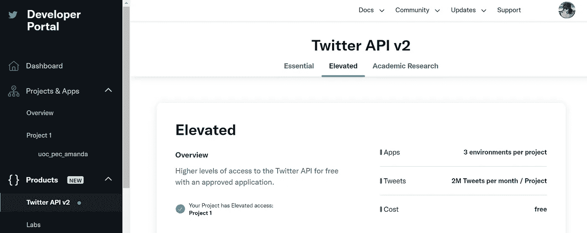*

*Twitter 开发人员门户(提升的帐户)—图片由作者创建*

*在完成获取 **Twitter API** 的凭证的步骤后，我们继续在我们的计算机上安装和配置 **Tweepy** 。要安装 Tweepy，我们需要在终端或 Anaconda 提示符下键入以下命令之一:*

> *pip 安装 tweepy(终端安装)*
> 
> *conda install-c conda-forge tweepy(Anaconda 即时安装)*

*一旦安装了 Tweepy，我们**将库**导入到脚本中，并且**设置凭证**。在试图从社交网络收集数据之前，我们需要提供以下**密钥和令牌**来保证通过 Tweepy 访问 Twitter 的 API。所有密钥都是令牌，可在应用程序的*密钥和令牌*选项卡中找到。*

1.  ***消费者 _ 密钥***
2.  ***消费者 _ 秘密***
3.  ***访问令牌***
4.  ***访问 _ 令牌 _ 秘密***

*我们向 Tweepy 的`OAuthHandler`对象提供**消费者密钥**和**消费者秘密**。然后，我们需要用`set_access_token`方法设置访问代码，提供**访问令牌**和**访问令牌秘密**作为参数。最后，我们以下面的方式将授权对象(`auth`)传递给`tweepy.API`函数:*

*如上所示，我们可以使用`API`类的`verify_credentials`方法来检查凭证是否有效。*

*现在，我们准备开始从 Twitter 收集数据。💙*

# *使用 Tweepy 收集数据*

*我们使用 **Tweepy** 提供的`Cursor`函数来获取包含 *#bridgertons* 的 tweets。`q`参数包含我们想要查询的术语。我们指定`-filter:retweets`从请求中排除转发。下面的链接展示了我们如何在 Twitter API 中定制查询，例如，指定一个位置，或者使用布尔运算符来匹配多个术语。*

* [## 搜索 Tweets -如何建立一个查询

### 搜索端点接受带有 GET 请求的单个查询，并返回一组匹配…

developer.twitter.com](https://developer.twitter.com/en/docs/twitter-api/tweets/search/integrate/build-a-query) 

此外，由于我们只分析英语推文，我们将参数`lang`设置为等于`'en'`。我们指定`tweet_mode=’extended'`来获取 tweet 的整个文本，因为默认情况下，`tweepy.API`返回的`text`属性被截断为 140 个字符。查询完 tweets 后，我们将全文存储在一个列表中，以供进一步处理。

我们不会对搜索设置任何时间或空间限制；然而，重要的是要记住**使用标准 API 将不会获得超过一周**的 tweets。如果我们想访问旧的推文，我们需要访问 Twitter 的高级 API。 **Tweepy** 还支持访问高级 API 来检索信息(例如通过`API.search_30_day`或`API.search_full_archive`函数)。

 [## 高级 API 支持

### 在此使用高级 API 获得支持。

developer.twitter.com](https://developer.twitter.com/en/support/twitter-api/premium) 

# 数据清理

下一步是清理我们在上一节中获得的 tweets。社交媒体数据通常包含大量噪音，因此必须执行多次清理任务，以进一步处理数据。如下所示，**我们使用 Python 中的正则表达式从 tweets 中消除 URL、标签和提及**。

在这种情况下，我们决定删除@ signs(提及)和# signs (hashtag)，保留原始术语，不做任何修改(例如，`#happy`转换为`happy`)。我们决定保留标签中的术语，因为在许多情况下，这些术语会在一个句子中使用，并且对于理解其含义是必要的(例如，我对新赛季真的很满意)。此外，我们还将删除数据中的标点符号。

为了清理推文，我们定义了函数`clean_tweet`。这个函数从文本(在这个例子中是 tweet)中删除 URL、标点符号、#和@。

在对每条推文应用该函数后，我们将结果可视化。

干净的推文(图片由作者创建)

# **情绪分析**

**情感分析**是计算语言最有前途的领域之一，它基于**确定文本的正面、负面或中性情感**。这是一个不断发展的领域，尽管它远未达到人类文本分析的能力，但许多工具允许我们以超过可接受的质量快速分析文本的极性。

**意见词**是用来表达意见的词。有一些形容词，如*漂亮的*、*令人惊奇的*或*好的*，我们用来表达积极的感觉。我们也可以认为像*废话*这样的名词或者像*无聊*这样的形容词都有负面的内涵，因此会被观点持有人用来表示不适或者拒绝。

**表情符号**在社交媒体交流中发挥着重要作用，尤其是在推特上。作为观点词，一些表情符号表达积极的情感(例如😃)，而其他的表示负极性(例如😢).为了尽可能准确地确定推文的情绪和观点，不仅需要分析文本中出现的词语的极性，还需要分析表情符号的极性。

# 阿芬词典和表情词典

情感词典的出现让研究人员能够快速而容易地分析文本的极性。在这个项目中，我们将计算整个文本(tweet)的极性，作为其单个单词和表情符号极性的总和。

**AFINN 字典**由 **2500 个英语单词组成，根据它们的意思(例如，有一个和的比率)从-5(负面)到+5(正面)**。分数越低，这个词越负面。这本字典是为了分析你能在社交媒体平台上找到的文本类型而创建的。

不是所有能表达观点的形容词或名词都包含在**阿芬词典**里。这是因为有些词的极性完全取决于它们出现的语境。在某些情况下，形容词可以表达否定的观点，而在其他情况下，它表达肯定的感觉。

AFINN 字典可以在很多网站上找到，例如，你可以通过下面的链接轻松下载一个. txt 文件。

 [## 情感分析/AFINN-111.txt 在国外硕士

### 此文件包含双向 Unicode 文本，其解释或编译可能与下面显示的不同…

github.com](https://github.com/abromberg/sentiment_analysis/blob/master/AFINN/AFINN-111.txt) 

将 **AFINN 字典**下载为. txt 文件后，我们必须将其转换为 **Python 字典**，以便在我们的分析中使用。

我们应用`opinion_words_txt2dict`将 **AFINN-111.txt** 文件转换成 **Python 字典**。

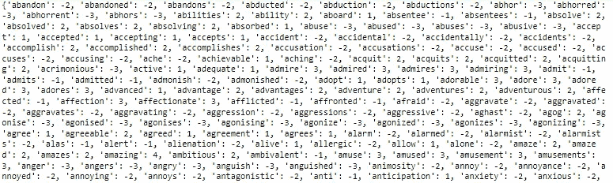

观点词词典(图片由作者创作)

如上所述，一条推文的**极性不仅通过分析其**观点词**来计算，我们还会考虑**表情符号**。文件 **emoji-polarity.txt** 包含 JSON 格式的表情符号的极性，可以使用下面链接中说明的`emoji-emotion`模块获得。极性是由一个人根据这些表情符号的名称和它们的 [AFINN-165](https://github.com/words/afinn-165) 值手工分类的。**

 [## GitHub-words/e moji-emotion:JSON 中被评价为有价的表情列表

### 一系列表情符号，其价数介于负五(负)和正五(正)之间。这个包裹是…

github.com](https://github.com/words/emoji-emotion) 

我们将 **emoji-polarity.txt** 文件读取为 **JSON 对象**。

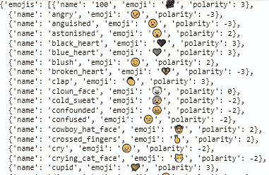

表情符号-极性字典(图片由作者创建)

在读取文件后，其内容必须转换成与`opinion_words_dictionary`的格式等效的格式，其中键包含表情符号，值是极性。

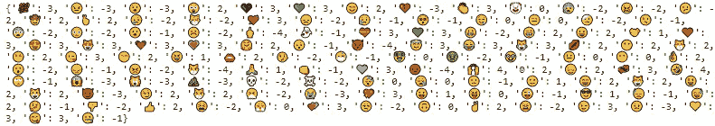

表情符号词典(图片由作者创建)

现在，这两本词典都可以用来计算一条推文的极性。在这个项目中，我们使用 **AFINN 字典** ( `opinion_words_dictionary`)和**表情符号极性字典(** `emojis_dictionary` **)** 到**计算一个代表一条推文极性的分数**。极性计算为推文中每个单词和表情符号极性的**总和，不包括不包含任何极性的单词和表情符号，即 AFINN 字典中没有的单词和表情符号。**

# **在表情符号前后添加空格**

为了单独分析 tweet 的每个元素，我们将检测 tweet 中的元素**根据空格分割文本**。在社交媒体中，将文字和表情符号放在一起很常见(例如，我喜欢😍)或者连续写几个表情符号(😍😍😍).出于这个原因，为了正确地获得 tweet 的单个元素(表情符号和观点词)，我们必须事先在每个表情符号的前后插入一个空格，如下所示。

功能`is_emoji`使用`emoji`库中可用的词典`UNICODE_EMOJI`检测一个字符是否是表情符号。如果角色是表情符号，`add_space`功能将**在表情符号**前后添加一个空格。

我们将`add_space`函数应用于列表`tweet_list_clean`中的每条 tweet。如下图所示，我们现在观察到每个表情符号前后都有一个空格。

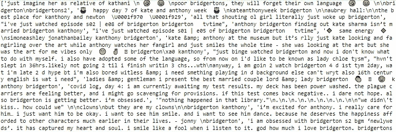

每个表情符号前后都有空格的推文(图片由作者创建)

# 计算推文的极性

现在，是时候使用 AFINN 字典和表情符号极性字典**计算推文的极性**了。第一步是将两个字典合并成一个名为`polarity_dictionary`的唯一字典。这个字典在`tweet_polarity`函数中用于计算 tweet 的极性。

如下所示，我们使用`tweet_polarity`函数来计算所有推文的极性。如果推文没有极性，这个函数返回 None，这意味着推文中没有携带积极或消极情绪的单词或表情符号。

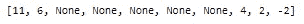

在列表中的前 10 条推文中，有 5 条没有极性，即它们不包含任何在字典`tweet_polarity`中找到的单词或表情符号。剩下的五条推文中，四条是正极，只有一条是负极。

# 分析推文的极性

我们将推文及其极性存储在一个数据框架中，以供进一步分析。

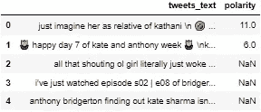

我们可以很容易地计算所有推文的平均极性，如下所示:

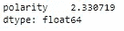

如上图所示，**表示极性为正**，意味着第二季发布后公众的反应是正面的。然而，比简单地知道极性的平均值更有趣的是知道概率的分布，例如，通过使用直方图。

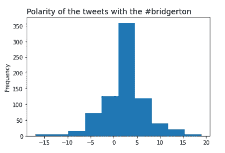

极性分布(作者创建的图像)

极性的**分布近似遵循以 2 为中心的正态分布**。有些推文具有非常高的正极性(在这种情况下高于 15)。相反，也有极负极性的推文，比如小于-10。

如下图，正极性高的推文确实传达了积极的反应。

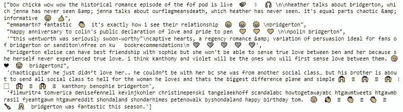

具有高正极性的推文(图片由作者创建)

负极性高的推文有时传达负面反应；然而，其他时候，他们表达对男演员或女演员的钦佩或吸引，我会说这不是特别负面的反应😉。

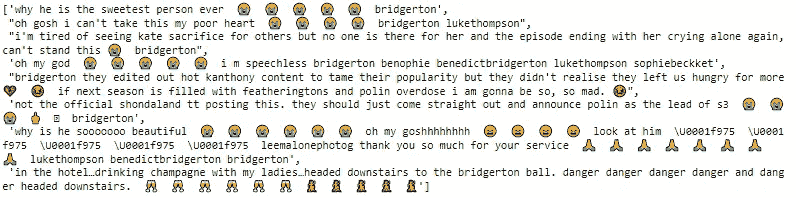

负极性高的推文(图片由作者创建)

# 未来的改进和需要克服的主要挑战

## 数据清理

在这个项目中，**数据清理**仅限于**移除 URL、标签、提及和标点符号**。此外，我们还在每个表情符号前后添加了一个空格。

Twitter 数据通常包含大量噪音；因此，为了获得更准确的结果，应该执行进一步的清洁步骤。在 Twitter 上，**将几个词连接在一起**很常见，尤其是在标签中(例如#BeautifulDay)。在分析推文之前，这些术语应该被拆分成单独的单词。此外，**拉长的单词**(例如 happyyyy)和**拼写错误**(例如 Ukranie)在 Twitter 数据上也很常见。所有这些问题都可以通过**使用正则表达式**或者用专门的**库检测拼写错误**来解决，比如**自动更正**库。

## 极性计算

基于**字典的方法**是计算文本的**极性的简单方法；然而，这种方法存在多重挑战。正如我们之前提到的，**意见词可以高度依赖于上下文**。因此，建议使用特定领域的字典来最大限度地提高准确性。**

另一个重大挑战是**否定**的使用。例如，短语*‘电影不好’*具有负面含义，即使形容词*好*包含正极性。像*否*、*非*、*从不*或*无*这样的否定词语，由于颠倒了文中观点词所表示的情感，所以被称为**情感移位器**。一个解决办法是在否定的情况下相应地改变极性。

在本项目中，我们只考虑了对**意见词**的分析。重要的是要记住，观点也可以用观点短语来表达。观点短语是可以用来表达观点的习语或短语。例如,*看着油漆变干*是一个英语习语，意思是某事非常无聊。更详尽的分析还会考虑到**观点短语**来检测推文的极性。

# 分析极性随时间的演变

分析极性时，**时间成分**起着基础作用。正如我前面提到的，标准 API 最多只能访问一周前的推文。要访问旧的推文，必须有高级 API。如果我们有它，我们就可以访问《布里奇顿夫妇》第一季首播前(2020 年 12 月 25 日)和第二季首播前(2022 年 3 月 25 日)的推文，然后比较两种极性。

我特别喜欢第二季。这可能是因为我是一个爱恨交加的故事的粉丝，或者是因为我太喜欢安东尼和凯特之间的化学反应了💜。然而，所有我谈论过这个系列的朋友都告诉我，他们更喜欢第一季。看看 Twitter 用户在第一季首播后或第二季首播后是否有更积极的反应，看看谁赢了这个赌注，我还是我的朋友，这将是一件有趣的事情。

# 项目概述

在这个项目中，我们使用一个关于观点词汇和表情符号的**字典，分析了标签为#bridgerton 的推文**的**极性。这些推文是使用**标准 Twitter API** 获得的，因此，只分析了不到一周的推文。极性分析显示，公众对该系列节目的情绪大多是积极的。如上所述，随着时间的推移进行极性分析来比较第一季和第二季的接受度将会很有趣。**

#感谢阅读

阿曼达·伊格莱西亚斯*