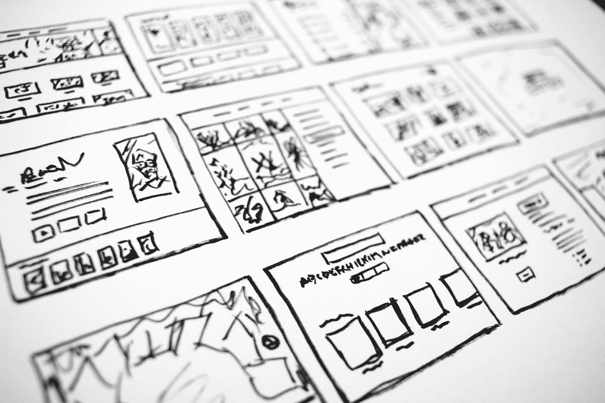
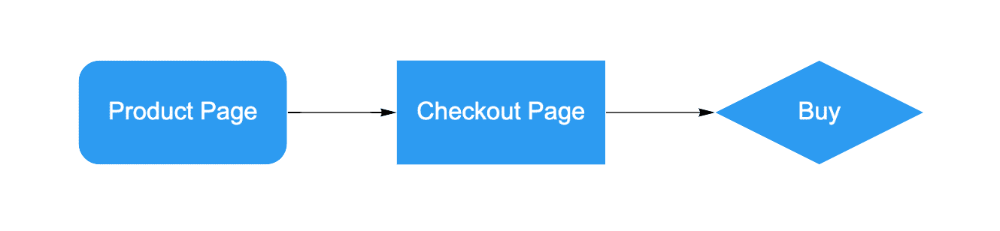
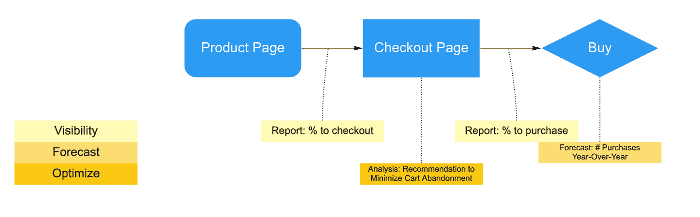
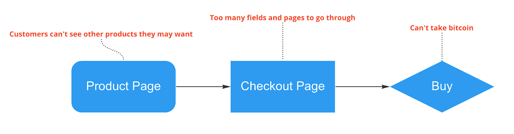

# 分析产品管理:创建分析策略指南

> 原文：<https://towardsdatascience.com/analytics-product-management-a-guide-on-creating-your-analytics-strategy-fc52f3799f63>

## 你被要求创建一个分析策略

哈尔·盖特伍德在 [Unsplash](https://unsplash.com?utm_source=medium&utm_medium=referral) 上拍摄的照片

这个循序渐进的指南是为了帮助你创造一个可以与合作伙伴和老板分享的愿景。获得支持以构建机器学习工具，并在关键分析上保持一致，以应对即将到来的一年。帮助您从响应临时数据请求发展到。

让我们开始吧。

# **1-我们的目标是 ____**

让我们首先承认组织的战略目标。他们将作为北极星来指导我们的路线图构思和头脑风暴会议。

目标越聪明越好。它提供了更少的解释空间，让更多的人朝着一个共同的目标努力。

例如，一个模糊或不明确的目标“减少我们的碳足迹”*可能是相对于去年减少 0.1%，但也可能是相对于 1800 年减少 50%，或者介于两者之间。这给误解留下了太多的空间，使得战略联盟难以实现。*

*另一方面，一个“通过在 2150 年实现碳中和，将全球变暖限制在相对于工业化前 2 摄氏度以内”的目标留给人们的争论空间要小得多。*

*业务团队的一个具体目标可能是“通过追加销售和重复购买，年销售额增长率达到 50%。”*

# ***2-今天我们 ____***

*我是 Ackoff (附属链接)揭露的[理想设计过程的忠实粉丝，我们首先从描绘当前状态开始。](https://amzn.to/3B9pdPR)*

*开始的一个方法是画一个流程图。它可以展示供应链之旅、客户体验或任何流程。例如，下面是一个简化的电子商务购买流程:*

**

*图片作者:电商结账*

*一旦我们对流程进行了可视化，我们就可以对支持该流程的分析工作和产品的当前状态进行分层。我建议将分析工作分为以下 3 类:*

*   ***可见性**收集数据并显示正在发生或已经发生的事情:例如数据集、ETL、数据仓库、仪表板、特别数据报告、业务回顾等。(基础分析)*
*   ***预测**回答“如果”:例如年度销售预测、产品变更的 AB 测试或反事实、流程变更的模拟等。(首先需要可见性)*
*   ***优化**支持决策并改进 KPI:例如，最大化客户终身价值、最小化运输成本等。(需要可见性，可能首先需要预测)*

*购买流程图现在可能是这样的:*

**

*作者图片:电子商务结账分析*

# ***3-理想情况下我们应该 ____***

*现在，让我们用[**]未来分析状态**来填补[当前分析状态]和[战略目标]之间的差距。让我们集思广益，看看哪些分析工作将有助于组织实现其目标。*

*我个人喜欢在让我们的想象力自由驰骋之前，先关注实际的问题。具体来说，我看着当前的状态并问:*

*   ****我们为什么这样做，又是为了谁？* "** 确认我们是否在为最终客户、内部利益相关者或其他人做某事，并揭示为什么它“重要”这有助于 1)确定我们可能不需要做的事情，因为它们不会增加价值，以及 2)对影响最终客户的工作进行优先排序。*
*   ****如果什么都不变，这怎么会在未来 10 年失败？* "** 指出需要解决的关键缺陷。这通常会激发出需要改进的想法。*

**

*作者图片:电子商务结账挑战*

*在这个阶段让关键的合作伙伴团队参与进来是很有帮助的——他们要么与我们合作构建，要么在我们的项目中投入资源。有两个原因:*

1.  *它允许我们集思广益，改变流程和产品，超越分析。*
2.  *协作允许团队在策略的执行阶段调整他们的优先级。*

*让不同类型的分析专家参与进来也很关键。我们倾向于我们熟悉的解决方案，因此让来自所有分析领域的人参与进来会发现更多的想法:数据工程、商业智能、数据分析师/科学家，甚至是产品分析想法的产品设计师/经理。我们一起更有可能想象一个涵盖分析所有方面的整体未来:可见性、预测和优化。*

*现在我们有了合适的人和合适的问题，终于到了想象未来状态的时候了。从一张白纸开始。*

**

*照片由[本工程 RAEng](https://unsplash.com/@thisisengineering?utm_source=medium&utm_medium=referral) 在 [Unsplash](https://unsplash.com?utm_source=medium&utm_medium=referral) 上拍摄*

*最后应该会有一个非常混乱的董事会，但有很多鼓舞人心的分析计划。类似于，但比这个好得多:*

**

*图片作者:电子商务结账理想设计*

# ***4-填补空白***

*我们研讨会的最后一步是制定切实可行的计划。开始脱离目前的状态，开始建立理想的状态。*

*换句话说， **1)创建计划，2)对计划进行优先级排序。***

*关于创建计划，这里有一篇关于基础知识或撰写敏捷计划(主题、史诗、故事)的介绍[博客文章](https://medium.com/agileinsider/an-introduction-to-user-stories-for-product-managers-c4c4aef38950)。关于故事的“验收标准”部分，功能和需求可能只与产品工作相关，如仪表板或数据管道。对于分析和报告，我发现*“要回答的问题”*更相关。*

*关于优先化计划，很明显我们想首先投资于最有价值的计划。然而，还有许多其他方面需要考虑:*

*   ***价值与紧急程度:**低价值高紧急程度的工作怎么办？还是反过来？可能没有“正确”的答案，但是它有助于量化一个计划将会产生的影响，估计工作量，并从合作伙伴那里获得反馈。所以在深入之前，先从机会分析开始。*
*   ***现实吗？**需要确定缺乏关键资源(工具、资金、人员)或来自领导或合作伙伴的支持。它们是先决条件。我们只有在先决条件检查完毕后才会启动任何计划。*
*   ***有激励作用吗？**一个好的战略或路线图需要让执行它的人感到有目的性和激励性。这是研讨会的全部目的，让分析团队自己制定计划。根据团队对计划的关注程度对计划进行排序将有助于权衡价值和紧迫性。*

*现在我们有了:开发分析路线图的 4 个步骤。*

*我的分析同事们，我希望你们能以此为参考，制定一个长期计划。从临时数据拉取转向优化和自动化工作。*

*有关更多*数据*指南，请参见[使用数据驱动产品设计](https://uxdesign.cc/product-analytics-a-guide-on-data-driven-product-management-ab5bca74f794)和[像皮克斯电影制作人一样展示数据故事](https://uxdesign.cc/data-storytelling-a-guide-to-presenting-data-driven-ideas-and-research-1c8969605810)。*

*帮我多写点。如果你喜欢阅读，就跟我来！*