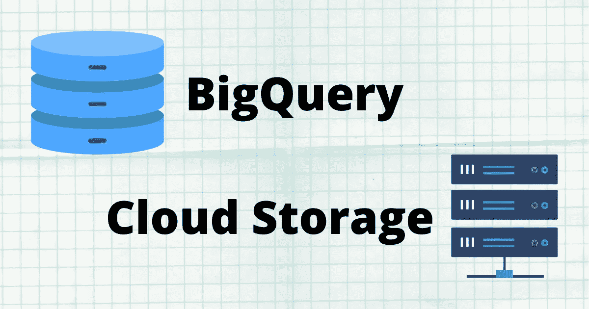
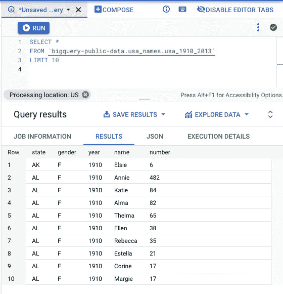
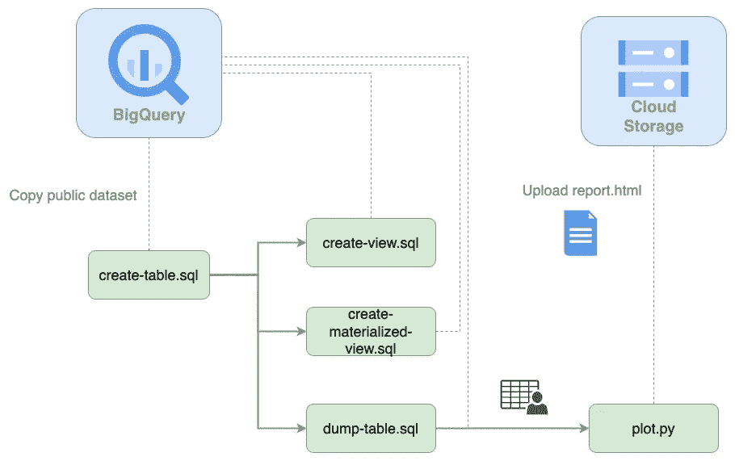
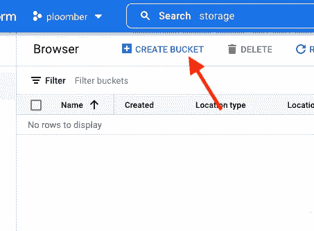
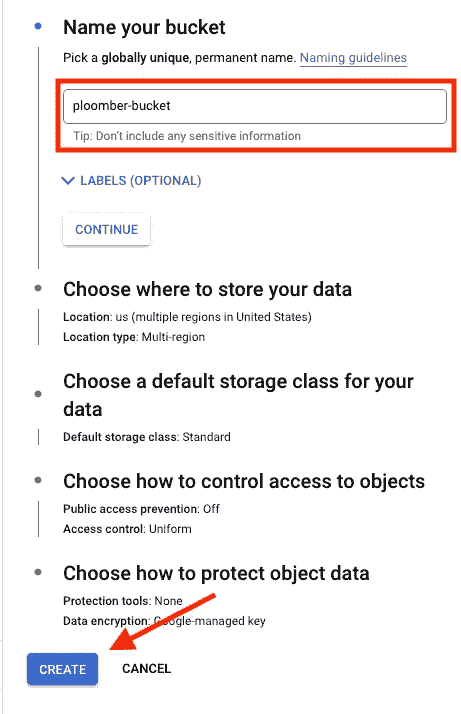
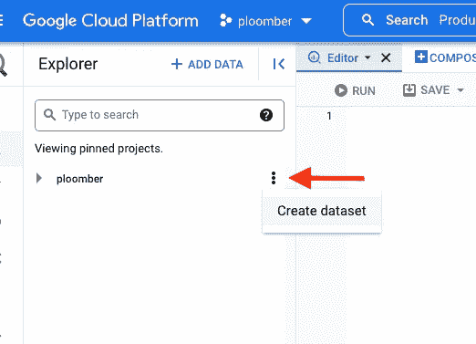
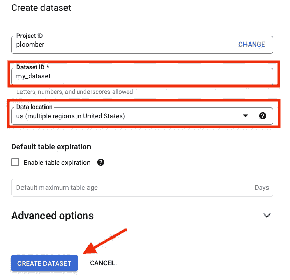
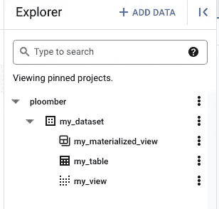
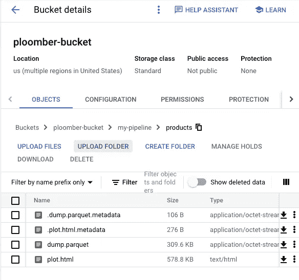
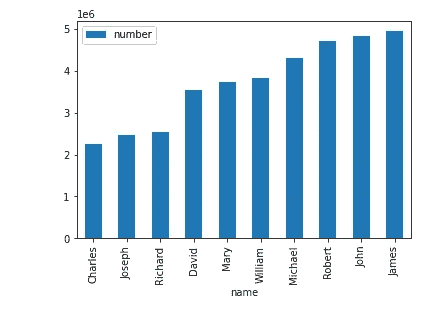

# 使用 BigQuery 和 Ploomber 分析和绘制 20 秒内的 550 万条记录

> 原文：<https://towardsdatascience.com/analyze-and-plot-5-5m-records-in-20s-with-bigquery-and-ploomber-8bf7646c031>

## 数据科学软件工程

## 使用开源软件在谷歌云上开发可扩展的管道

图片作者。

本教程将向您展示如何使用 Google Cloud 和 Ploomber 来开发一个可扩展的、生产就绪的管道。

我们将使用 Google BigQuery(数据仓库)和云存储来展示如何使用 SQL 轻松转换大数据集，使用 Python 绘制结果，并将结果存储在云中。由于 BigQuery 的可伸缩性(我们将使用一个有 550 万条记录的数据集！)和 Ploomber 的便利，**从导入数据到汇总报告的整个过程都在云上，不到 20 秒！**

# 介绍

在我们开始之前，我将快速浏览一下我们在这个项目中使用的两个 Google 云服务。 [Google BigQuery](https://en.wikipedia.org/wiki/BigQuery) 是一个无服务器的数据仓库，允许我们大规模分析数据。简单来说，我们可以存储大量数据集，并使用 SQL 查询，而无需管理服务器。另一方面，[谷歌云存储](https://en.wikipedia.org/wiki/Google_Cloud_Storage)是存储服务；这是相当于亚马逊 S3 的服务。

因为我们的分析包括 SQL 和 Python，所以我们使用 [Ploomber](https://github.com/ploomber/ploomber) ，一个开源框架来编写可维护的管道。它抽象了所有的细节，所以我们专注于编写 SQL 和 Python 脚本。

最后是数据。我们将使用一个公共数据集，其中包含了一段时间以来美国人名的统计数据。数据集包含 550 万条记录。它看起来是这样的:

样本数据。图片作者。

现在让我们来看看管道的架构！

# 架构概述

管道架构概述。图片作者。

第一步是`create-table.sql`脚本；这样的脚本运行一个`CREATE TABLE`语句来复制一个公共数据集。`create-view.sql`和`create-materialized-view.sql`使用现有的表并生成一个视图和一个物化视图(它们的目的是展示我们如何创建其他类型的 SQL 关系，我们不使用输出)。

`dump-table.sql`查询现有的表，并将结果转储到本地文件中。然后，`plot.py` Python 脚本使用本地数据文件，生成 plot，并以 HTML 格式上传到云存储。整个过程可能看起来令人生畏，但 Ploomber 让这变得简单明了！

现在让我们配置将要使用的云服务！

# 设置

我们需要在云存储中创建一个桶，在 BigQuery 中创建一个数据集；以下部分解释了如何做到这一点。

## 云存储

转到[云存储](https://console.cloud.google.com/storage)控制台(如果需要，选择一个项目或创建一个新项目)并创建一个新的存储桶(如果您愿意，可以使用现有的存储桶)。在我们的例子中，我们将在项目“ploomber”下创建一个 bucket“ploomber-bucket”:

在云存储中创建一个存储桶。图片作者。

然后，输入一个名称(在我们的例子中是“ploomber-bucket”)，并单击“CREATE”:

确认云存储空间的创建。图片作者。

现在让我们配置 BigQuery。

## BigQuery

转到 [BigQuery](https://console.cloud.google.com/bigquery) 控制台并创建一个数据集。为此，单击项目名称旁边的三个堆叠点，然后单击“创建数据集”:

在 BigQuery 中创建数据集。图片作者。

现在，输入“my_dataset”作为数据集 ID，并在*数据位置*中输入“us”(位置很重要，因为我们将使用位于该区域的公共数据集)，然后单击“CREATE DATASET”:

确认 BigQuery 数据集详细信息。图片作者。

谷歌云现在已经准备好了！现在让我们配置本地环境。

# 本地设置

首先，让我们进行身份验证，这样我们就可以对 Google Cloud 进行 API 调用。确保使用在项目中有足够权限使用 BigQuery 和云存储的帐户进行身份验证:

如果您有问题，请查看文档。

现在，让我们安装 Ploomber 来获得代码示例:

现在让我们回顾一下项目的结构。

# 项目结构

*   `pipeline.yaml`管道声明
*   `clients.py`创建 BigQuery 和云存储客户端的功能
*   `requirements.txt`巨蟒依赖
*   `sql/` SQL 脚本(在 BigQuery 中执行)
*   `scripts/` Python 脚本(在本地执行，输出上传到云存储)

你可以在这里查看详细的文件[。对于本教程，我将快速提及几个关键细节。](https://github.com/ploomber/projects/tree/master/templates/google-cloud)

`pipeline.yaml`是本项目的中心文件；Ploomber 使用这个文件来组装您的管道并运行它，如下所示:

`pipeline.yaml`文件中的每个任务包含两个元素:我们要执行的源代码和产品。您可以看到，我们有几个生成表和视图的 SQL 脚本。然而，`dump-table.sql`创建了一个`.parquet`文件。这向 Ploomber 表明它应该下载结果，而不是将它们存储在 BigQuery 上。最后，`plot.py`脚本包含一个`.html`输出；Ploomber 将自动运行脚本并将结果存储在 HTML 文件中。

您可能想知道顺序是如何确定的。Ploomber 从源代码本身提取引用；例如，`create-view.sql`依赖于`create-table.sql`。如果我们看代码，我们会看到引用:

有一个占位符`{{ upstream["create-table"] }}`，这表示我们应该先运行`create-table.sql`。在运行时，Ploomber 将替换表名的占位符。我们还有第二个占位符`{{ product }}`，它将被`pipeline.yaml`文件中的值替换。

`pipeline.yaml`到此为止。让我们回顾一下`clients.py`文件。

# 配置客户端. py

`clients.py`包含返回客户端与 BigQuery 和云存储通信的函数。

例如，这是我们连接到 BigQuery 的方式:

注意我们正在返回一个`ploomber.clients.DBAPIClient`对象。Ploomber 包装了 BigQuery 的连接器，因此它可以与其他数据库一起工作。

其次，我们配置云存储客户端:

这里，我们返回一个`ploomber.clients.GCloudStorageClient`对象(确保`bucket_name`与您的匹配！)

太好了，我们准备好运行管道了！

# 运行管道

确保您的终端在`gcloud`文件夹中打开，并执行以下操作:

运行`ploomber build`命令几秒钟后，您应该会看到类似这样的内容:

如果出现错误，很可能是配置错误。请给我们发送一条关于时差的[消息，这样我们可以帮助您解决这个问题！](https://ploomber.io/community)

如果您打开 [BigQuery](https://console.cloud.google.com/bigquery) 控制台，您会看到新的表和视图:

运行管道后在 BigQuery 中创建的表和视图。图片作者。

在[云存储](https://console.cloud.google.com/storage)控制台中，您会看到 HTML 报告:

运行我们的管道后在云存储中生成的工件。图片作者。

最后，如果你下载并打开 HTML 文件，你会看到情节！

聚合我们的 550 万行数据集后生成的图！图片作者。

# 增量构建

可能需要几次迭代才能得到最终的分析结果。这个过程包括对您的代码做一些小的修改，然后重新运行工作流。Ploomber 可以跟踪源代码的变化以加速迭代，所以它下次只执行过时的脚本。启用此功能需要一些额外的配置，因为 Ploomber 需要存储管道的元数据，我们已经预先配置了相同的工作流，因此它将元数据存储在 SQLite 数据库中，您可以使用以下命令运行它:

如果您下次运行该命令，您会看到它跳过了所有任务:

现在尝试更改`plot.py`并重新运行管道；你会看到它跳过了大多数任务！

# 结束语

本教程展示了如何在 Google Cloud 上构建可维护和可伸缩的数据分析管道。Ploomber 有许多其他功能来简化您的工作流，例如参数化(每次运行管道时将输出存储在不同的上)、任务并行化，甚至云执行(以防您需要更多的功能来运行 Python 脚本！).

查看我们的[文档](https://docs.ploomber.io/)以了解更多信息，不要犹豫[向我们发送任何问题！](https://ploomber.io/community)

*最初发布于*[*ploomber . io*](https://ploomber.io/blog/google-cloud/)