# 用网络图分析和可视化 URL

> 原文：<https://towardsdatascience.com/analyze-and-visualize-urls-with-network-graph-ee3ad5338b69>

## 从 Python 中的 URL 获得洞察力

# 动机

你有没有尝试过从 URL 中提取特征和见解，但是发现很难做到？

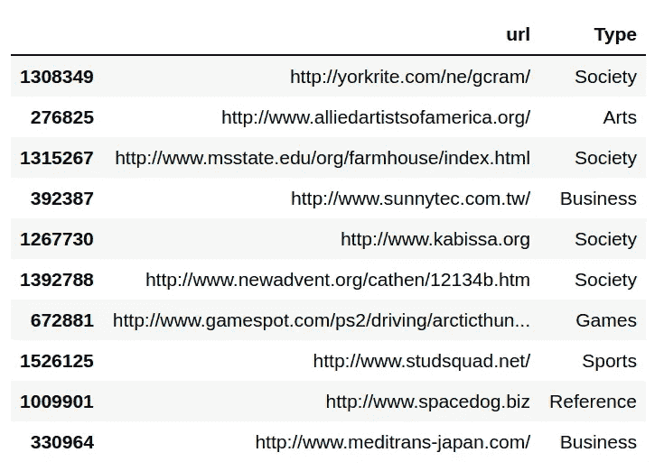

作者图片

如果你能提取特征并为你的 URL 创建一个漂亮的网络图，不是很好吗？


作者图片

在本文中，您将学习如何结合使用 yarl 和 PyGraphistry 来实现这一点。

# 用 yarl 从 URL 中提取要素

yarl 是一个 Python 库，允许你从你的 URL 中提取特征。要安装 yarl，请键入:

```
pip install yarl
```

让我们尝试使用 yarl 从 URL 中提取一些元素。从创建 URL 实例开始:

获取方案:

```
>>> url.scheme
'https'
```

获取主机:

```
>>> url.host
'github.com'
```

获取路径:

```
>>> url.path
'/search'
```

获取查询:

```
>>> url.query_string
'q=data science'
```

获取片段:

```
>>> url.fragment
'contents'
```

我们可以看到用 yarl 从 URL 中提取元素是多么容易。让我们利用这个工具从一个数据帧中的多个 URL 中提取元素。

我们将通过知识共享许可在 Kaggle 上使用 [URL 分类数据集【DMOZ】](https://www.kaggle.com/datasets/shawon10/url-classification-dataset-dmoz)。下载并解压当前目录下的数据后，开始加载数据。由于数据非常大，我们将只使用 10，000 个样本的数据。

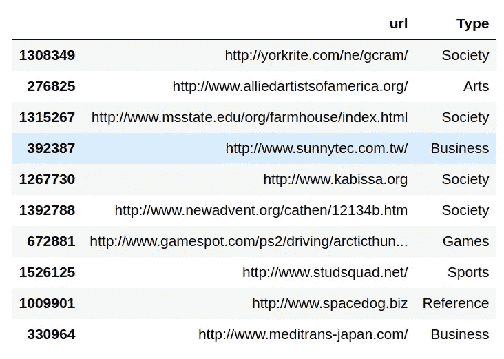

作者图片

从该数据集的`url`列中提取一些元素:

# 用网络图可视化 URL 的特征

既然我们已经从数据集中的 URL 提取了特征。让我们想象一下这些特性与 URL 类型之间的关系。

首先，为每篇文章的主题找出前 5 位最受欢迎的主持人:

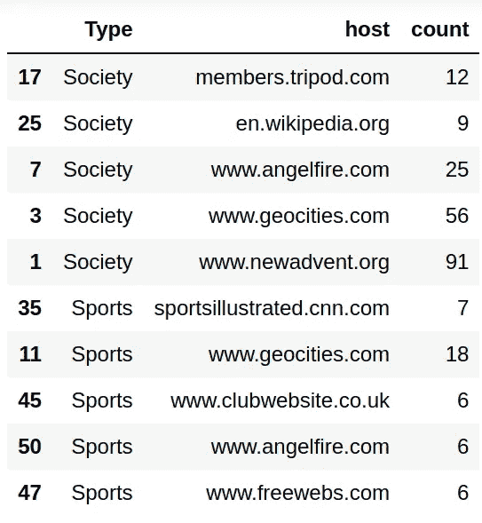

作者图片

现在我们准备使用 [PyGraphistry](https://github.com/graphistry/pygraphistry) 来可视化`Type`和`host`之间的关系。从安装 PyGraphistry 开始:

```
pip install graphistry
```

要使用 PyGraphistry，[在网站](https://hub.graphistry.com/)上注册一个免费帐户，然后使用您刚刚创建的帐户进行注册:

要用 PyGraphistry 创建一个图，我们需要边和节点。从创建边开始:

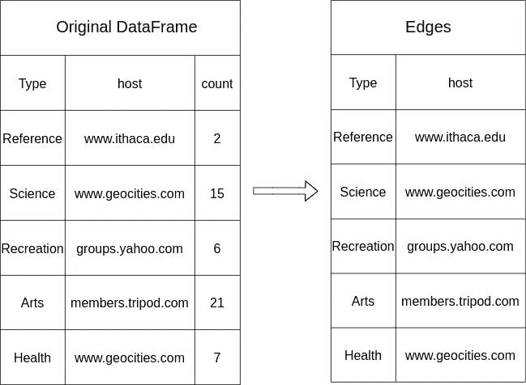

作者图片

接下来，创建节点:

上面代码的可视化:

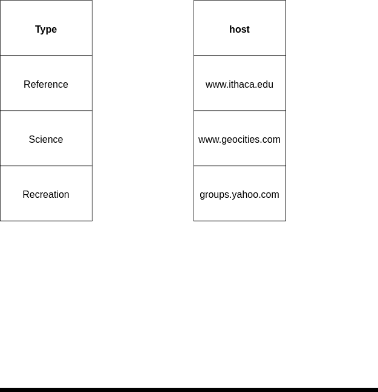

作者 GIF

现在我们准备创建一个网络图:

您应该会看到类似下图的图表:

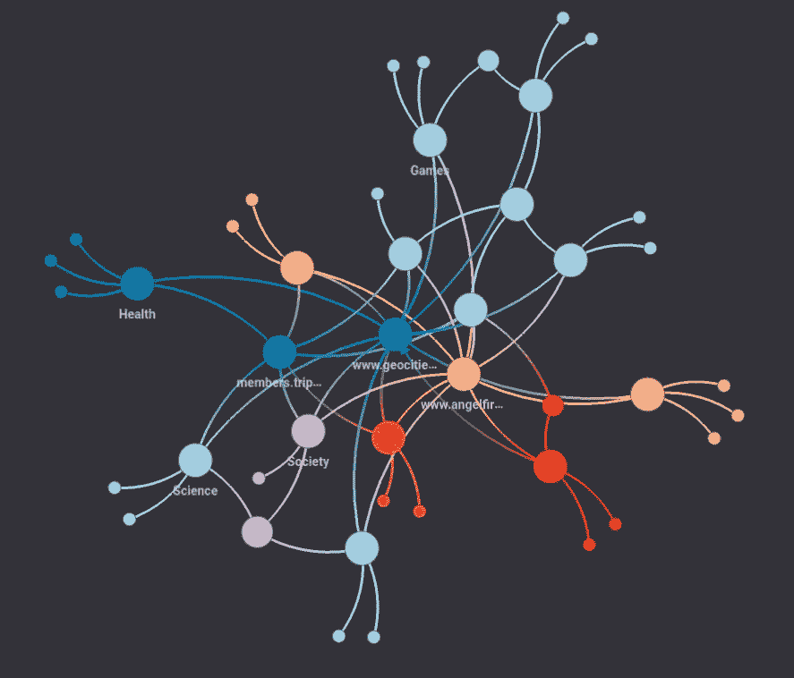

作者图片

默认情况下，PyGraphistry 只显示有大量连接的节点的标签。要显示其他节点的标签，点击`Label settings`然后增加`Max Points of Interest`的值。

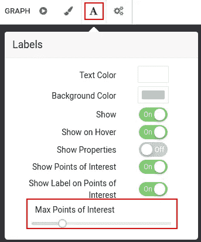

作者图片

现在，您应该可以看到更多节点的标签:

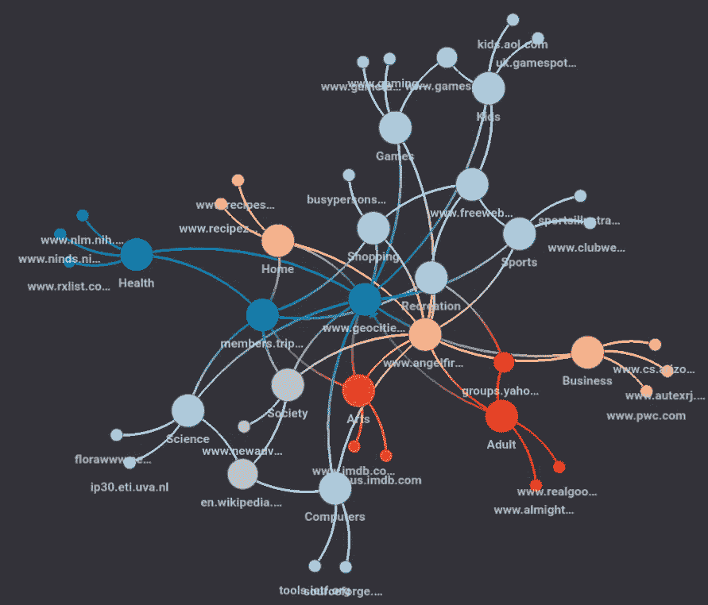

作者图片

该图看起来有点混乱，因为类型为`host`的节点和类型为`Type`的节点具有相同的颜色和图标。

让我们调整节点的颜色和图标，使图形看起来更清晰。

# 自定义您的图表

首先使用 [faker](/how-to-create-fake-data-with-faker-a835e5b7a9d9) 为不同的节点类型创建不同的颜色:

```
{'Arts': '#e56110',
 'Society': '#7a06d8',
 'Recreation': '#f7e1be',
 'Games': '#e07db7',
 'Computers': '#a8dbf4',
 'Sports': '#fffdb5',
 'Science': '#e2917f',
 'Health': '#969e0e',
 'Home': '#ffe3c6',
 'Kids': '#012e77',
 'Shopping': '#96f2aa',
 'Reference': '#f4bc66',
 'Business': '#728bc9',
 'Adult': '#321875',
 'News': '#ffadf8'}
```

接下来，用不同的图标分配不同的节点类型。你可以在[字体 Awesome](https://fontawesome.com/v4/icons/) 中找到 PyGraphistry 的所有图标。

接下来，将颜色映射和节点映射添加到我们的图形中。

在上面的代码中，

*   `encode_point_color("node", …)`告诉图形根据`node`列中的值对点的颜色进行编码。
*   `encode_point_color(…, categorical_mapping=node_color_mapping, default_mapping="silver")`告诉图形对特定类型的节点使用哪种颜色。如果没有指定节点的颜色，该节点将为银色。

输出:

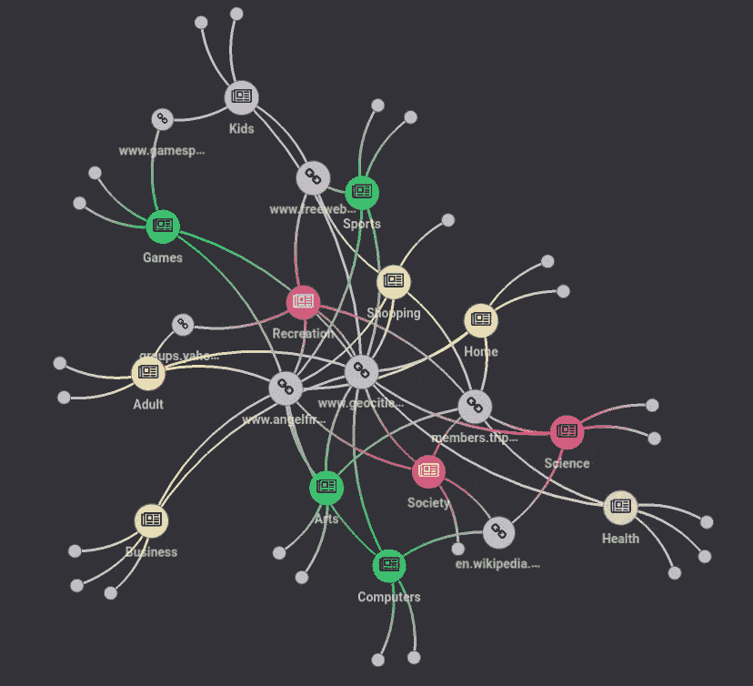

作者图片

图表看起来清晰多了。不同类型的物品有不同的颜色。URL 有银色和链接图标。

# 寻找最多样化的主机

最多样化的主机是链接到最多文章主题的主机。换句话说，具有最高向内度数的节点。

点击`Add histogram for` → `point.degree_in`可获取入度最高的节点。您将看到一个直方图，其 x 轴表示输入度数，y 轴表示每个类别的计数。

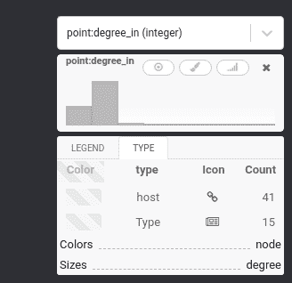

作者 GIF

当您将鼠标悬停在每个条形组上时，属于该条形组的节点将突出显示。下面的 GIF 显示了当我在直方图上从左向右移动鼠标时突出显示的节点(从最小的输入度数到最大的输入度数)。

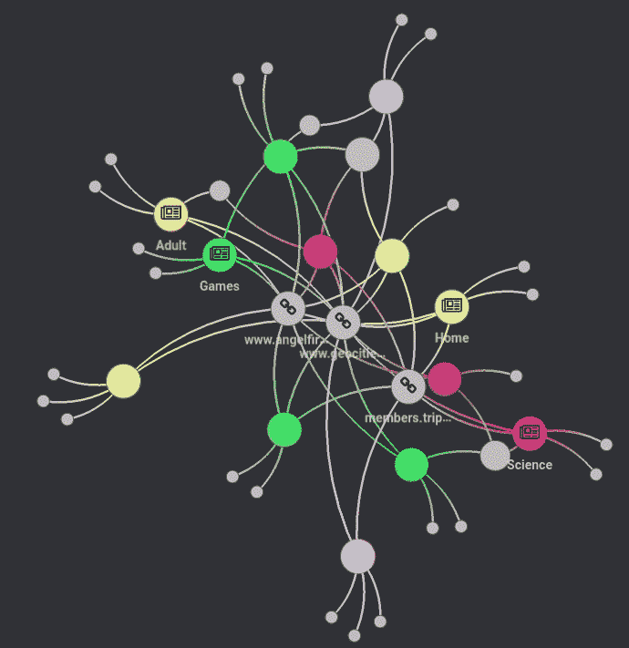

作者 GIF

从图中，我们可以看到 www.geocities.com 是与其他主题联系最多的主持人。

# 下一步

我们刚刚发现了主机和文章类型之间的关系。我鼓励你使用网络图来分析文章类型和其他 URL 特征之间的关系。您可能会发现一些有趣的关系，这些关系无法通过单独查看您的数据来发现。

随意发挥，并在这里叉这篇文章的源代码:

[](https://github.com/khuyentran1401/Data-science/blob/master/visualization/analyze_URL/analyze_URL.ipynb) [## 数据科学/analyze _ URL . ipynb at master khuyentran 1401/数据科学

### 收集有用的数据科学主题以及代码和文章-Data-science/analyze _ URL . ipynb at master…

github.com](https://github.com/khuyentran1401/Data-science/blob/master/visualization/analyze_URL/analyze_URL.ipynb) 

我喜欢写一些基本的数据科学概念，并尝试不同的数据科学工具。你可以在 LinkedIn 和 T2 Twitter 上与我联系。

星[这个回购](https://github.com/khuyentran1401/Data-science)如果你想检查我写的所有文章的代码。在 Medium 上关注我，了解我的最新数据科学文章，例如:

[](/visualize-github-social-network-with-pygraphistry-dfc23a38ec8d) [## 用 PyGraphistry 可视化 GitHub 社交网络

### 分析机器学习开发者和 Web 开发者之间的联系

towardsdatascience.com](/visualize-github-social-network-with-pygraphistry-dfc23a38ec8d) [](/pyvis-visualize-interactive-network-graphs-in-python-77e059791f01) [## Pyvis:用 Python 可视化交互式网络图

### 只需要几行代码

towardsdatascience.com](/pyvis-visualize-interactive-network-graphs-in-python-77e059791f01) [](/observe-the-friend-paradox-in-facebook-data-using-python-314c23fd49e4) [## 使用 Python 观察脸书数据中的朋友悖论

### 平均来说，你的朋友比你的朋友多吗？

towardsdatascience.com](/observe-the-friend-paradox-in-facebook-data-using-python-314c23fd49e4) [](https://pub.towardsai.net/visualize-gender-specific-tweets-with-scattertext-5167e4600025) [## 用分散文本可视化特定性别的推文

### 区分推文中的性别，并在交互式 HTML 散点图中呈现

pub.towardsai.net](https://pub.towardsai.net/visualize-gender-specific-tweets-with-scattertext-5167e4600025) 

# 参考

URL 分类数据集[DMOZ]。阿沙杜拉·沙文。CC0:公共领域。从[https://www . ka ggle . com/datasets/shawon 10/URL-classification-dataset-dmoz](https://www.kaggle.com/datasets/shawon10/url-classification-dataset-dmoz)检索到 2022–04–13