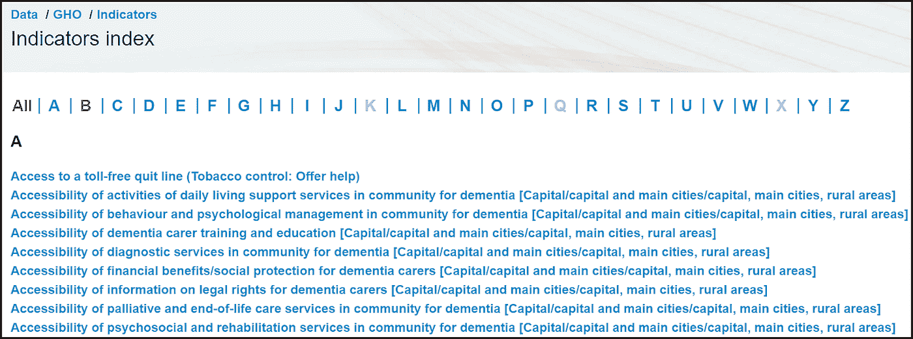
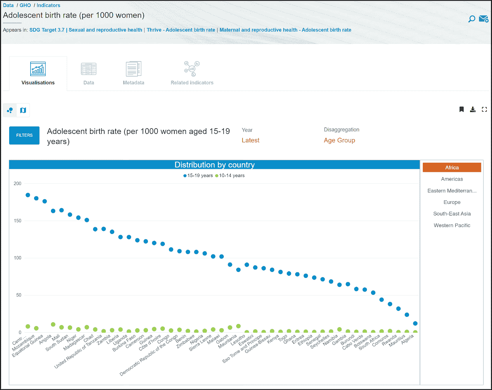
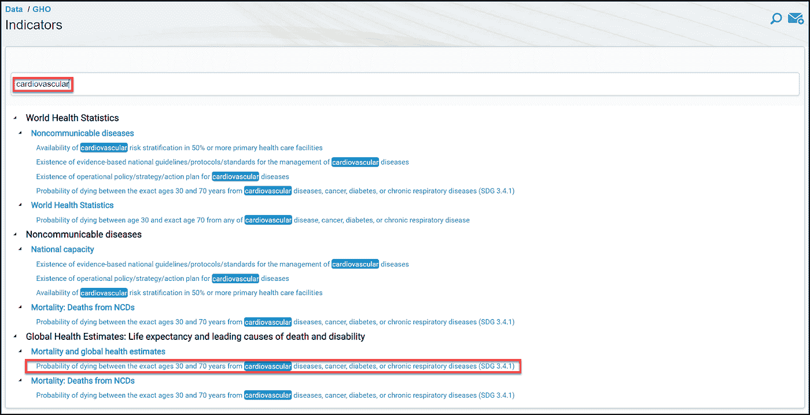
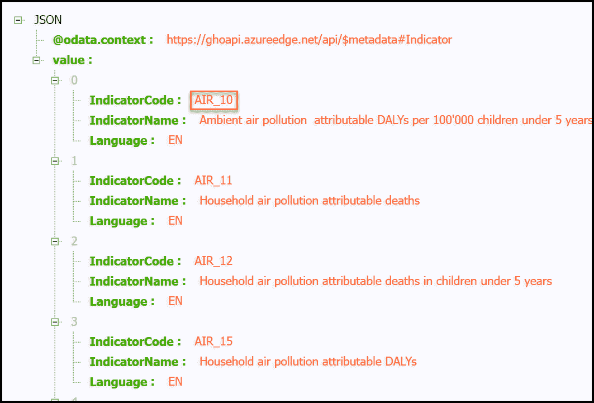
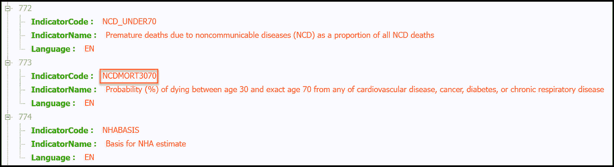
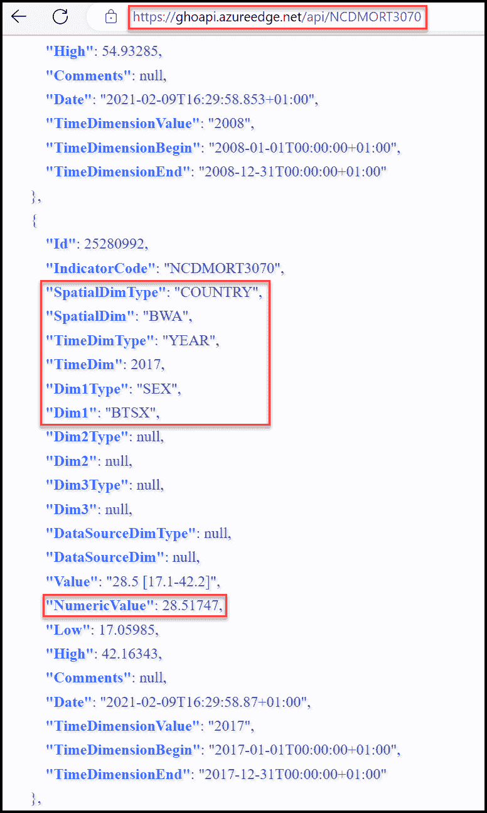
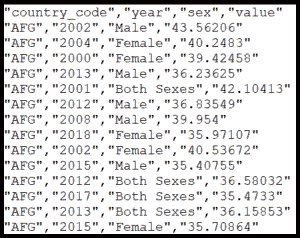
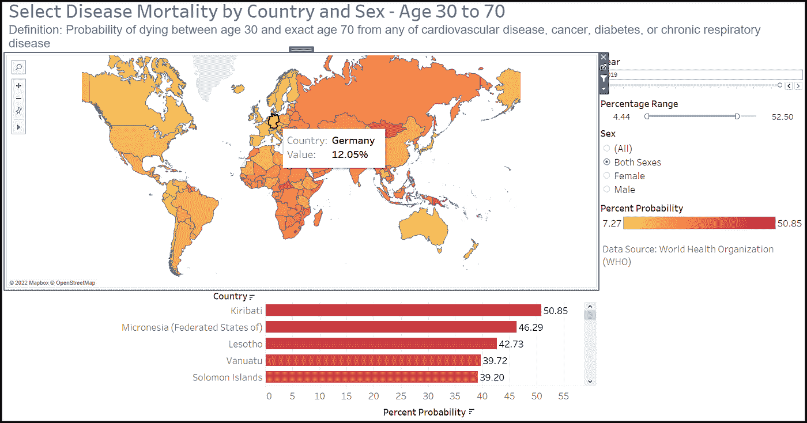

# 分析来自世界卫生组织全球卫生观察站的数据

> 原文：<https://towardsdatascience.com/analyze-data-from-the-world-health-organization-global-health-observatory-723418d3642b>

## 医疗保健数据分析、Python 和 Tableau

## 使用世卫组织的全球健康观察 oData API、Python 和 Tableau 来分析世界范围内的健康相关数据

小心翼翼地牵着手。[国家癌症研究所](https://unsplash.com/@nci?utm_source=unsplash&utm_medium=referral&utm_content=creditCopyText)在 [Unsplash](https://unsplash.com/s/photos/care?utm_source=unsplash&utm_medium=referral&utm_content=creditCopyText) 上拍摄的照片。

世界卫生组织(世卫组织)成立于 1948 年，是一个联合国机构，它将各国、合作伙伴和人民联系在一起，以促进健康，维护世界安全，并为弱势群体服务。世卫组织全球卫生观察站(GHO)是联合国为其 194 个成员国提供卫生保健统计数据的门户。本文向您展示了如何使用 GHO OData API 和 Python 检索医疗保健统计数据，并将其从 JSON 结构转换为 CSV 文件。CSV 文件将可以导入到 Tableau 等数据可视化工具中。

以下部分将描述以下主题:

*   GHO OData API 和指标
*   用于检索和转换 GHO 医疗保健统计数据的 Python 程序
*   可视化医疗统计数据的 Tableau 工作簿

# GHO 奥达数据 API 指标

这里描述的 GHO OData API 是。您可以使用 API 访问的数据集被标识为指示器。

指标索引中包含了按字母顺序排列的完整指标列表。请参见下面截图中的指标示例。

GHO 指标索引的第一页。Randy Runtsch 截图。

单击任何指标的名称都会显示关于数据、元数据、相关索引的信息，有时还会显示可视化效果。例如，滚动指标索引并点击“青少年出生率(每 1000 名 15-19 岁女性)”会返回如下所示的可视化结果。

GHO“青少年出生率…”指标的数据可视化。Randy Runtsch 截图。

本文中使用的指标称为“[30 岁至 70 岁之间死于心血管疾病、癌症、糖尿病或慢性呼吸系统疾病的概率](https://www.who.int/data/gho/data/indicators/indicator-details/GHO/probability-(-)-of-dying-between-age-30-and-exact-age-70-from-any-of-cardiovascular-disease-cancer-diabetes-or-chronic-respiratory-disease)”您可以通过搜索“心血管”在[指标页面](https://www.who.int/data/gho/data/indicators)找到它，如下图所示。

GHO 指标网页上感兴趣的指标。Randy Runtsch 截图。

要使用 GHO OData API 检索数据集，您需要知道其指示器代码(indicator code)值。要查找该值，请导航到 JSON 格式的指示器页面:

【https://ghoapi.azureedge.net/api/Indicator】T4。

在下面的第一个屏幕截图中，指示符代码“AIR_10”是“周围空气污染…”指示符的标识符。

JSON 格式的 GHO 指标列表。Randy Runtsch 截图。

通过扫描或搜索该页面，您将发现一个指标代码值“NCDMORT3070”，该指标称为“30 岁之间死亡的概率(%)”。我们将使用该指标代码值来识别要通过 GHO oData API 检索的数据集。

指示器代码值为“NCDMORT3070”的指示器 Randy Runtsch 截图。

# JSON 格式的示例数据

通过在 URL[https://ghoapi.azureedge.net/api](https://ghoapi.azureedge.net/api)上附加指示符代码，可以以 JSON 格式查看用 GHO OData API 检索的示例数据集。对于本文中使用的数据集，完整的 URL 是[https://ghoapi.azureedge.net.api/NCDMORT3070](https://ghoapi.azureedge.net.api/NCDMORT3070)。在 web 浏览器中导航到该地址以查看数据，如下面的屏幕截图所示。

注意，您可能需要安装一个浏览器扩展来查看格式正确的 JSON 中的数据。在我的电脑上，我使用微软 Edge 浏览器的免费 JASON-Handle 扩展。可以在这里找到[。](https://microsoftedge.microsoft.com/addons/detail/jsonhandle/pogcfcgaeocmmoadpbcfnponnlidodjn)

下面描述的 Python 程序将使用上面红框中显示的字段。它将检索由 IndicatorCode 值“NCDMORT3070”标识的数据集的所有记录。 **"** 但是将只处理 SpatialDimType 为“国家”的记录此外，它还将检索国家代码(SpatialDim)、年份(TimeDim)、性别(Dim1)和数值(numeric value)的值。

# 用于此项目的工具

对于这里描述的项目，我使用 Microsoft Visual Studio Community 2022 进行 Python 编程，使用 Tableau 公共桌面和 Tableau 公共网站进行数据可视化。对于 Python 编程，可以随意使用您喜欢的任何编辑器或集成开发环境(IDE)。

Visual Studio Community 和 Tableau Public 是免费工具，您可以从以下位置安装:

*   [Visual Studio 社区](https://visualstudio.microsoft.com/vs/community/)
*   [Tableau Public](https://www.tableau.com/community/public)

请注意，虽然 Tableau 的商业版本允许您将数据可视化工作簿保存到本地驱动器或服务器，但在 Tableau Public 中，所有可视化工作簿只能保存到 Tableau Public 服务器。此外，公众也可以看到可视化效果。

# Python 程序

## 计划概述

下一节中展示的 Python 程序分为这两个模块:

*   **c _ who _ mortality _ data . py 类**检索 JSON 格式的指标 NCDMORT3070 的数据，将其转换为 Python 字典列表，并将死亡率记录写入 CSV 文件。
*   **模块 get_who_mortality_data.py** 是驱动程序。它只是用输出文件的名称调用 c_who_mortality_data 类，程序将以 CSV 格式写入数据记录。

下面是程序的伪代码:

*   用输出文件名调用 c_who_mortality_data。
*   在 JSON 流中请求 NCDMORT3070 的数据。
*   将 JSON 格式的数据转换成 Python 字典列表。
*   以写入模式打开输出 CSV 文件。
*   将列标题写入文件。
*   遍历列表中的每条记录。对于 SpatialDimType = "COUNTRY "的每个记录，创建一个 CSV 格式的输出记录，其中包含年份、性别(从 Dim1 值转换而来)和值。将输出记录写入文件。

请注意，除了“国家”之外，数据集 NCDMORT3070 还包含 SpatialDimType 值。该程序将忽略具有这些其他值的记录。

## 代码

c_who_mortality.py 和 get_who_mortality.py Python 模块如下所示。

用于检索、重新格式化和写入 GHO 数据的 Python 程序，用指示符“NCDMORT3070”标识由 Randy Runtsch 编写的代码。

# CSV 文件

这里显示的 Python 程序将记录写入一个名为“c:/who_data/mortality.csv”的文件。以下是文件顶部的一些示例记录。

死亡率 CSV 文件中的样本记录。Randy Runtsch 截图。

第一条记录包含列名“国家代码”、“年份”、“性别”和“值”。后续记录包含数据值。

# Tableau 公共工作簿

为了创建由 Python 程序写入 CSV 文件的死亡率概率的地图和条形图，我将数据加载到 Tableau Public 中。此外，为了将 3 个字符的国家代码转换成国家名称，我将这个[国家主文件](https://github.com/lukes/ISO-3166-Countries-with-Regional-Codes/blob/master/all/all.csv)加载到 Tableau 中，并加入国家代码的数据集..

使用来自 GHO 数据集的数据构建的 Tableau 仪表盘，标识为指示器“NCSMORT3070”由 Randy Runtsch 创建的仪表板。

虽然重新创建 Tableau 公共仪表板的说明超出了本文的范围，但是您可以[在这里](https://public.tableau.com/views/SelectDiseaseMortalitybyCountryandSex/Dashboard1?:language=en-US&publish=yes&:display_count=n&:origin=viz_share_link)查看并下载它。下载后可以在 Tableau 公共桌面或者 Tableau 桌面进行操作。

# 摘要

本文提供了编写一个 Python 程序的说明，该程序使用世卫组织的 GHO OData API 来检索与特定疾病导致的死亡率相关的全球健康相关数据。您应该能够调整该程序来检索和处理其他 GHO 数据集。

我希望这篇文章对你有所帮助。如果你有任何问题，请让我知道。