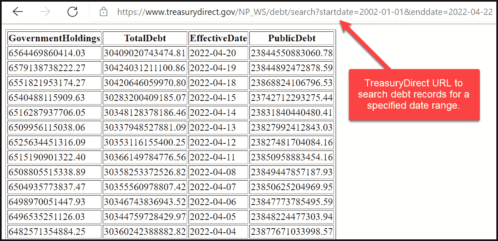
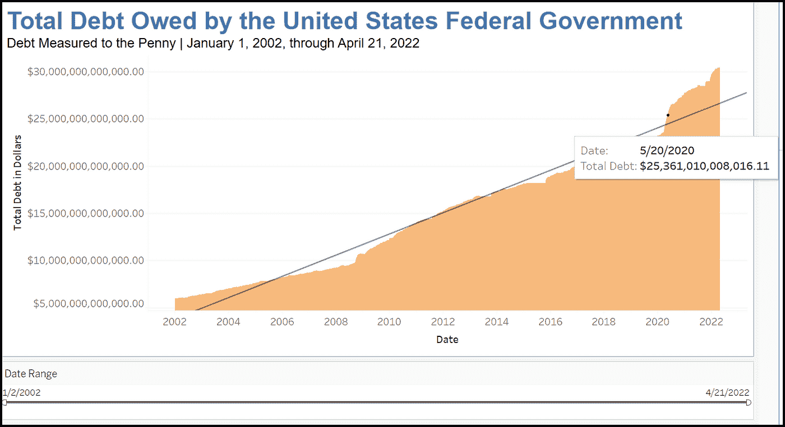
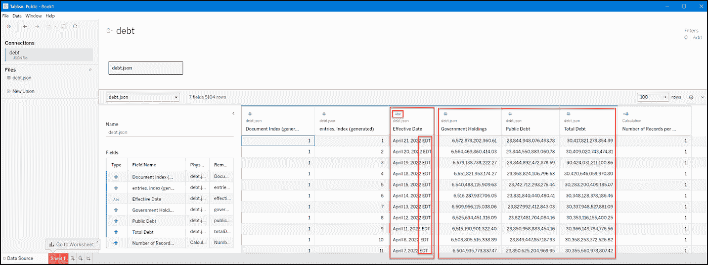
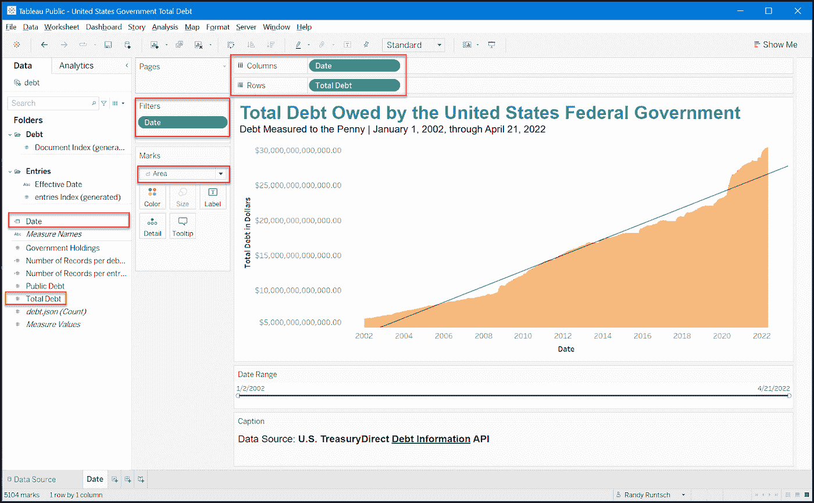

# 用美国国债 API、Python 和 Tableau 分析美国债务

> 原文：<https://towardsdatascience.com/analyze-us-debt-to-the-penny-with-the-us-treasury-debt-api-python-and-tableau-ab9aaa44e0e3>

## 数据分析、数据工程、美国政府、Python 和 Tableau

## 美国财政部通过其债务信息 API 可以轻松检索美国联邦政府债务数据

美国采购一分硬币。丹·丹尼斯在 [Unsplash](https://unsplash.com/s/photos/coin?utm_source=unsplash&utm_medium=referral&utm_content=creditCopyText) 上拍摄的照片。

根据[美国国债时钟](https://usdebtclock.org/)，在我写这篇文章的时候，美国联邦政府已经累积了 30403148491160 美元的债务。那超过三十万亿美元。

您可以通过美国财政部管理的美国财政部直接债务信息 API，以编程方式检索美国政府债务水平数据，精确到便士。本文将向您展示如何编写一个 Python 程序来检索债务数据。然后，它将演示如何在 Tableau Public 中创建一个面积图来可视化数据。

# 债务信息 API 和数据摘要

调用债务信息 API 很简单。它的基本网址是“*http://www.treasurydirect.gov/NP_WS/debt*”您可以向基本 URL 添加参数来检索特定数据。该 API 可以通过 web 浏览器或任何编程语言调用，包括 Python。

API 参数在这里[描述](https://www.treasurydirect.gov/webapis/webapisdebt.htm)。在本教程中，我们将搜索、检索和查看从 2002 年 1 月 1 日到 2022 年 4 月 21 日的二十多年的每日债务记录。以下是该日期范围内债务信息 API 的格式。它使用 API 文档中所说的“债务搜索端点”

> [https://www.treasurydirect.gov/NP_WS/debt/search?开始日期=2002-01-01 &结束日期=2022-04-21](https://www.treasurydirect.gov/NP_WS/debt/search?startdate=2002-01-01&enddate=2022-04-21)

请注意"https://www.treasurydirect.gov/NP_WS/debt/search 后面的开始日期和结束日期参数。:"

*   开始日期= 2002–01–01
*   结束日期=2022 年 4 月 21 日

一个问号(？)位于第一个参数之前，而与符号(&)位于后续参数之前。

要运行此查询，请将完整的 URL 粘贴到 web 浏览器的地址栏中。然后，按下[返回]。它应该会返回如下图所示的记录。

美国债务数据样本。Randy Runtsch 截图。

请注意数据表周围的边框。默认情况下，API 以这种表格格式返回数据。但是出于编程目的，它也可以返回 j *son、jsonp 和 xhtml* (XML)格式的数据。下一节中的 Python 程序需要一个 JSON 输出，因此我们将在 URL 中添加“format”参数，以 JSON 格式返回数据。以下是完整的网址:

> https://www.treasurydirect.gov/NP_WS/debt/search?开始日期=2002 年 1 月 1 日&结束日期=2022 年 4 月 21 日&格式=json

您也可以在 web 浏览器中运行这个 API 调用，但是 JSON 格式的数据是不可读的。

# Python 程序检索总债务数据并将其写入文件

我在 Windows 10 上使用 Python 3.10 和[微软 Visual Studio 社区 2022](https://visualstudio.microsoft.com/vs/community/) 集成开发环境(IDE)，编写并运行了下面描述和显示的 Python 程序。您可以在 Windows 上随意使用这些工具，或者在您选择的平台上使用最新版本的 Python 和您首选的 IDE 或代码编辑器。

## Python 代码

为了调用债务信息 API，我在模块 *c_us_debt_api.py* 中写了一个名为 *c_us_debt* 的 Python 类。模块 *get_us_debt.py* 是程序的入口点。它创建 c_us_debt 的一个实例，并用文件名、开始日期和结束日期参数调用它。

Python 代码模块如下所示。下一节介绍描述代码如何工作的伪代码。

**c_us_debt_api.py:**

Python 类 c_us_debt 检索美国债务总额数据并将其写入 JSON 格式的文件。由 Randy Runtsch 编写的代码。

**get_us_debt.py:**

调用 c_us_debt 类的 Python get_us_debt.py 代码模块。由 Randy Runtsch 编写的代码。

## 伪代码

这段伪代码描述了程序的工作原理:

1.  创建一个文件夹，程序将在其中写入输出文件，该文件包含一个 JSON 结构和每天的美国债务数据。
2.  在程序的入口点模块(get_us_debt.py)中，调用 c_us_debt_api.py 的构造函数，给它发送这些参数:输出文件夹和文件的名称，格式为“YYYY-MM-DD”的债务记录开始日期，格式为“YYYY-MM-DD”的债务记录结束日期。
3.  在 c_us_debt 类的构造函数(__init__())中，将基 URL 和参数设置到对象变量中。调用 get_data()函数来处理请求。
4.  在 get_data()函数中，构建完整的 URL，使用 get 调用带有完整 URL 的债务信息 API，将返回的 JSON 数据结构写入指定的输出文件夹和文件。

# 在 Tableau Public 中可视化债务数据

我选择使用免费的 Tableau 公共数据可视化桌面应用程序和网站来可视化美国自 2002 年 1 月 1 日以来的债务总额。虽然本教程的重点不是教你如何使用 Tableau，但它描述了构建可视化的步骤，如下所示。

Tableau 公众桌面美国总债务面积图截图。由兰迪·朗奇创作。

你可以在这里下载 [Tableau 公共桌面软件](https://www.tableau.com/products/public)。该应用程序适用于 Windows 和 Mac OS。Tableau 发布了这些[免费培训视频](https://www.tableau.com/learn/training/20221)来教你如何使用这个工具。

**用 Tableau Public 创建美国总债务面积图的步骤:**

1.  运行上一节描述的 Python 程序，创建一个文件，其中包含按日期排列的 JSON 格式的美国总债务记录。
2.  下载并安装 Tableau 公共桌面。创建一个帐户。
3.  启动 Tableau 公共桌面。
4.  打开包含总债务记录的 JSON 文件作为新的数据源。
5.  您应该会看到如下所示的数据源窗口。
6.  请注意，您将使用“生效日期”和“债务总额”字段中的数据来创建图表。
7.  单击屏幕底部的第一个“新工作表”选项卡。
8.  *生效日期*字段中的值是无效的日期值，因为每条记录都包含一个后缀“EDT”，表示该日期为东部夏令时。使用以下计算创建一个名为 *Date* 的新计算字段: *DATE(DATEPARSE( "MMMM dd，yyyy "，LEFT([生效日期]，LEN([生效日期]) — 4))。*此计算将删除“EDT”并将其转换为标准日期。
9.  在新的*日期*字段的下拉菜单中，将其数据类型更改为“日期”
10.  创建面积图，如下面的第二个屏幕截图所示。为了精确地描述债务，请务必选择“精确日期”作为*日期*，并将*总债务*更改为“维度”
11.  从主菜单中选择[工作表]和[工具提示…]，编辑工具提示文本。
12.  点击主菜单中的[分析]、[趋势线]和[显示趋势线]，添加趋势线。
13.  根据需要继续修改工作表，包括更改颜色、字体等。
14.  当面积图如你所愿出现时，用你选择的名字发布到 Tableau 公共服务器。为此，单击主菜单中的[文件]和[保存到 Tableau Public…]。

Tableau 公共桌面显示的美国总债务 JSON 数据源。Randy Runtsch 截图。

在 Tableau Public Desktop 中设置总负债面积图。Randy Runtsch 截图。

请注意，世界上的任何人都可以查看发布到 Tableau 公共服务器的所有工作表。此外，这是从 Tableau Public Desktop 保存工作表的唯一方法。例如，商业版 Tableau Desktop 的用户可以将工作簿保存到他们的本地驱动器、Tableau Server 的私有实例或 Tableau Public。

你可以在这里查看我的美国政府债务总额图表。请随意下载一份，在 Tableau Public Desktop 中编辑，并使用您自己的帐户将其发布到 Tableau Public 服务器。

# 其他美国财政部数据 API

虽然本教程涵盖了美国的总债务数据，但是您也可以调用[财政部安全信息 API](https://www.treasurydirect.gov/webapis/webapisecurities.htm) 来查询和检索大量关于美国政府证券的数据，比如国债和票据。你可以通过其[财政数据网页](https://fiscaldata.treasury.gov/api-documentation/)上描述的 80 个附加 API 访问其他类型的美国财政部数据。

# 摘要

本教程提供了编写 Python 程序以使用债务信息 API 检索美国政府债务数据的基本说明。它还描述了如何使用 Tableau Public 来可视化债务数据。我希望这些信息对您有所帮助。

***P.S.*** *首先，你要* [***把我的帖子收进你的收件箱***](https://rruntsch.medium.com/subscribe) *。接下来，通过成千上万像我一样的作家的故事，体验所有的媒介，考虑一下每月只需 5 美元就能注册成为会员的*<https://rruntsch.medium.com/membership>**。你也将有机会通过写作赚钱。**