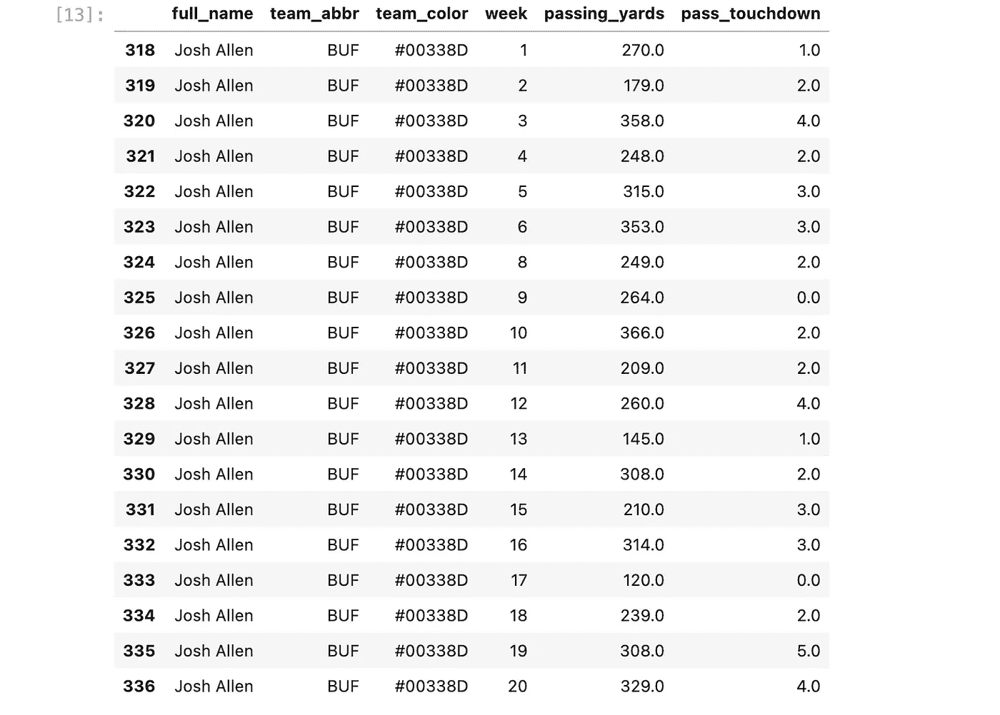
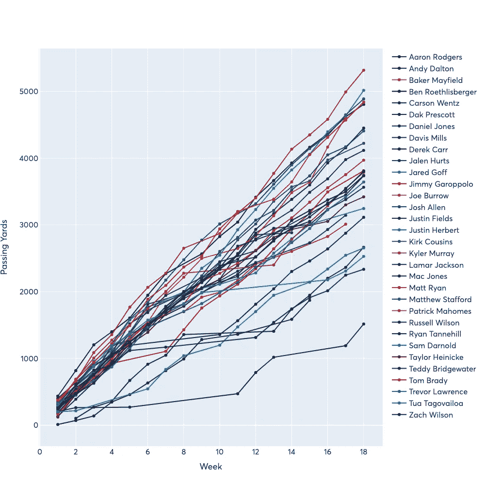
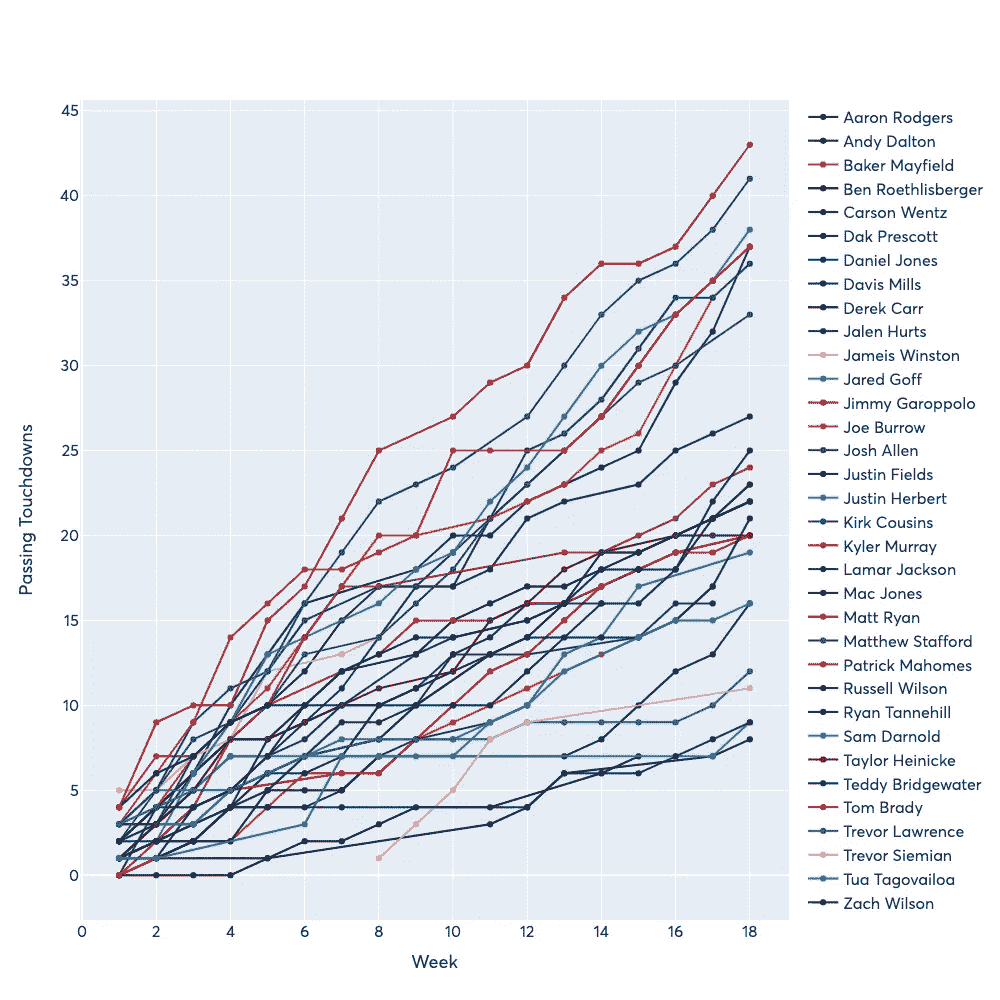

# 用 nfl-data-py 和 Plotly 分析和绘制 NFL 数据

> 原文：<https://towardsdatascience.com/analyzing-and-plotting-nfl-data-with-nflfastpy-and-plotly-a170a09cad6>

## 使用 nfl-data-py 从 NFL 比赛数据中创建可视化


照片由[纳文·文卡特桑](https://unsplash.com/@naveenv92?utm_source=medium&utm_medium=referral)在 [Unsplash](https://unsplash.com?utm_source=medium&utm_medium=referral) 上拍摄

我是旧金山 49 人队的超级粉丝，也是数据可视化的爱好者，所以我一直在寻找机会将体育数据与数据科学和分析相结合。对我们来说幸运的是，有一个名为`nfl_data_py`的很棒的 Python 包，它允许我们提取 NFL 的详细数据并进行分析。在这篇文章中，我将使用`nfl_data_py`引入数据，并使用`plotly`创建两个传球码和达阵的可视化。

## 获取详细数据

开始之前，我们需要确保我们有分析所需的包。

```
pip install pandas plotly nfl_data_py
```

现在，让我们导入我们的包并加载 2021–22 NFL 赛季的三个数据集:详细比赛数据、花名册数据和球队信息。

```
# import packages
import pandas as pd
import plotly.graph_objects as go
import nfl_data_py as nfl# load data
df_2021 = nfl.import_pbp_data([2021])
df_players = nfl.import_rosters([2021])
df_teams = nfl.import_team_desc()
```

我们已经加载到`df_2021`中的数据包含了来自 NFL API 的极其丰富的详细数据。举个例子，让我们打印出数据集中的列:

```
# print columns
df_2021.columns>> Index(['play_id', 'game_id', 'old_game_id', 'home_team', 'away_team',
       'season_type', 'week', 'posteam', 'posteam_type', 'defteam',
       ...
       'out_of_bounds', 'home_opening_kickoff', 'qb_epa', 'xyac_epa',
       'xyac_mean_yardage', 'xyac_median_yardage', 'xyac_success', 'xyac_fd',
       'xpass', 'pass_oe'],
      dtype='object', length=372)
```

我们每部戏都有 372 个独特的栏目！数量如此之多，以至于在默认情况下不会全部打印出来-有了这个数据集，您可以进行的分析的可能性基本上是无限的。在这篇文章中，我们将检查传球码和达阵，所以我们必须先用`pandas`做一点过滤，以得到我们想要的数据帧形式。

## 过滤数据以传递播放

首先，当前的逐场比赛数据帧包含了常规赛和季后赛的所有比赛，所以我们将只过滤常规赛的比赛。

```
# filter to regular season
df_2021 = df_2021[df_2021["season_type"] == "REG"]
```

我们必须处理的下一个微妙之处是过滤掉任何两点转换，因为这些码对整体统计数据没有贡献。幸运的是，有一个名为`two_point_attempt`的布尔列，我们可以直接使用它来完成这项工作。

```
# remove two point attempts
df_2021 = df_2021[df_2021["two_point_attempt"] == False]
```

现在，自然地，由于我们对传球统计感兴趣，我们可以额外过滤掉传球。同样，我们有一个名为`play_type`的键，可以用来过滤传球。希望现在你开始看到`nfl_data_py`向我们展示的高粒度的力量。

```
# filter to pass plays
df_2021 = df_2021[df_2021["play_type"] == "pass"]
```

我们现在应该有了所有感兴趣的剧本供我们分析。现在，我们需要将过滤后的数据帧与花名册和球队数据连接起来，为我们的绘图获取球员姓名和球队颜色。

## 获取球员姓名和球队颜色

由`import_pbp_data([2021])`返回的数据不包括任何玩家名字，但是我们有玩家 id 的列。此外，我们为传球、抢球和接球的球员 id 设置了单独的列，这样我们可以更好地控制从花名册中提取的球员姓名。在这种情况下，因为我们正在进行传递分析，所以我们将使用列`passer_player_id`。

在我们加载的玩家表中，我们看到有以下几列:

```
df_players.columns>> Index(['season', 'team', 'position', 'depth_chart_position', 'jersey_number',
       'status', 'player_name', 'first_name', 'last_name', 'birth_date',
       'height', 'weight', 'college', 'player_id', 'espn_id', 'sportradar_id',
       'yahoo_id', 'rotowire_id', 'pff_id', 'pfr_id', 'fantasy_data_id',
       'sleeper_id', 'years_exp', 'headshot_url', 'ngs_position', 'week',
       'game_type', 'status_description_abbr', 'football_name', 'esb_id',
       'gsis_it_id', 'smart_id', 'entry_year', 'rookie_year', 'draft_club',
       'draft_number'],
      dtype='object')
```

我们看到我们可以得到感兴趣的球员的`player_name`。对于玩家 ID，我们将加入到`player_id`栏中以获得正确的匹配。

```
# join with the roster table to get player names
df_2021 = df_2021.merge(df_players[["player_id", "player_name"]], left_on="passer_player_id", right_on="player_id")
```

为了确保我们的连接有效，让我们检查一下`player_name` 的值现在是否出现在我们的原始数据帧中。

```
df_2021["player_name"].unique()>> array(['Ryan Tannehill', 'Kyler Murray', 'Matthias Farley', 'Derek Carr',
       'Lamar Jackson', 'Andy Dalton', 'Justin Fields',
       'Matthew Stafford', 'Baker Mayfield', 'Patrick Mahomes',
       'Tom Brady', 'Dak Prescott', 'Daniel Jones', 'Teddy Bridgewater',
       'Jameis Winston', 'Aaron Rodgers', 'Taysom Hill', 'Jordan Love',
       'Tyrod Taylor', 'Trevor Lawrence', 'Justin Herbert',
       'Ryan Fitzpatrick', 'Taylor Heinicke', 'Mac Jones',
       'Tua Tagovailoa', 'Kirk Cousins', 'Joe Burrow', 'Justin Jefferson',
       'Zach Wilson', 'Sam Darnold', 'Matt Ryan', 'Jalen Hurts',
       'Josh Allen', 'Ben Roethlisberger', 'Carson Wentz',
       'Russell Wilson', 'Jared Goff', 'Jimmy Garoppolo', 'Trey Lance',
       'Josh Rosen', 'Jacoby Brissett', 'Davis Mills', 'Jacob Eason',
       'Greg Ward', "D'Andre Swift", 'Mitchell Trubisky', 'Drew Lock',
       'Ty Long', 'Jakobi Meyers', 'Geno Smith', 'Blaine Gabbert',
       'Kadarius Toney', 'Mike Glennon', 'Cedrick Wilson',
       'Cordarrelle Patterson', 'Case Keenum', 'Dawson Knox',
       'Brandon Allen', 'John Wolford', 'Dante Pettis', 'Phillip Walker',
       'Tyler Huntley', 'Jack Fox', 'Derrick Henry', 'Chad Henne',
       'Kendrick Bourne', 'Mike White', 'Brian Hoyer', 'Tyler Boyd',
       'Josh Johnson', 'Jamison Crowder', 'Cooper Rush', 'Rex Burkhead',
       'Cole Beasley', 'Gardner Minshew', 'David Blough', 'Chris Boswell',
       'Trevor Siemian', 'Leonard Fournette', 'A.J. Brown', 'Colt McCoy',
       'Christian Kirk', 'C.J. Beathard', 'Danny Amendola',
       'Ezekiel Elliott', 'Albert Wilson', 'Joe Flacco', 'Cam Newton',
       'Chris Streveler', 'Mason Rudolph', 'Tommy Townsend',
       'Johnny Hekker', 'Tim Boyle', 'Feleipe Franks', 'Blake Gillikin',
       'Jarvis Landry', 'Cooper Kupp', 'Andy Lee', 'Keenan Allen',
       'Kyle Allen', 'Riley Dixon', 'Deebo Samuel', 'Jake Fromm',
       'Nick Mullens', 'Keelan Cole', 'Garrett Gilbert', 'Nick Foles',
       'Ian Book', 'Chris Banjo', 'Stefon Diggs', 'Brett Rypien',
       'Kendall Hinton', 'Marcus Mariota', 'Mike Gesicki', 'Sean Mannion',
       'Kellen Mond', 'David Montgomery', 'Brandon Zylstra',
       'Tom Kennedy', 'Courtland Sutton', 'Sam Koch', 'Odell Beckham',
       'Travis Kelce', 'Bryan Anger', 'Joe Mixon'], dtype=object)
```

因此，我们现在有了 2021-22 NFL 赛季期间与传球相关联的所有球员姓名。我们已经完成了大部分——我们还想获得每个玩家的团队颜色，这样我们在绘图时就有了一个调色板。为此，我们可以使用我们也加载的 teams 数据集，它有一个名为`team_color`的列。就我们将用于加入的键而言，我们可以使用逐场比赛数据中的列`posteam`,它对应于比赛开始时拥有的球队。这是有道理的，因为传球的球队自然是控球的球队。teams 表中对应的键是`team_abbr`。因此，使用这些信息，我们可以加入提取团队的颜色。

```
# join with team table to get team color for plot
df_2021 = df_2021.merge(df_teams[["team_abbr", "team_color"]], left_on="posteam", right_on="team_abbr")
```

我们现在拥有了绘制图表所需的一切—首先我们必须进行汇总，然后我们可以自由绘制数据。

## 聚合和绘图

我们想要创建的两个图将是球员传球码数和触地得分的累计总和。为了做到这一点，我们必须首先做一个汇总—我们当前的表只是一堆单独的游戏，但我们希望按周和按玩家得到总数。对于`pandas`中的`groupby()`和`agg`来说，这是一个完美的用例，我们可以很容易地做到如下:

```
# get total passing yards and touchdowns by week
df_agg = (
    df_2021.groupby(["player_name", "team_abbr", "team_color", "week"], as_index=False)
    .agg({"passing_yards": "sum", "pass_touchdown": "sum"})
)
```

如果我们过滤到特定的玩家，让我们看看我们的牌桌是什么样的:

```
df_agg[df_agg["player_name"] == "Josh Allen"]
```



图一。乔希·艾伦的每周统计——由作者提供的数据

现在我们有了每周的总数(还没有累计，但是我们以后会处理)，所以我们可以开始绘图了。

让我们首先绘制我们的传球码——为了做到这一点，我们将按球员姓名分组，然后在`plotly`中将每个单独的组绘制为一条新的轨迹。我以前的一篇文章更详细地介绍了我们如何获得这些代码，所以如果你有任何问题，我可以参考一下。此外，我将只过滤总共投掷了> 1500 码的玩家。通过在绘图时使用`cumsum()`,我也将得到我想要的累计总数。

```
fig = go.Figure()for name, values in df_agg.groupby("player_name"):
    if values["passing_yards"].sum() > 1500:
        fig.add_trace(
            go.Scatter(
                x=values["week"], 
                y=values["passing_yards"].cumsum(), 
                name=name, 
                mode="markers+lines", 
                line_color=values.iloc[0].team_color,
                hovertemplate=f"<b>{name}</b><br>%{{y}} yds through week %{{x}}<extra></extra>"
            )
        )

fig.update_layout(
    font_family="Averta, sans-serif",
    hoverlabel_font_family="Averta, sans-serif",
    xaxis_title_text="Week",
    xaxis_title_font_size=18,
    xaxis_tickfont_size=16,
    yaxis_title_text="Passing Yards",
    yaxis_title_font_size=18,
    yaxis_tickfont_size=16,
    hoverlabel_font_size=16,
    legend_font_size=16,
    height=1000,
    width=1000
)

fig.show()
```



图二。2021-22 NFL 赛季期间累积传球码数-作者数据

现在，我们可以使用类似的代码来传递触地得分，并获得一个累积图。



图 3。2021-22 NFL 赛季累计传球触地得分-作者数据

它们就在那里——你可以看到获取 NFL 的比赛数据并进行很酷的数据分析和可视化是多么简单！

如果你想看看我用`nfl_data_py`制作的其他信息图，你可以看看这个 [GitHub 库](https://github.com/venkatesannaveen/nfl-infographics)。

## 结论

我希望这篇文章有助于介绍如何使用`nfl_data_py`处理 NFL 的比赛数据，并进行分析和可视化。用于生成本文中所有代码的笔记本可以在这个 [GitHub 资源库](https://github.com/venkatesannaveen/medium-articles)中找到。如果想了解更多更新，也可以在 [Twitter](https://twitter.com/naveenv_92) 和 [LinkedIn](https://www.linkedin.com/in/naveenvenkatesan) 关注我。

## 参考

[1][https://github.com/cooperdff/nfl_data_py](https://github.com/cooperdff/nfl_data_py)