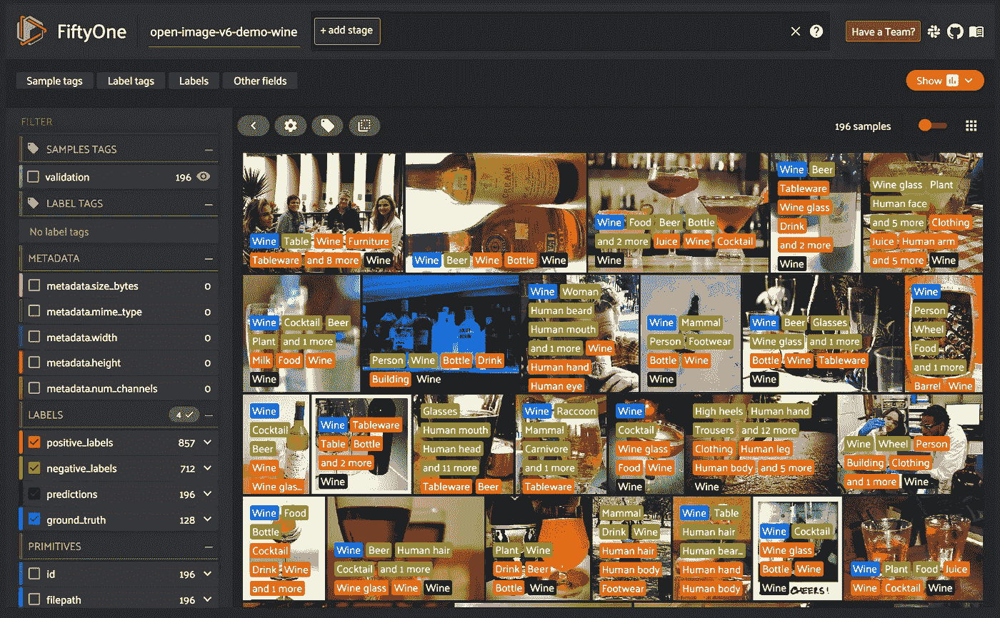
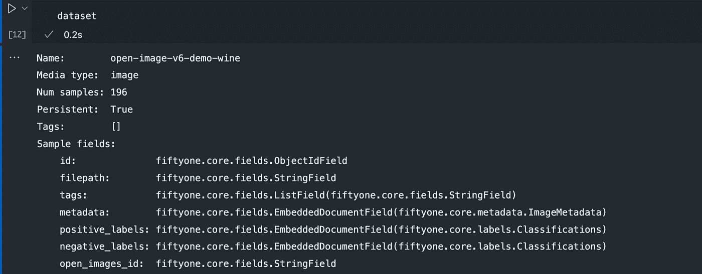
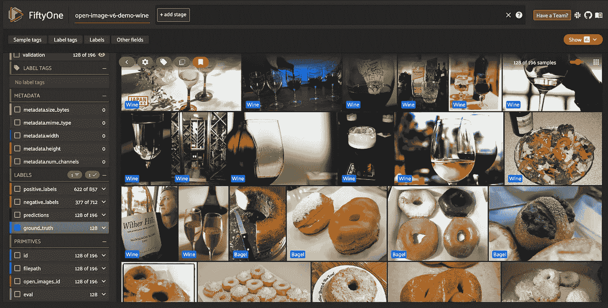
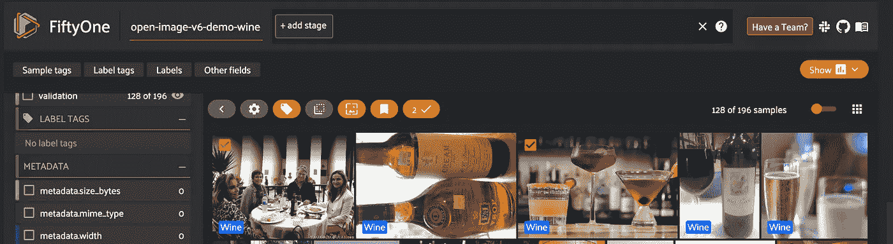
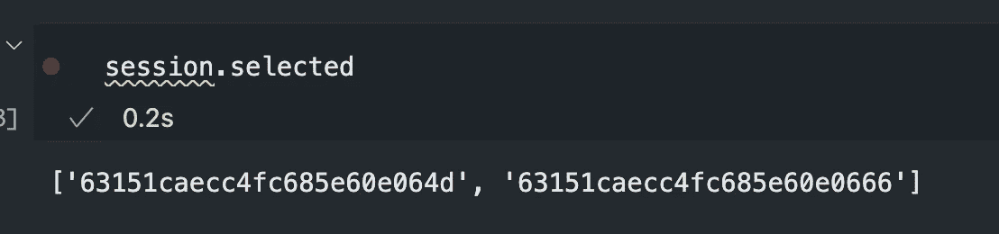
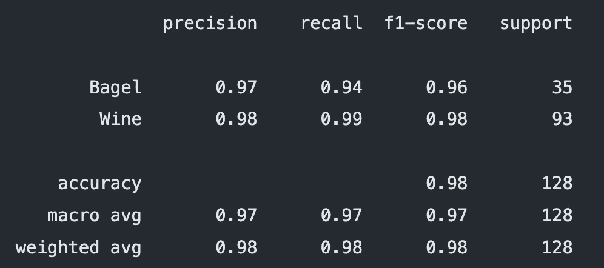
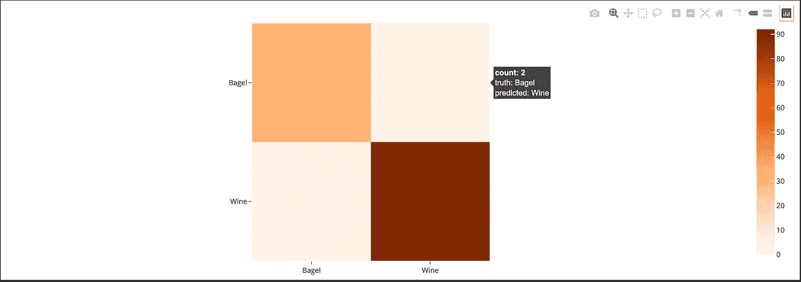
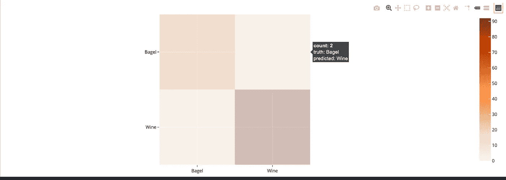
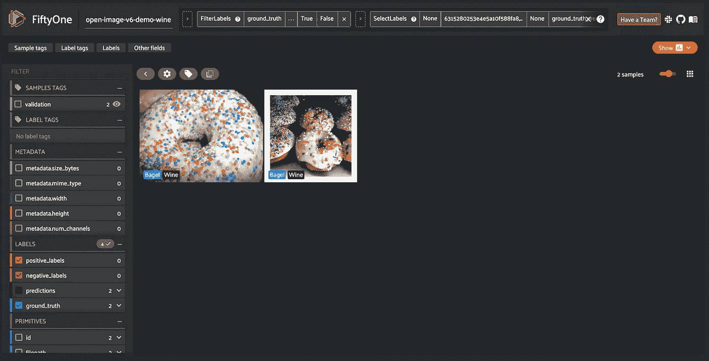
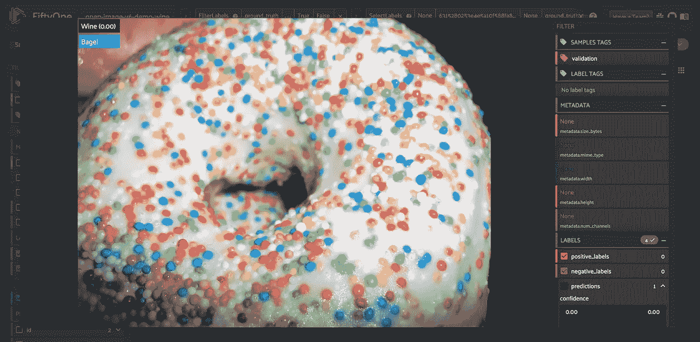

# 像专家一样分析计算机视觉模型的性能

> 原文：<https://towardsdatascience.com/analyzing-computer-vision-model-performance-like-a-pro-dbb3e3e92b64>

## 了解用于分析计算机视觉模型的强大工具 FiftyOne

在 [Unsplash](https://unsplash.com?utm_source=medium&utm_medium=referral) 上由 [Rohan Makhecha](https://unsplash.com/@rohanmakhecha?utm_source=medium&utm_medium=referral) 拍摄的照片

我叫 Manpreet，是一名深度学习/计算机视觉研究工程师。我在使用各种深度学习架构完成计算机视觉任务方面有丰富的经验，如分类、对象检测、跟踪、分割等。这些年来，我开发了自己的代码来分析这些模型的性能。然而，如果通过保存在不同文件夹中的文本覆盖图像来完成，图像的初始数据探索阶段和训练后性能分析可能会很慢。我最近了解到一个由 Voxel51 开发的名为[五十一](https://voxel51.com/docs/fiftyone/)的令人难以置信的工具，我爱上了它。我怎么推荐它在你的工作或研究中使用都不为过。在这篇博文中，我将解释如何使用该工具进行图像分类。

# 介绍

FiftyOne 是一款开源工具，为数据集标注和计算机视觉模型分析提供了强大的图形界面。“提高数据质量和了解模型的故障模式是提升模型性能的最有效方法。”[1]拥有一个标准化的工具极大地加速和简化了数据和模型质量分析过程。成为一个开源项目是一件好事。该工具的官方文档写得非常漂亮，可从以下网址获得:

[51—51 0 . 16 . 5 文件](https://voxel51.com/docs/fiftyone/)。该工具既可以作为独立的应用程序运行，也可以从您的 Jupyter 笔记本中运行。

来源:作者

# **第五十一次安装【1】**

要安装 51，您可以使用 pip。使用以下命令创建一个名为 fo 的 conda 环境，然后使用 pip 安装第五十一个库。[注意:对于装有 M1 芯片的 MacBooks，您需要手动设置 MongoDB 后端，因为捆绑的 DB 安装不能开箱即用。可以在这里了解:[https://voxel 51 . com/docs/fifty one/getting _ started/install . html #疑难解答](https://voxel51.com/docs/fiftyone/getting_started/install.html#troubleshooting)。

如果一切正常，你应该能够加载 python 中的包。接下来我们将看看 51 的两个基本核心类。

# 五十一个数据集和样本[2]

**1。Dataset** :这个类是 fiftyone 的核心，具有强大的功能来表示数据，并使用 python 库和 fiftyone UI 来操作数据。您可以加载、修改、可视化和评估数据以及标签(分类、检测等。)[2]即使您有未标记的数据，初始探索阶段也可以在 51 应用程序中完成。它还集成了 CVAT 和其他标签平台。数据集是为检索分配了唯一 id 的样本类的有序集合。可以使用下面的代码实例化一个名为“emotion-dataset”的空数据集。

**2。Sample** : Dataset 由存储与任何给定数据样本相关的信息的样本类对象组成。每个样本都有一个文件路径作为必填字段。除此之外，您可以添加任意多的关键字字段，只要所有样本的数据类型一致。让我们看看下面的例子。

这将创建一个具有 filepath 和 ground_truth 字段的示例。注意，对于整个数据集，ground_truth 需要是字符串类名。如果你想使用整数，你必须对整个数据集保持一致。
向数据集添加样本相当容易。

# 方法学

对于本教程，我将使用 51 库从 [Open Images v6 数据集](https://storage.googleapis.com/openimages/web/index.html)下载两个类【Wine，Bagel】。根据 open images 网站，使用 51 库是下载数据的推荐方法。

下面的代码将从验证分割中下载 Wine 和 Bagel 类的图像，并将它们注册在 open-image-v6-demo 名称下。我们已经指定 label_types 作为分类，因为对于本教程，我们将不使用检测注释。

此时，我们有一个数据集，其中填充了 positive_labels 和 negative label 字段以及其他一些字段。

来源:作者

但是对于我们的示例评估，我们需要创建一个包含 fo 的 ground_truth 字段。分类对象。下面的代码将把 ground_truth 添加到所有感兴趣的相关样本中。我们首先基于葡萄酒的 positive_labels 字段过滤数据集，然后向其中添加 ground_truth。这里需要注意的是，您需要对每个样本调用 save 方法，以便将更改反映到数据库中。如果为一个样本创建了一个新字段，所有其他样本将使用默认值 None 填充该字段。这样，我们就为数据集创建了 Wine 和 Bagel ground_truth 标签。

此时，您可以启动 fiftyone 应用程序，并开始查看下载的数据集。下面的代码将启动一个会话，并让您查看数据。

有几个你应该熟悉的 UI 元素。阅读这一页应该可以帮助你做到这一点:[https://voxel51.com/docs/fiftyone/user_guide/app.html](https://voxel51.com/docs/fiftyone/user_guide/app.html)

来源:作者

您可以快速滚动数据集并分析标签是否有意义。如果有任何错误的样本，您可以通过将鼠标悬停在图像上并选择复选框(或打开图像然后选择它)来选择它们。

来源:作者

所有选中的图像都可以被标记以过滤掉。或者您可以使用 session.selected 属性访问选定的图像。这将为您提供所有选定样本的唯一 id。然后可以用来处理这些样本。

来源:作者

现在，我们需要使用一个模型将预测添加到我们的数据集中。Imagenet 有三个名为“红酒”、“酒瓶”和“面包圈”的类，可用于我们从开放图像数据集中下载的样本。我们将使用预先训练的模型对数据集执行预测，然后进行评估。我选择了在 imagenet 数据集上预先训练的 densenet169 (PyTorch)模型。

此代码将向样本添加一个带有分类结果的预测标签字段。但是，它会将 argmax 类标签和置信度分配给来自 1000 个 imagenet 类的样本。对于我们的用例，我们只想要与葡萄酒和百吉饼类别相关的那些。我们也通过指定 store_logits=True 在预测字段中存储逻辑信息。接下来，我们为我们感兴趣的类找到相关的类索引。

现在，我们对数据集进行迭代，并根据 open image downloader 生成的 positive_labels 中的可用数据分配正确的 ground_truth 值。我们通过添加“红酒”和“酒杯”的 softmax 值和 bagel _ conficence 作为 bagel softmax 值来创建 wine_confidence。基于哪个置信度更大来分配预测标签。

现在，我们已经在数据集中做好了一切准备来进行评估。

# 51 用于性能评估

一旦为数据集中所有感兴趣的样本注册了 ground_truth 和预测，评估就会非常快。对于分类，我们可以查看分类报告和混淆矩阵来进行分析。

我们过滤数据集，只选择带有葡萄酒或百吉饼标签的基本事实。然后使用这个过滤后的视图，我们运行 evaluate_classifications 方法。我们指定预测和 ground_truth 字段名称以及 eval 键。这将计算 sklearn 风格分类报告以及混淆矩阵。

要查看分类报告，我们可以简单地使用 print_report 方法。

来源:作者

我总是查看分类报告，以立即深入了解模型在班级级别的表现。在类别严重失衡的数据集中，精度值可能会产生误导。但是，精确度、召回率和 f1 分数值显示了更真实的性能情况。看着这份报告，你可以立即挑选出哪些班级表现良好，哪些表现不佳。

其次，混淆矩阵是分析分类器性能的另一个强有力的工具。使用 ClassificationResults 结果对象创建混淆矩阵。您可以使用 plot_confusion_matrix 方法创建壮观的交互式热图对象。然后，可以将该图附加到会话中，以提供交互式体验。下面的代码创建一个混淆矩阵并附加到会话中。

您可以将鼠标悬停在矩阵中的每个单元格上，以查看总计数、基本事实标签和预测标签。

来源:作者

您还可以选择单个单元格或单元格组来动态过滤 UI 中的样本，以便只显示属于混淆矩阵中特定单元格的示例。这使得分析假阳性、假阴性和错误分类变得轻而易举！

例如，如果我们想看到被错误归类为葡萄酒的百吉饼，我们只需点击右上角的单元格。

来源:作者

来源:作者

上图显示了点击混淆矩阵右上角单元格后的过滤视图。使用 51 工具查找硬样本或发现错误注释是如此方便。

访问这些样本非常简单。我点击了其中一张图片，观察到 UI 上显示的置信度为 0.00。悬停在详细浮动窗口中的标签上时，它显示置信度为 0.002。

来源:作者

但是，如果我们想以编程方式查看视图中的所有样本或某些选定样本的细节，我们可以轻松地做到这一点。

这些样本可用于发现错误预测中的趋势和模式，并可用于获取新的训练数据来解决这些问题。

# 结论

总之，我们查看了 fiftyone 库，这是一个用于分析模型性能的开源工具。我们学习了数据集、样本和 51 应用程序。接下来，我们从开放图像数据集[3]创建了一个数据集，并使用在 imagenet 数据集[4]上预先训练的 densenet 模型计算预测。我们还了解了如何创建分类报告和混淆矩阵。《五十一》中的混乱矩阵图是一个交互式的图。我们学习了如何将图附加到 51 个会话，并交互地过滤样本以分析错误的预测。我几乎没有触及这个工具的表面。还有其他几个可用的特性，我可能会在以后的帖子中介绍其中的一些。但是，欢迎您阅读他们的文档。最后，感谢您阅读文章！希望你觉得有用，学到了新东西。关注关于深度学习、机器学习、数据科学、计算机视觉和计算机科学的内容。你可以在 LinkedIn 上联系我:[https://www.linkedin.com/in/msminhas93/](https://www.linkedin.com/in/msminhas93/)

# 参考

[1]https://voxel51.com/docs/fiftyone/

[2]https://voxel51.com/docs/fiftyone/user_guide/basics.html#

[3][https://storage.googleapis.com/openimages/web/download.html](https://storage.googleapis.com/openimages/web/download.html)

[https://www.image-net.org/](https://www.image-net.org/)