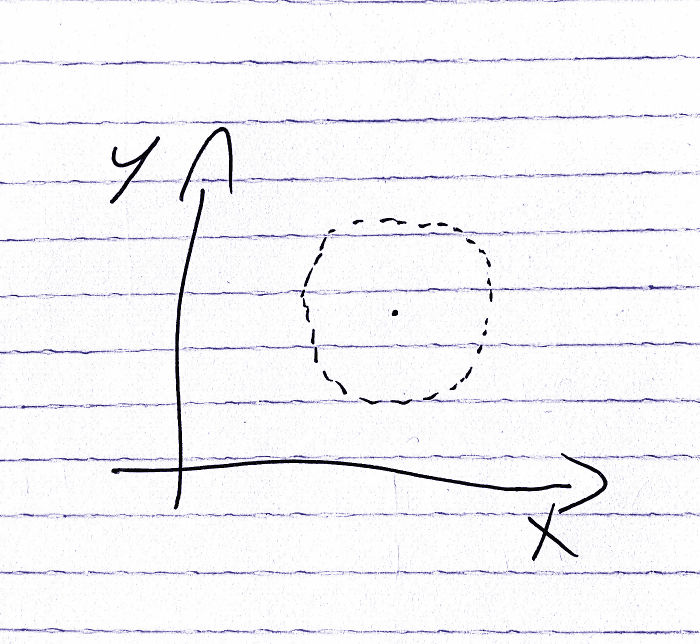
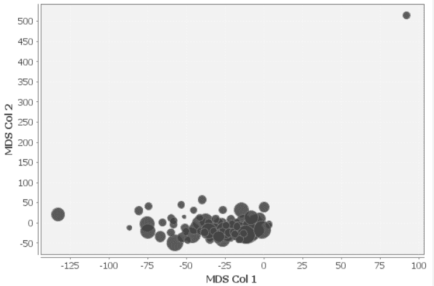
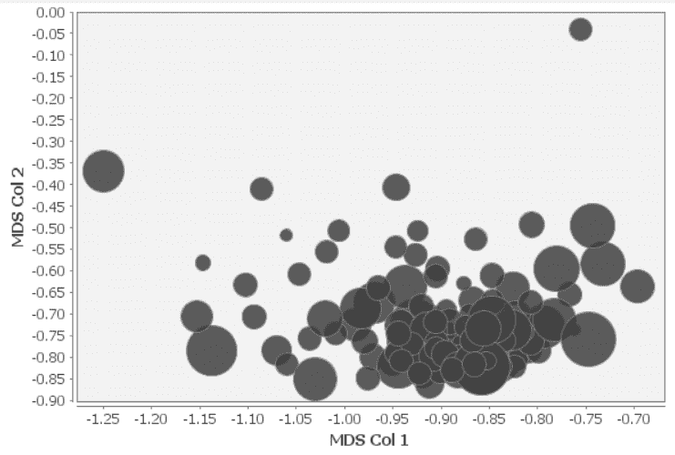
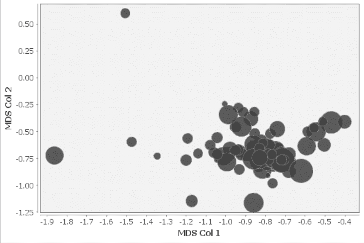

# 利用空间异常检测分析客户状态

> 原文：<https://towardsdatascience.com/analyzing-customers-state-using-spatial-anomaly-detection-d80b5dde99bc>

梅丽莎·沃克·霍恩在 [Unsplash](https://unsplash.com/?utm_source=unsplash&utm_medium=referral&utm_content=creditCopyText) 上的照片

A I 团队经常被要求针对非结构化数据提出见解。例如，考虑客户的状态分析应用程序(哪些客户面临流失风险？谁是潜在的[向上销售者](https://en.wikipedia.org/wiki/Upselling)？).通常未标记的数据将是最可用的相关资源([产品使用](https://mixpanel.com/blog/what-is-product-usage/#:~:text=Product%20usage%20analytics%20is%20the,rather%20than%20a%20subjective%20observation.))、以前的升级、购买记录等..)因此，所使用的算法将是无监督的算法(就像根据客户的原始矩阵对其进行聚类)，但问题是**如何处理这些算法输出**？(类似于预计的客户聚类平面)。一个常见的解决方案是依靠异常检测工具来突出值得观察的异常值。当我们想到异常检测时，我们大多会想到时间序列异常值检测或识别视觉重复模式中的错误等应用程序(如上图所示)。但事实是异常检测要广泛得多，包括许多其他子领域。其中之一是空间异常检测，通常用于此类需求。前面是一些相关的异常检测技术，后面是一个用例脚本示例。

# 空间离群点检测

通常用于流量分析等场景。首先，通过将每个点与其先前的值以及平面中的其他点进行比较(以便找到像阻塞连接这样的一般异常值)。第二，通过将每个点与其“上下文”进行比较(以便找到“局部”异常值；与整体相比是正常的，与它们的邻居相比是异常的)。挑战将是如何决定本地上下文界限；邻居之间的界限在哪里。这样做的目的不仅是为了发现问题，如畸形的交通灯(与整体记录相比以及与同一路口以前的记录相比，这可能会产生极值)，还为了识别局部错误，如有零星交通灯问题的路口、糟糕的道路设计等..整体正常，但与当地环境、相邻连接处相比有些奇怪。

# 多元异常检测

多维值根据每个轴本身可能是正常的，但在组合空间上可能是异常的(下图中的示例)。因此，考虑变量之间的关系也很重要。分析多变量异常时需要考虑的两个重要现象( [Acuna 和 Rodrigez](https://academic.uprm.edu/eacuna/paperout.pdf) ，2004 年)是**掩蔽效应**(当 B 仅在删除 A 后被视为异常值时，异常值 A 掩蔽异常值 B。当少数异常值使均值和协方差偏向异常值时，通常会发生这种情况。 使 B 看起来正常)和**淹没效应**(当 B 仅在异常值 A 存在的情况下被认为是异常值时，异常值 A 淹没异常值 B。当少数异常值使平均值和来自非异常值点的协方差偏离时，通常会发生这种情况，产生从非异常值点到平均值的高距离，这将随着偏离的删除而恢复)。 为了找到多元异常值，我们通常尝试检测距离数据分布中心相对较远的点。一种常见的基于统计的方法是根据需要使用 [**马氏距离**](https://en.wikipedia.org/wiki/Mahalanobis_distance)；使用数据集协方差和均值来推断点属于数据集的概率。较大的 mahalanobis 距离可能表示异常值(通常认为“大”大于 3 个标准差或超出 93%-95%的值范围)。**屏蔽**可以降低点距离，而**交换**可以增加非异常点距离( [Ben-Gal](http://www.eng.tau.ac.il/~bengal/outlier.pdf) ，2005)。这两个问题都可以通过使用中值而不是平均值来解决，给予非异常点更多的权重。多变量异常检测的其他常见方法查看平面结构，依赖于从一个点到其第 n 个最近邻居的距离(高距离=异常值)或通过分析生成的聚类组(点数少的聚类=异常值)。

位于圆心的多元异常值，图片由作者提供

回到开始，让我们假设我们想要分析我们顾客的行为，以便发现值得注意的行为。在下面添加了一个如何做的脚本，其中包含要避免的常见陷阱和一些要考虑的要点。

# 聚类+异常检测

在许多可能的运营(未标注)相关指标中，我们通常会选择**产品** **使用**，假设它是一个重要的客户状态指标(使用不足可能表示流失风险，过度使用可能表示潜在的追加销售机会)。从绘制客户的使用模式开始，将使我们能够快速(手动)识别异常值。比较聚合值(中值、最大值等..)代替原始值可以实现更深层次的可见性，但代价是在聚合过程中丢失了大量数据(同样，可能只有极端值是可见的)。常见的下一步是使用聚类，以便能够进行直接使用(原始、时间序列、值)比较。但是在许多情况下，除了检测明显的小异常集群之外，一般的集群结构不会提供如此多的信息(将大多数客户放在同一个大型集群中)。我们真正寻找的是一种分析客户平面的方法，以确定每个客户如何偏离其他客户。我们的援助方式多种多样。

*在我们继续之前有一个重要的注意事项；聚类一般需要一种距离方法，默认选择会是*<https://en.wikipedia.org/wiki/Euclidean_distance>**。问题是当我们比较时间序列数据时，它可能会突出时区作为一个重要的距离指标，将来自相似时区的客户聚集在一起。隐含假设周末轮班产生最高的距离份额。明智地选择您使用的距离方法，以确保它反映了您想要分析数据平面的方式。考虑预处理数据以避免此类问题。这种可能的解决方案是在对其应用聚类之前，将原始值聚集到每周标准化视图中。**

# *流形+异常检测*

*多种方法有助于将客户的使用价值投影到更低维度的平面中。 [MDS](https://en.wikipedia.org/wiki/Multidimensional_scaling) (多维定标)是多种可能的 Manifold 方法中的一种，搜索*‘其中距离很好地尊重原始高维空间中的距离的数据的低维表示’(*scikit learn)。使用它，我们可以绘制一个 2d 平面，并可视地(手动地)识别似乎偏离其他客户的客户。众所周知，MDS 对极端值很敏感(Blouvshtein 和 Cohen-Or ，2018)，我们可以分阶段进行；对第 1 个异常值发出警报，将其移除并再次计算 MDS，以对下一个第 1 个异常值发出警报，这隐含地使我们能够生成异常值的层次结构。但由于我们不希望依赖手动分析来生成这些洞察，如何实现自动化检测？马哈拉诺比斯距离可以在这里协助我们。*

**我们继续之前的一个重要注意事项；请确保在此步骤之前筛选重复的列。由于 MDS 通常基于欧式距离——所有属性都具有相同的重要性，因此从属属性会受到双重影响(我们可能不愿意考虑这一点)。**

# *流形+马氏+异常检测*

*如前所述，观察 MDS 生成的 2d 平面，我们可以使用 Mahalanobis 自动突出显示相对远离数据分发中心的点。反复这样做(取第 1 个异常值，将其移除，然后再次计算 Mahalanobis)可以帮助我们避免淹没和掩蔽现象，并使我们有一个内部层级(MDS 回合)。但观察这样的常见输出(如下图所示)，极端异常值将主导算法输出，通常它们是具有一些极端异常值的输出。我们需要的是找到一种更好的方法来缩放[归一化](https://en.wikipedia.org/wiki/Normalization_(statistics))我们的数据，以便关注那些不太明显的异常值。*

**我们继续之前的一个重要注意事项；确保在此步骤之前过滤空的(传统客户)向量。原因是空向量将影响均值和协方差，而均值和协方差随后将影响马氏输出，因为马氏高度依赖它们。**

**

*MDS 输出无缩放，图像由作者*

# *流形+马氏+尺度+异常检测*

*基于欧氏距离的 MDS 对属性的尺度敏感；例如，范围为[1，100]的值比范围为[0，1]的值对距离计算的影响更大。并且由于 MDS 任务是在降低数据维度的同时尽可能地保持原点距离，所以所生成的平面将受到更高范围属性的高度影响(因为它们将最有可能支配穿过原点平面的高距离)。最显而易见的直接解决方案是将原始产品使用值标准化，以确保它们在同一尺度上(如下所示)。另一方面，由于简单的归一化将生成所有属性都同样重要的距离测量，如果一些属性比其他属性更重要呢？(即使在时间序列上，周末的极值可能比工作日的极值更重要)。此外，在很多情况下，我们只有很少的使用类型(比如登录和活动记录)，将它们放在一起处理可能会导致误导(不要比较苹果和苹果)。解决方案应该是规格化，同时确保将相似的子属性缩放在一起。*

**

*MDS 输出与一般标准化，由作者图像*

# *流形+马氏+子尺度+异常检测*

*为了保持每个域和每个时间帧的唯一性，一种可能的解决方案是应用子 MDS 归一化，将该过程分成多个步骤；首先计算每种数据类型的 1D MDS(我们仍将面临规模问题，但没关系，因为所有向量都来自同一类型，所以我们希望超大规模异常值保持不变)。然后在[0，1]标度上归一化每个 MDS 分(因为现在所有值都是可比较的，代表相同空间中的点)。最后在子类型 MDS 归一化值的连接表上生成 MDS。结果将是更平滑的投影，其保留了每个子域分析的提示。*

**

*MDS 输出子标准化，由作者图像*

# *流形+聚类+子尺度+异常检测*

*通常，我们不仅想要突出异常值，还要标记它们的潜在聚类。 [EM](https://en.wikipedia.org/wiki/Expectation%E2%80%93maximization_algorithm) (期望最大化)聚类算法可以帮助我们继续我们的自动化分析，因为它会自动找到最佳的聚类数(而像 [kMeans](https://en.wikipedia.org/wiki/K-means_clustering) 这样的算法需要我们使用像[肘方法](https://en.wikipedia.org/wiki/Elbow_method_(clustering))这样的技术来决定合适的聚类数)。使用基于欧几里德距离的 EM，在子缩放阶段之后应用它是有意义的，以确保它更加关注子类型距离与子子类型距离(在子类型距离内，距离的类型可能是不可比的，如登录原始值与适用的操作原始值)。*

# *调谐、调整和监控*

*值得注意的是，许多描述的选择高度依赖于手头的数据；例如，如果只有一种使用类型可用，那么子缩放就不那么重要了。在某些情况下，我们希望用其他距离方法替换欧几里德距离，或者在计算距离之前应用一些数据准备(如使用窗口平滑原始值[)。确保探索和技巧，即插即用，以确保您找到最适合您的配置。同样重要的是，确保您保留生成的见解反馈，假设它可能是您的下一个开发标签数据，从而实现向监督模型的](https://online.stat.psu.edu/stat510/lesson/5/5.2)[转移](/question-pivoting-handling-unachievable-ai-tasks-6e715cb12026)。*