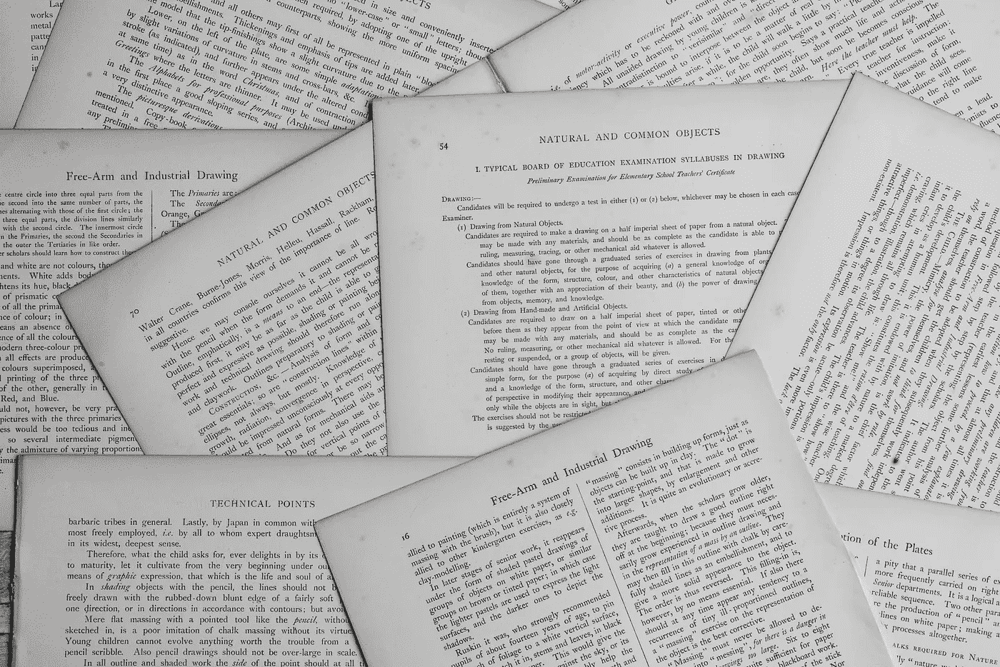
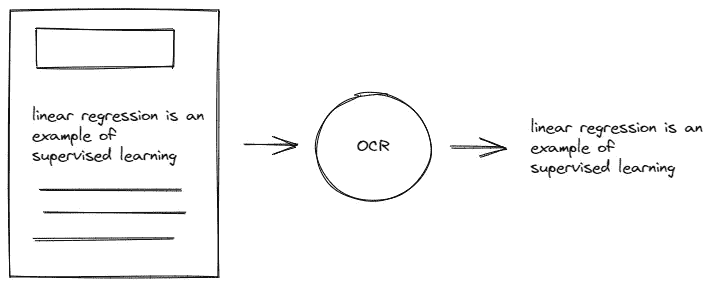
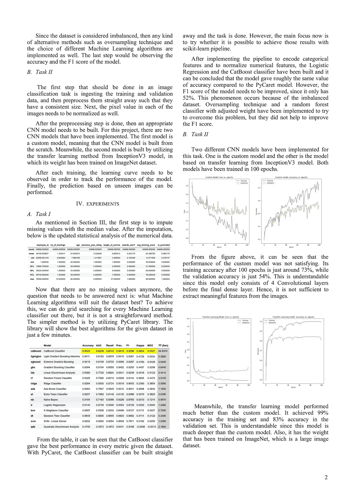
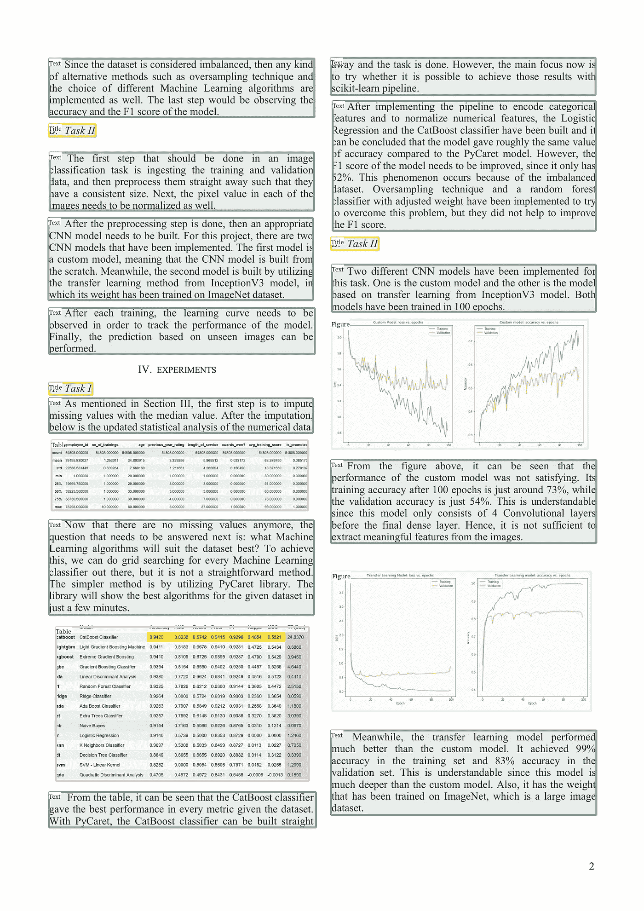
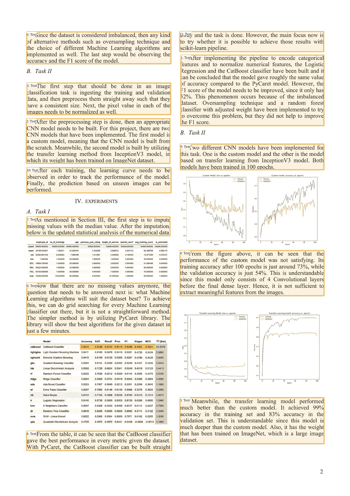
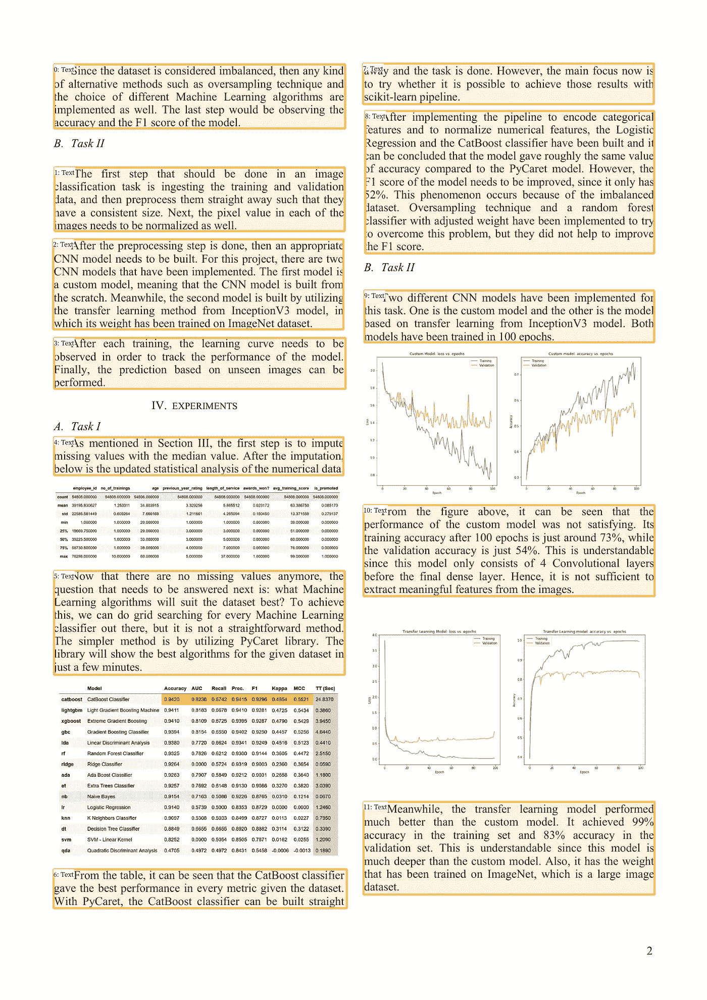
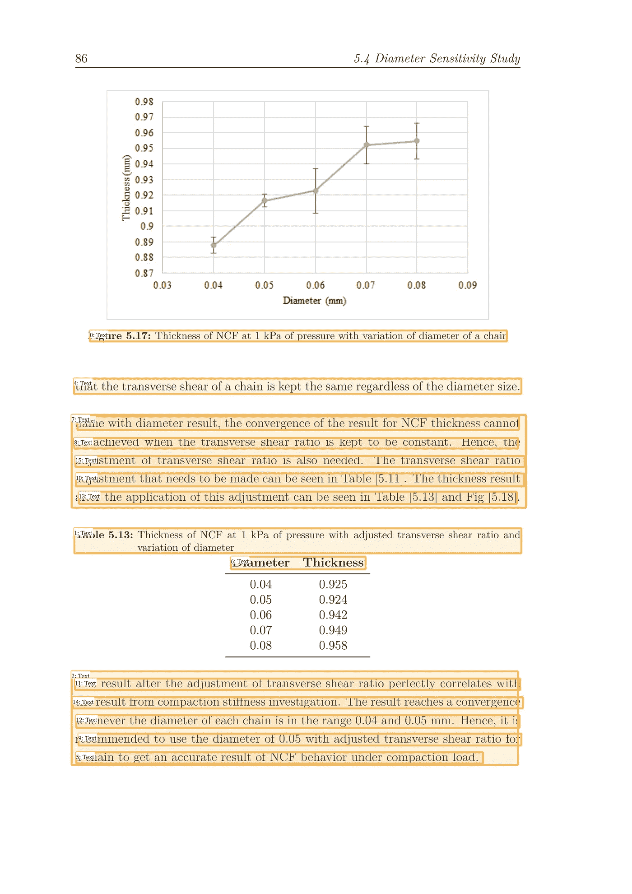
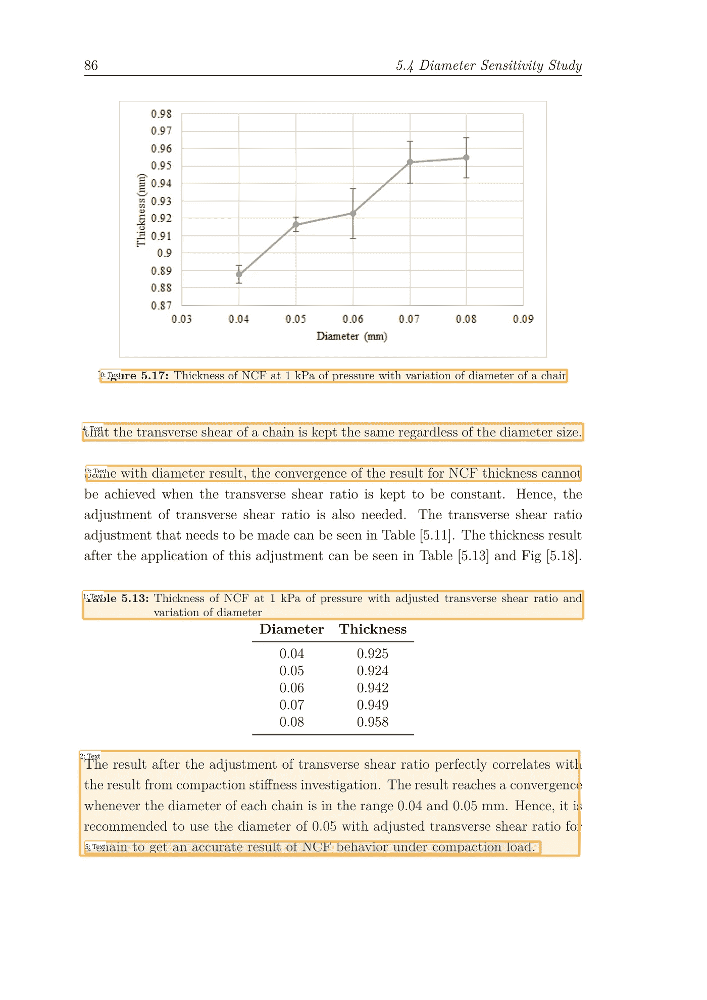
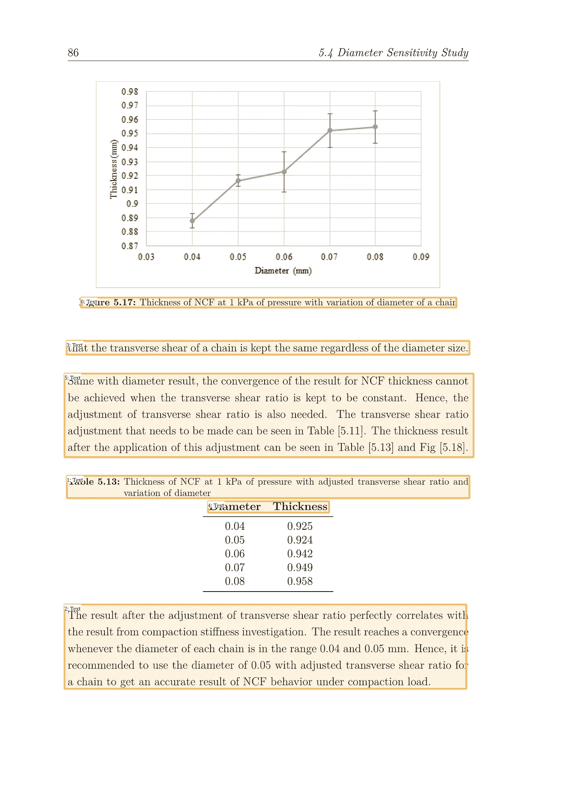
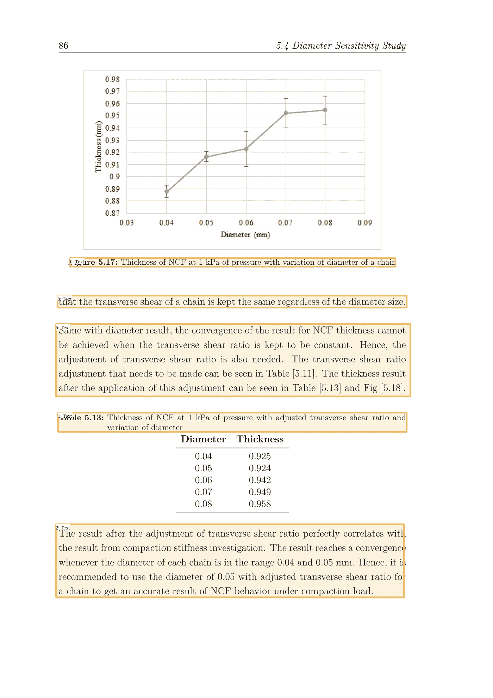

# 使用 LayoutParser 分析文档布局

> 原文：<https://towardsdatascience.com/analyzing-document-layout-with-layoutparser-ed24d85f1d44>

# 使用 LayoutParser 分析文档布局

## 如何使用 LayoutParser 库检测布局并从文档图像中提取文本



安妮·斯普拉特在 [Unsplash](https://unsplash.com/s/photos/document?utm_source=unsplash&utm_medium=referral&utm_content=creditCopyText) 上的照片

自然语言处理的应用经常需要我们从输入文档中提取文本作为先决条件。

问题是，有时我们需要做额外的工作来从输入文档中提取文本，因为它们通常是 PDF、JPEG 或 PNG 格式的。而这就是我们通常使用 OCR 引擎的地方。它帮助我们将图像或扫描文档中的书面文本转换为机器可读的文本数据。



作者图片

但是，在使用 OCR 提取文本之前，我们需要注意一个问题。有时，我们的输入文档不仅包含一堆文本，还包含一个标题、一个图像和一个表格，如下所示:



作者图片

假设对于我们的用例，我们只想从上面输入文档的每一段中提取文本。这意味着我们希望省略表格、标题和图像区域中的文本。

但是我们怎么做呢？在使用 OCR 之前，我们需要在这里对输入文档的每个部分进行分类。我们将使用 LayoutParser 来完成这项工作。

# 什么是 LayoutParser？

[LayoutParser](https://github.com/Layout-Parser/layout-parser) 是一个 Python 库，它提供了广泛的预训练深度学习模型来检测文档图像的布局。

使用 LayoutParser 的好处是它真的很容易实现。您实际上只需要几行代码就可以检测到文档图像的布局。我们将在下一节中看到这些步骤。

有了 LayoutParser，你可以利用一些预先训练好的深度学习模型，这些模型已经在各种数据集上进行了训练，比如[publilaynet](https://developer.ibm.com/exchanges/data/all/publaynet/)、 [HJDataset](https://dell-research-harvard.github.io/HJDataset/) 、 [PrimaLayout](https://www.primaresearch.org/dataset/) 、[报纸导航器](https://news-navigator.labs.loc.gov/)和 [TableBank](https://doc-analysis.github.io/tablebank-page/index.html) 。

如果您的文档图像看起来类似于上面提到的任何数据集，那么您将有很好的机会使用 LayoutParser 获得非常好的布局检测结果。

现在让我们直接进入 LayoutParser 实现。

# 使用 LayoutParser 进行布局检测

要使用 LayoutParser 来检测我们的文档图像的布局，我们需要通过 pip install 安装软件包和 Detectron2 模型，如下所示:

```
pip install layoutparser torchvision && pip install "detectron2@git+https://github.com/facebookresearch/detectron2.git@v0.5#egg=detectron2"
```

如果您的文档是 PDF 格式，您需要将其转换为 PNG 文件。要用 Python 进行这种转换，我们可以使用 pdf2img 库。

```
pip install pdf2img
```

我将在本文中用作示例的文档仍然是 PDF 格式的，因此这个 pdf2img 库对于将文档转换为 PNG 文件是必不可少的。我们实际上只需要两行代码就可以做到这一点:

仅此而已。现在我们的文档已经可以用于布局检测了。

LayoutParser 使用基于 Detectron2 的预训练模型(如 fast R-CNN、RetinaNet 和 Mask R-CNN)来检测输入文档的布局。要初始化预训练模型，我们可以执行以下操作:

如您所见，我们在实例化`Detectron2LayoutModel`时提供了三个参数:

*   `model_path`:预训练模型的配置路径。要查看 LayoutParser 当前支持的各种预训练模型及其对应的配置路径，请查看[它们的文档页面](https://layout-parser.readthedocs.io/en/latest/notes/modelzoo.html#model-catalog)。
*   `extra_config`:这是一个可选参数。但是，您可以提供一个来调整 Detectron2 型号的默认配置。在上面的示例中，我们将每个检测到的布局的阈值更改为 0.5。这意味着，如果检测到的布局的置信度低于 0.5，相应的边界框将不会显示。
*   `label_map`:从模型预测的 id 映射到实际的字符串表示。此标签映射取决于您选择的预训练模型以及该模型已训练的数据集。您可以在此页面中看到关于标签映射[的完整信息。](https://layout-parser.readthedocs.io/en/latest/notes/modelzoo.html#model-label-map)

现在我们可以使用`model`中的`detect`方法来检测输入文档的布局，如下所示:

我们基本上完成了。现在如果你打印出`layout_result`里面的内容，你会得到如下结果:

```
Layout(_blocks=[TextBlock(block=Rectangle(x_1=126.12479400634766,       y_1=1335.8980712890625, x_2=806.6560668945312, y_2=1578.486328125), text=None, id=None, type=Text, parent=None, next=None, score=0.9993358254432678),TextBlock(block=Rectangle(x_1=854.9361572265625, y_1=259.9295654296875, x_2=1530.5875244140625, y_2=592.3228149414062), text=None, id=None, type=Text, parent=None, next=None, score=0.9992992877960205),....
```

这基本上是一个由检测到的布局列表组成的对象。在每个检测到的布局中，您会获得以下重要信息:

*   每个检测到的布局的边界框( ***x1，y1，x2，y2*** )的坐标
*   检测到的布局类型(即文本、图像、表格、列表或标题)
*   检测到的布局的 id
*   每个检测到的布局中的文本
*   每个检测到的布局的置信度得分

如果我们想要进一步调整或优化布局检测的结果，所有这些信息都将派上用场，你将在这篇文章的后面看到。

如果您想要可视化布局检测的结果，您可以使用 LayoutParser 中的`draw_box`方法，如下所示:

你会得到下面的视觉效果:



作者图片

假设我们只想检测文本区域并忽略图像和表格区域，那么我们可以使用相应的标签映射来过滤结果:

在过滤过程之后，我们可以再次用`draw_box`方法可视化结果:



作者图片

# 使用 LayoutParser 的 OCR

不仅是布局检测，我们还可以用 LayoutParser 提取每个检测到的布局中的文本。为此，您需要通过 pip install 安装一个附加的依赖项:

```
pip install "layoutparser[ocr]"
```

LayoutParser 目前支持两个 OCR 引擎:Tesseract 和 Google Cloud Vision。在这篇文章中，我们将使用 Tesseract 作为 OCR 引擎，从检测到的布局中提取文本。

如果您使用 Tesseract，那么您可能还需要安装引擎本身。[参考他们的文档](https://tesseract-ocr.github.io/tessdoc/Installation.html)了解如何根据您的平台安装 Tesseract 引擎。

但在此之前，我们需要对检测到的布局的元素 ID 进行排序，因为我们的 OCR 引擎将根据布局的元素 ID 顺序提取文本。从上面的可视化可以看出，检测到的布局的元素 ID 还没有排序。



作者图片

现在我们准备好用 OCR 提取每个检测到的布局的文本。首先，我们需要用 LayoutParser 中的`TesseractAgent`初始化 Tesseract OCR 代理对象。

正如你从上一节已经知道的，我们的`text_blocks`变量基本上是一个带有几个有用信息的`Layout`对象，包括每个检测到的布局内的文本，如下所示:

```
Layout(_blocks=[TextBlock(block=Rectangle(x_1=126.12479400634766,       y_1=1335.8980712890625, x_2=806.6560668945312, y_2=1578.486328125), text=None, id=0, type=Text, parent=None, next=None, score=0.9993358254432678),....
```

但是，如果仔细观察，每个检测到的布局的`text`仍然有一个值`None`。我们将用 Tesseract OCR 将这个`None`值转换成实际的文本。

我们在上面的代码中所做的基本如下:

*   迭代每个检测到的布局
*   在每个检测到的布局中，我们只将原始图像裁剪到该检测到的布局的区域
*   对裁剪的图像执行 OCR
*   将从`None`检测到的每个布局的`text`值设置为 OCR 产生的实际文本

最后，我们可以获取每个检测到的布局的文本，如下所示:

下面我只显示了从前三个文本区域提取的文本:

```
Since the dataset is considered imbalanced, then any kind of alternative methods such as oversampling technique and the choice of different Machine Learning algorithms are implemented as well. The last step would be observing the accuracy and the F1 score of the model.   
--- 
The first step that should be done in an image classification task is ingesting the training and validation data, and then preprocess them straight away such that they have a consistent size. Next, the pixel value in each of the images needs to be normalized as well.   --- 
After the preprocessing step is done, then an appropriate CNN model needs to be built. For this project, there are two CNN models that have been implemented. The first model is a custom model, meaning that the CNN model is built from the scratch. Meanwhile, the second model is built by utilizing the transfer learning method from InceptionV3 model, in which its weight has been trained on ImageNet dataset.
```

就是这样！现在，您可以将输出保存到一个文本文件、一个 CSV 文件中，或者直接对其进行预处理，以将其用作您想要执行的任何 NLP 任务的输入。

# 调整 LayoutParser 的结果

由于 LayoutParser 利用了在特定数据集上训练过的预训练模型，当然，最终的布局检测有时会与我们预期的有一点偏差。

上面的例子工作得很好，因为提供的文档非常类似于 PubLayNet 数据集中的典型科学文档，这是我们选择的模型的训练数据集。

当输入文档的布局略有不同时，假设文档只有一列，而不是典型的两列格式，我们可能会得到稍微不准确的结果。

在本节中，我将向您展示一个布局检测结果略有偏差的示例，以及一种我们如何进行调整以提高结果质量的可能方法。

使用与上一节完全相同的模型配置(阈值 0.5)，我们从一列格式的输入文档中得到以下结果:



作者图片

上述结果有两个问题:

1.  在另一个边界框中有许多冗余的边界框，这对于我们的 OCR 过程来说不是理想的。
2.  文本'*直径厚度*'不应被检测到，因为它是表格区域的一部分。

缓解这些问题的一个可能的方法是在我们初始化模型时增加`extra_config`参数中的阈值。假设我们将它从 0.5 增加到 0.8



作者图片

从上面的结果可以看出，我们在调整阈值的时候是有取舍的。较低的阈值意味着我们会得到很多噪声，而较高的阈值意味着丢失一个或多个文本区域的风险较高。

如果我们不想错过很多文本区域，那么我们可以将阈值设置为一个较低的值(在本例中我们使用 0.5)。然后，我们通过计算一个边界框与另一个边界框的交集(IoU)来移除位于边界框内部的边界框。

上面的代码是这样做的:

*   计算每个边界框相对于另一个边界框的 IoU。
*   如果 IoU 高于某个阈值，那么我们计算两个边界框的面积。
*   将面积较小的边框类型从`Text`更改为`None`
*   最后，我们过滤检测到的布局，只包含类型为`Text`的边界框

这是优化检测到的布局后的结果。



作者图片

现在结果看起来好多了，因为我们已经移除了位于边界框内的边界框。

但是还有一个问题。检测到的带有文本'*直径厚度*'的布局不应该在那里，因为它是表格区域的一部分。移除该布局的一个简单方法是查看其索引，然后将其`type`从`Text`设置为`None`，如下所示:



作者图片

仅此而已。现在，我们可以继续使用 OCR 从每个布局中提取文本，正如您在上一节中看到的那样。

当然，上面的例子只是调整 LayoutParser 结果的许多可能性之一。决定什么方法最适合你的用例，这完全取决于你的创造力。

但是，如果结果对您的数据非常不利，以至于调整输出不再是一个可行的选择，该怎么办呢？

使用 LayoutParser，您实际上可以在自己的定制数据集上训练 LayoutParser 的 model zoo 上可用的模型。为此，你可以[遵循他们的 GitHub 页面](https://github.com/Layout-Parser/layout-model-training)上提到的步骤。

# 结论

LayoutParser 是一个很棒的库，只需几行代码就可以检测文档图像的布局。不仅检测布局，我们还可以用 OCR 提取每个检测到的布局的文本。

根据您的用例，您实际上可以调整或细化 LayoutParser 的布局检测结果。但是，如果结果很差，以至于无法再对其进行调整，则可以在自定义数据集上训练 LayoutParser 上可用的模型。

我希望这篇文章能够帮助您开始探索 LayoutParser！你可以在 [**这本笔记本**](https://github.com/marcellusruben/medium-resources/blob/main/Layout_Parser/layout_parser_ex.ipynb) 里看到这篇文章的代码。