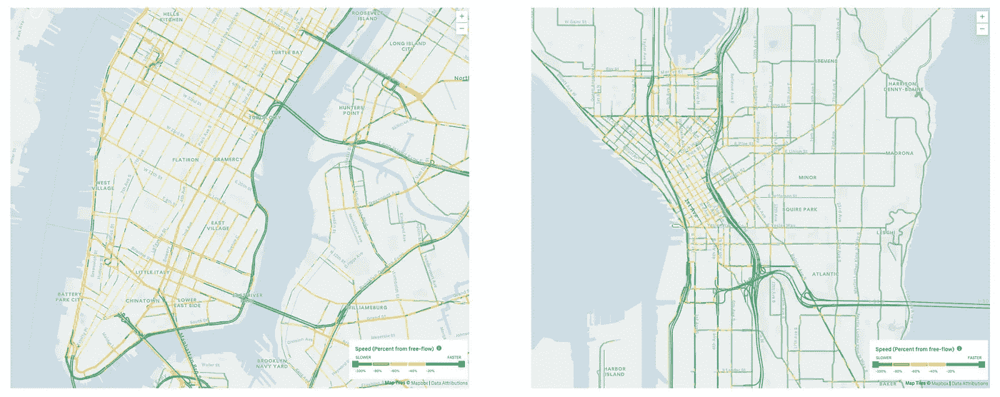
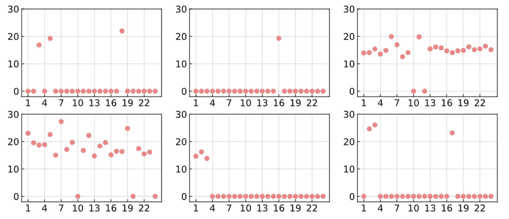
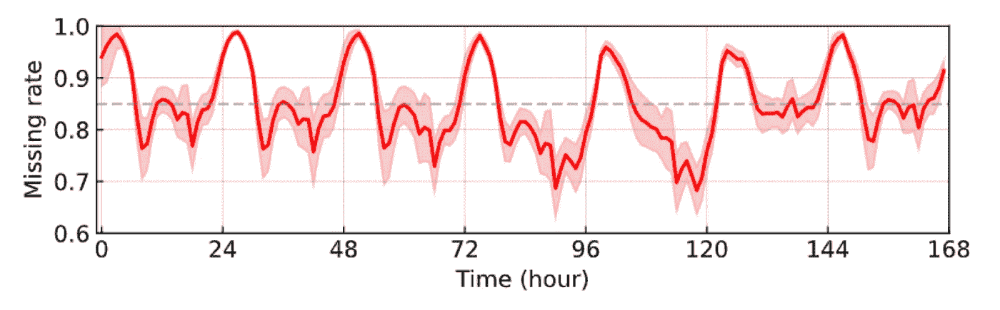
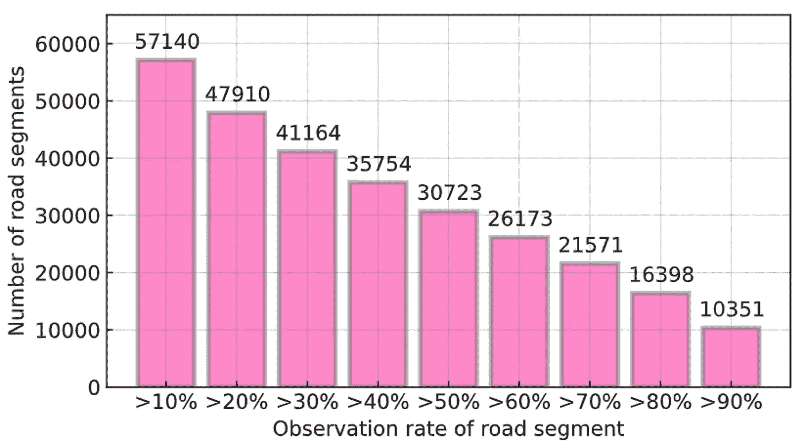
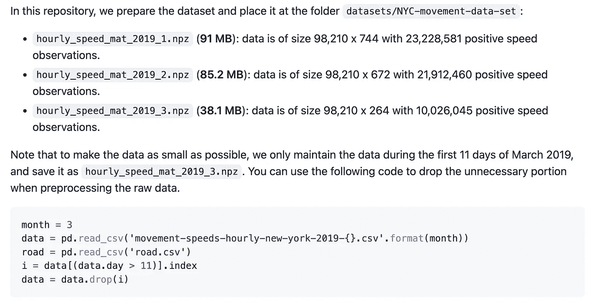
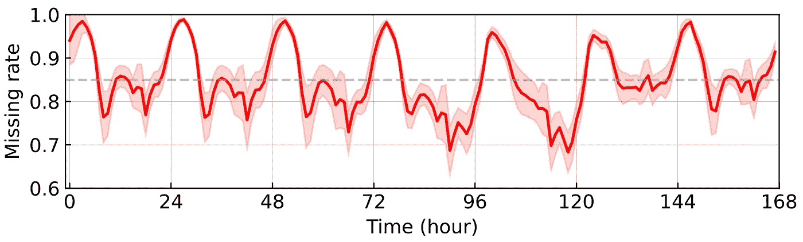

# 优步运动速度数据缺失问题分析

> 原文：<https://towardsdatascience.com/analyzing-missing-data-problem-in-uber-movement-speed-data-208d7a126af5>

## 我们讨论优步运动速度数据，以及如何使用 Python (Pandas & NumPy)对其进行预处理和分析。

> http://movement.uber.com/的优步运动项目为城市更深入地了解和解决城市交通挑战提供了数据和工具。在数据方面，它共享从超过 100 亿次旅行中聚合的匿名数据，以帮助世界各地的城市规划。本帖将介绍一款重要的产品——**speed**——用于时空数据分析。

**鸣谢**:本帖使用移动数据，我们遵循[https://movement.uber.com/faqs](https://movement.uber.com/faqs)的数据使用政策。从 https://movement.uber.com 2022 优步技术有限公司[的优步机芯中检索的数据。](https://movement.uber.com.)

# 优步的移动速度是多少？

优步运动速度数据提供指定月份中每天每小时在给定路段上的平均速度。一个仅包括在该小时内**至少有 5 个独特行程**的路段。它已经覆盖了世界各地的许多城市，包括纽约市、西雅图、伦敦等等。这些数据确实是有 *N* 个路段和 *T* 个小时的多元时间序列。

图 1 显示了某一小时数千个路段的移动速度数据。可以看出，它有助于直观地监控城市道路网的交通状态。特别是，我们可以看到红色路段严重拥堵，而绿色路段畅通。



**图 1** :美国纽约市(左图)和西雅图(右图)的优步移动速度热图。这两张图片都来自优步运动项目。

# 丢失的数据来自哪里？

在现实世界的交通系统中，可以从拼车车辆中收集大量的 GPS 轨迹数据。优步运动速度是城市交通状态监控的数据来源。它从城市道路网络上的大量拼车车辆中收集总的运动速度。然而，由于数据采集机制的瓶颈，即**采样不足**，这种移动传感系统中的数据缺失问题是不可避免的。

例如，在一个路段，如果我们在某个小时内的唯一行程少于 5 次，那么我们就不能合计速度值。这样的例子不是特例，因为在大多数路段，很难保证在某些时间段(例如，非高峰时间)至少有 5 次独特的出行。图 2 显示了速度时间序列的一些例子(收集自 2019 年 1 月 1 日的 6 个路段)。速度值大于 0 表示有效观测，速度值为 0 表示数据缺失。可以看出，在这些例子中有许多缺失的值。



**图 2** :纽约市 2019 年 1 月 1 日(24 小时)6 个路段的移动速度。值为 0 的数据点表示缺少值。

为了说明优步运动速度数据中缺失数据问题的重要性，我们使用了纽约市的一些公开数据进行分析，并用 Python 实现了分析。

# 如何处理数据？

## 下载移动速度数据

1.  打开优步运动项目的下载页面。以纽约市为例，请试着打开 [NYC 优步移动速度数据](https://movement.uber.com/explore/new_york/speeds)。
2.  将产品设置为`speeds`和一个特定的时间段。
3.  下载数据并保存在您的计算机上。

## 提取路段

请下载`movement-speeds-hourly-new-york-2019-1.csv`(2019 年 1 月纽约市运动速度数据文件)。

```
import pandas as pd
import numpy as np

data = pd.read_csv('movement-speeds-hourly-new-york-2019-1.csv')
road = data.drop_duplicates(['osm_way_id', 'osm_start_node_id', 'osm_end_node_id'])
road = road.drop(['year', 'month', 'day', 'hour', 'utc_timestamp', 'segment_id', 'start_junction_id', 
                  'end_junction_id', 'speed_mph_mean', 'speed_mph_stddev'], axis = 1)
road.to_csv('road.csv')
```

在纽约市，优步运动项目覆盖了**98210 个路段**。我们将这些唯一的路段保存在`road.csv`文件中，包括 Openstreetmap 中的路段道路 ID、起始节点 ID、结束节点 ID 等信息。

# 构建速度矩阵

我们使用 Pandas 工具处理原始数据，并将数据组织成 NumPy 数组。

```
import numpy as np
import pandas as pd

month = 1
data = pd.read_csv('movement-speeds-hourly-new-york-2019-{}.csv'.format(month))
road = pd.read_csv('road.csv')
tensor = np.zeros((road.shape[0], max(data.day.values), 24))
k = 0
for i in range(road.shape[0]):
    temp = data[(data['osm_way_id'] == road.osm_way_id.iloc[i]) 
                & (data['osm_start_node_id'] == road.osm_start_node_id.iloc[i]) 
                & (data['osm_end_node_id'] == road.osm_end_node_id.iloc[i])]
    for j in range(temp.shape[0]):
        tensor[k, temp.day.iloc[j] - 1, temp.hour.iloc[j]] = temp.speed_mph_mean.iloc[j]
    k += 1
    if (k % 1000) == 0:
        print(k)
mat = tensor.reshape([road.shape[0], max(data.day.values) * 24])
np.savez_compressed('hourly_speed_mat_2019_{}.npz'.format(month), mat)

del data, tensor
```

使用这些 Python 代码，我们可以得到一个**速度矩阵**，矩阵的行对应于一个特定的路段，而列对应于一个特定的小时。

注意，通过使用`.npz`文件，我们已经为任何用途压缩了 NumPy 数组。压缩后的数组不会消耗内存。例如，`hourly_speed_mat_2019_1.npz`会是 **91 MB** ，而`hourly_speed_mat_2019_2.npz`会是 **85.2 MB** 。

# 数据分析

通过检查 Python 代码进行数据预处理，我们可以为 NYC 优步运动速度准备 2019 年全年 **12** **速度矩阵**(每个速度矩阵对应一个具体月份)。然后，我们可以用 NumPy 调查丢失数据问题。

```
## Build a speed matrix for the whole year of 2019 in NYC
mat = np.load('hourly_speed_mat_2019_1.npz')['arr_0']
for month in range(2, 13):
    mat = np.append(mat, np.load('hourly_speed_mat_2019_{}.npz'.format(month))['arr_0'], axis = 1)

## Calculate missing rates
print('The missing ratte of speed matrix is:')
print(len(np.where(mat == 0)[0]) / (mat.shape[0] * mat.shape[1]))

N, T = mat.shape
sample_rate = np.zeros(T)
for t in range(T):
    pos = np.where(mat[:, t] == 0)
    sample_rate[t] = len(pos[0]) / N
sample_rate = sample_rate[: 52 * 7 * 24].reshape([52, 24 * 7])
whole_rate = np.mean(sample_rate, axis = 0)
```

2019 年全年纽约市优步运动速度数据的整体缺失率为 **64.43%** ，隐含了很大一部分未观测到的速度值。

```
import matplotlib.pyplot as pltrate = len(np.where(mat == 0)[0]) / (mat.shape[0] * mat.shape[1])plt.rcParams['font.size'] = 12
fig = plt.figure(figsize = (8, 2))
ax = fig.add_subplot(1, 1, 1)
plt.plot(whole_rate, color = 'red', linewidth = 1.8)
upper = whole_rate + np.std(sample_rate, axis = 0)
lower = whole_rate - np.std(sample_rate, axis = 0)
x_bound = np.append(np.append(np.append(np.array([0, 0]), np.arange(0, 7 * 24)), 
                              np.array([7 * 24 - 1, 7 * 24 - 1])), np.arange(7 * 24 - 1, -1, -1))
y_bound = np.append(np.append(np.append(np.array([upper[0], lower[0]]), lower), 
                              np.array([lower[-1], upper[-1]])), np.flip(upper))
plt.fill(x_bound, y_bound, color = 'red', alpha = 0.2)
plt.axhline(y = rate, color = 'gray', alpha = 0.5, linestyle='dashed')
plt.xticks(np.arange(0, 24 * 7 + 1, 1 * 24))
plt.xlabel('Time (hour)')
plt.ylabel('Missing rate')
plt.grid(axis = 'both', linestyle='dashed', linewidth = 0.1, color = 'gray')
ax.tick_params(direction = "in")
ax.set_xlim([-1, 7 * 24])
ax.set_ylim([0.4, 1])
plt.show()
```

图 3 显示了纽约市优步运动速度数据的缺失率。它直观地展示了由于 GPS 轨迹数据在空间和时间方面的采样不足而导致的缺失数据问题。可以看出，在高峰时段，它表现出相对较低的丢失率，低于整体丢失率 64.43%。然而，在午夜，丢失率达到峰值，大于 80%。在这种情况下，缺失的数据与浮动车数据和交通模式的特征有关(晚上开车的人少)。



**图 3**:2019 年全年每周汇总的 NYC 优步每小时移动速度数据的缺失率。数据集有 98，210 个路段。如灰色虚线所示，总缺失率为 64.43%。红色曲线显示了所有 52 周内的累计缺失率。红色区域显示 52 周内每小时缺失率的标准偏差。168 个时间步长指的是周二、周三、周四、周五、周六、周日和周一的 168 个小时。

通过分析前十周的数据，还可以考察各个路段的观察率。图 4 显示了每个路段的观察率。回想一下，我们在纽约市优步运动速度数据中有 98，210 个路段。在这些分析中，只有 30723 个路段的观测率大于 50%，约占整个路段的 31%。图 4 直观地告诉我们，大多数路段的速度观测值非常有限。



**图 4** :数据集中路段观察率直方图。只有一小部分路段的观察率大于 50%，即 30723/98210=31%。对于大于 20%和 80%的观测率，分别有约 49%和 17%的路段。

用于绘制图 4 的 Python 代码如下所示。

```
import numpy as npdense_mat = np.load('hourly_speed_mat_2019_1.npz')['arr_0']
for month in range(2, 4):
    dense_mat = np.append(dense_mat, np.load('hourly_speed_mat_2019_{}.npz'.format(month))['arr_0'], axis = 1)vec = np.sum(dense_mat[:, : 24 * 7 * 10] > 0, axis = 1) / (70 * 24)
obs = np.zeros(9)
for i in range(1, 10):
    obs[i - 1] = np.sum(vec > i / 10)import matplotlib.pyplot as pltplt.rcParams['font.size'] = 12
fig = plt.figure(figsize = (5.5, 3))
ax = fig.add_axes([0,0,1,1])
rate = ['>10%', '>20%', '>30%', '>40%', '>50%', '>60%', '>70%', '>80%', '>90%']
ax.bar(rate, obs, color = 'deeppink', alpha = 0.5, edgecolor = 'dimgray', linewidth = 2.5)
for i in range(1, 10):
    plt.text(i - 1.45, obs[i - 1] + 2000, str(int(obs[i - 1])))
ax.tick_params(direction = "in")
ax.set_ylim([0, 65000])
plt.grid(axis = 'both', linestyle='dashed', linewidth = 0.1, color = 'gray')
plt.xlabel('Observation rate of road segment')
plt.ylabel('Number of road segments')
plt.show()
```

请注意，2019 年前三个月纽约市优步移动速度数据的准备数据集可在我们的 GitHub 知识库中获得:[https://GitHub . com/xinychen/tracebase/tree/main/datasets/NYC-movement-data-set](https://github.com/xinychen/tracebase/tree/main/datasets/NYC-movement-data-set)



# 西雅图优步运动速度数据中的缺失数据

图 5 显示了西雅图运动速度数据的缺失率。可以看出，2019 年全年的数据整体缺失率为 84.95%。这一缺失率高于纽约市优步运动速度数据的缺失率，这意味着西雅图优步运动速度数据极其稀少。值得注意的是，在午夜，漏检率甚至达到 100%。



**图 5**:2019 年全年每周汇总的西雅图优步每小时移动速度数据的缺失率。数据集有 63，490 个路段。如灰色虚线所示，总缺失率为 84.95%。红色曲线显示了所有 52 周内的累计缺失率。红色区域显示 52 周内每小时缺失率的标准偏差。168 个时间步长指的是周二、周三、周四、周五、周六、周日和周一的 168 个小时。

# 摘要

通过以上分析，我们对优步运动速度数据中的缺失数据问题有了清晰的认识。需要处理这种涉及大量缺失值的不完善数据。我们在 GitHub 上构建了一个开源项目，用于开发优步运动速度数据的多元时间序列预测方法，并研究几种复杂的数据行为。如果你有兴趣，欢迎来看看！该存储库位于 https://github.com/xinychen/tracebase[的](https://github.com/xinychen/tracebase)。