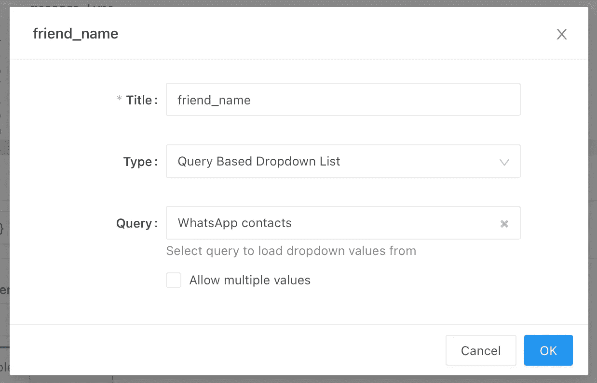
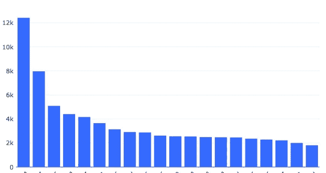
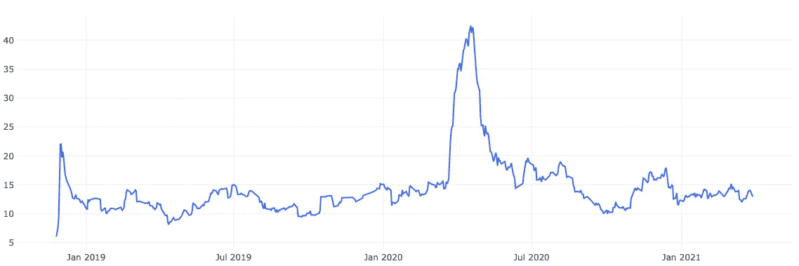
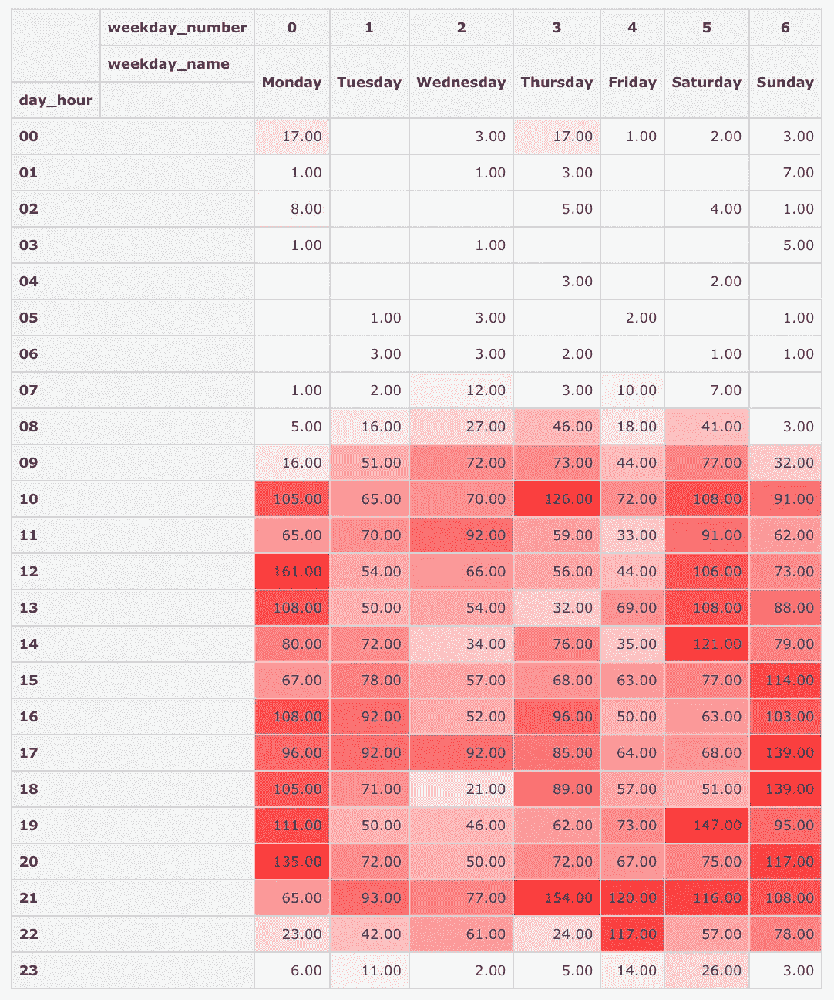
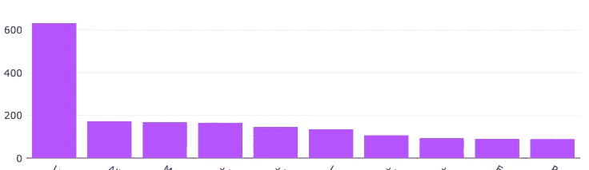
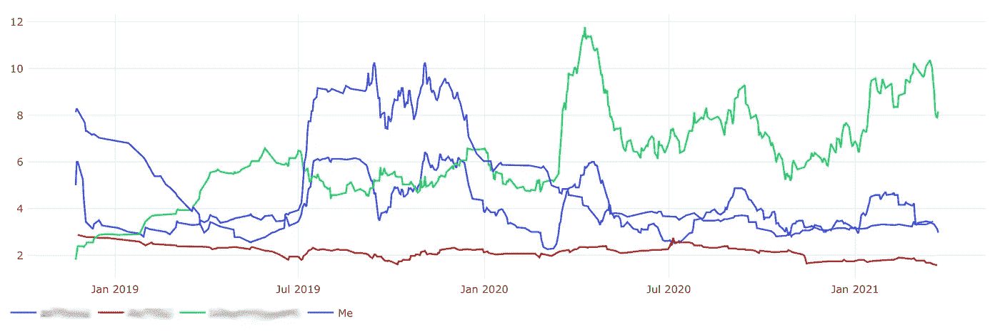

# 使用 SQL 和 Redash 分析我的 WhatsApp 数据库

> 原文：<https://towardsdatascience.com/analyzing-my-whatsapp-database-using-sql-and-redash-5ef9bd6a0b0>

# 使用 SQL 和 Redash 分析我的 WhatsApp 数据库

## 如何创建一个包含一些关键绩效指标的交互式仪表盘，显示您和您的朋友如何使用 WhatsApp

几个月前，我在浏览 WhatsApp 聊天记录时，突然有了一个想法:为什么不提取我的 WhatsApp 数据库，并对其进行一些数据分析？可以提取许多关于我和我的联系人如何使用 WhatsApp 的有趣元数据。


照片由 [LinkedIn 销售解决方案](https://unsplash.com/@linkedinsalesnavigator?utm_source=medium&utm_medium=referral)在 [Unsplash](https://unsplash.com?utm_source=medium&utm_medium=referral) 上拍摄

这不是一个简单的过程，因为你需要以某种方式将数据库从你的手机复制到你的电脑上，然后理解它，一旦你理解了它的结构，就要考虑可以提取哪些有用的信息以及如何呈现它。这花了我很多时间，但现在我对结果感到非常自豪，我真的很高兴能与你们分享这些成果。

在这篇文章中，我将向你解释:

*   如何将你的 WhatsApp 数据库从 iPhone 或 Android 手机复制到电脑上
*   如何从原始数据库中获得这个实验的相关数据
*   SQL 查询获取关于我们使用 WhatsApp 的最有趣的 KPI
*   如何创建一个交互式仪表板来可视化这些 KPIs 我们将使用 [Redash](http://redash.io) ,但也可以随意选择其他—。

如果你想亲自尝试，你需要几样东西:

*   有根的安卓手机或者 iPhone(不需要越狱)
*   将手机连接到电脑的 USB 电缆
*   [adb](https://developer.android.com/studio/releases/platform-tools) 如果你的手机是安卓系统，或者是装有 [iTunes](https://www.microsoft.com/en-us/p/itunes/9pb2mz1zmb1s) 的 Windows PC，或者是苹果电脑如果是 iPhone
*   安装在计算机上的 sqlite3 用于处理数据库
*   [gcc](https://gcc.gnu.org) 和 [make](https://www.gnu.org/software/make/) 安装在你的电脑上编译备份解压程序(除非你有 Mac，因为这个工具已经为 macOS 编译好了)
*   [Docker](https://www.docker.com/get-started) 安装在您的电脑上，用于部署 [Redash](https://redash.io) 或任何其他仪表板工具

你准备好加入我了吗？我们走吧！

# #1.提取 WhatsApp 数据库

## 从安卓手机上

如果你有一部 Android 手机，我很抱歉地告诉你，你需要[一个根设备](https://www.androidauthority.com/root-android-277350/)。WhatsApp 数据库存储在限制访问的文件系统位置，因此您需要特殊权限才能获得它。有一些替代方法可以获得它，但是最终都需要 root 访问权限。


照片由 [Andrew M](https://unsplash.com/@andymant?utm_source=medium&utm_medium=referral) 在 [Unsplash](https://unsplash.com?utm_source=medium&utm_medium=referral) 上拍摄

如果你有你的手机根，你必须按照这些步骤安装 adb [，然后用 USB 线连接你的手机并运行你的工作目录中的命令:](https://www.xda-developers.com/install-adb-windows-macos-linux/)

```
adb root
adb shell sqlite3 wa.db “.backup ‘wa.db.bak’”
adb pull /data/data/com.whatsapp/databases/msgstore.db
adb pull /data/data/com.whatsapp/databases/wa.db.bak wa.db
sqlite3 msgstore.db .dump > whatsapp.sql
sqlite3 wa.db .dump >> whatsapp.sql
sqlite3 whatsapp.db < whatsapp.sql
```

我们在这里做的是获得 root 权限，获得存储 WhatsApp 数据的两个数据库，并将它们合并成一个数据库。

## 从 iPhone 上

有了[越狱的 iPhone](https://www.idownloadblog.com/jailbreak/#whatis) ，这个过程可能会更容易——它可能看起来类似于上面对 Android 的解释——但由于我的 iPhone 没有越狱(世界上大多数人也没有越狱)，我们将从备份中提取它。

首先，你得把你的 iPhone 连接到电脑上，并进行备份。你可以在苹果官方网站上找到 [Mac](https://support.apple.com/kb/HT211229) 和 [Windows](https://support.apple.com/kb/HT212156) 的详细说明。然后，我们将使用名为 [*imobax*](https://github.com/Siguza/imobax) 的开源工具从备份中提取 WhatsApp 数据库。如果你有 Mac，可以直接从[这里](https://github.com/Siguza/imobax/releases/latest)下载可执行文件。如果你使用的是 Windows，那么你需要自己使用 *gcc* 和 *make* 来编译它(关于如何安装它的说明[这里是](https://dev.to/gamegods3/how-to-install-gcc-in-windows-10-the-easier-way-422j)):只需将存储库下载到你的计算机上，并在文件夹中运行命令“ *make* ”。

如果您使用了 Mac 进行备份，它将存储在*~/Library/Application Support/mobile sync/Backup*中。如果你是在 Windows 中做的，这个目录将会是*% user profile % \ Apple \ mobile sync \ Backup*或者*% appdata % \ Apple Computer \ mobile sync \ Backup*。在这些目录中，将有一个包含您的备份的文件夹，在所有备份的文件中，包括我们的数据库。问题是这些文件有随机的字母数字名称。这就是 imobax 将帮助我们的地方，它告诉我们哪个文件是数据库。

```
./imobax -l <backup location>  | grep ChatStorage.sqlite | awk ‘{print $1}’
```

上面的命令将给出数据库的名称。只需在备份文件夹中搜索，复制到你的工作目录中，随心所欲的重命名，比如 *whatsapp.db* 。

# #2.探索数据库

WhatsApp 数据库充满了表格，有些表格有无数的列和行。它们中的大多数都与我们无关，所以让我们看看我们将使用哪些表和列。

## 在 Android 上

*   ***wa_contacts*** :关于您的联系人和群组的信息
    *unseen _ msg _ count*:该联系人/群组未阅读的消息数量
    ➣ *jid* :联系人或群组的标识符:联系人将以“*@ s . whatsapp . net”*结尾，群组以“*@ g . us”* ➣*display _ name*
*   ***chat_view*** :聊天会话
    ➣ *raw_string_jid* :联系人/群组的标识符
    ➣*last _ message _ row _ id*:消息中该聊天的最后一条消息的 fk
    ➣*sort _ timestamp*:该联系人/群组的最后一条消息的日期
*   ***消息***
    ➣*key _ from _ me*:0 为传入消息，1 为传出消息
    ➣ *media_wa_type* :消息是否为文本(0)、图片(1)、视频(2)、语音消息(3)……
    ➣*时间戳*:以 [UNIX 时间格式发送或接收消息的日期和时间](https://en.wikipedia.org/wiki/Unix_time)。
    ➣ *数据*:信息的文本(对于没有文本的彩信为空)
    ➣ *key_remote_jid* :远程部分的标识符(如果收到信息，则为发送方，如果发送信息，则为接收方)

## 在 iPhone 上

*   ***ZWACHATSESSION*** :关于您的联系人和群组的信息
    ➣ *ZMESSAGECOUNTER* :与该联系人/群组交换的消息数量
    ➣ *ZSESSIONTYPE* :如果是与联系人的私人消息，则为 0；如果是群组，则为 1；如果是广播，则为 2；如果是状态，则为 3。
    ➣ *ZUNREADCOUNT* :未从该联系人/群组读取的消息数
    ➣ *ZLASTMESSAGE* : FK 为该联系人/群组的最后一条消息*zwa message*
    ➣*zlastmessagedate*:该联系人/群组的最后一条消息的日期
    ➣ *ZCONTACTJID* :该联系人或群组的标识符:联系人将以“【结束
*   ***ZWAMESSAGE*** :发送和接收的消息
    ➣ *ZISFROMME* : 0 为传入消息，1 为传出消息
    ➣ *ZMESSAGETYPE* :消息是文本(0)、图像(1)、视频(2)、语音消息(3)……
    ➣*zmessagedate*:消息发送或接收的日期和时间 [UNIX 时间 但是时间戳从 2001 年 1 月 1 日开始，而不是从 1970 年 1 月 1 日开始(](https://en.wikipedia.org/wiki/Unix_time)[此处解释](https://www.oreilly.com/library/view/practical-mobile-forensics/9781788839198/a78b0a6a-e0f5-45b8-bce9-b82c3e7a3b7a.xhtml) )
    ➣ *ZTEXT* :消息的文本(对于没有文本的多媒体消息为空)
    ➣ *ZFROMJID* :发送者的标识符； 如果消息是由用户发送的( *ZISFROMME* == 1)，该字段将为空
    ➣ *ZTOJID* :接收方的标识符；如果用户收到消息( *ZISFROMME* == 0)，该字段将为空

# #3.转换数据

为了以后使我们的 SQL 查询更容易，现在在我们的数据库中创建两个视图是一个好主意:一个用于私人的、单独的消息(让我们称之为 *friends_messages* )，另一个用于来自群聊的消息( *group_messages* )。这不仅简化了 SQL 查询，还允许我们对 iPhone 和 Android 使用相同的查询。

## 在 Android 上

## 在 iPhone 上

# # 4.设置可视化工具

在我的实验中，我使用了 [Redash](https://redash.io) 来创建一个仪表板，以可视化 KPI，我们将在以后研究这些 KPI。遵循本指南，可以使用 Docker [轻松部署这个开源工具。不言而喻，您可以自由使用任何其他支持 SQLite 的可视化工具，如 PowerBI、Tableau 等。](https://redash.io/help/open-source/dev-guide/docker)

一旦我们导入了上一步创建的数据库视图，下一步就是创建一个查询来获取联系人列表和另一个查询来获取组列表。这将是需要的，然后能够显示一个下拉列表，以过滤那些关于单个联系人或组的关键绩效指标。在 Redash 中，这是通过创建这两个 SQL 查询来完成的，然后在相应的 KPI 上添加一个类型为“*查询的下拉列表*的参数，在 SQL 查询中可以称为“ *{{ parameter_name }}* ”。



Redash 查询中一个名为" *friend_name"* 的变量的定义，它将从一个包含您所有联系人姓名的下拉列表中获取值

## 用于检索所有联系人姓名的 SQL 查询:

## 用于检索所有组名称的 SQL 查询:

# #5.定义和可视化 KPI

现在我们准备动手编写一些 SQL 查询来提取一些关于我们如何使用 WhatsApp 的有趣 KPI。实际可以提取的 KPI 数量只是受到你的想象力和创造力的限制，所以欢迎你自己创造。我会给你们留下一些我创作的作品:

## KPI #1:在过去 30 天里与你交谈最多的人

该查询可以用垂直条形图来可视化，X 轴上的列为“ *friend_name* ”，Y 轴上的列为“ *number_of_messages* ”。



最近 30 天内与我交谈最多的前 20 位联系人(出于隐私原因，底部的姓名被删除)

## KPI #2:你的每一个朋友每天的信息数量

这个查询可以用一个折线图来可视化，X 轴上是列“ *day* ”，Y 轴上是列“ *ma_mom* ”。请注意查询的第一行，其中计算了 30 天的移动平均值。如果没有它，图表看起来会非常清晰和嘈杂，因此应用这个过滤器。

另外需要注意的是 *{{ friend_name }}* 是一个变量，所以 Redash(或者相应的可视化工具)会用选中的联系人替换它。



一段时间内每天与联系人交换的消息数量。该值已经用 30 天移动平均值进行了平滑。

## KPI #3:一天中或一周中你和你的朋友交谈最多的时刻

对于这个 KPI，我们使用 sqlite 函数 *strftime()* 按一天中的小时和一周中的天对消息进行分组，然后计算一周中每天的小时和天中交换的消息总数。然后我们可以在数据透视表中绘制它。



这张热图显示了一周中每天每小时与朋友交换的信息数量

## KPI #4:写邮件最长的前 10 位朋友

在这个查询中，我们计算每个联系人发送给我们的邮件的平均长度，得到前 10 个，然后绘制成垂直条形图。但是把长文拆分写在几条消息里是很正常的，所以这个 KPI 不是很准确。考虑到这一事实，我试图计算它，但是需要非常复杂的算法，不幸的是不能用 sqlite 实现。



此图表显示了平均来说写邮件最长的前 10 位联系人发送的邮件的平均字母数(出于隐私原因，底部的姓名被剪掉)

## KPI #5:一段时间内组中每个成员发送的消息数量

与 KPI #2 类似，这里我们使用 30 天移动平均值过滤每个组成员每天发送的消息数量，包括我自己(" *Me* ")。由于我们使用的是组，所以使用视图“ *group_messages* ”来代替“ *friend_messages* ”，并且在仪表板中定义了一个新变量(“ *group_name* ”)，因此用户可以选择他想要查看该图表的组。



每个小组参与者(包括我自己)的参与率(每天过滤的消息数量，以 30 天的移动平均值计算)的变化

这是一个很大的帖子，我已经涵盖了一个很长的过程:从我们的手机中提取数据库，清理数据，用 SQL 做一些分析，然后在图表中可视化这些结果。我从中获得了很多乐趣，所以我欢迎你们亲自尝试，并尝试制定一些新的 KPI。请随意发表您的印象、发现或改进的评论，我将很高兴阅读您的来信！

## 来源

1.  ADB 文档:[https://developer . Android . com/studio/command-line/ADB # shell commands](https://developer.android.com/studio/command-line/adb#shellcommands)
2.  SQLite 3 窗口函数:[https://sqlite.org/windowfunctions.html](https://sqlite.org/windowfunctions.html)
3.  *strftime* 手动:[https://man7.org/linux/man-pages/man3/strftime.3.html](https://man7.org/linux/man-pages/man3/strftime.3.html)
4.  *WhatsApp 在众目睽睽之下:在哪里以及如何收集法医文物*:[https://blog.group-ib.com/whatsapp_forensic_artifacts](https://blog.group-ib.com/whatsapp_forensic_artifacts)
5.  *WhatsApp DB 中的奇遇——从备份中提取消息(附代码示例)*:[https://medium . com/@ med 1um 1/extracting-WhatsApp-messages-from-backups-with-code-examples-49186 de 94 ab 4](https://medium.com/@Med1um1/extracting-whatsapp-messages-from-backups-with-code-examples-49186de94ab4)