# 通过自然语言处理和仪表板分析政治宣言

> 原文：<https://towardsdatascience.com/analyzing-political-manifestos-through-natural-language-processing-and-dashboarding-4ad1d62d6b9a>

## 一个关于话语分析的数据科学项目

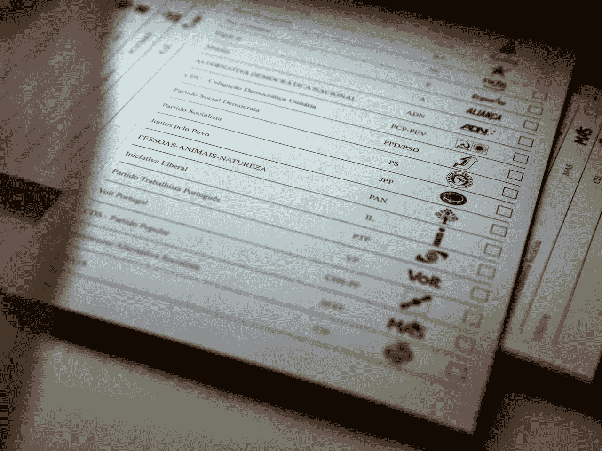

joséSena goulo 为[苏露莎](https://www.lusa.pt/)拍照

# TL；速度三角形定位法(dead reckoning)

我已经为[开发了一个应用](https://share.streamlit.io/andrecnf/polids/main/app/app.py)，展示对选举宣言的语言和内容的分析；我希望它有用，因为*政治是疯狂的*；这篇文章解释了我为什么，做了什么，怎么做的。

# 为什么

政治宣言应该是最能代表一个政党的东西:它包含他们的主张背后的主要思想以及他们对国家或地区的愿景。然而，我们作为选民似乎没有给予应有的重视。根据 BMG [1]的一项民意调查，大约 67%的英国人不读宣言，十分之一(10%)的人甚至不知道宣言是什么。相反，我们倾向于关注媒体和社交媒体上展示的东西，可能会关注一些辩论，这些辩论不一定比前者更耸人听闻。

事实上，人们可能与政治有着过于情绪化和基于身份的关系，就像我们对待宗教或足球一样。令人担忧的是，也许由于社交网络的回音室效应、社会不平等和反对保守与进步的议程，政治对话似乎变得更糟而不是更好。以至于根据 2017 年的一项民意调查[2]，如果亲密的家庭成员与“另一边”的人结婚，三分之一的美国人会感到失望。如果政客们自己也有这种心态，情况会变得更加危险，因为这会损害任何形式的合作或协议。

> “危险的不是犯错误，而是如此迷恋自己的观点，以至于不让事实成为障碍。”Abhijit 诉 Banerjee 和 Esther Duflo [3]

关于政治的对话，大约在 2022 年。GIF 由 [Shoshana Weissmann](https://giphy.com/channel/shoshana/) 在 [Giphy](https://giphy.com/gifs/fight-argument-argue-3o85xHdzqxzuHojJAc) 上发布。

如果政治看起来如此混乱，为什么还要为它费心呢？嗯，随着关键的社会问题，如不平等，经济危机的浪潮，疫情疾病，民粹主义的兴起，无休止的冲突和气候变化，在我看来，如果我们想要一个更美好的明天，我们需要在政治上积极主动。我不是唯一一个这样想的人:

> ……参与政治进程是各行各业的人们能够采取的帮助避免气候灾难的最重要的一步。——比尔·盖茨

我们应该以更加理性和开放的态度看待政治。只有这样做，我们才能让政治家寻求合作，而不仅仅是反对，让政府真正想解决问题，而不仅仅是观众。这就是我想做这个项目的原因。

议会需要更多的金毛猎犬，这样我们就可以放松下来，开始对话。GIF 由 [u/tranquil365](https://www.reddit.com/user/tranquil365/) 在 [Reddit](https://www.reddit.com/r/gifs/comments/3vtb0z/neutrality/) 上发布。

此外，我已经开始了这个项目，重点是上个月发生的葡萄牙大选。

# 什么

我开发了一个名为 [polids](https://share.streamlit.io/andrecnf/polids/main/app/app.py) 的应用程序，试图从选举宣言的主要内容和交流风格的角度对其进行概括，同时也促进进一步的阅读。

它有两种类型的页面:

*   **概述:**对所有宣言的综合分析，给出了预期的基线和具体选举的总体情况。
*   **个人:**关注一个政党的宣言，上面有一些附加信息。

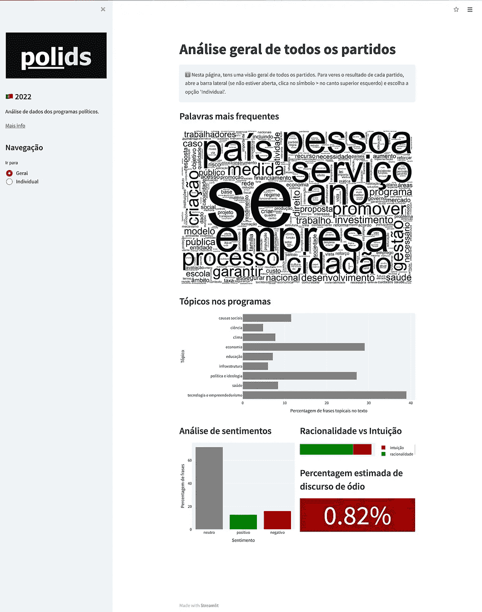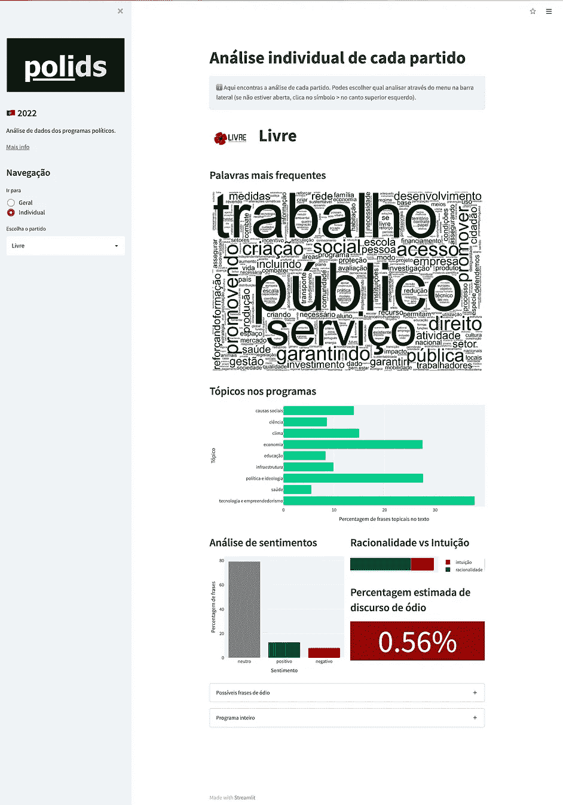

[polids 应用](https://share.streamlit.io/andrecnf/polids/main/app/app.py)的两页:所有宣言的概述(左)和对每个政党的个人分析(右)。作者图片。

正如你在截图中看到的，两个页面看起来非常相似，因为主要的可视化模块在所有页面之间共享。让我们仔细检查每一块，看看它是什么。

首先，我们有一个词云。这是探索文本时非常常见的视觉化，因为它可以通过突出最常见的单词，让我们快速了解它们的主要内容和风格。例如，我们可以看到泛欧党 [Volt](https://www.voltportugal.org/) 大量提及欧洲(例如 *europeu* )，绿党 [PAN](https://www.pan.com.pt/) 非常重视动物福利，大量提及动物(例如*animas*)。

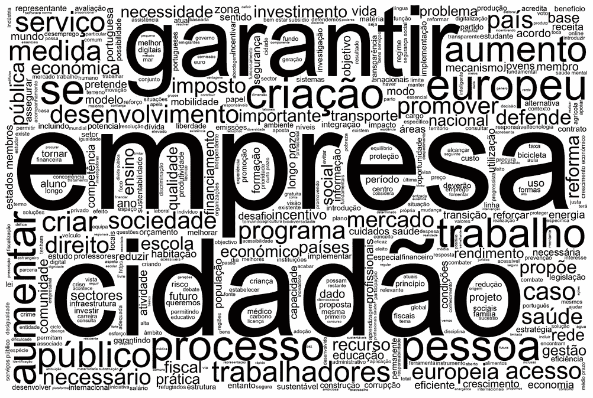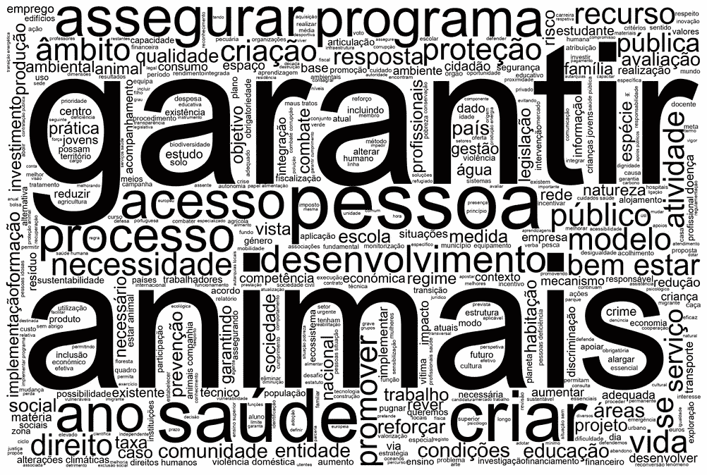

来自 app 的词云示例:[伏特](https://www.voltportugal.org/)的泛欧词云(左)，参考欧洲(europeu)；[潘](https://www.pan.com.pt/)的动物福利聚焦词云(右)，重点是动物(animais)。作者图片。

第二个最突出的情节是话题在场。这是为了显示每个政党对一系列核心议题的重视程度，基于它们在宣言中出现的频率。例如，这可以向我们展示左翼和右翼政治之间的典型优先转移，左翼政党倾向于强调社会事业和意识形态，而右翼政党则优先考虑经济。

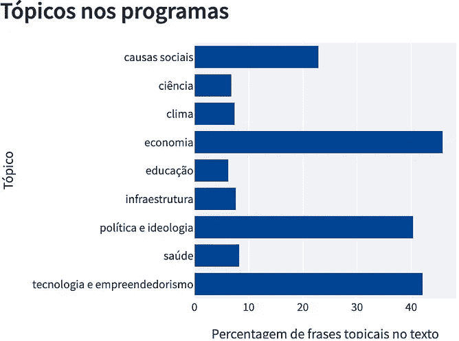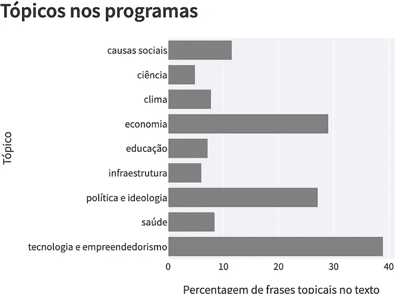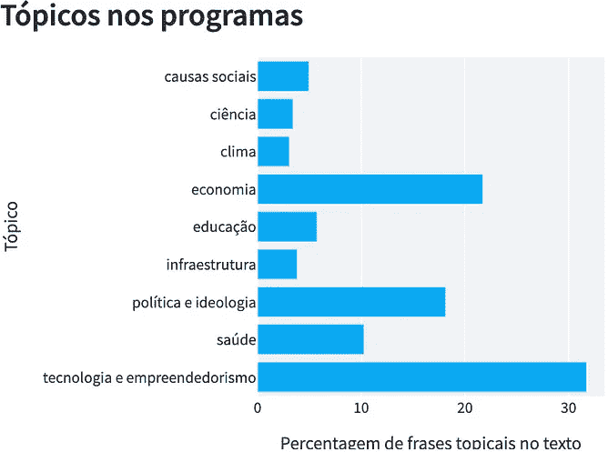

话题在场的例子:左翼政党 [CDU](https://www.cdu.pt/2022/) (左)，更强调社会原因(causas sociais *)* 和意识形态(política e idemia)；所有宣言的平均主题出现率(中间)；右翼自由党 [Iniciativa Liberal](https://iniciativaliberal.pt/) (右)，侧重于经济学(economia)和企业家精神(tecnologia e empreendedorismo)，较少强调社会事业(causas sociais)和气候(clima)。y 轴是题目；x 轴是涉及给定主题的短语的百分比。作者图片。

之后，我们有一组分两栏展示的图表。在左边的大图中，我们有一个情绪分析条形图。它代表了宣言句子中的情绪，比如有多少是中性的、积极的或消极的。它可以显示一个政党有多合作和开放，或者有多民粹和封闭。例如，有趣的是看到两个极端的政党，一个在最左边，一个在最右边，都有非常消极的交流方式。

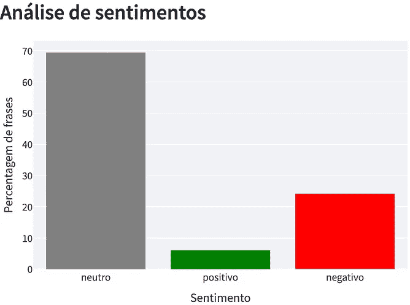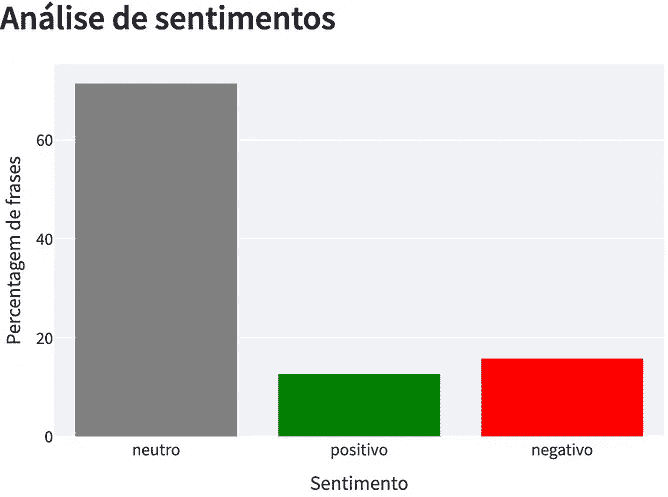

情绪分析的例子:kinda-极左翼政党 [Bloco de Esquerda](https://www.bloco.org/) 的情绪分析(左)，情绪非常负面；各方平均情绪分析(中间)；极右翼政党 [Chega](https://partidochega.pt/) 的情绪分析(右)，情绪非常负面。x 轴是情绪(中性、积极、消极)；y 轴是用给定情感分类的短语的百分比。作者图片。

在右侧，我们可以看到一个类似颜色的百分比条形图。它反对两种不同的沟通方式:理性和直觉。第一个对应的是更科学、可量化和肯定的立场，而后者更多的是在情感、想象和激励方面。例如，我们可以看到，与其他政党相比，民粹主义政党倾向于更多地利用直觉。最近的一篇论文 T10 探究了这两种风格的文学演变，是这一分析背后的灵感。

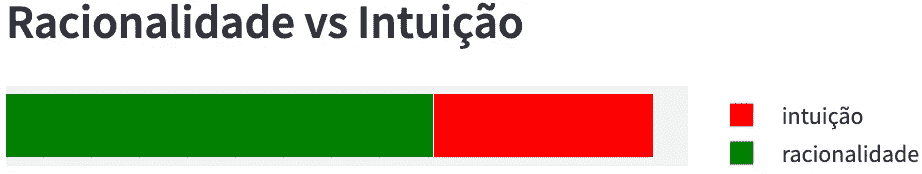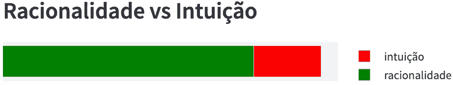

理性 VS 直觉剧情举例:极右翼政党[切加](https://partidochega.pt/)更重直觉的用法【66%理性| 34%直觉】(左)；右翼政党 [Iniciativa Liberal](https://iniciativaliberal.pt/) 的理念驱动理性【78.9%理性| 21.1%直觉】(右)。作者图片。

接下来是仇恨言论，它以两种方式显示:被归类为仇恨言论的句子的百分比以及这些句子的完整列表。理想情况下，任何人都不应该投票给发表仇恨言论的政党。鉴于极端主义的明显抬头，这篇分析文章似乎很有意义。虽然大多数政党显示仇恨言论的残留百分比，主观上看起来更像是误报，但一些极右翼政党的言论明显带有种族主义、仇视同性恋或其他歧视性。这样就方便了，通常不太关注这些政党的人和那些盲目信任它们的人都可以很快看到这些政党实际上有多可恶。

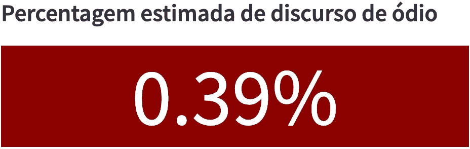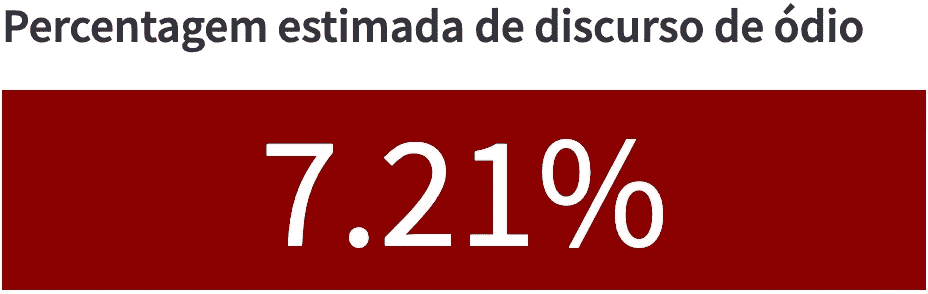

仇恨言论百分比的例子:中右翼政党 [PSD](https://www.psd.pt/) 的残余仇恨言论(左)，只有误报；极右翼政党 Chega 的仇恨言论比例很高，带有种族主义、纯粹主义和普遍的歧视性言论。作者图片。

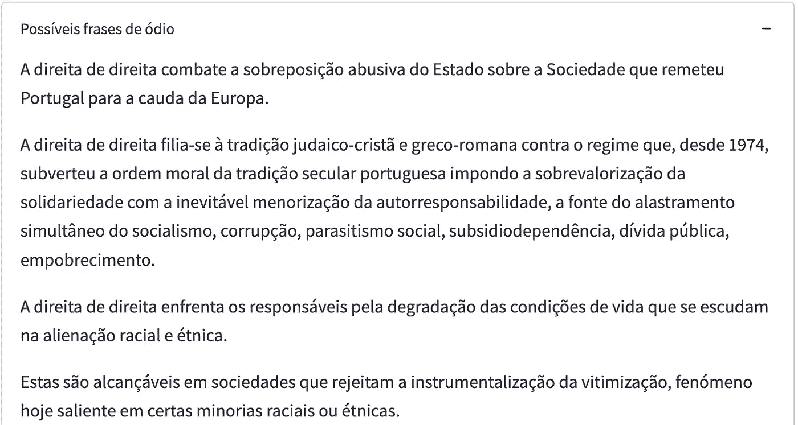

被归类为仇恨言论的句子的例子，来自极右翼政党 [Chega](https://partidochega.pt/) 的宣言。包括对种族纯洁性、受害的少数民族和对依靠补贴的人的歧视的评论。图片作者。

最后，我们可以通过点击页面末尾的开关来查看该党的整个宣言。这样，每个人都可以在有了概述之后，对一个政党的提议和代表有一个全面的了解。

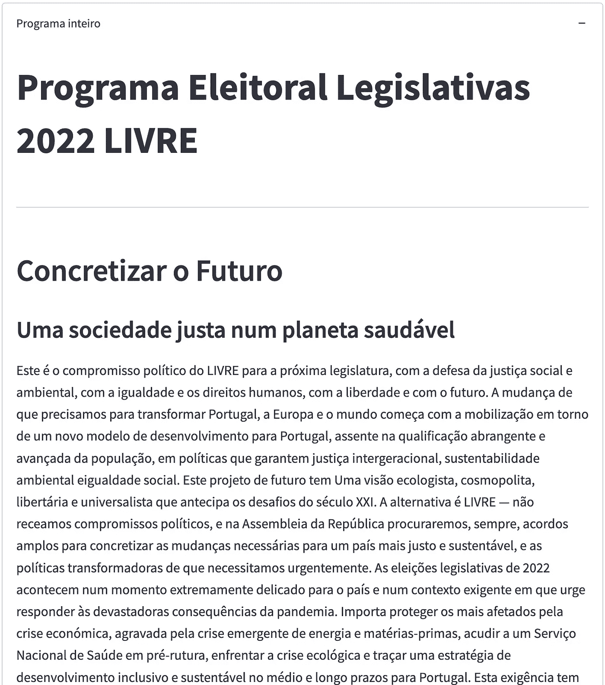

从 [polids 应用](https://share.streamlit.io/andrecnf/polids/main/app/app.py)中看到的[利夫尔](https://partidolivre.pt/)的宣言节选。图片作者。

# 怎么

## 概观

该项目全部由 Python 开发，在特定库和工具的帮助下，贯穿三个主要阶段:

1.  **数据:**获取允许 app 存在的内容及其格式；[Markdown](https://www.markdownguide.org/getting-started/)【6】和[YAML](https://yaml.org/)【7】是数据使用的主要格式。
2.  **推理:**通过模型和代码从数据中提取洞察；[斯帕西](https://spacy.io/)和[拥抱脸的变形金刚](https://huggingface.co/docs/transformers/index)【9】是我在这里的首选。
3.  **可视化:**以直观清晰的方式展现洞见；[Plotly](https://plotly.com/)【10】和[Streamlit](https://streamlit.io/)【11】处理了这个拼图的最后一块。

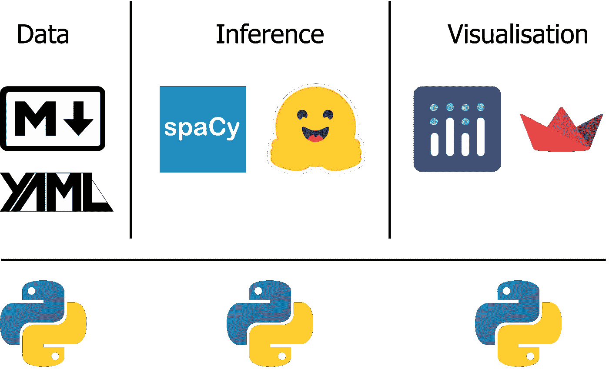

主要技术步骤和相应的工具。一切都是用 Python 完成的。图片作者。

下面我将解释更多关于我做这个项目的具体步骤。如果你只是想深入研究代码，你可以去 polids GitHub 库[:](https://github.com/AndreCNF/polids)

 [## GitHub - AndreCNF/polids

### 分析选举计划并通过应用程序输出。

github.com](https://github.com/AndreCNF/polids) 

## 清单数据

政党宣言的全文往往以 PDF 文件的形式提供。这些服务于阅读的目的，并可以变得有吸引力，但它们对于计算分析来说并不理想:包含图像、列、标题和其他文本格式形式使得很难提取内容并在我们的代码和模型中舒适地使用它。因此，重要的第一步是将 pdf 转换成更便于机器使用的格式，比如 Markdown。

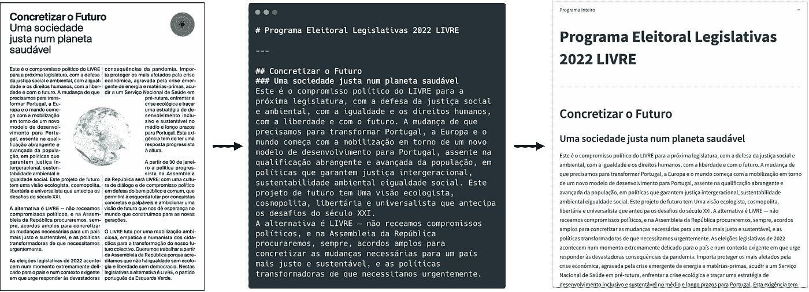

宣言处理，从 PDF 到 markdown 再到 app。图片作者。

幸运的是，我不需要亲自做宣言的转换，因为已经有人做了。[política Para Todos](https://www.politicaparatodos.pt/)【12】是一个开源组织，它将葡萄牙全国选举的所有宣言转换成公开的降价文件。

## 单词和句子

我发现将文本分成单个的单词(对于单词云)和句子(对于剩余的分析)是很方便的。

要获取单词，第一步只是从 spaCy 加载一个语言模型，并在其上运行文本。这可以给我们每个单词，以及一些语言环境，如词性标注(POS)。因为我只想获得最相关的单词，所以我应用了一些过滤器，例如:

*   移除一些降价假象(例如粗体符号)；
*   删除停用词(即没有意义的词；例如“该”、“一个”、“在”)；
*   删除标点符号；
*   过滤名词、形容词、动词和感叹词。

用于从减价文本中获取相关单词的主要代码。

我也试着用 spaCy 提取句子，但它有时输出错误，尤其是在涉及标题、粗体字或列表的情况下。因此，在处理这些边缘情况时，我已经创建了自己的方法来获取句子(例如，如果在点之后出现了另一个数字，则继续考虑相同的短语，因为它可能是一个编号列表或一些带小数部分的行内数字)。

用于从减价文本中获取句子的主要代码。

## 词云

有了从`get_words`获得的单词列表，只需要把它提供给[单词云](https://github.com/amueller/word_cloud) [13]库，就可以得到这种类型的可视化。本质上，它显示了所提供列表中最常见的单词，字体大小根据出现的次数而变化。

我在这里做的一个简单的改变是我遵循了 Anupama Garla 在她自己的[关于单词云的中型文章](/how-to-make-word-clouds-in-python-that-dont-suck-86518cdcb61f) [14]中建议的风格变化:

 [## 如何用 Python 制作不烂的词云

### 用 python 制作漂亮有意义的单词云的简要教程。

towardsdatascience.com](/how-to-make-word-clouds-in-python-that-dont-suck-86518cdcb61f) 

函数来创建好看的单词云。

## 政治话题

主题呈现是如何通过宣言获得的简化动画。图片作者。

宣言中的每一句话都可能涉及一个或多个主题。因此，确定有多少短语包含某个主题可能会让我们知道这对那些写文章的人有多重要。此外，比较不同主题之间的数字可以表明作者的优先顺序。因此，正如上面的动画所描述的，我决定实现一个方法来遍历通过`get_sentences`获得的每个句子，并检查它可能讨论的主题。

我没有发现任何现有的健壮模型可以识别文本之外的政治相关话题，更不用说葡萄牙语了。此外，在有限的时间内从头开始创建一个好的模型是一项相当大的工作。话虽如此，我还是采用了一种更简单的方法，似乎对政治分析的第一次迭代已经足够好了:关键词搜索。我为每个主题预定义了一组单词，如果一个句子包含任何单词，它将被标记为属于该主题。

我定义的核心主题是:

*   气候；
*   经济；
*   教育；
*   健康；
*   基础设施；
*   科学；
*   社会原因；
*   政治和意识形态；
*   技术和企业家精神。

对于其中的每一个，我都在一个 YAML 文件中定义了它们的关键字，这实质上是将每个单词映射到它的父主题。

如何以 YAML 格式定义主题关键字的示例。注意“…”符号只是为了说明那里会有更多的单词；你不应该把它写进 YAML 法典。

这里有一个小提示，即使只是用葡萄牙语写单词， [GitHub 副驾驶](https://copilot.github.com/) [15]对于记住每个主题的更多单词也有惊人的帮助。

有了这些关键词，我们可以简单地浏览每一句话，如果它包含任何主题的关键词，就将它们添加到每个主题的列表中。

根据预定义的主题及其关键字标记每个句子的主要代码。

## 理性 vs 直觉

理性与直觉如何通过宣言获得的简化动画。图片作者。

在这里，我采用了一种与主题存在非常相似的方法，除了现在，我不再用政治相关的主题来标记句子，而是将它们标记为基于理性或直觉。这是受[最近一篇研究这两种沟通方式趋势的论文](https://www.pnas.org/content/118/51/e2107848118)【5】的启发。

这里使用了`get_topical_sentences`,就像在主题存在任务中一样，因为它可以通过简单地改变使用哪个 YAML 字典来适应(即`topics`参数)。

## 情感分析

情感如何通过宣言分类的简化动画。图片作者。

幸运的是，情感分析是一个更常见的、普遍适用的任务，所以在这里我可以求助于来自[humping Face 的 Models hub](https://huggingface.co/models)【16】的现有模型。在该平台中，人们可以很容易地找到几种类型的模型，主要是在自然语言处理(NLP)中，只需几行代码就可以在 Hugging Face 的 transformers Python 库[9]中使用。出于葡萄牙语情感分析的目的，我使用了 [XLM-T，一个多语言语言模型](https://huggingface.co/cardiffnlp/twitter-xlm-roberta-base-sentiment) [17]。

这个情感分析模型的标签是:

*   中立；
*   正面；
*   没有。

对于这个建模任务，我将输出保存为 dataframe 格式，并附上模型的分数(即模型在预测标签中的置信度)。

基于情感的句子分类方法。

## 仇恨言论

通过宣言如何检测仇恨言论的简化动画。图片作者。

对于仇恨言论，我能够再次从[拥抱脸模型](https://huggingface.co/models)【16】中获得一个现有的模型，这一次是从[基于多语种 BERT 的模型](https://huggingface.co/Hate-speech-CNERG/dehatebert-mono-portugese)【18】。这个模型本质上只有一个标签，将句子分为中性或仇恨言论。

当我第一次尝试这个模型时，我发现它有几个误报，特别是那些非常合理的句子，这些句子提到了任何如果以不同的负面方式解决就会变成问题的问题(例如，打击种族主义，改善性别平衡，接受移民等)。为了缓解这个问题，我将被标记为仇恨言论的句子数量减少到只有那些既在原始仇恨言论模型中被识别为仇恨言论又在情感分析模型中被归类为负面的句子。我仍然有一些假阳性，但我看到了结果的主观改善。

识别句子中仇恨言论的方法。

## 应用

在我开始开发一个应用程序或仪表板之前，我喜欢思考和起草它应该是什么样子。通过这种方式，我们可以想到一些我们可能不会考虑的潜在问题，优化用户体验，并为我们实际组装最终产品时设定指导方针。

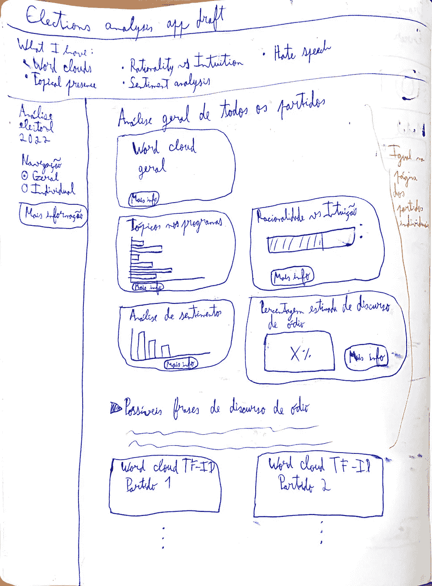

初稿(左)和终稿(右)的对比。作者图片。

出现的一个问题是，这个项目涉及大量的文本数据和一些冗长的任务。如果我们在应用程序加载时动态运行所有东西，这会使应用程序变慢。此外，我们只打算显示静态数据，没有任何反馈循环或新的数据流。因此，解决方案是预先计算更重的工作负载，即单词云、情感分析和仇恨言论检测。然后，在应用程序加载时，我们简单地显示输出。以下是我运行以获得输出的脚本:

 [## 策略/脚本和配置/策略

### 分析选举宣言并通过应用程序输出。-策略/脚本

github.com](https://github.com/AndreCNF/polids/tree/4df57de6cba19866d8df659f849d989bab6a5907/scripts) 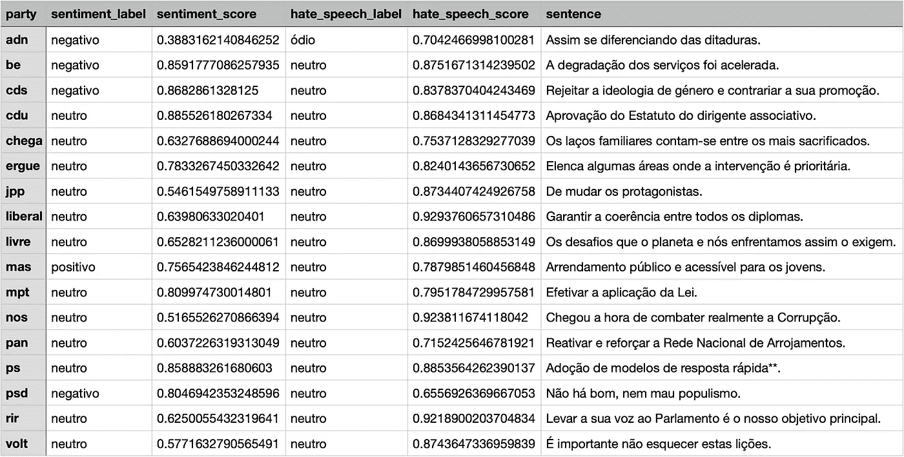

应用程序使用的 NLP 输出表的一些示例。图片作者。

由于 Streamlit，准备好输出后，实际开发应用程序相对容易。有可能构建一个成熟的应用程序，具有多页面、交互性、分栏、自动屏幕大小调整、明暗模式等奇特的功能，甚至可以部署应用程序 [19]，而不必进入复杂的 web 开发细节。事实上，大多数的 [polids 应用](https://share.streamlit.io/andrecnf/polids/main/app/app.py)可以总结为 74 行代码(注意，自定义函数与在 Streamlit 之外使用的没有任何不同):

构建 Streamlit 应用程序的主要方法。

我不会详细讨论特定于绘图的代码，但是您可以查看`viz_utils`文件，它显示了我是如何做到的:

 [## polids/viz _ utils . py Andre CNF/polids

### 分析选举宣言并通过应用程序输出。polids/utils/viz_utils.py…

github.com](https://github.com/AndreCNF/polids/blob/4df57de6cba19866d8df659f849d989bab6a5907/utils/viz_utils.py) 

# 未来的工作

鉴于我在不到一个月的时间里(在选举前，在得到所有宣言和选举日之间)利用一些空闲时间从事这个项目，我必须设定非常明确的优先事项，并牺牲一些我本来想探索的途径。说到这里，我打算继续这个项目，尤其是在新的选举即将到来的时候。

以下是我对未来工作的优先顺序清单:

*   包括宣言各章的摘要；
*   用更好的模型替代话题在场和合理性关键词搜索；
*   改进情感分析和仇恨言论模型；
*   介绍可解释性，至少强调为什么某些句子被贴上仇恨言论的标签；
*   实现交易方比较页面；
*   报道其他选举。

如果你想为这个项目的开发做出贡献，甚至只是为了你自己的用例，请随时联系我们🙂

# 最后的想法

政治也许是每个人生活中最有影响力的领域。然而，它往往看起来像一个战场，无论是在比喻还是字面意义上，都有枪战和交火，没有足够的公开讨论，没有足够的推理。在这一切当中，我们可能会感到无能为力，无法获得充分的信息，也无法试图让事情变得更好。然而，每个人都可以贡献自己的技能，即使只是作为一个副业。特别是，拥有数据科学技能的人有可能帮助检查数字、分析消息并向一般受众提供见解。

在政界和商界，已经有一些例子表明，那些身居高位的人使用数据来理解我们，理解人口，有时是以令人窒息的操纵方式[20–21]。我认为是时候改变秩序了，通过数据做出明智的决定，并对我们的领导负责。也许这样我们会作为一个社会更加繁荣，吸取过去的教训，预测未来，现在就行动。

关于政治本身的更多评论，请看我之前的文章:

 [## 政治被打破了:理想的制度会是什么样子？

### 关于如何改进政治制度的几点说明

medium.com](https://medium.com/@andrecnf/politics-is-broken-what-would-an-ideal-system-look-like-811449994e0) 

# 参考

[1] [BMG 研究调查有多少人阅读宣言](https://www.bmgresearch.co.uk/bmg-research-poll-10-people-dont-know-manifesto/) (2017)

[2]金·哈特，[民意调查:大多数民主党人认为共和党人是“种族主义者”、“偏执者”或“性别歧视者”](https://www.axios.com/poll-democrats-and-republicans-hate-each-other-racist-ignorant-evil-99ae7afc-5a51-42be-8ee2-3959e43ce320.html) (2017)

[3] Abhijit V. Banerjee 和 Esther Duflo，[艰难时期的良好经济学](https://www.goodreads.com/book/show/51014619-good-economics-for-hard-times) (2019)

[4]比尔·盖茨，[如何避免气候灾难](https://www.goodreads.com/book/show/52908942-how-to-avoid-a-climate-disaster) (2021)

[5]马丁·谢弗等，[语言中理性的兴衰](https://www.pnas.org/content/118/51/e2107848118) (2021)

[6] Matt Cone，[降价指南—入门](https://www.markdownguide.org/getting-started/) (2022)

[YAML](https://yaml.org/)

[8] [空间](https://spacy.io/)

【9】[抱脸变形金刚](https://huggingface.co/docs/transformers/index)

[阴谋地](https://plotly.com/)

[11] [细流](https://streamlit.io/)

[12] [政治促进发展](https://www.politicaparatodos.pt/)

[13]安德里亚斯·穆勒，[文字云](https://github.com/amueller/word_cloud)

[14] Anupama Garla，[如何用 Python 制作不吸的字云](/how-to-make-word-clouds-in-python-that-dont-suck-86518cdcb61f) (2021)

[15] [GitHub 副驾驶](https://copilot.github.com/)

[16] [抱脸模特](https://huggingface.co/models)

[17]弗朗切斯科·巴比耶里等人， [XLM-T:推特的多语言语言模型工具包](https://huggingface.co/cardiffnlp/twitter-xlm-roberta-base-sentiment) (2021)

[18] Sai Saket Aluru 等人，[多语言仇恨言论检测的深度学习模型](https://huggingface.co/Hate-speech-CNERG/dehatebert-mono-portugese) (2020)

[19] [细流云](https://streamlit.io/cloud)

[20] Alvin Chang，[《脸书和剑桥分析》丑闻，用一个简单的图表解释](https://www.vox.com/policy-and-politics/2018/3/23/17151916/facebook-cambridge-analytica-trump-diagram) (2018)

[21]大卫·莱恩哈特，[《新间谍战:一个关于以色列、飞马和世界的故事》](https://www.nytimes.com/2022/01/28/briefing/pegasus-spyware-espionage-cyberwarfare.html) (2022)