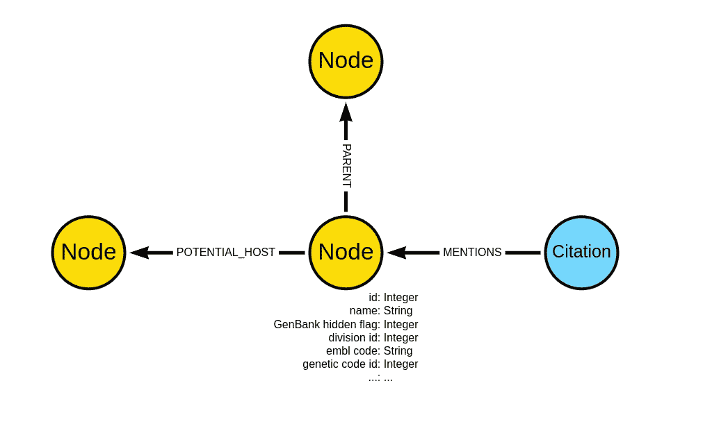
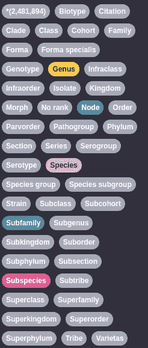
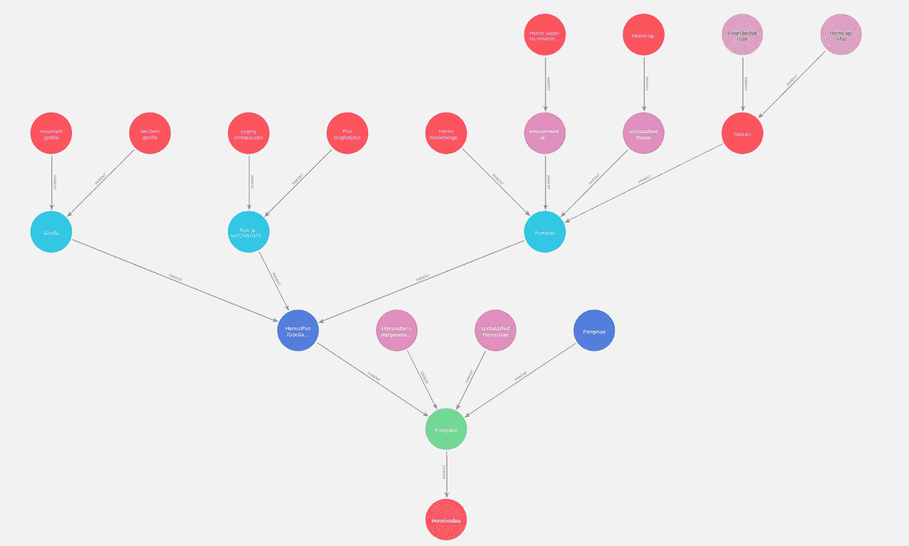
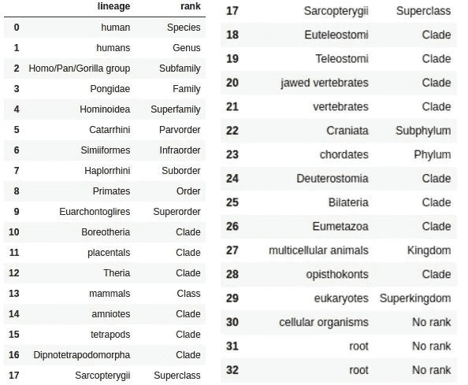
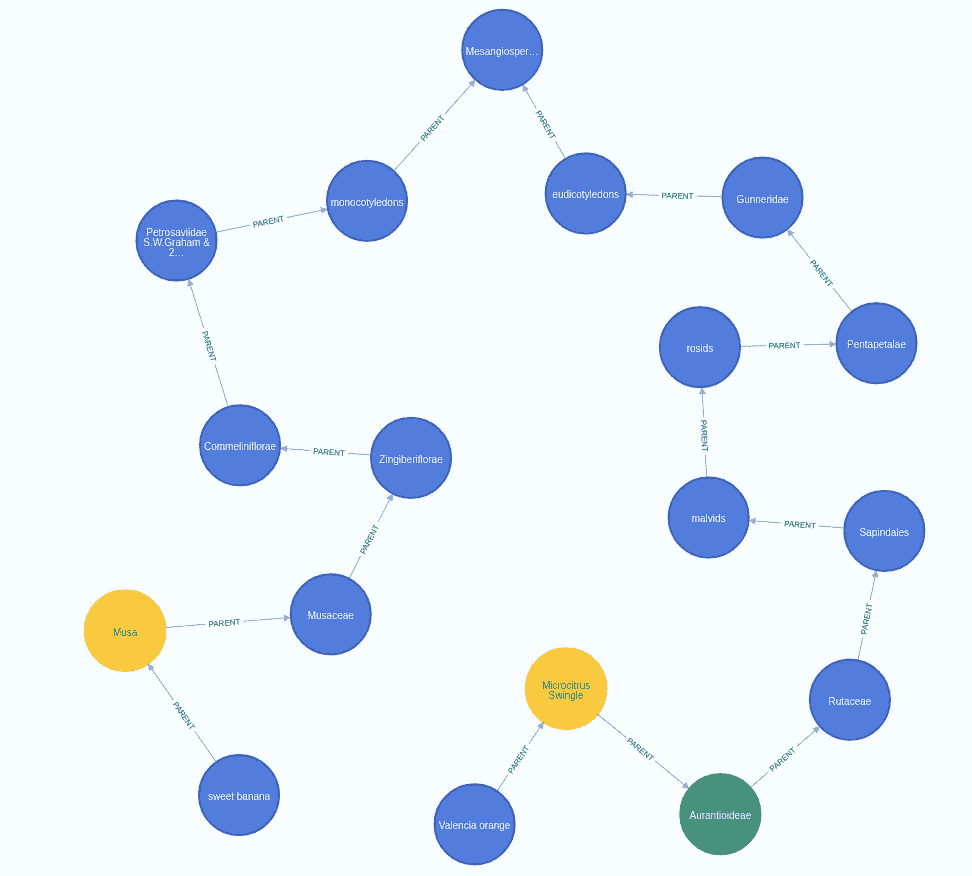
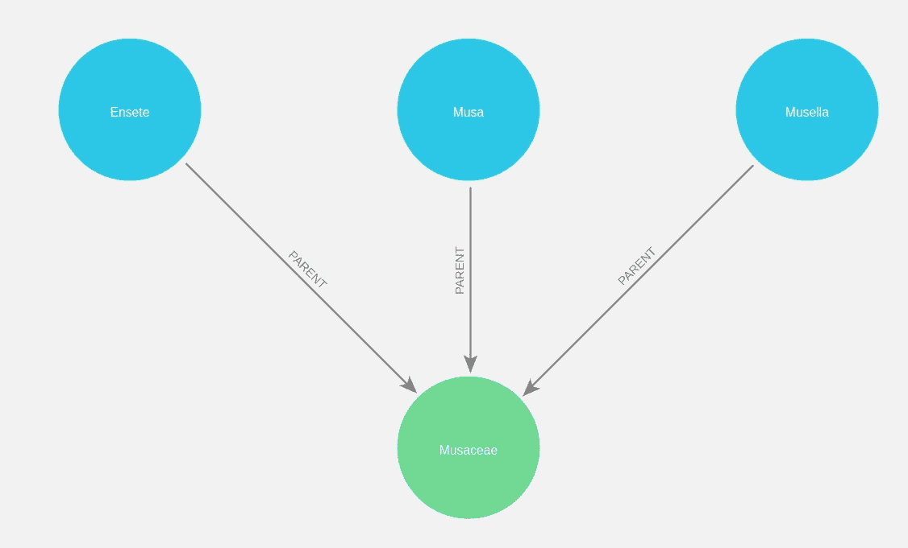
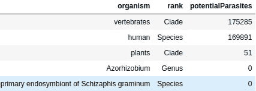
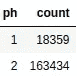
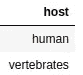
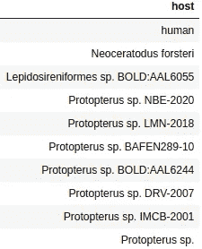

# 用 Neo4j 分析地球生命的演化

> 原文：<https://towardsdatascience.com/analyzing-the-evolution-of-life-on-earth-with-neo4j-7daeeb1e032d>

## 在图形数据库中探索 NCBI 生物分类学

生命的进化是一个美丽而深刻的研究领域，它将我们的起源追溯到生命的开端。它帮助我们理解我们从哪里来，以及我们潜在的去向。物种之间的关系通常在生命树中描述，这是一种用于描述各种物种之间关系的模型。由于树结构是图形的一种形式，因此将这些关系存储在图形数据库中进行分析和可视化是有意义的。

在这篇博文中，我决定将 NCBI 生物分类系统导入到图形数据库 [Neo4j](https://neo4j.com/ž) 中，在这里我们可以方便地遍历和分析不同物种之间的关系。

## 环境和数据集设置

要了解本文中的代码示例，您需要下载 [Neo4j 桌面应用程序](https://neo4j.com/download/)。我准备了一个数据库转储，您可以使用它轻松启动并运行 Neo4j 数据库，而不必自己导入数据集。如果你需要一些关于恢复数据库转储的帮助，看看我之前的博文。

 [## NCBI-分类-neo4j.dump

### 编辑描述

drive.google.com](https://drive.google.com/file/d/1-TNOU3KKEaDH6AtXJRQxzy8yRimx41Zt/view?usp=sharing) 

原始数据集可在 NCBI 网站上获得。

 [## /发布/分类的索引

### 编辑描述

ftp.ncbi.nlm.nih.gov](https://ftp.ncbi.nlm.nih.gov/pub/taxonomy/) 

我已经使用 2022 年 6 月 13 日下载的新分类转储文件夹创建了上述数据库转储。虽然没有为数据集指定明确的许可，但 [NCBI 网站声明](https://www.ncbi.nlm.nih.gov/home/about/policies/)所有信息在公共领域内都是可用的。

如果你想评估这个过程或者进行任何修改，我已经在我的 GitHub 上提供了用于将分类法导入 Neo4j 的代码。

## 图表模式

我已将以下文件导入 Neo4j:

*   节点. dmp
*   names.dmp
*   host.dmp
*   引文. dmp

其他一些文件有冗余信息，这些信息已经存在于包含生物体分类的`nodes.dmp`文件中。我看了一点遗传密码文件，但是由于我不知道如何处理遗传密码名称和它们的翻译，我在导入时跳过了它们。

使用上面的四个文件，我构建了下面的图形模式。



分类图表模式。图片由作者提供。

我已经为所有出现在`nodes.dmp`文件中的节点添加了一个通用标签**节点**。带有通用标签节点的节点包含多个属性，可用于导入其他文件并帮助专家更好地分析数据集。对我们来说，只有**名称**酒店才是相关的。分类层次用节点之间的**父**关系来表示。该数据集还包含一个描述各种物种的潜在宿主的文件。最后，一些节点在各种医学来源中被提及，它们被表示为**引用**节点。

所有带有通用标签**节点**的节点都有一个描述其等级的次级标签。等级的一些例子是种、科和属。数量太多，无法一一列举，所以我准备了一张截图，上面有所有可用的节点标签。



数据库中所有可用的节点标签。图片由作者提供。

## 探索性分析

该分析中的所有代码都可以在 GitHub 上以 Jupyter notebook 的形式获得，尽管查询已被修改为使用 Pandas Dataframe 而不是可视化工具。

我在数据集中寻找**智人**物种，但是没有找到。有趣的是，NCBI 的人们决定将我们这个物种简单地命名为人类。我们可以用下面的 Cypher 语句检查最多四跳的分类邻域:

```
MATCH p=(n:Node {name:"human"})-[:PARENT*..4]-()
RETURN p
```

*结果*



人类物种的分类邻域。图片由作者提供。

我在 Neo4j Bloom 中进行可视化，因为它提供了一个层次化的布局，非常适合可视化分类法。使用 Neo4j Bloom 的一个优点是，它允许不熟悉 Neo4j 或 Cypher 的用户检查和分析图形。如果你想了解更多关于 Neo4j Bloom 的信息，请点击这个[链接。](https://neo4j.com/product/bloom/)

因此，人类结节是属于人类属的物种，人类属是 Pongidae 家族的一部分。在谷歌上快速搜索后，似乎 Pongidae 分类已经过时，应该使用 Hominidae，它在 NCBI 分类中是一个超级科。有趣的是，人类物种有两个亚种，即尼安德特人和丹尼索瓦人，在 homo sp 阿尔泰节点下有代表。我刚刚了解了一些关于我们历史的新情况。

NCBI 分类数据集仅包含地球上 10%的已描述物种，因此如果数据集中有缺失的物种，不要感到惊讶。

让我们用下面的 Cypher 语句来检查数据集中有多少物种:

```
MATCH (s:Species)
RETURN count(s) AS speciesCount
```

数据集中描述了近 200 万种物种，这意味着有足够的空间去探索。

接下来，我们可以使用一个简单的查询来检查人类物种的分类层次结构，一直到树的根:

```
MATCH (:Node {name:'human'})-[:PARENT*0..]->(parent)
RETURN parent.name AS lineage, labels(parent)[1] AS rank
```

*结果*



人类物种的分类学等级。图片由作者提供。

似乎从人类节点到根节点需要 31 次遍历。由于某种原因，根节点有一个自循环(与自身的关系)，这就是它在结果中出现两次的原因。此外，一个进化枝，一群从共同祖先**、**进化而来的生物，在层级中多次出现。看起来 NCBI 分类法比你在谷歌上快速搜索所能找到的更加丰富。

像 Neo4j 这样的图数据库也非常擅长寻找图中节点之间的最短路径。现在，我们可以回答一个关键问题:苹果和橙子在分类学上有多接近。

```
MATCH (h:Node {name:'Valencia orange'}), (g:Node {name:'sweet banana'})
MATCH p=shortestPath( (h)-[:PARENT*]-(g))
RETURN p
```

*结果*



香蕉和橘子之间的最短路径。图片由作者提供。

看来，甜香蕉和夏橙之间最接近的共同祖先是 Mesangiospermae 进化枝。Mesangiospermae 是开花植物的一个分支。

遍历关系的另一个用例可能是找到与某个特定物种属于同一个家族的所有物种。在这里，我们将把所有的属都想象成甜香蕉。

```
MATCH (:Node {name:'sweet banana'})-[:PARENT*0..]->(f:Family)
MATCH p=(f)<-[:PARENT*]-(s:Genus)
RETURN p
```

*结果*



与甜香蕉同科的一个属。图片由作者提供。

甜香蕉属于芭蕉属和芭蕉科。有趣的是，有一种 Musella 属，听起来像小芭蕉。事实上，在谷歌上搜索了 Musella 属之后，看起来只有一个物种出现在 Musella 属中。该物种通常被称为中国矮香蕉。

## Neo4j 推理

在最后一个例子中，我们将看看如何在 Neo4j 中开发推理查询。推理意味着我们基于节点之间的一组规则创建新的关系，并将它们存储在数据库中或仅在查询时使用它们。在这里，我将向您展示一个推理查询的例子，它只在查询时分析潜在的主机时使用新的关系。

首先，我们将评估哪些生物体在数据集中描述了潜在的寄生虫。

```
MATCH (n:Node)
RETURN n.name AS organism,
       labels(n)[1] AS rank,
       size((n)<-[:POTENTIAL_HOST]-()) AS potentialParasites
ORDER BY potentialParasites DESC
LIMIT 5
```

*结果*



具有潜在寄生虫的生物体计数结果。图片由作者提供。

似乎人类是被描述得最多的，也是唯一有潜在寄生虫的物种。我大胆猜测，大多数(如果不是全部的话)人类的潜在寄生虫也是脊椎动物的潜在寄生虫，因为数量非常接近。

我们可以用下面的 Cypher 语句来检查生物有多少潜在的宿主。

```
MATCH (n:Node)
WHERE EXISTS { (n)-[:POTENTIAL_HOST]->()}
WITH size((n)-[:POTENTIAL_HOST]->()) AS ph
RETURN ph, count(*) AS count
ORDER BY ph
```

*结果*



图片由作者提供。

18359 生物只有一个已知的宿主，而 163434 有两个已知的宿主。因此，我关于大多数攻击人类的寄生虫也可能攻击所有脊椎动物的假设是有效的。

这就是推理查询发挥作用的地方。我们知道脊椎动物是生物分类学中更高一级的分类单元。因此，我们可以从脊椎动物到物种水平来研究哪些物种可能被用作宿主。

我们将使用猴痘病毒的例子，因为它与这次有关。首先，我们可以评估它的潜在宿主。

```
MATCH (n: Node {name:"Monkeypox virus"})-[:POTENTIAL_HOST]->(host)
RETURN host.name AS host
```

*结果*



图片由作者提供。

请注意，人类和脊椎动物都被描述为猴痘病毒的潜在宿主。然而，假设我们想要检查所有可能受到病毒威胁的物种。

```
MATCH (n: Node {name:"Monkeypox virus"})-[:POTENTIAL_HOST]->()<-[:PARENT*0..]-(host:Species)
RETURN host.name AS host
LIMIT 10
```

*结果*



图片由作者提供。

我们使用了一个极限，因为有许多脊椎动物。不幸的是，我们不知道它们中的哪些已经灭绝，因为这将有助于我们筛选出它们，并只识别仍然活着的猴痘病毒的潜在受害者。然而，它仍然是 Neo4j 中推理的一个很好的例子，我们在查询时根据预定义的规则集创建或推断一个新的关系。

## 结论

我真的很喜欢写这篇文章，因为它给了我一个探索香蕉和橙子分类的机会。你可以作为一个业余爱好者使用这个数据集来探索你最喜欢的物种，甚至在一个更专业的环境中。只需下载[数据库转储](https://drive.google.com/file/d/1-TNOU3KKEaDH6AtXJRQxzy8yRimx41Zt/view?usp=sharing)，加载到 Neo4j 中，就可以开始了。

代码可在 [GitHub](https://github.com/tomasonjo/blogs/blob/master/ncbi/NCBI%20taxonomy%20-%20import.ipynb) 上获得。