# 分析嵌入空间中的变压器—已解释

> 原文：<https://towardsdatascience.com/analyzing-transformers-in-embedding-space-explained-ef72130a6844>

## 如何和为什么透过嵌入空间棱镜看

照片由[丹·迪勒梅达](https://unsplash.com/@ddealmeida?utm_source=unsplash&utm_medium=referral&utm_content=creditCopyText)在 [Unsplash](https://unsplash.com/s/photos/clear?utm_source=unsplash&utm_medium=referral&utm_content=creditCopyText) 上拍摄

在这篇文章中，我提交了盖伊·达尔、莫尔·杰瓦、安基特·古普塔和乔纳森·贝兰特的论文“ [**分析嵌入空间中的变形金刚**](https://arxiv.org/abs/2209.02535)”(2022)。盖伊·达尔就是我:)

在本文中，我们提出了一种新的方法来解释变压器，使其参数更容易解释。我们表明，一些变压器权重可以被“说服”来解释它们的意思。我们使用一种简单而非常有效的技术将模型的权重转化为令牌。我们可以将所有权重转换为令牌上的向量和矩阵。因此，他们不再依赖于他们来自的模型。然后，我们可以连接使用相同记号赋予器的不同模型。我们的工作在很大程度上依赖于杰瓦等人(2020，2022)和埃尔哈格等人(2021)。

# 动机

变压器模型是自然语言处理和许多其他 ML 子领域的核心。随着变形金刚可用性的提高，责任也越来越大，人们想知道是什么让他们的模型运转起来。模特通常有偏见(性别、种族等)，可能不诚实——从阴谋性的互联网内容中获取信息，偶尔使用辱骂性语言。随着越来越多的敏感应用程序使用转换器，理解它的“决策”过程是至关重要的。这种推理产生了一个叫做**可解释性的研究领域。为了使模型的输出更容易理解，研究人员发明了许多有趣的技术。然而，除了少数例外，大多数都需要将输入馈入变压器，并且通常还需要计算梯度。**

我们的方法只使用矩阵乘法，不需要输入例子。它可以应用于单个权重，而不是一次应用于所有权重。参数的解释不像其他可解释性技术那样局限于某些输入。使用我们的方法，一个参数从它的特征空间被转换到另一个通用空间——嵌入空间**——其中坐标是词汇表的条目(通常不严格地称为“记号”)。由于参数不再在特定于模型的特征空间中表示，而是在公共嵌入空间中表示，所以我们可以将它们与另一个模型中的参数进行比较，甚至可能在另一个模型中使用来自一个模型的知识。我们在下面展示实验来支持这一点。**

# **术语**

为了准确地描述我们的方法，我们需要简要地介绍以前工作中介绍的术语。

我们遵循 Geva 等人(2020)的思路，将 FF 模块视为一种注意力: *f* ( **QK** ^T) **V** ，其中 **Q** 为 FF 模块的输入， **K** 为前馈模块第一层的权重， **V** 为第二层的权重。与原来的注意机构不同的是， *f* 是 GELU 而不是 softmax， **K** 和 **V** 是输入独立的。我们称 K 为 **FF 键**，V 为 **FF 值**。

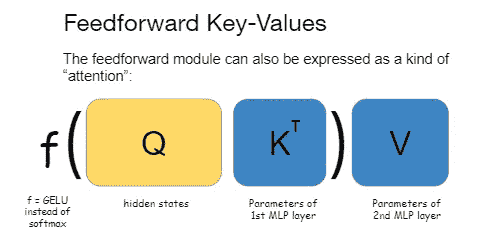

图:FF 模块表示为“注意”

下一个概念由 Elhage 等人(2021)提出，我们称之为“相互作用矩阵”。这次我们将重点放在*注意力*模块上。

给定注意力模块的一个输入 X，我们计算 Q_att = X W_Q，K_att = X W_K，V_att = X W_V，然后我们把它们分成头。我们可以等效地预先将权重矩阵分成头，并得到相同的结果:

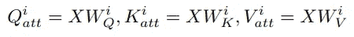

事实证明，注意力查询的权重(W_Q)和关键点的权重(W_K)总是一起起作用——因此计算 W_QK 是有意义的——注意力**查询-关键点矩阵**:

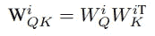

现在，回想一下，在连接该层中所有注意力头部的输出之后，我们对连接的头部应用线性变换 W_O。事实证明，关注值矩阵 W_V^i 的每个头总是与关注输出矩阵 W_O 的某个片段交互——我们将其命名为 W_O^i.。类似于查询和键，值和输出头可以组合成每个头的单个矩阵:

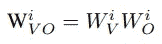

注意力**价值-输出矩阵**。下图对此进行了总结:

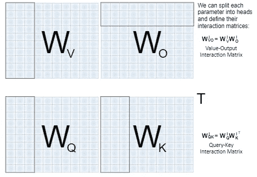

图 3:交互作用矩阵的构建以图形方式呈现

# **如何投影模型参数？**

嵌入空间是本文的中心主题，在我们继续之前有必要简单讨论一下。嵌入空间是我们用于向量空间的一个术语，其中每个坐标对应于记号赋予器的词汇表中的一个词汇表条目(有时也称为“记号”)。我们区分了标记和词汇项，其中我们认为词汇项是词汇的元素，而标记是在标记一段文本时产生的(潜在的重复)词汇项。这些术语经常被作者互换使用，但是为了清楚起见，我们做了区分。

为什么会想到嵌入空间？嵌入空间中的向量可以被认为表示单词的加权和。当我们在嵌入空间中执行操作时，我们实际上是在词汇项目上接受一个“分布”或分数(它们不是真正的分布，因为它们不被限制为正或总和为 1)，并输出项目上的另一个分数向量。然而，变压器在密集向量的潜在空间(又名特征空间)中运行。顺便提一下，您可能对嵌入领域的操作很熟悉。事实上，它们让人想起了早期的方法，如 TF-IDF 和词袋分类器，在这些方法中，分数是直接通过对令牌的操作获得的。

我们能否将密集特征空间中的变形器操作转化为嵌入空间中的词汇项操作？我们相信答案是肯定的，至少部分是肯定的。

**残流**

剩余流是另一个概念，出现在以前的工作中(例如，nostalgbraist，2020)，它是变压器层的不同视图。剩余流视图规定模型的隐藏状态在各层之间相对不变，在这个意义上，第 I 层之后的隐藏状态通常是离第(i+1)层之后的隐藏状态不太远 *的*。其原因是层间的残余连接。剩余连接获取第(i+1)层的输出，并将其添加到第 I 层之后的隐藏状态。**

事实证明，第 I 个隐藏状态通常比它被添加到的向量(第(i+1)层的输出)更占优势。这种观点也可以直观地解释:下一个单词的预测通常在转换器的早期是可能的，因为它通常需要简单的推理。然而，一些输入需要更复杂的处理，然后更深的层开始影响最终决策。

不考虑每层的隐藏状态，我们可以把隐藏状态想成是**剩余流**，它只是随着每一层的增加而略微更新。从某种意义上说，每一层从剩余流中读取并写入剩余流，如下图所示:

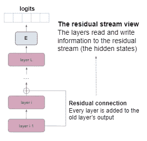

这种观点的一个推论是，在许多情况下，我们可以忽略模型的最后几层，并得到差别不大的预测。从某种意义上说，在变压器中“提前退出”是可能的。

通过扩展，我们可以将每个隐藏状态视为最后一个隐藏状态。这是一个重要的观察结果。**是什么让它如此重要？**最后一个隐藏状态非常显著。在 Transformer 中，最后一个隐藏状态乘以嵌入矩阵 **E** 并产生模型的逻辑——它给每个词汇项的*分数。如果所有的隐藏状态都是“有点像上一个状态”，就像我们上面解释的，也可以用 **E** 投影到嵌入空间！*

类似地，就像最终的隐藏状态一样，投影的隐藏状态在模型的这一层产生**模型的 logits！**换句话说，在层 *i* 投影隐藏状态(或者残差流，如果你喜欢的话)给了我们模型对下一个令牌的当前预测。

杰瓦等人(2020，2022)对此更进了一步，他们假设，由于 FF 值只是在每一层的隐藏状态中求和，也许它们代表了一个概念(动物、形容词、名字等)。)投影到嵌入空间时— *形成构成隐藏态的原子*。他们展示了帮助他们支持这一主张的实证结果。

但是有人可能会问:其他参数组呢？注意力输出也被添加到残差流中，FF 键正在与来自上一层的隐藏状态进行交互。形成注意力矩阵的 W_QK 呢？能不能翻译成定义词汇项之间亲和度的矩阵？这就是我们着手调查的！

**导出其他参数投影方案**

我们应用于隐藏状态和 FF 值的上述技术可以扩展。我们用一个非常简单的观察:如果 **h** 是一个隐藏态，我们可以用 **E.** 把它投影到嵌入空间，这样，我们可以把带有 **h** 的内积想象成它们发生在嵌入空间中:**h*****w**=(**hE)*****(E’w)**，其中**E’**

所以举个例子，当我们计算一个隐藏状态 **h** 和一个 FF 键之间的相互作用时，我们可以在嵌入空间中重写这个相互作用。由于**和**被识别为当前模型的预测“分数”，我们可以认为内积决定了当前预测与关键字编码的概念的对应程度。

该逻辑可用于重新解释嵌入空间中的模型，其中交互(如带有 FF 键的隐藏状态)被重新转换为嵌入空间中的交互，并且添加到残差流的向量(如 FF 值)在用 **E** 投影时被认为是可解释的。整个过程我们就不细说了。下面，我们提供了一个总结我们发现的表格。

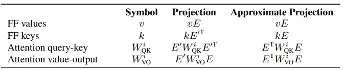

显示我们解释模型参数的方法的表格

正如你在表格中看到的，我们没有使用真正的右逆，而是使用了 **E' = E^T** ，尽管它不是 **E** 的真正右逆。这是因为 Penrose-Moore 右逆，一个流行的右逆公式，与我们的解释方法表现不佳，原因在我们论文的附录 A 中解释。^T 实际上足够接近嵌入矩阵的逆矩阵，至少对我们来说是这样。**详见** — **参见**文件附录 A。

下面是我们对嵌入空间的投影示意图:

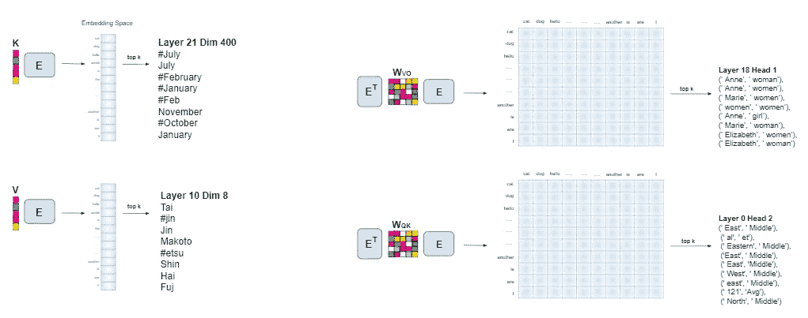

建议程序的示意图演示

# **示例**

FF 的键和值都是向量，它们在嵌入空间中被投影成向量。类似地，W_VO 和 W_QK 是矩阵，并且它们被投影到嵌入空间中的矩阵，即它们对于每一对词汇项都有一个条目。由于嵌入空间很大，当解释一个向量或矩阵时，我们不可能显示所有的条目。相反，我们选择一个整数 *k* 并在向量或矩阵中呈现前 *k* 个条目。

在下文中，我们从 GPT-2 培养基的重量中展示几个有趣的例子。例如，你知道 GPT-2 媒体有一个加拿大头(在 W_VO)？

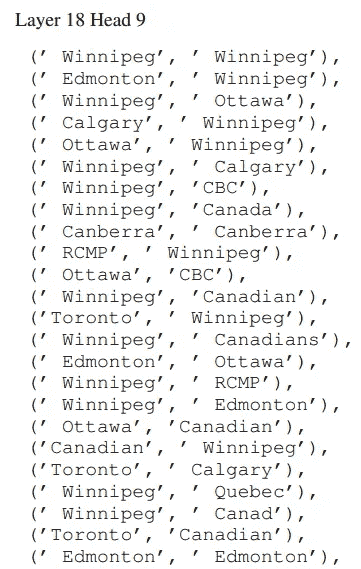

还有一个说英式英语的脑袋:

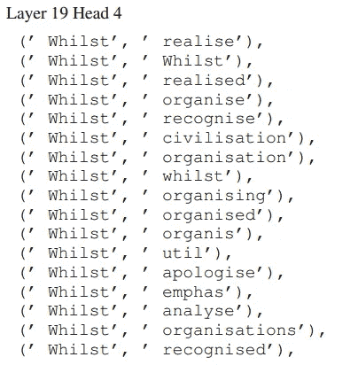

更多地理信息:

还有一些非常独特的头:

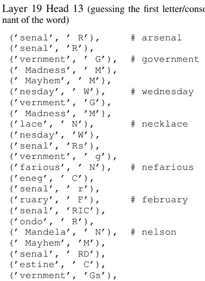

此外，找到正确的介词对流利也很重要:

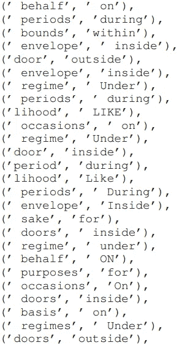

W_QK 有一个合法的头:

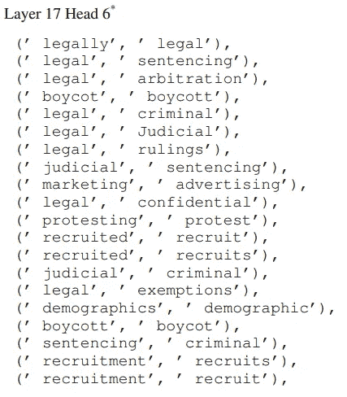

也有数字头脑:

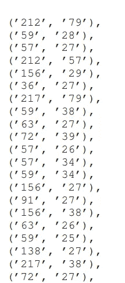

**更多信息请见** **我们论文的附录 B**！

# 应用程序

**微调方向可以解释**

我们在 IMDB 电影评论(正面或负面评论)上微调了预训练模型的分类头和最后三层，结果表明参数移动的方向是**可解释的**。具体来说，微调位移向量——微调模型和原始模型参数之间的差异——要么强调与正面评论相关的标记，要么强调负面评论。示意性:

接下来，我们表明模型在嵌入空间中学习相似的表示。

**跨型号的参数对齐**

我们使用的是 MultiBERTs (Sellam 等人，2022 年)，这是一个根据相同数据和不同随机种子训练的 BERT 模型集合。根据我们的理论，我们可以把两个独立的模型都投影到嵌入空间。一个重要的观察:由于嵌入空间只取决于词汇表，**嵌入空间是** **共享的**！一旦我们将两个模型的参数投影到嵌入空间(每个都有自己的嵌入矩阵)，所有的参数都在同一个空间。他们现在有共同的语言，我们可以比较他们。当我们将第一个模型的参数与第二个模型的参数进行匹配时，发现同一层的参数与另一个模型中*同一层* *的参数最为相似。这意味着来自两个模型的层在相似的层中学习语义相似的概念，但是每个层都在自己的特征空间中表示它。虽然特征空间表示是任意的并且依赖于随机性，但是嵌入空间是规范的和稳定的。这就是为什么我们可以在嵌入空间中比较模型！*

在下图中，我们展示了在嵌入空间(左)和特征空间(右)中两个 BERTs 的参数之间的比较:

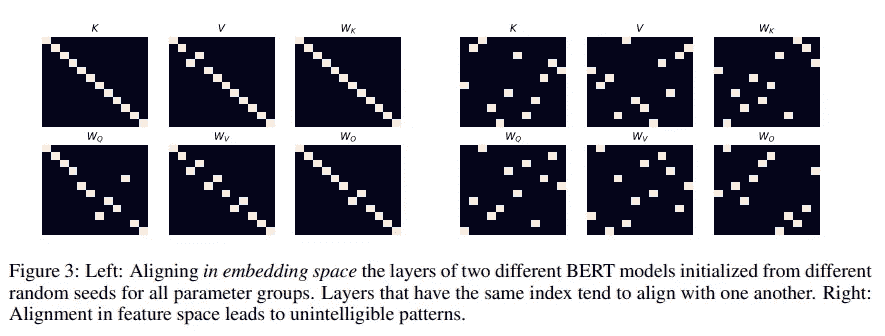

**零次拼接**

想象一下两个模型，一个是预先训练的，另一个是在任务中微调的，比如 IMDB 上的情感分析。如果我们相信两个模型都在嵌入空间中隐式地操作，我们可以*将知识*从微调模型转移到预训练模型*而无需任何训练。*我们需要将微调模型的特征空间转换到预训练模型的特征空间。为此，我们在特征空间 A 中采用隐藏状态，并在模型 A 的嵌入矩阵的帮助下将其投影到嵌入空间，然后我们将*从*嵌入空间投影到特征空间 B——使用模型 B 的嵌入矩阵的右逆。这是一个简单的线性运算符，允许我们“切换”特征空间，现在可以应用模型 B 的微调层。图片:

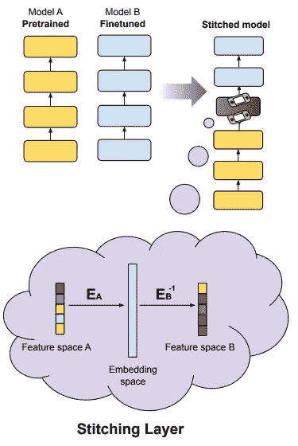

不幸的是，这并不像预期的那样顺利，我们需要重复实验以获得良好的准确性。在情感分析上，我们花了 11 次运行才得到 3 个“好的”拼接模型(准确率> 70%)。进一步的研究可能会解决这个问题。结果如下图所示。*层*轴表示在模型 A 中我们缝合模型 b 的微调层的位置。

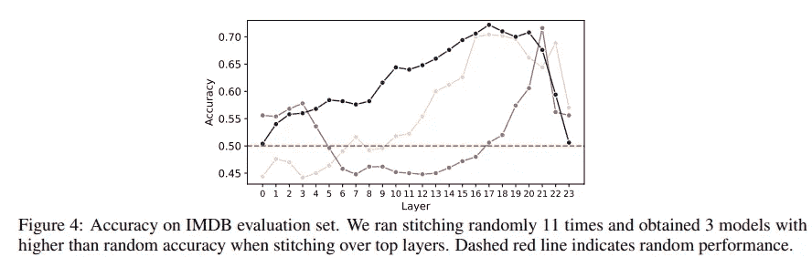

# 最后的话

我们已经看到，转换器可以被视为在嵌入空间中操作，我们可以在单个线性空间中比较不同的模型。我们还提出了一种新的预训练模型参数的可解释性方法。该方法不需要向模型提供输入，也不需要一起解释所有参数。我们相信这在未来会带来许多有趣的应用。重要的是，我们不期望我们的方法是防弹的。然而，我们认为这是第一步，并可能成为令人兴奋的未来进步的基础。

感谢阅读！敬请期待！

**请查看我们的 github 回购:**[**【https://github.com/guyd1995/embedding-space】**](https://github.com/guyd1995/embedding-space)**。**

如果你喜欢这篇文章，你可以在推特上关注我:[https://twitter.com/guy__dar](https://twitter.com/guy__dar)

*所有图片均由作者创作*

# 参考

[1]杰瓦、舒斯特、贝兰特和利维。变压器前馈层是键值存储器，2020。网址[https://arxiv.org/abs/2012.14913](https://arxiv.org/abs/2012.14913)

[2]杰瓦、卡丘拉鲁、王和戈德堡。变压器前馈层通过提升词汇空间 2022b 中的概念来构建预测。网址[https://arxiv.org/abs/2203.14680](https://arxiv.org/abs/2203.14680)。

[3] N .埃尔哈格、n .南达、c .奥尔松、t .赫尼根、n .约瑟夫、b .曼、a .阿斯克尔、y .白、a .陈、t .科内利、n .达萨尔马、d .迪伦、d .甘古利、z .哈特菲尔德-多兹、d .埃尔南德斯、a .琼斯、j .肯宁、l .洛维特、k .恩杜塞、d .阿莫代伊、t .布朗、j .克拉克、j .卡普兰、s .麦卡德里什和 c 变压器电路的数学框架，2021。网址[https://transformer-circuits.pub/2021/framework/index.html](https://transformer-circuits.pub/2021/framework/index.html)。

[4]诺斯特代数学家。解读 GPT:logit 透镜，2020。网址[https://www . less wrong . com/posts/ack Rb 8 wdp Dan 6 V6 ru/interpreting-GPT-the-logit-lens](https://www.lesswrong.com/posts/AcKRB8wDpdaN6v6ru/interpreting-gpt-the-logit-lens)。

[5] T. Sellam、S. Yadlowsky、I. Tenney、J. Wei、N. Saphra、A. D'Amour、T. Linzen、J. Bastings、I. R. Turc、J. Eisenstein、D. Das 和 E. Pavlick。多伯特:鲁棒性分析的伯特再现。2022 年国际学习表征会议。网址[https://openreview.net/forum?id=K0E_F0gFDgA](https://openreview.net/forum?id=K0E_F0gFDgA)。