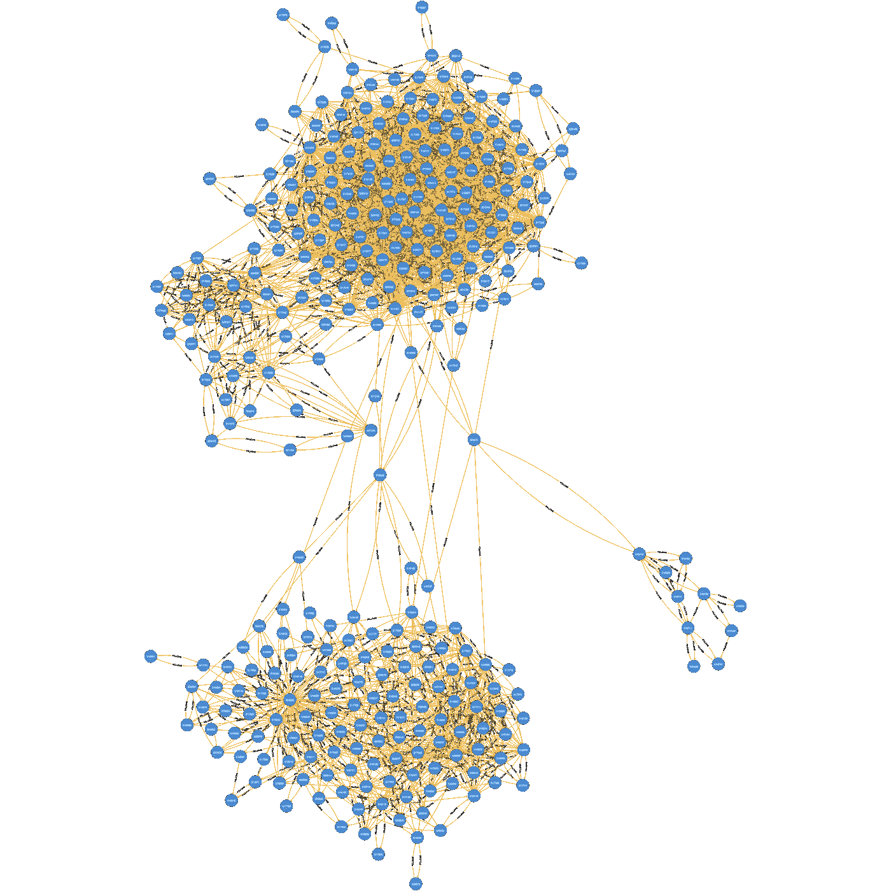
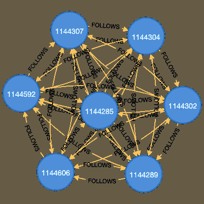
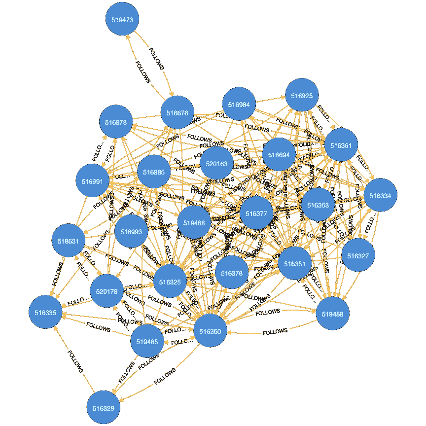
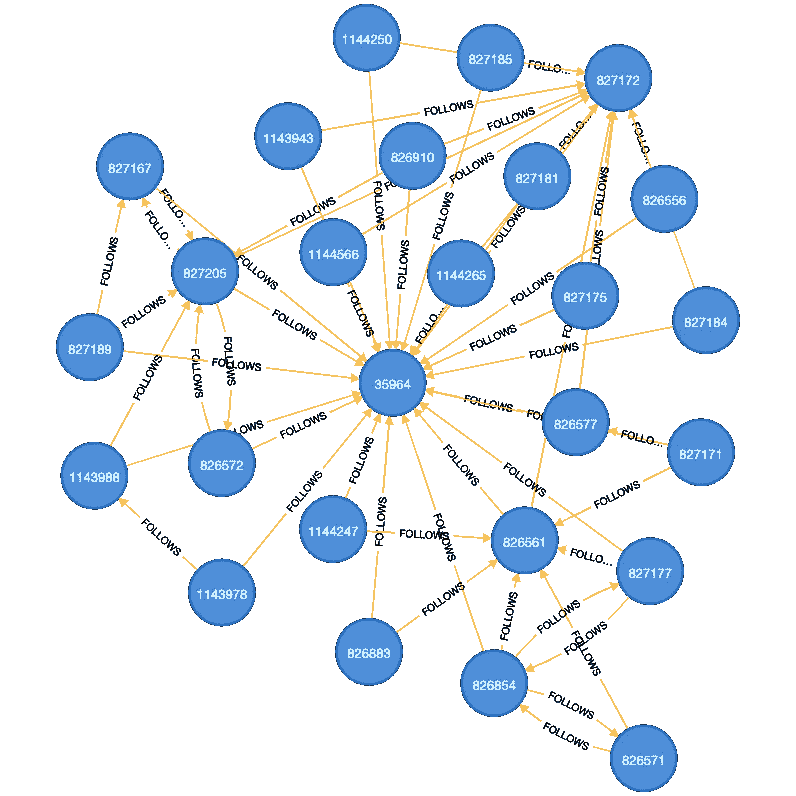

# 分析 Twitter 用户网络

> 原文：<https://towardsdatascience.com/analyzing-twitter-user-network-1cfcef1dd89d>

## 使用中心性和社区检测算法分析 Twitter 用户网络。

在本文中，我们将收集 Twitter 用户和关系。我们将把这些数据加载到图形数据库中。最后，我们来分析一下网络。最终结果是推荐谁跟随。

我们的读者将了解到网络分析是数据科学家和机器学习实践者不可或缺的工具。

执行这些操作的步骤如下:

1.  开发一个应用程序来收集用户和关系
2.  将数据加载到 Neo4j 图形数据库
3.  分析网络数据并提供建议

图片作者。Neo4j 浏览器生成。强连通分量社区图。该社区有 331 个节点

# 收集用户和关系

## 获取 Twitter 数据

Twitter 为开发者提供了获取数据的 API。为此，我们需要:

*   注册一个开发者帐户。详情[此处](https://developer.twitter.com/en/docs/twitter-api/getting-started/getting-access-to-the-twitter-api)。
*   转到开发者门户。创建应用程序。生成 API 密钥、API 密钥、访问令牌和访问令牌密钥。将这些值保存在 twitter4j.properties 文件中。这是 Twitter4J 使用的一个配置文件，Twitter 4j 是一个我们用来轻松访问 Java 的 Twitter API 的库。[这里的](https://gist.github.com/mananai/6ca8aff9e78bd388cca1968a866e2d5d)是一个样本。

一旦我们获得了访问权，我们就可以开始开发应用程序来收集数据。有两部分。收集 Twitter 用户。然后，收集用户关系。

## 收集用户

首先，我们收集用户。该应用程序将执行以下操作:

*   获取指定位置的趋势。它们是典型的流行标签。我们通常会收到 50 封。然后，我们过滤掉提升的。
*   对于每一个趋势，我们都会搜索推文。每个搜索结果有 100 条推文。为了获得更多的推文，我们可以搜索更多的页面。此外，还有一个 API 速率限制。我们需要在每次调用之间有一些延迟，以避免速率限制。
*   对于搜索结果中的每条 tweet，我们都会得到一个用户。此外，如果推文被转发，我们会得到被转发的用户。如果这条推文引用了另一条推文，我们就获得了被引用推文的用户。
*   我们将所有用户保存到一个关系数据库表中。

这个[类](https://gist.github.com/mananai/481fd75eefd2d91f22077fb4faf9f433)和这个[类](https://gist.github.com/mananai/b74378ec70999ba680616c41e4627c1a)是应用程序的 Java 类。同样，使用这个 [DDF](https://gist.github.com/mananai/b2c2223dc9c178bfa78ddbdbe08e9efe) 来创建用户表。我们将整个 Java 项目放在 GitHub [库](https://github.com/mananai/TwitterUserNetwork/tree/master/TwitterUserNetwork)中。

我们从 2022 年 6 月 11 日到 2022 年 6 月 14 日运行这个应用程序。我们有超过 20，000 名用户。

## 收集关系

在第二部分，我们收集一个用户如何关注其他用户。我们已经在这篇[文章](/building-a-network-graph-from-twitter-data-a5e7b8672e3)中详细讨论了这一点。[这里的](https://gist.github.com/mananai/7ec403b8e2235ecd8f2870eec62418e4)是获取关系的主要代码。

我们将关系存储在一个表中。DDF 来了。

我们对 20，000 名用户进行了测试。我们有超过七百万的关系。

## 导出用户和关系

使用以下查询将用户数据导出到 CSV 文件。

使用以下查询将关系数据导出到另一个 CSV 文件。

# 将数据加载到图形数据库

## 数据库准备

我们需要创建一个新的图形数据库来存储 Twitter 用户数据。目前，我们有 Neo4j 数据库版本 4.4.7。我们还安装了图形数据科学库 2.0.5。该库提供了一些我们想要使用的图形算法。

## 加载数据

以下是将用户和关系加载到图形数据库的步骤:

*   将这两个 CSV 文件复制到数据库导入目录。
*   创建一个约束。这将确保用户的 id 是唯一的。以下是命令:

*   使用以下命令将用户数据文件加载到图形数据库。该命令使用定期提交来处理大量数据。它指定 id、屏幕名称、姓名、朋友计数和关注者计数属性。id 属性充当主键。

*   使用以下命令将关系数据文件加载到图形数据库。该命令还使用定期提交。它在用户和他们的朋友之间创建了以下类型的关系。

这些脚本将创建一个用户标签和一个关系类型，如下所示。
我们可以使用下面的模式可视化命令来检查模式。

模式如下。

图片作者。由 Neo4j 浏览器使用模式可视化命令生成。

# 网络分析

## 命名图

首先，我们需要创建一个命名图。图形数据科学库中的大多数算法都使用一个命名的图形。

下面的命令创建一个图形。它指定标签名称和关系类型。

所有用户和关系都将出现在此图表中。

## PageRank 算法

PageRank 算法识别网络中有影响的节点。它的工作原理与谷歌网页排名类似。我们运行以下命令来应用该算法，并列出前 20 名用户。

以下是结果。

结果是有道理的。名单中的大多数人都有很高的追随者数量。有些甚至有数百万的追随者。追随者较少的人比追随者较多的人得分更高。这可能是因为:

*   关注度较低的用户可能有更多得分较高的关注度。
*   我们只收集了网络的一小部分。如果网络中有更多的节点，结果可能会改变。

## 强连通分量

强连通分量算法是社区检测的一种。该算法将网络划分为节点组。一个重要的特性是，所有对中的每个节点都可以双向到达另一个节点。

我们运行以下脚本来应用该算法。

该算法为每个节点写入一个社区 id 作为属性。我们运行以下脚本来列出组、它们的大小和成员。该脚本根据社区 id 对用户进行分组，计算社区大小，并显示前几个成员。

结果如下。

请注意，id 是图形数据库节点 id，而不是 Twitter 用户 id。

下一个是每个组的关系数量与最大数量的比率。看看下面的查询。

以下是结果。

顺便说一下，有一个社区的比率是 1.0。让我们看看这个社区。我们有下面的代码来显示社区中的节点。

这是社区图。

作者提供的图像。由 Neo4j 浏览器生成。该社区由强连通分量算法发现。每个用户都关注社区的其他人。

在这个社区，我们观察到每个人都跟随其他人。这就是关系比率为 1.0 的原因。

让我们看看另一个社区，其 sccId 为 516325。这个社区规模更大，有 26 名成员。关系比率相对较高，为 0.28。下面是图表。

作者提供的图像。由 Neo4j 浏览器生成。通过强连通分量算法检测社区。该社区有 26 名成员

由于对社区有更严格的要求，因此规模似乎比其他社区检测算法要小。通过使用以下查询，我们可以找到三个或更多成员的社区中有多少用户。

当我们运行它的时候，我们有大约 3000 个用户。该数字低于初始用户数。所以，我们会尝试另一种算法。

## 标签传播

标签传播是另一种社区检测算法。它的要求没那么严格。首先，我们运行以下代码来检测社区。

该算法向每个节点写入一个社区 id 作为属性。

我们运行以下脚本来列出社区、它们的大小和成员。

这是结果。

通过使用下面的查询，我们可以发现三个或更多成员的社区中有多少用户。

我们发现，大约有 20，000 名用户在拥有三名或更多成员的社区中。这与初始用户数大致相同。

我们可以看看一个标签传播社区。id 为 35964 的有 26 个成员。下图显示了它的样子。

图片作者。Neo4j 浏览器生成。通过标签传播算法检测社区。该社区有 26 名成员

这个标签传播社区比相同大小的 SCC 具有更少的关系。此外，一些节点比其他节点获得更多的传入连接。然而，SCC 更像是一个点对点的社区。

## 个性化页面排名

下一个问题是每个社区的共同利益是什么。我们可以随机检查每个小组的推特账户。更好的方法是从社区成员的角度运行 PageRank 算法。以下代码是应用于社区 id 4854 的 PageRank 算法。

下面的结果显示了从特定社区的角度来看具有最高页面排名的用户。

从上面的结果中，我们应该能够看出谁是社区中有影响力的 Twitter 帐户。此外，如果你知道这些帐户，他们是相关的。

此外，我们试图在下面的单个查询中列出社区及其排名最高的用户。

以下是结果。

像前面的结果一样，一些社区的排名靠前的帐户是相关的。

## 用户推荐

我们的最后一部分是找到我们推荐用户关注的人。典型地，用户会和他们的朋友有相似的兴趣。我们还可以假设一个用户和同一个社区的用户有相同的兴趣。因此，我们可以使用社区个性化 PageRank 算法，删除用户已经关注的帐户。

假设用户 id 是 2138。社区 id 是 4854。查询如下。

结果如下。

# 结论

在本文中，我们收集了 Twitter 用户及其关系。我们已经将数据加载到 Neo4j 图形数据库中。然后，我们做了如下分析:

*   将 PageRank 应用于整个网络，以识别有影响力的用户。
*   使用强连接组件来检测网络中的社区。
*   使用标签传播来发现网络中的组。
*   使用个性化的 PageRank 来寻找共同的兴趣。
*   使用个性化的 PageRank 对用户的社区进行排序，以此来确定用户推荐的起点。

通过将 Twitter 用户视为网络数据，我们发现了社区和社区中的影响者。我们已经提供了应遵循的世卫组织建议。还有更多的应用，尤其是在社交网络领域。

网络分析可以成为数据科学家和机器学习实践者的额外工具。