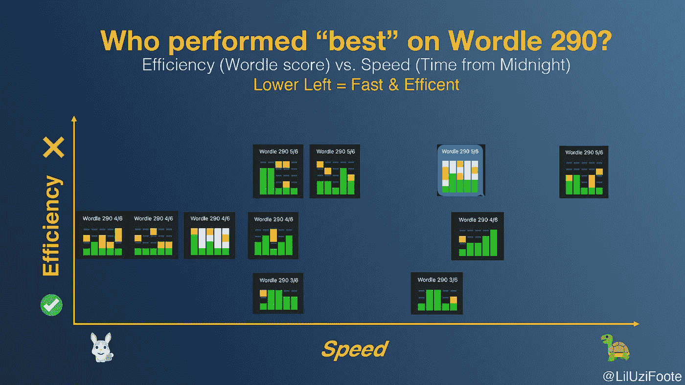
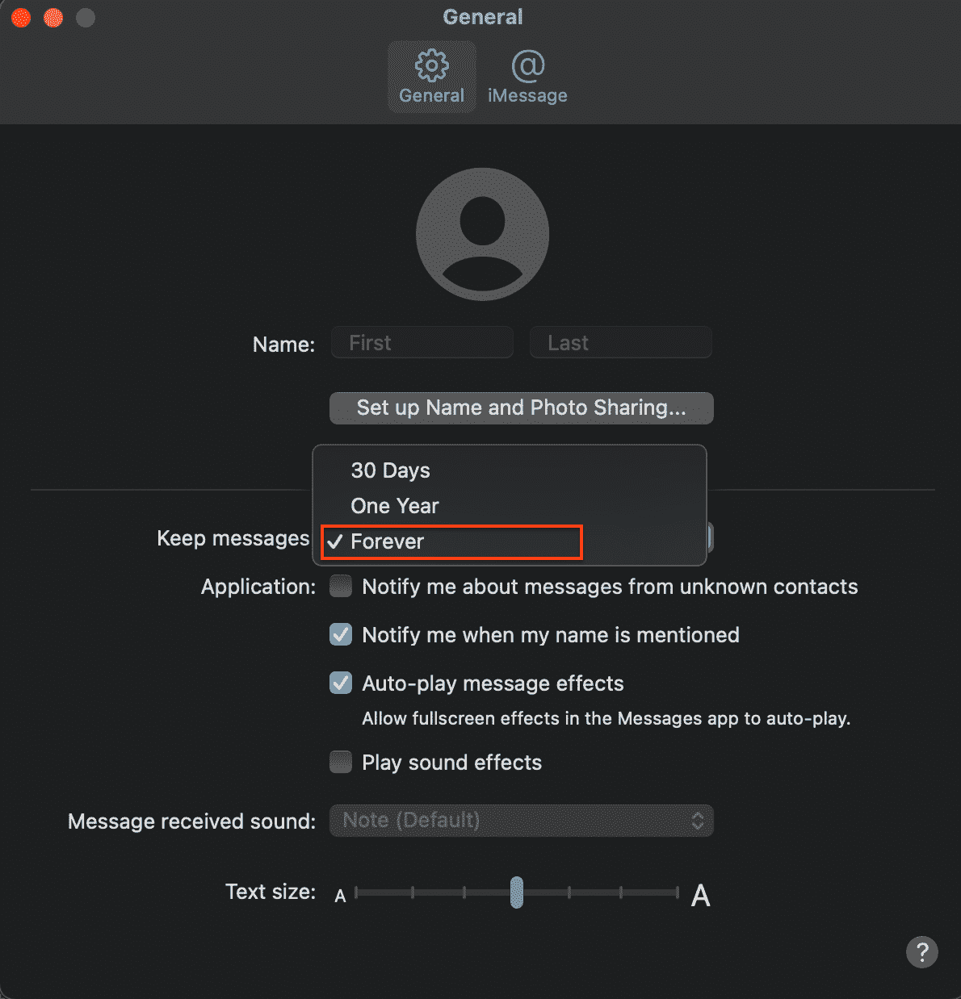
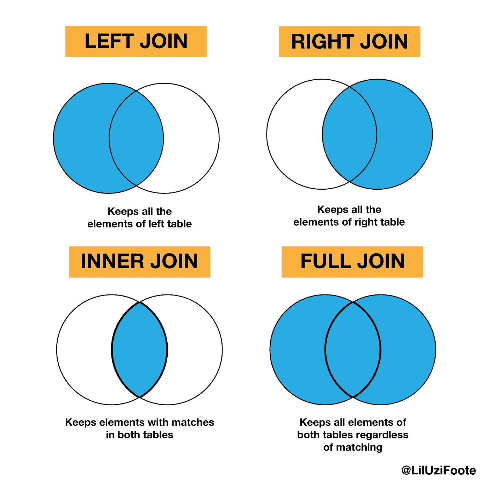
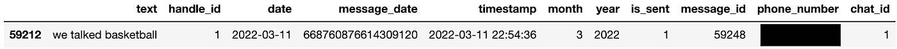
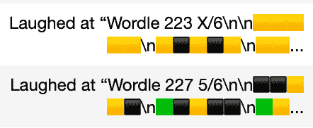
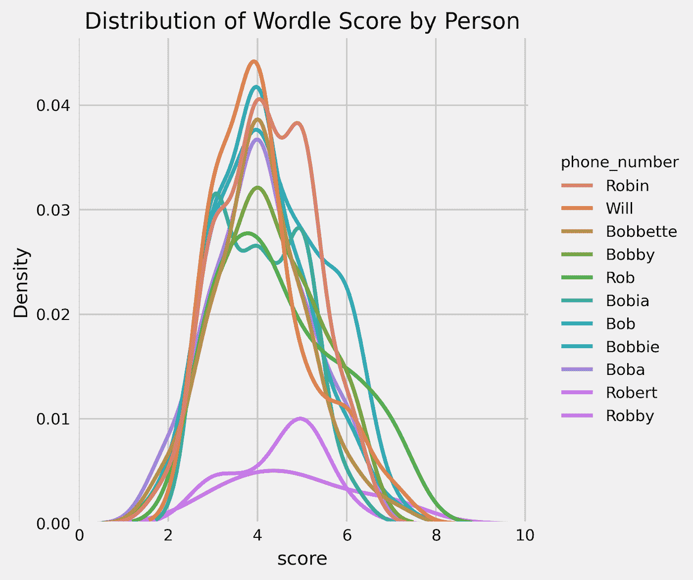
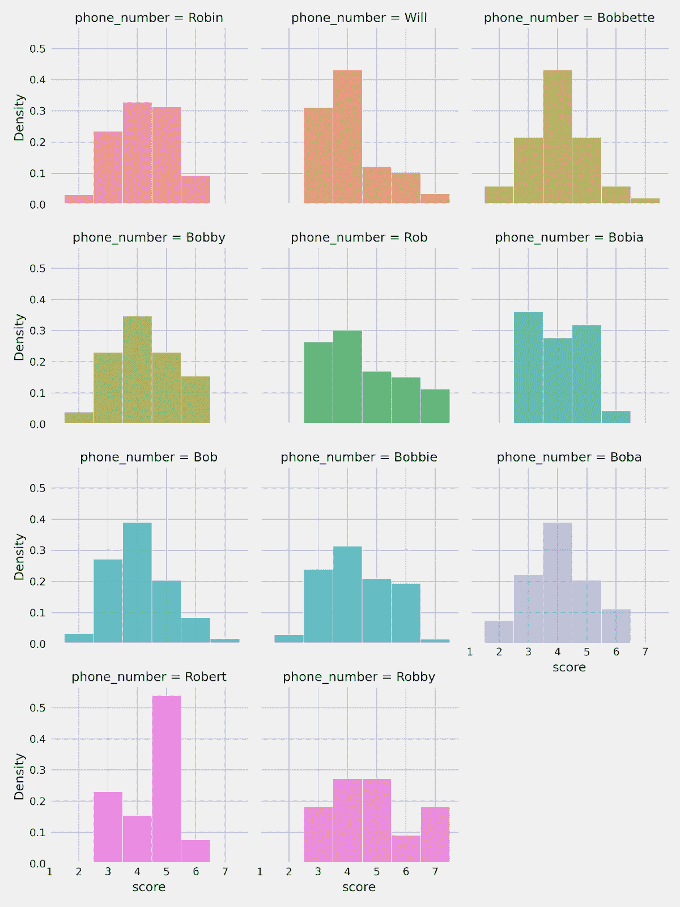
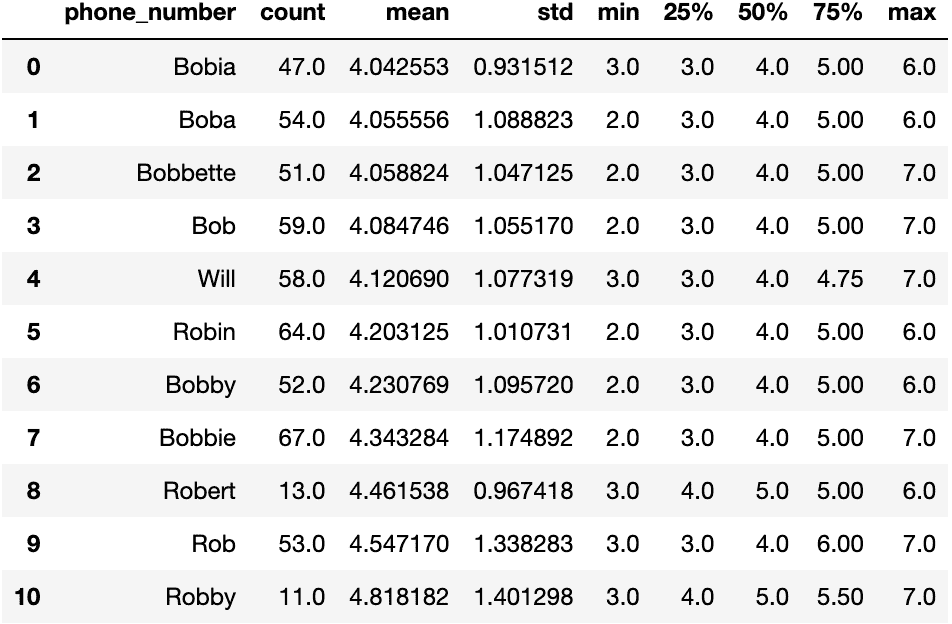
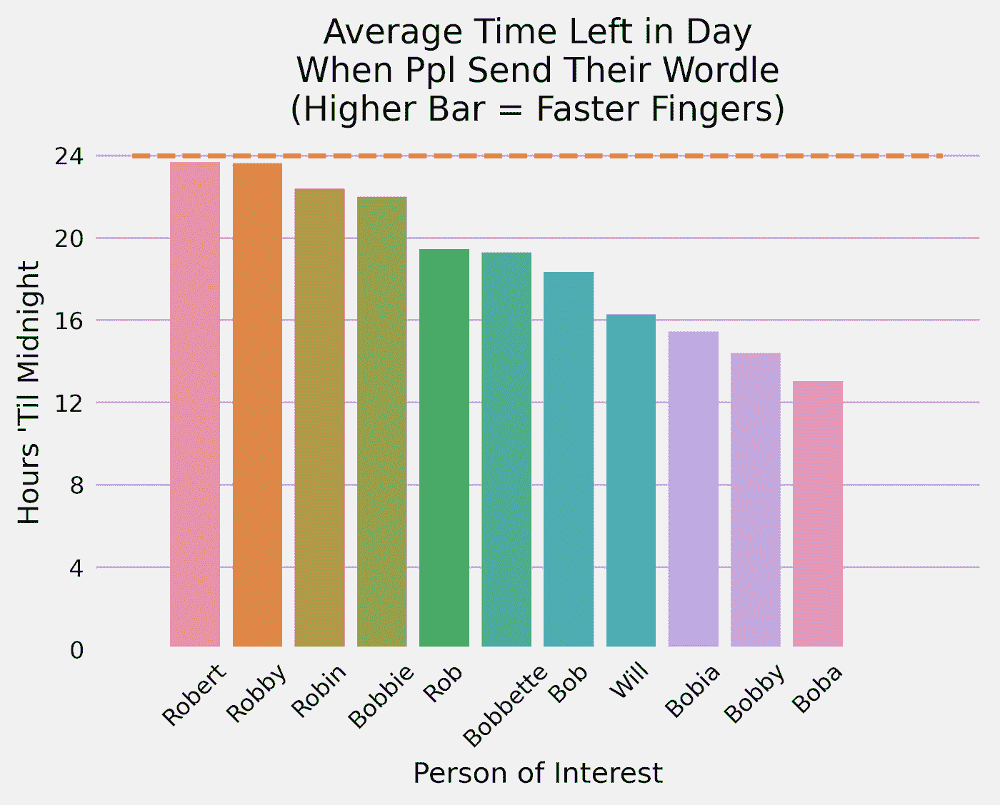
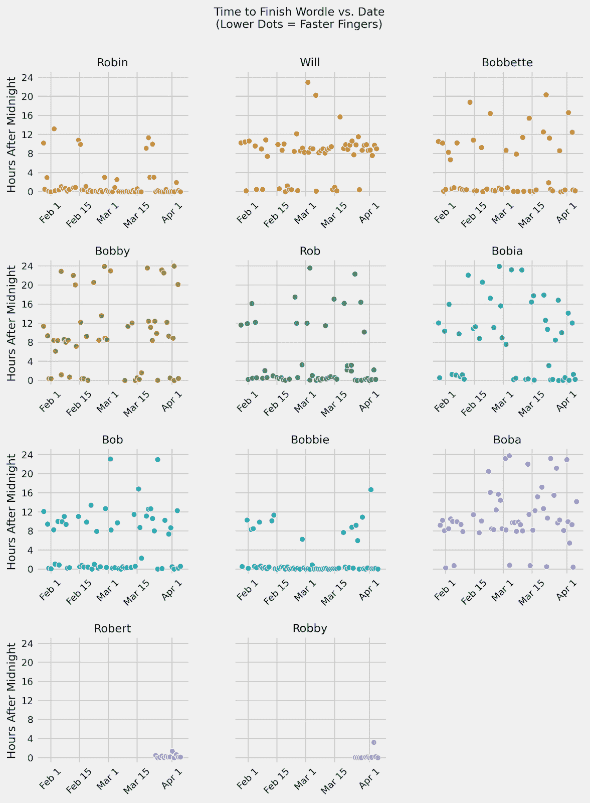

# 使用 Python 分析您朋友的 iMessage Wordle 统计数据

> 原文：<https://towardsdatascience.com/analyzing-your-friends-imessage-wordle-stats-using-python-5649def20fd>

## 分析你与朋友分享的所有 Wordle 结果的分步指南。

自从沃尔多加入我的朋友群后，我们每天保证会收到 13 条信息:一条“早上好，我非常爱你”的短信，一条“晚安<3” text, and eleven Wordle-results texts.

Is the optimal Wordler the one who finishes it fastest and in the least guesses? (Image by Author)

Almost every day, almost everyone does the Wordle and sends their results in our group chat — sometimes for better and sometimes for worse. Within the group, people have different routines for when they do the Wordle, but the expectation remains steadfast: everyone finishes the Wordle and sends their results in the group chat.

For some of us, we’ve added completing the daily Wordle to the list of items we *在起床和起床之间要做的*——此外还有其他睡眠后、生产前的必需品，如查看 Instagram 和 Snapchat。

该集团的竞争成员已经把它带到了一个更高的水平。对他们来说，完成 Wordle，就像纽约时报*每日迷你，是对意志力和速度的考验。任务很简单，在午夜钟声敲响之后，也就是新的 Wordle 发布的时候，尽快完成 Wordle。谁在乎猜多少次呢？*

然而，一天中的一次胜利或者七天中的一连串成功意味着什么呢？因此，我踏上了总结我们结果的旅程，最终果断地宣布小组中最好的写作者。

我们可以一劳永逸地回答大问题。谁猜得最少完成单词？然而，更重要的是，谁的名字是速度的同义词？

在本文中，我将概述我自己使用 Python 和 SQL 进行数据分析的结果，以及这些方法的一步一步的过程，以便您可以使用来分析您想要的感兴趣群体。完整的 Jupyter 笔记本有我所有的代码，可以在[我的 Github](https://github.com/williamfoote/iMessageWordleStats) 上找到。

*技术说明*:我的群聊驻留在苹果的 iMessage 中，它指导我使用特定的分析方法。如果你没有蓝色的信息，也许这个具体的分析不适合你。不管怎样，我采用的某些技术，比如正则表达式，可能仍然有助于指导不同的分析实现，而不管你的手机的品牌和型号。

*道德注意事项*:在处理短信等私人敏感数据时，要小心谨慎。因此，在继续之前，请询问你的朋友他们是否同意你分析他们的数据。

# 我们如何从消息中提取数据？

你可能会问这样一个问题，我们在自己的设备上都有自己的 Wordle 统计数据，但是我们如何在群聊中访问他人的统计数据呢？在本文中，我将一步一步地概述访问 Mac 上信息存储位置的过程——是的，不幸的是，目前我只能概述 Mac 用户的过程——以及如何从包含 Wordle 结果的文本信息(我称之为 Wordle stat-text)中获取有意义的数据，就像上面的截图一样。

总的来说，Wordle stat-text 可以告诉我们一个人在某一天的 Wordle 分数。例如，如果我们将文本“⅚…290 号”削减为数字“5 ”,并对我们群聊中发送的每个统计文本重复这一过程，会怎么样？

幸运的是，在大多数情况下，人们可以在 MacOS 上查看自己的短信。一旦您能够访问所有的文本消息，您就可以使用 Python 中的 Pandas 包创建一些易于操作的数据帧。

使用 pandas 过滤功能和 Python 中“re”包中的正则表达式，我们可以实现上面的目标，从每个 stat-text 中获得每个分数。

我们还可以将此信息与 iMessage 文件中存储的其他变量配对，包括谁发送了文本以及他们何时使用 datetime Python 包等工具发送了文本。

在本文中，我提供了我的编码过程的一步一步。如果你不需要更多，我的代码也在这个 Jupyter 笔记本里。尽管如此，这远不是人们可以做类似或更好的分析的唯一方法，所以我很想听听您有什么建议可以使代码更有效或分析更丰富！

# 步骤 1A:进行此分析的常见问题和要求

# 常见问题 1:如果我没有 iPhone/Mac combo 怎么办？

这种分析依赖于访问储存在 Mac 上的 iMessages 的过程。所以，这两种情况:

1.  我有一部 iPhone，但我的电脑是一台 PC。
2.  我有一部安卓手机和一部苹果电脑。

超出了我的工作范围。一般来说，如果上述情况之一适用于您，我建议您复制此过程，找出一种方法将您的邮件导出到. CSV 文件或另一种方法直接访问您的邮件存储位置。

这个 [Reddit 线程](https://www.reddit.com/r/iphone/comments/8s4azs/how_can_you_access_imessage_on_a_pc/)概述了一些使用各种工具(其中一些是付费的)在 PC 上分析 iMessage 数据的工具，但不清楚是否有一种方法可以像我下面这样访问数据。

# 常见问题 2:如果我的群消息有一两个 Android 用户，该怎么办？

绿色信息？不要害怕。只要您可以在“信息”应用程序中访问这些信息，它们就会包含在我们在后续步骤中收集的数据中。

# 要求:消息首选项和存储时间范围

要继续，您首先必须能够访问您的 iMessage 文件。如上所述，本教程只适合当时的 Mac 用户，在这种情况下，你可能可以在你的电脑上访问你的 iMessage 文件。该框架的唯一限制是您选择在计算机上存储邮件的时间——您可以选择将邮件保存 30 天、一年或永远。

若要查看您选择的设置，请在 Mac 上打开“信息”应用程序，然后选择“偏好设置”>“通用”。如果你选择了永远(如下)，那么只要你一直在 iMessages 中发送它们，你就应该有 Wordle 结果。

我选择了永久，这将允许我查看我发送或接收的所有 Wordle 统计数据。(图片由作者提供)

# 步骤 1:找到 chat.db 文件，并使用 SQL 连接到 chat.db 数据库

一旦您确认将 iMessages 储存在 Mac 上，您需要找到这些信息储存的位置。在 MAC 上，iMessage 文件位于一个名为 chat.db 的数据库文件中。

Yorgos Askalidis 为[提供了一个非常有启发性的、易于遵循的指南](/heres-how-you-can-access-your-entire-imessage-history-on-your-mac-f8878276c6e9)，关于查找 chat.db 文件并将其制作成一个有用的 pandas dataframe 的过程，实际上我为本文修改了这个指南。

chat.db 文件应该位于“/Users/USERNAME/Library/Messages/chat . db”中。一旦找到特定的文件，就可以使用 Python 连接到这个数据库。

通过 chat.db 文件访问的数据库类似于 Google Sheets 文件，其中多个表分布在不同的工作表中。我们希望访问 chat.db 文件的各个方面，包括文本消息本身以及相关联的元数据，包括谁在何时发送了文本，这些内容存储在数据库(例如 Google Sheets 文件)中的不同表(例如类比中的工作表)中。

以下代码块提供了使用 sqlite3 连接到 chat.db 数据库的特定命令，sqlite3 是一个用于在 Python 中实现结构化查询语言命令的包。SQL 允许我们使用特定的命令(在 SQL 中称为“查询”)与 chat.db 文件中的数据库进行交互，以获取我们想要分析的数据表(在 SQL 中称为“选择”)。在第 2 步中会有更多的介绍。

步骤 1:用 SQL 连接到 chat.db 数据库

*注意*:如果连接 chat.db 时出现错误“无法连接”，您可能需要更改您的隐私设置，以允许 Python 和终端“完全磁盘访问”这个 [Reddit 线程](https://www.reddit.com/r/learnpython/comments/adrfew/i_cant_read_db_file_if_its_in_library_folder_macos/)对这个问题很有帮助。

# 步骤 2:使用熊猫创建一个易于使用的数据框架

**关于 SQL 的一点信息**

既然您已经连接到 chat.db 数据库，现在是时候选择包含感兴趣的数据的表了。我们将使用 pandas 来运行 SQL 查询(尽管您可能还记得我们使用 sqlite3 来建立连接)。

我不会深入研究下面的代码，但是一个基本的 SQL 查询应该是这样的:

示例:一个简单的 SQL 查询(“；”传统上指示查询的结束)。

这将选择所有列(“*”表示所有列，但是您也可以指定您想要选择的特定列，用逗号分隔)来自名为“table”的表的列下面的代码并不比 query_1 中的代码复杂多少，query _ 1 中包含了一些额外的数据操作(与数据收集查询相反，查询 2 和 3 也是我的例子)。

query_1 的中间部分可能令人望而生畏，但它基本上只是接受消息表中的日期列，改变数据的格式，并将其重命名为“date_utc”SQL 查询的最终结果是一个表，其中包含来自消息的所有列，它们的格式和日期都被重新格式化为 date_utc。

**使用 Pandas 获取 SQL 表，并使它们易于在 Python 中使用**

如果我们在野外使用 SQL，它会输出一个像 dataframe 一样存储的表，一个带有标记行和列的二维表。但是，因为我们在 Jupyter 笔记本中，所以使用 Pandas library 使用 capital DF 数据框架要容易得多，Pandas library 是一个将数据转换为易于使用的数据结构的包，使数据分析更容易，更有组织性。

Pandas 的功能之一是它能够接受一个 SQL 查询和一个已建立的 SQL 连接(就像我们用 sqlite3 创建的那个),并将其转换成 Pandas 数据帧。这很有用，因为如果在 Pandas dataframes 提供的舒适的基础设施中工作，许多数据清理和分析工具是最容易实现的。

**步骤 2A:创建初始数据帧**

2A 步骤:将 SQL 查询转换成熊猫数据框架。

## 步骤 2B:清除用于日期时间分析的数据帧

目前，日期作为字符数据类型存储在数据帧中。单词“我喜欢冰淇淋”也可以是字符数据类型的数据帧中的值。但是，我们知道“2021–10–14 09:12:21”和“我喜欢冰淇淋”不应该被等同地评价。

在某种程度上，日期和时间代表一个数值。午夜在一天中比中午早，2022 年 3 月 1 日在 2022 年 3 月 25 日之前到来。Python 中的 datetime 包实现了这一思想，允许我们对日期进行数学运算，或者表示日期之间的数字关系。

下面的代码采用各种数据帧中的日期列，并将它们转换成 datetime 格式。

步骤 2B:使用日期时间包清除日期值。

## 步骤 2C:最后，合并数据帧

关于单个文本消息的信息当前存储在不同的表中。为了方便起见，我们将数据帧合并成一个包含所有信息的数据帧。

这个过程是通过 Pandas 的合并功能实现的。它采用两个数据帧 X 和 Y，这两个数据帧通过标识列相互关联，并匹配相关的行。有不同类型的合并，但我实现的代码被称为左连接。

左连接的独特之处在于它接受数据帧 X 和 Y，在标识符列上连接它们，并保留 X 的所有行。

SQL 联接的四种基本类型。(图片由作者提供)

最终结果是一个名为 df_messages 的数据帧，其中包含您的 iMessages 数据。现在是时候研究包含 Wordle stat-text 的文本了！

步骤 2C:使用左连接合并分离的数据帧。

# 步骤 3:使用正则表达式过滤数据帧

现在我们有了一个可行的数据框架，下一步是根据包含单词数据的消息进行过滤。

这分两步完成，使用。loc 方法，str.contains()方法。

DataFrame.loc 方法允许用户以 DataFrame.loc[condition]的形式对满足特定条件的数据帧的部分进行子集化。

我们使用 str.contains 指定这些条件是什么。下面的代码将根据数据帧中的每一行是否包含单词“basketball”来为该行生成 True 或 False。

示例:搜索文本消息中包含单词“basketball”的行

的。loc()方法然后返回条件为真(即在文本消息中包括单词“basketball”)的行，并忽略条件为假(即在文本消息中不包括单词“basketball”)的行。下面的代码将这些步骤放在一起。注意:我使用[7:8]只看到输出的第 8 行。

示例:这段代码从上面的示例中只选择了我的搜索的第 8 行。

在这个例子中，我在 2022 年 3 月 11 日发送了短信“我们谈论了篮球”。(图片由作者提供)

## 步骤 3A:获取消息中包含术语“Wordle”的行

虽然结果还远未完成，但使用上述相同过程基于包含“Wordle”的文本进行过滤应该包括所有包含 Wordle 评分数据的邮件(以及我们接下来将进一步过滤的其他无用文本)。

步骤 3A:在文本消息中搜索带有“Wordle”的行。

## 步骤 3B:由于“反应”删除重复

问题是，上面的查询将包含具有重复数据的行:当人们对消息作出“反应”时，它将作为一个单独的消息存储，而不是原始的 Wordle stat-text 发送。

这个人在群聊中发了低分，值得称赞。#完整性(图片由作者提供)

那些厚颜无耻地嘲笑人们失败的人会(不经进一步过滤)将 X/6 计入大笑者的统计数据，而我们知道它只应计入被嘲笑的人。

回想一下。loc 方法通常用于将数据帧分成满足给定条件的行。在下面的代码中，我使用了相同的过程，但有一点需要注意，那就是~。条件前面的~本质上是“不要”的意思也就是说，我想要对数据帧的行进行子集化，其中像“大笑”或“强调”这样的词在文本消息中是 ***而不是*** 。

步骤 3B:过滤“反应”文本。

## 步骤 3C:删除文本中不包含有用数据的行

另一个问题是，原始查询还会包含像“我讨厌 Wordle”这样的文本消息，其中不包含任何有用的数据。

为此，我寻找一个一直存在的 Wordle stat-text 的一个方面。我认为包含有用数据的文本中至少有一个猜对的字母。在 Wordle 中，这由一个绿框表示，在 Wordle stat-text 中是绿框表情符号，🟩.

我还没见过有人没有用 0 个正确的字母来完成一个单词。如果发生这种情况，我认为合乎逻辑的假设是，这个人可能 1)在瞎搞，或者 2)没有瞎搞，并且羞于在群聊中发送这些结果。

3C 步骤:只选择带有绿框表情符号的行。

## 步骤 3D:过滤额外的边缘情况(如果适用)

对我来说，除了一种情况，上面的步骤将数据集过滤为只包含 Wordle stat-text 的行。我的一个朋友将他们的电话设备语言设置为西班牙语。因此，讨厌的“反应”边缘情况没有被过滤。他们没有强调一个单词的统计文本，而是表示为“强调‘单词 XYZ…’”,结果是“惊呼‘单词 XYZ…’”"

步骤 3D:边缘情况的额外过滤。

这可能不适合你，但是如果是这样的话，上面的代码应该可以解决问题。另一个有用的检查工作的练习可以像我一样，将数据帧导出到一个. CSV 文件。然后，您可以进一步检查“文本”列，以确保它只包含实际的 Wordle 统计文本。

注意:您可以在不导出的情况下这样做，但是对我来说，在打开。比我笔记本里的还多。

如果您仍然有令人讨厌的案例，我建议将结果导出到. CSV 文件中，找出问题所在，并添加几行代码来进一步清理数据帧。

# 步骤 4:使用正则表达式从单词统计文本中挖掘单词分数

现在我们有了一个数据框架，其中的文本只包括有意义的 Wordle 统计文本，我们需要提取相应的实际 Wordle 分数作为一个整数值。

**一般流程(思路)**

一般流程是获取一个 Wordle stat-text，如“Wordle 243 2/6…”1)只选择分数“2/6”，然后 2)删除“/6”特征。那么，我们将只剩下一个 2。

注意:如果有人没有通过 Wordle(即 stat-text 中的 X/6)，为了能够使变量成为整数，我将 X 替换为 7。

为了实现这个过程，我使用了 for 循环和正则表达式(简称 regex)，这两种技术我将在下面解释。

什么是 for 循环和正则表达式？

对于那些不熟悉 for-loops 的人来说，它本质上是一种在每一行数据上重复该过程的自动化方法。下面的代码遍历数据的每一行，并将相应的分数追加(追加是在列表末尾添加一个新项)到我称为“score”的列表中

我还将使用一些正则表达式，这是一系列用于在给定文本中定位搜索模式的字符。如果我们想要选择包含“Wordle”的所有行，我们可以在 python 中用。loc 和 str.contains()。如果我们需要搜索更复杂的场景，正则表达式会很有帮助。

正则表达式通过赋予某些字符某些功能来增强搜索模式。例如，“”是一个通配符。它可以匹配任何字母、数字或符号。但是如果你有这样一句话“我喜欢冰淇淋”，您也可以搜索“.”本身使用正则表达式模式" \ "它利用了称为转义符的“\”的功能。

**一般流程——但更接近实际编码**

在下面的代码中，我使用 re.findall()函数查找一个后跟/6 的通配符。这就把“Wordle 243 2/6 …”缩短为“2/6”然后，我使用 re _ sub()函数获取先前的输出，并用空值替换“/6”。然后，我添加了另一个 re.sub()用法，如果这个人没有通过这个单词，就用 7 代替 X。最后，我将“2”改为 2(字符数据类型改为整数数据类型),并将其添加到分数列表中。

第四步:将单词统计文本转换成数字单词分数变量。

当我在 4 月 4 日第二次完成这个过程时，我能够从我的 iMessages 中收集 533 个 Wordle 分数。

# 步骤 5:将这个列表放入已清理的数据帧的列中

下面的代码获取 Wordle 分数列表，并将其作为一个新列放入“已清理”的数据帧中。

第五步:给数据框架添加分数。

# 第 6 步:将 phone_number 变量改为一个人的名字

当创建群组图表时，通过名字比电话号码更容易识别人。为了保护朋友的隐私，我改了号码。

第六步:将电话号码设置为人名。

步骤 7:最终清理:根据感兴趣的 chat_id 进行子集划分

您可能会注意到，您的“已清理”数据帧在 chat_id 列中有多个值。我推断这些对应于不同的信息线索。当我给 A 发短信时，我们的信息被识别为 chat_id = 1。

我感兴趣的群组消息位于 chat_id = 40 中(我们的群组聊天称为“女孩”)，但是您可能需要滚动浏览。CSV 文件，以确定您感兴趣的 chat_id 是什么。

# 实际分析数据

与许多其他数据科学项目一样，清理这个项目中的数据是最重要的。在这里，我使用 Python 的 Seaborn 和 Matplotlib.pyplot 包创建了各种绘图。

现在你应该有了一个感兴趣的数据框架，你可以从中绘制出大量的图表。正如我在介绍中提到的，我主要关注组的准确性和速度指标。不过，单词是你的牡蛎！随意调查，感谢你读到这里。

快速题外话:在下面的图表中，你会注意到我朋友的两个统计数据样本量非常小。我给他们起的绰号叫罗伯特和罗比，他们对此各有各的原因。罗伯特在玩一个山寨版的 Wordle 应用程序，并不知道我们都在玩这个网站(现为《纽约时报》所有)。另一方面，Robby 是一个狂热的 Android 用户，在一次徒步旅行事件“迫使”他转向蓝色信息方面后，他变成了一个应用程序。

# 步骤 8(可选):按人制作一个精度的核密度估计图

我不会深入内核密度估计(KDE)背后的本质统计，但在最基本的层面上，它可以帮助我朋友的个人分数分布创建一个平滑的趋势线。对于那些更倾向于统计的人来说，KDE 是随机变量的概率密度函数(PDF)的非参数估计。

当我们谈到这个话题时，一个重要的注意事项是，我们正在处理的数据是离散的(例如，整数 1、2、3……，而不是像 1.2、2.3、3.4……这样的连续数据)，所以当我们应该估计概率质量函数(PMF)时，KDE 或 PDF 完全有意义。

尽管如此，这种探索性数据分析(EDA)的目标是看到一般趋势，可以指导对该主题的进一步研究。也许 KDE 将向我们展示一种趋势，我们可以使用专门针对离散数据的统计方法进行进一步研究。在我看来，这才是好 EDA 的目标。

在使用 Seaborn(别名为 sns)制作图表后，我使用下面的 savefig 函数将图表导出为. PNG。我推荐通读 Seaborn 文档来进一步学习。

第八步:使用 Seaborn 的人的 Wordle 得分的 KDE 图。

结果图估计了每个人的 Wordle 分数分布。(图片由作者提供)

# 步骤 9(可选):创建个人评分分配

从技术上来说，数据是离散的，所以直方图不是这个图表的合适标题。不过，在下面的代码中，我已经将这样一个直方图变成了一个准条形图。

步骤 9:使用 Seaborn 的人的 Wordle 分数的个体分布。

这个图表显示了每个人的分数分布。每个人都有自己的情节。(图片由作者提供)

# 步骤 10(可选):创建准确性汇总统计

既然我们有了个人准确性的直观表示，我想从数字上看一下分数数据。这是一个非常简单的过程，包括分组。group by)phone _ number(现在是一个人的名字)，选择 score(即['score']选择分数列)，然后使用。描述给出汇总统计数据的方法，如平均值、最小值、最大值。

为了组织结果输出，我按照平均值降序排序(即 sort_values('mean '，ascending=True))并重置索引(即 reset_index)，以便第一行的行号对应于它们在平均分数排名中的位置(例如，第一名将被标记为行 0)。

此输出中一个被低估的汇总统计信息是 count。在我的群聊中，它提供了对数据的洞察，比如漏报。在得到的数据框架中——按最低平均分数排序——分数和某人报告分数的频率之间似乎存在关联。也许你可以用这个来提醒你群聊中那些没有发低分的人。但是，唉，我不会宽恕暴力。所以我绝对不建议这么做。

第 10 步:按人进行 Wordle 评分汇总统计。

使用上面的代码创建的 dataframe 的屏幕截图。(图片由作者提供)

# 步骤 11(可选):调查速度数据

步骤 11A:对日期时间数据进行一点清理

想要收集速度数据是一回事，但实际实现这个目标是另一回事。我选定的流程使用 datetime 包中的 datetime 函数的功能——它是在前面导入的——从 dataframe 中获取时间戳变量，并将它们转换成不同的变量。

如何直观地对时间进行分类是一个主观的问题，可能会根据你对这个问题的看法而有所不同。也就是说，一个更快的时间应该用一个更短的条形图来表示吗？还是更高的酒吧？

鉴于 Wordle 从上午 12:00 到晚上 11:59 是可用的，我看到了两种方式来框定速度问题。首先，我们可能会问“从 12:00 开始，一个人完成一个单词平均需要多长时间？”另一方面，我们可以问“一旦一个人完成了当前的工作，到下一个工作还有多长时间？”

如果你选择了第一个问题，那么得到的条形图中较短的条形表示文字书写速度较快。相反，如果一个人选择了第二种姿势，更高的竖条意味着更快的书写速度。我选择了第二个，因为在我看来，个子越高越好(但也许这是因为我身高 5 英尺 6 英寸)。

在编码方面，我使用了 for 循环技术，并将结果附加到两个列表中，time_from_mid 和 time_til_mid。time_from_mid 是午夜之后的时间，而 time_til_mid 是午夜之前的时间(回想一下，我选择了绘制第二个变量)。这些值存储为 24 小时制的浮点数(即连续数值)，因此在上午 10:15 完成的一个 Wordle 的 time_from_mid = 10.25，time_til_midnight = 13.75。

步骤 11A:为绘制世界速度图进行数据清理和处理。

## 步骤 11B:制作图表

在数据清理过程之后，不需要做太多事情来制作想要的柱状图。对应于不同 Wordle stat-text 的每一行现在都有相应的 time_til_mid 值。我想看看从午夜开始完成 Wordle 的平均时间，使用与步骤 10 类似的过程很容易做到这一点。

您可以按人分组，然后取平均 time_til_mid 值，并使用 matplotlib.pyplot 轻松绘制。

步骤 11B:用图表显示每个人的平均语速。

触碰红线的横条表示最快的单词完成速度。回想一下罗伯特和罗比都有 N < 15。(图片由作者提供)

# 步骤 12(可选):使用 time_from_mid 变量制作一个有用的图表:

虽然使用 time_til_mid 变量绘制平均速度在视觉上最有吸引力(在我看来),但在绘制时间与日期的散点图时，使用 time_from_mid 变量更好。这对我很有意义，因为 time_from_mid 相当于一天中的时间。在此图中，每个单独的分数都是散点图上的一个单独的数据点。

Seaborn 具有制作子情节网格的良好功能，并基于 matplotlib.pyplot 的功能。下面的代码中有很多参数，但大多数只是为了使图形更容易理解。

我发现这个图表的有趣之处在于，它让我们了解了一个人的速度有多快，以及他们每天的生活习惯。例如，您可能会在我的图表中看到一天中的早、早、晚三个时间段，大多数数据点发生在上午。

从这个观点来看，它再次证实了我所知道的我的写单词习惯:当我和我的朋友们在一起时，我会在单词第一次落下的时候完成它。但是，通常我醒来后就解决了这个问题，这通常发生在早上 8 点到晚上 12 点之间。

这个图表很强大，因为它可以提示人们的习惯是什么样的，以及他们坚持这些习惯的可能性有多大。Bobia、Bobby 和 Boba 的发行版暗示他们会以自己的速度完成 Wordle。我想对他们来说，这是一项他们想做就做的悠闲活动。

另一方面，我猜想罗宾和博比这两个数据差异很小的角色更专注于自我施加的折磨。也许他们看到了更多的竞争，并生活在“早起的鸟儿有食吃”的口号中。

步骤 12:使用 Seaborn 创建一个世界速度数据散点图。

这是我最喜欢的图表，因为它显示了人们的习惯以及他们是如何改变的。(图片由作者提供)

# 恭喜你。我们将何去何从？

在整个教程中，你已经学会了清理和处理 iMessage 数据(另一个重要的原因是 [Yorgos Askalidis](https://medium.com/u/2c4731836156?source=post_page-----5649def20fd--------------------------------) ，其代码可以在[他们的 Github](https://github.com/yortos/imessage-analysis/blob/master/imessages-data-extract-and-prep.ipynb) 上找到)将日常的 Wordle 统计文本转化为富有洞察力的数据帧。

在我的分析中，我主要关注的是我的 Wordler 朋友的速度和准确性，但还有很多分析可以做。随着样本量的增长，也许可以应用统计方法(如假设检验)来判断我们的速度或准确率是否有统计学上的显著差异。

人们越玩越会玩 Wordle 吗？随着时间的推移，像罗宾这样的赛车手是保持动力还是耗尽汽油？这些都是我希望在未来的分析中看到回答的问题(由我自己或者你这个读者)。

展望未来，我也有兴趣了解我们的文化如何将 Wordle 视为我们日常生活的一部分。有一天我们会停止在 Twitter 上发布我们的 Wordle 分数或者把它们发给朋友吗？或者这个 5 个字母的单词游戏会一直存在下去吗？

感谢你的阅读，请在评论中告诉我你想采取什么样的分析路线！