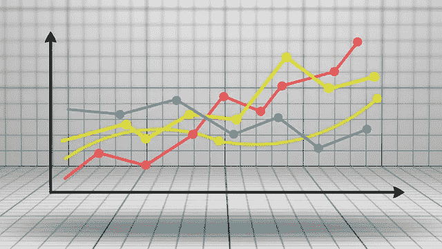
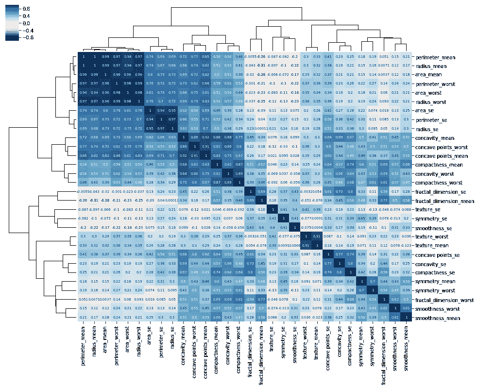
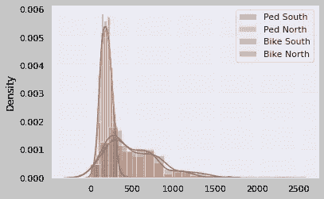
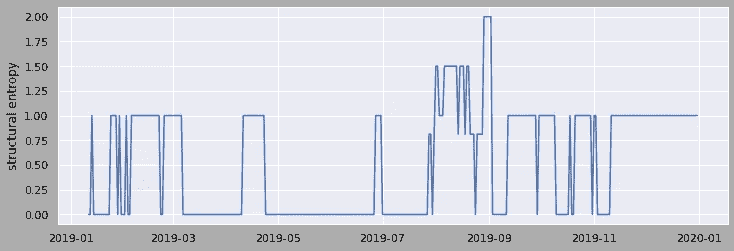
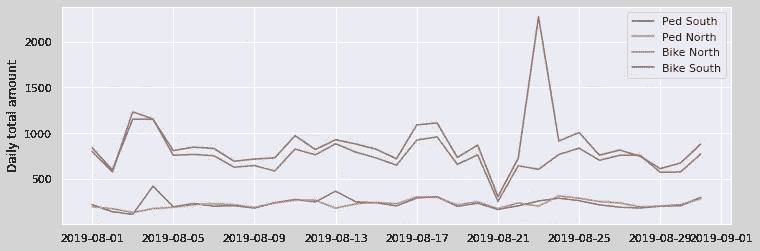
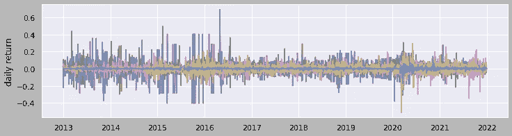
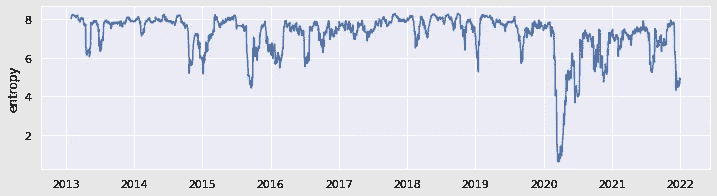

# 基于结构熵的多元时间序列异常检测

> 原文：<https://towardsdatascience.com/anomaly-detection-for-multivariate-time-series-with-structural-entropy-63f9c34cb67>

## 如何用现实例子发现时间序列相关性异常

图片由 [Mediamodifier](https://pixabay.com/users/mediamodifier-1567646/?utm_source=link-attribution&utm_medium=referral&utm_campaign=image&utm_content=3033203) 来自 [Pixabay](https://pixabay.com//?utm_source=link-attribution&utm_medium=referral&utm_campaign=image&utm_content=3033203)

熵可以区分随机性和确定性。在我之前关于用谱熵进行单变量随机时间序列的[异常检测的文章](https://medium.com/@ning.jia/anomaly-detection-in-univariate-stochastic-time-series-with-spectral-entropy-834b63ec9343?source=your_stories_page-------------------------------------)中，我展示了谱熵的魔力。现在，我们将把话题转到多元时间序列中的异常检测，我们仍然试图在解决方案中使用熵。

多元时间序列有 N 个时间序列变量。每个变量不仅依赖于它过去的值，还依赖于其他变量。一个典型的异常是，对于某些数据点，这些变量的相互作用或相关性是不期望的。任何一个变量都不应该有明显的异常。否则，问题就变成了单变量时间序列异常检测。

例如，让我们谈论天气。温度和湿度一般是负相关的。随着温度的升高，湿度会降低。因此，即使温度相当高，只要水分停留在较低的区域，相应地匹配温度，你就会感到热。那是典型的大热天，不是异常。我不知道你住在哪里，但你可能在夏天经历过这样的日子:温度和湿度同时非常高的日子，这使你感到特别不舒服。这就是温度和湿度的时间序列的相关性出错的时候:多元时间序列中的异常。

## 关联和结构熵

皮尔逊相关是时间序列相互作用的一种简单测量方法。对于一个有 N 个变量的多元时间序列，我们会有 C(N，2)个相关(从 N 中选两个)或者一个 N*N 相关矩阵(上三角和下三角是一样的)。

我们想知道这个矩阵包含了多少信息。常见的方法是应用聚类算法来挖掘矩阵中的**结构信息**。下面是一个对相关矩阵使用层次聚类的示例。

图片由[桑蒂](https://www.kaggle.com/sgalella)经许可来自[卡格尔](https://www.kaggle.com/code/sgalella/correlation-heatmaps-with-hierarchical-clustering)

接下来，我们将应用熵的概念。熵可以基于矩阵的结构来定义，特别是满足某个阈值的重要聚类的数量。假设所有变量都高度相关。将只有一个聚类，多元时间序列中包含的相关信息最小。另一种极端情况，N 个时间序列全部不相关，会有 N 个聚类，多元时间序列包含的相关信息最大。研究人员提出了这种熵，并将其命名为**结构熵**。

使用结构熵，我们可以将一组时间序列转换成熵值的单个时间序列，这捕获了我们感兴趣的相关性的运动。如果我们想监控相关性并捕捉异常，这种转换特别有用。我们将在下面两个真实数据的例子中看到这一点。

## 轨迹数据集

我们有西雅图伯克吉尔曼步道的数据集。它是通过监控步道上的行人和骑车人生成的。描述说，“混凝土中菱形排列的电线探测自行车，安装在木柱上的红外传感器探测行人。计数器还能捕捉自行车和行人的行驶方向”。这个公共数据集可以从 [Kaggle](https://www.kaggle.com/datasets/city-of-seattle/seattle-burke-gilman-trail?datasetId=34281&sortBy=dateRun&tab=profile) 下载。

数据集有四列:Ped South、Ped North、Bike North 和 Bike South，表示南/北方向的行人/骑车人的人数。在日水平上对 2019 年进行聚合后，我们有一个包含四个变量的多元时间序列。每个时间序列都有季节性和趋势性。图 1 显示了四个密度图。

图 1:四列的密度图，图片由作者提供

预计两个方向的行人/骑车人数量应该高度相关。例如，如果在一个好天气里，更多的骑车人出现在南行的路上，那么更多的骑车人应该出现在北行的路上。

图 2 将数据显示为多元时间序列。

情节 2:4 列时间序列，作者提供的图像

如果我们仔细观察这个情节，我们可以发现一些有趣的反常现象。在 8 月的一些日子里，虽然去南方的行人数量增加了，但去北方的行人数量却减少了。八月的骑车人也有类似的异常区域。

为了展示这些异常，我还在右边的第二个 y 轴上绘制了两个窗口大小为 10 天的滚动相关性。这两条灰线清楚地显示了相关性在 8 月份的变化。

现在我们来计算结构熵。这里涉及到两个参数。首先是窗口大小。还是用 10 天吧。第二个是用于聚类相关矩阵的阈值。因为我们认为两个方向的数字应该是高度相关的，所以我们用 0.8。图 3 显示了最终的结构熵曲线。

情节三:结构熵曲线，作者图片

我们可以看到 8 月份的峰值，这意味着相关性的不确定性增加。它能告诉我们除了八月异常以外的更多信息。从 3 月到 8 月的大部分时间，该值为 0。这意味着四个变量高度相关。在一年的其余时间里，该值为 1。这意味着矩阵中有两个集群:Ped 南与 Ped 北，以及 Bike 南与 Bike 北。一般来说，两个方向都是相关的，但行人和骑自行车的人没有太多的联系。也许这背后的原因是温度和天气。

在八月下旬，熵可以上升到 2。这意味着四个变量之间没有特定的相关性。2019 年 8 月发生了什么？我们应该把它当作一个真正的异常吗？

说实话，我也不知道原因。我在搜索“西雅图伯克吉尔曼步道 2019 年 8 月”后发现了‘新闻’:8 月 16 日至 8 月 18 日，步道因树木移除工作而关闭。这一事件可能会导致持续三天以上的混乱。人们可能会在看到工作通知标志后，甚至在工作完成后绕道而行。工作地点、传感器和标志可能会影响人们选择路线的方式。

但从数据角度来看，8 月份确实看起来不正常。如果我们放大 8 月的数据，我们会将 8 月 4 日、8 月 13 日和 8 月 24 日标记为明显异常。

图 4，放大八月份的数据，图片由作者提供

从这个例子中，我们可以看出，当多元时间序列的相关性从可预测的确定性变为不可预测的随机性时，结构熵将捕捉到奇数时刻。

接下来是另一种异常方式的例子。

## 市场数据集

结构熵的思想最早应用于股票市场分析。在这个例子中，异常表现为随机性的确定性或一堆不相关的相关性。

我从雅虎 API 下载了大约 400 只加拿大主要股票的价格历史。然后，我用百分比计算日收益率，得到每只股票的时间序列。图 5 显示了其中的 20 个每日回报时间序列。

图 5，每日股票回报的多元时间序列，图片由作者提供

然后，我们计算所有序列的结构熵，并获得一个新的熵时间序列，如图表 6 所示。最显著的异常发生在 2020 年 4 月左右，当时市场受到 covid 19 的严重打击。大约在那个时期，几乎所有的股票都朝着同一个方向运动:走低。熊市没有不确定性，熵一度接近于零。在其他时期，熵值在 4 和 8 之间变化。这标志着一个正常的市场:一些股票/板块在上涨，一些在下跌。

情节 6，结构熵，作者图像

## 结论

如果变量的相关性是我们关心的，结构熵提供了一个强有力的工具来检测多元时间序列数据中的异常。它可以捕捉相关时间序列变得不相关的时刻，反之亦然。很容易理解和计算。我建议数据科学家探索这一工具，用于多元时间序列中的异常检测任务。

以后我会分享更多时间序列数据的经验教训。

感谢阅读。享受你的时间序列数据。

## 参考

[结构熵:随着时间的推移监测基于相关性的网络，并应用于金融市场](https://www.ncbi.nlm.nih.gov/pmc/articles/PMC6658667/)

西雅图伯克吉尔曼踪迹数据(CC0:公共领域)

Yahoo Finance API(BSD 3-条款“新”或“修订”许可证)