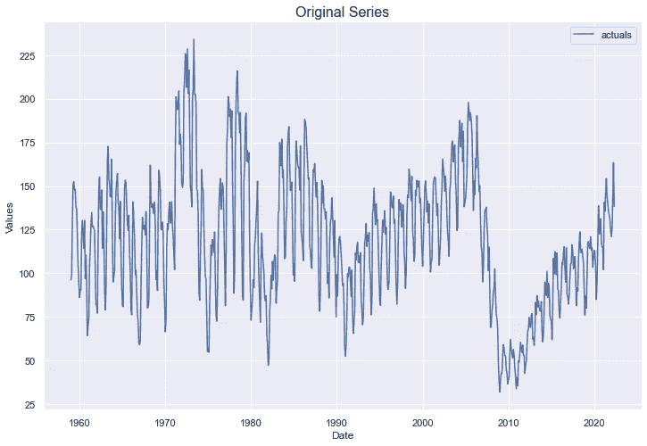
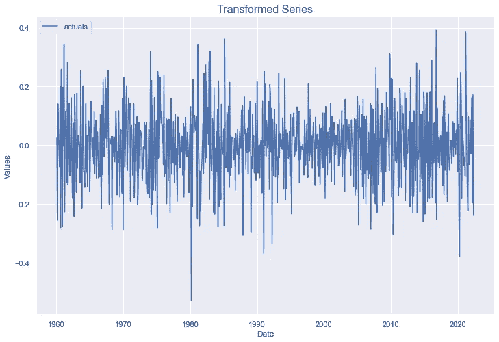
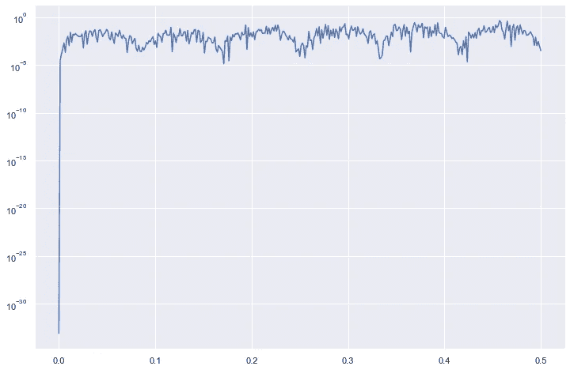
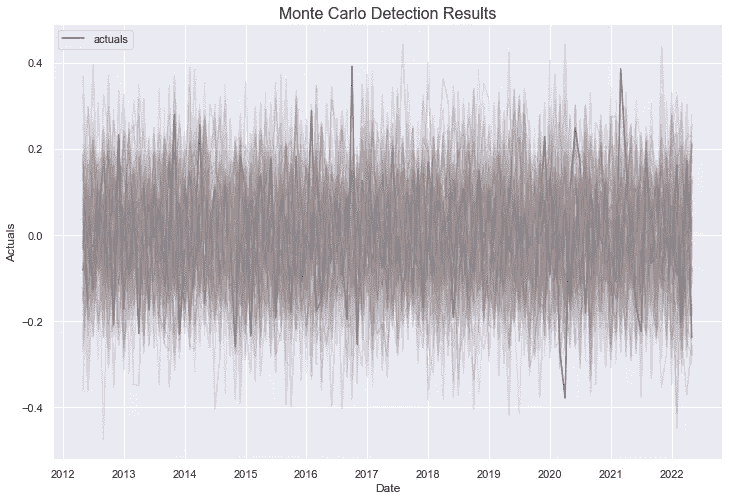
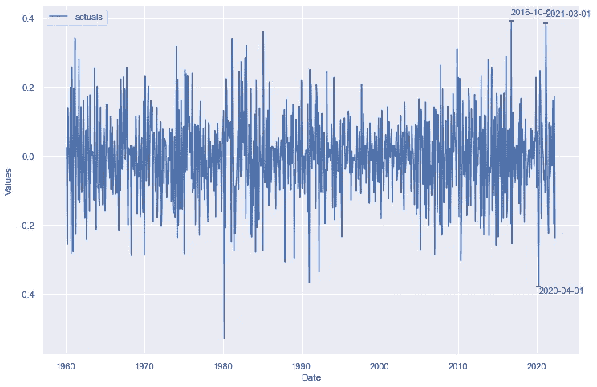
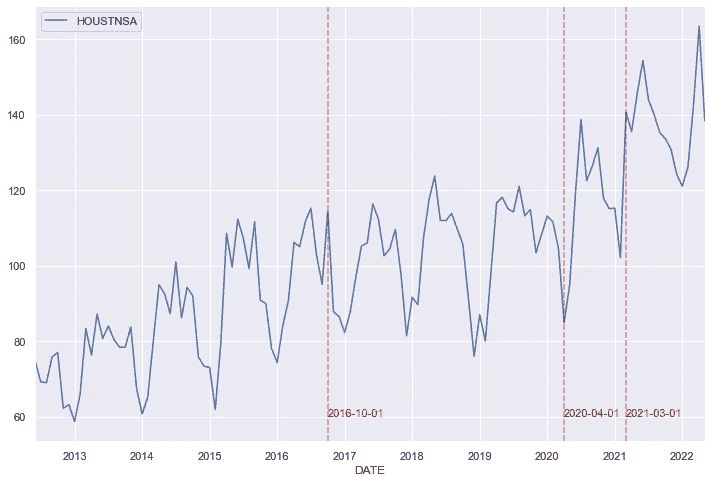
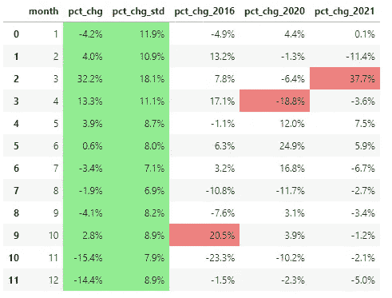
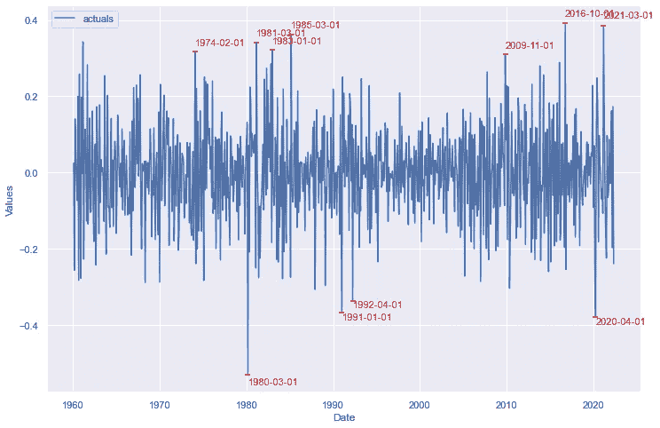
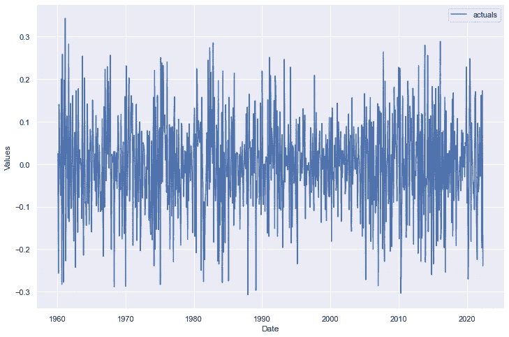
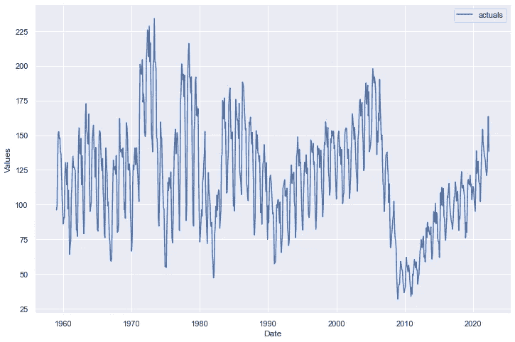

# 基于蒙特卡罗模拟的时间序列异常检测

> 原文：<https://towardsdatascience.com/anomaly-detection-for-time-series-with-monte-carlo-simulations-e43c77ba53c>

## 通过模拟时间序列数据的路径来检测异常的有趣方法


[Yash](https://unsplash.com/@yashirke?utm_source=medium&utm_medium=referral) 在 [Unsplash](https://unsplash.com?utm_source=medium&utm_medium=referral) 上拍照

使用未标记的时间序列数据进行异常检测可能是一项复杂的任务。许多问题涉及到需要找到一种技术，可以适当地解释一个系列的季节性、趋势、相关系列和其他特性。由于这个原因，对于异常检测来说，LSTMs 序列的估计是流行的，它应该能够拾取这些特性中的许多。Marco Cerliana 在一篇非常有趣的[文章](/anomaly-detection-with-lstm-in-keras-8d8d7e50ab1b)中展示了这样一种技术。对于这项工作，还有其他几种经常使用的技术。

如果对时间序列进行变换以使其呈正态分布、非季节性和平稳，蒙特卡罗模拟也可以是一种有用的异常检测技术。我将使用 Python 中的 [scalecast](https://github.com/mikekeith52/scalecast) 库演示该技术的一个示例，以及在发现异常后应用于异常的可能缓解策略。这些方法对未标记的数据起作用，这意味着我们在开始之前不知道哪些点是异常的，哪些不是异常的。

# 数据预处理

要安装要求，请执行以下操作:

```
pip install scalecast
```

导入库并读取数据:

```
import pandas as pd
import pandas_datareader as pdr
import matplotlib.pyplot as plt
import seaborn as sns
from scipy import stats        
from scalecast.Forecaster import Forecaster
from scalecast.AnomalyDetector import AnomalyDetector
from scalecast.SeriesTransformer import SeriesTransformerdf = pdr.get_data_fred(
    'HOUSTNSA',
    start='1959-01-01',
    end='2022-05-01',
).reset_index()f = Forecaster(
    y=df['HOUSTNSA'],
    current_dates=df['DATE']
)f.plot()
plt.title('Original Series',size=16)
plt.show()
```



作者图片

该数据集衡量了自 1958 年以来美国每月的房屋开工数，可在开放数据库 [FRED](https://fred.stlouisfed.org/series/HOUSTNSA) 上获得。仅从数据来看，没有明显的异常或异常值，但有几个转折点——数据中潜在趋势改变方向的点。这些变化大多与经济衰退和市场调整时期相吻合。

为了让这些数据为异常检测做好准备，让我们对其进行转换，使其没有明确的趋势或季节性。这可以通过获取数据中的差异来实现。我们可以取数列的第一个差值，这样每个观测值都可以用相对于前一个观测值的变化来表示。这应该会消除这种趋势。我们可以采用数据集中的月差(每 12 次观察的差)来处理季节性。

最后，为了使它更正常，在取这两种差之前，我们还可以应用对数变换。这将改变数据的比例，从而使较大的值向分布的中心压缩。

```
transformer = SeriesTransformer(f)f2 = transformer.LogTransform()     # log transform
f2 = transformer.DiffTransform(12)  # seasonally adjust
f2 = transformer.DiffTransform(1)   # first differencef2.plot()
plt.show()
```



作者图片

为了确保数据现在是正态分布、稳定的，而不是季节性的，我们可以运行一些统计测试。第一个检验是 D'Agostino 和 Pearson 的正态性检验结果，它保持数据是平稳的零位置。

```
critical_pval = 0.05
print('-'*100)
k2, p = stats.normaltest(f2.y.values)
print("D'Agostino and Pearson's test result for normality:")
print('the test-stat value is: {:.2f}'.format(k2))
print('the p-value is {:.4f}'.format(p))
print('the series is {}'.format('not normal' if p < critical_pval else 'normal'))
print('-'*100)
```

结果是:

```
------------------------------------------------------
D'Agostino and Pearson's test result for normality:
the test-stat value is: 4.55
the p-value is 0.1028
the series is normal
-------------------------------------------------------
```

第二个检验是扩展的 Dickey-Fuller 检验，它保持零位置，即序列不是平稳的。

```
print('-'*100)
print('Augmented Dickey-Fuller results:')
stat, pval, _, _, _, _ = f2.adf_test(full_res=True,maxlag=12)
print('the test-stat value is: {:.2f}'.format(stat))
print('the p-value is {:.4f}'.format(pval))
print('the series is {}'.format('stationary' if pval < critical_pval else 'not stationary'))
print('-'*100)
```

结果是:

```
------------------------------------------------------
Augmented Dickey-Fuller results:
the test-stat value is: -11.72
the p-value is 0.0000
the series is stationary
-------------------------------------------------------
```

最后，为了了解季节性，我们可以绘制数据的周期图，在函数认为周期对序列有重大影响的数据位置出现峰值。

```
a, b = f2.plot_periodogram()
plt.semilogy(a, b)
plt.show()
```



作者图片

该图表显示，数据中可能有几个周期值得进一步探索，但在大多数情况下，该系列没有明确的主导周期。因此，我们可以说，季节性可能已经得到有效处理。

# 在数据范围内进行模拟

现在数据已经准备好了，我们可以开始扫描异常情况了。蒙特卡洛模拟是一种绘制时间上向前的随机路径的技术，从假设数据中的第一次观察到的观察值正态分布在具有观察到的标准偏差的观察平均值周围开始。当抽取样本时，考虑到新的数据点，更新关于分布的假设，并进行另一次抽取。这个过程一直重复，直到我们想要跨越的时间段结束。

我们可以想象在我们的数据集中，在过去 10 年的观测数据中做 100 次这一过程，然后检查哪些实际观测值在 99%的时间里高于或低于所有模拟路径。那些有异常的被标记为异常。

```
detector.MonteCarloDetect(
    start_at = '2012-05-01',
    stop_at = '2022-05-01',
    cilevel = .99, # default
    sims = 100, # default
)detector.plot_mc_results()
plt.title('Monte Carlo Detection Results',size=16)
plt.show()
```



作者图片

图中的彩色线是 100 条模拟路径，蓝色的尖峰是我们最有可能标记为异常的点。

```
detector.plot_anom()
plt.show()
```



作者图片

使用这种技术，发现了三点:

*   2016 年 10 月
*   2020 年 4 月
*   2021 年 3 月

这几点有什么特别的？我们最初并不确定，但是我们可以将它们映射回我们的原始数据，以便更仔细地检查它们。

```
_, ax = plt.subplots()
df.iloc[-120:,:].plot(x='DATE',y='HOUSTNSA',ax=ax)
for i,v in zip(detector2.labeled_anom.index,detector2.labeled_anom):
    if v == 1:
        ax.axvline(i,linestyle='--',color='red',alpha=.5)
        ax.text(
            i+pd.Timedelta(days=2),
            60,
            s=i.strftime('%Y-%m-%d'),
            color='red',
            size=11
        )
plt.show()
```



图像

由于新冠肺炎疫情，2020 年的时间点显然是房屋开工率下降。另外两个呢？我们真的需要深入挖掘，看看这些点是否有什么特别之处。让我们看看，与这些年来相同月份的平均增长相比，这些点的逐月百分比增长是否有什么变化。



作者图片

我们在这里看到的是，在大多数 10 月份，我们预计会看到 2.8%的环比增长，但在 2016 年，这是 20.5%，导致它被贴上异常的标签。我试着研究了一下，得出的结论是，最有可能的原因是上个月房屋开工率意外下降。从这个角度来看，2021 年 3 月仍然没有太大意义，但我认为这最有可能是由于 COVID 的同比强劲复苏，其影响在 2020 年 3 月开始在房地产市场上感受到，在同一时期的后半段，一切都开始关闭。

# 整个数据的窗口模拟

这很有趣，但是这项技术只扫描了我们 50 年以上的数据中的 10 年。让我们尝试调用另一个方法，在滚动窗口上运行相同的模拟，从 60 个观察开始，跨越 60 个观察，然后向前推进 30 个观察，重复这个过程，直到检查完每个点。这将扫描几个观测值两次，如果任何一个观测值至少有一次被识别为异常，则最终结果会说它是异常。我选择的 60/30 参数完全是主观的，但在我尝试了一些值后，对我来说似乎是正确的。

```
detector.MonteCarloDetect_sliding(60,30)
detector.plot_anom(label=True)
plt.show()
```



作者图片

这就发现了同样的三个异常，再加上过去的八个异常。我没有做太多的研究来确定为什么这些是异常，但是为了这个例子，我假设它们都被正确地识别了。

# 减轻已识别的异常

现在我们在数据中发现了一些异常，我们应该如何处理它们呢？下面我们回顾两种可以用来改变数据集中的值以减轻这些值的方法。

## q 切割

q 切割是“分位数切割”,它使用 pandas 数据框架中的一种方法来查找数据集中的特定百分位数，以替换异常值。例如，默认情况下，我们用序列中所有值的第 90 个百分位数替换高异常值，用第 10 个百分位数替换低异常值。这是一个很好的方法，适用于数据已经稳定且正常而没有任何转换的情况。如果我们尝试以这种方式替换转换数据上的值，然后将该转换数据恢复到其级别值，则从识别出第一个异常的点之后，级别值将全部改变。因此，对于这个数据集来说，这不是最好的主意，但是我们可以在代码中展示它是如何工作的:

```
f2 = detector.adjust_anom(method='q')
f2.plot()
plt.show()
```



作者图片

我们可以看到，原始数据中之前的大峰值现在都消失了。

## 线性内插法

对于我们的数据集，将它恢复到原始值并使用线性插值是更改异常值的更合适的方法。这将在连续识别的异常前后的第一个和最后一个值之间画一条直线，并用该线性步长的值替换异常值。

```
# f is the original Forecaster object before transformations
f = detector.adjust_anom(f=f,method='interpolate')
f.plot()
plt.show()
```



作者图片

你甚至注意不到，但是那些以前异常的值都被改变了。我们的数据现在可能稍微容易分析了，我们可以考虑用它来运行预测模型。

# 更多资源

这就是如何使用蒙特卡罗模拟技术来检测和减轻时间序列数据上的异常。感谢您的关注。如果你喜欢这个教程，在 [GitHub](https://github.com/mikekeith52/scalecast) 上给 scalecast 包打个星，看看下面的链接:

*   [本例中使用的笔记本](https://github.com/mikekeith52/scalecast-examples/blob/main/misc/anomalies/monte%20carlo/monte%20carlo.ipynb)
*   [对象的文档](https://scalecast.readthedocs.io/en/latest/Forecaster/AnomalyDetector.html)
*   [对象的文档](https://scalecast.readthedocs.io/en/latest/Forecaster/SeriesTransformer.html)
*   [针对`ChangepointDetector` 对象的文档](https://scalecast.readthedocs.io/en/latest/Forecaster/ChangepointDetector.html)(此处未涉及，但相关且有趣)

下次见！