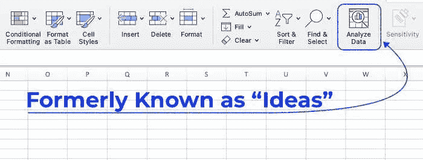
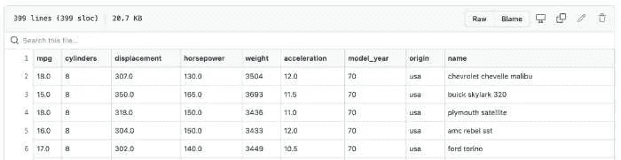
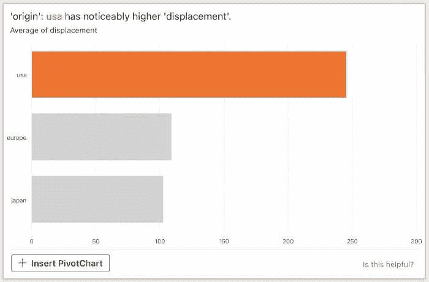
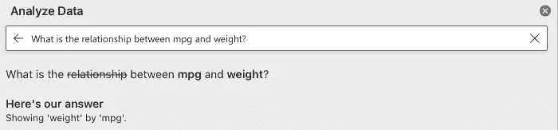
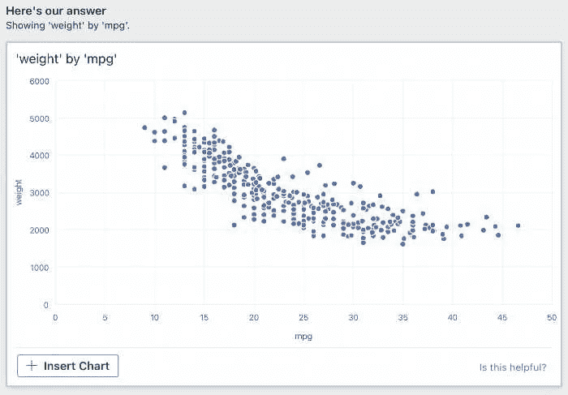
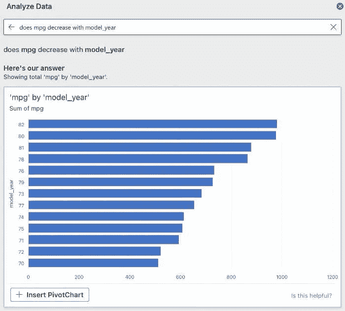
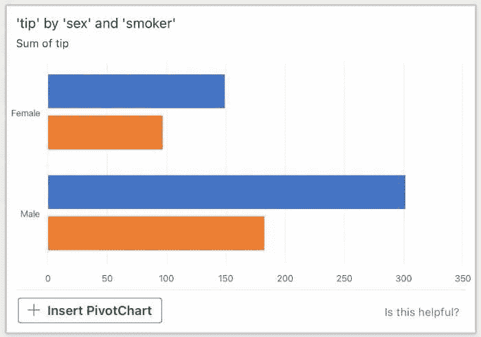
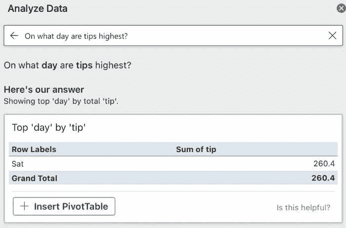
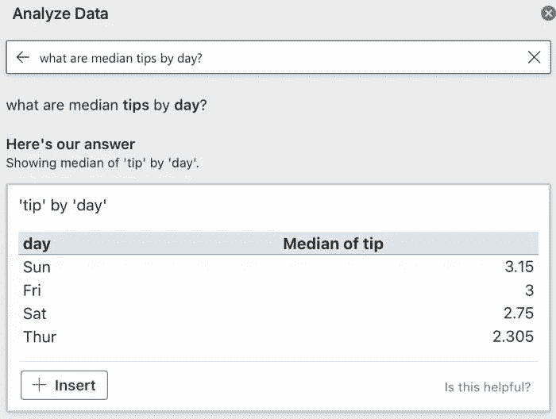

# 用 Excel 的 Ideas 功能再看探索性数据分析

> 原文：<https://towardsdatascience.com/another-look-at-exploratory-data-analysis-with-excels-ideas-feature-b1be32579cf>

## Excel 会取代数据科学家吗？Excel 会帮我们做机器学习吗？

TLDR:如果你不是数据科学家，你也可以进行探索性的数据分析。任何以前发现 Excel 的自动化探索性数据分析工具的分发效果不佳的数据科学家，现在都应该抽出时间来看看该软件的云基础架构增强工具。要做好探索性分析，数据科学家需要时间。花在探索性数据分析上的时间通常是值得的。本文将帮助数据科学家、数据分析师和其他数据专业人员减少在 EDA 上花费的时间(并减少对其他 EDA 技术的需求)。

# 介绍

## 不仅仅是数据科学家

这篇文章是对上一篇展示 Microsoft Excel 的“Ideas”功能的文章的更新。这个新功能现在被形象地称为“分析数据”该功能改变的不仅仅是它的名称。在其最简单的形式中，它通过快速生成数据可视化仪表板来帮助探索性数据分析。

探索性数据分析(EDA)是数据科学和机器学习中的一个大课题。自动化 EDA 工具为您找到模式。在我最近对这个更新工具的回顾之后，我确信即使是最有经验的数据科学家也会对这里印象深刻。如果您还没有将 Excel 作为 EDA 工具中的佼佼者，那么您就太应该这样做了。就算你是数据可视化专业人士，也会印象深刻。

## 对于数据科学家来说

处理来自研究人员、分析师、商业智能专业人员等的数据的人在探索性数据分析任务上花费了大量时间。根据《哈佛商业评论》的一篇文章，数据科学家花 80%的时间寻找、清理和组织数据。

除了对那些感到时间紧迫的人有用之外，本文对那些需要“探索”数据文件，但还不熟悉如何用 Python 或 R 语言这样的开源编程语言这样做的人尤其有用。

为了验证这一点，您可以在 Microsoft Excel 中找到这个函数。我们仍在等待微软推出“机器学习”按钮的那一天。

如何找到“分析数据”按钮？这以前被称为“想法”按钮。图片来源:作者的带有注释的截屏。

本文总结了上面显示的结果函数。这篇文章将使用两组数据进行评论，你可以在 Seaborn 的 Github Repo 这里找到这两组数据。我当然建议你遵循下面的数据，但是如果你用你自己的数据库探索这个工具，我希望你能在这里评论你是否同意。

# 数据集(及其许可证)

本文使用两个数据源。这两个数据源都是数据科学和机器学习领域众所周知的实践数据集。

这些数据通过 Seaborn 获得了开源许可。它们通常可以从`seaborn.load_dataset`包的 Python 中获得。[根据 Seaborn license](https://github.com/mwaskom/seaborn/blob/master/LICENSE) 的规定，只要你满足一定的条件，包(修改过的和没有修改过的)都可以重新分发。我在这篇文章的底部放了更多关于许可证的内容。

我们将在本文中使用的第一个数据集(如下所示)被称为“mpg”数据。这里有一个链接来查看原始的 [mpg.csv 文件](https://raw.githubusercontent.com/mwaskom/seaborn-data/master/mpg.csv)。

mpg.csv 文件摘录。查看前五个观察值。图片鸣谢:作者截屏。这些数据随 Seaborn 数据可视化包一起分发。关于与 Seaborn 数据可视化包相关的许可证的更多信息，请参阅本文的底部。

我们将在本文中使用的第二个数据集(如下所示)被称为“tips”数据。这里有一个链接可以查看原始的 [tips.csv 文件](https://raw.githubusercontent.com/mwaskom/seaborn-data/master/tips.csv)。

tips.csv 文件摘录。查看前五个观察值。图片鸣谢:作者截屏。关于与 Seaborn 数据可视化包相关的许可证的更多信息，请参阅本文的底部。

在 Excel 中打开这些文件很容易。只需将文件保存到您的本地计算机。大多数装有 Microsoft Office 的计算机会让你双击文件在 Excel 中打开它们。如果这不起作用，您将需要首先打开 Excel 并使用文件→打开菜单序列。打开文件对话框后，您可以选择要打开的文件。

mpg . CSV->[https://raw . githubusercontent . com/mwaskom/seaborn-data/master/mpg . CSV](https://raw.githubusercontent.com/mwaskom/seaborn-data/master/mpg.csv)

tips . CSV->[https://raw . githubusercontent . com/mwaskom/seaborn-data/master/tips . CSV](https://raw.githubusercontent.com/mwaskom/seaborn-data/master/tips.csv)

# 进行探索性数据分析

# 汽车数据

对于 mpg.csv 文件，Excel 的自动化 EDA 专注于位移变量。根据 Excel 的数据，美国制造的汽车排量更大。Excel 自己提供了这种见解(以及其他一些)——并为我生成了以下视觉效果。

按制造来源分列的位移。图片鸣谢:作者截屏。

一个更新的功能是有机会用简单的英语提问。这里我问“mpg 和体重有什么关系？”

在 Excel 中提问。图片鸣谢:作者截屏。

明确地说，我期望很少。我保持低期望值。Excel 选择了我会为自己选择的精确可视化策略，或者我会建议任何客户或学生选择的策略，这让我感到惊讶。我在下面写了更多，但我也希望这里有一个联合图，这样我可以更好地理解每个变量的数据分布，但尽管错过了看到数据分布，这是一个好的开始。

按 MPG 来源的重量。图片鸣谢:作者截屏。

我做了另一个诚实的尝试，给 Excel 一个更难的测试。我问“mpg 是否随 model_year 而减少？”Excel 生成了以下(有用的)数据可视化。我会选择线形图(而不是条形图)。但是，Excel 再次给我留下了深刻的印象，它能够识别我询问的数据，然后生成这种有意义的数据可视化。在这里，数据清楚地表明效率随着时间的推移而提高。

按年 MPG。图片鸣谢:作者截屏。

# 外出就餐

对于 tips.csv 文件，Excel 有一些失误。第一个失误是制作了这张巧妙但标签不全的图表。这里按性别和吸烟状况列出小费金额。它标明了性别…但没有标明吸烟状况。x 轴是好的，但是 y 轴需要更新。蓝条是吸烟者吗？或者说，橘条是抽烟的吗？

按性别给小费。图片鸣谢:作者截屏。

接下来，我问“什么时候小费最高？”Excel 没有返回有用的结果。当我换句话说“哪一天小费最高？”我得到了正确的答案，但没有太多的上下文，这将是很好的。

小费最多的一天。图片鸣谢:作者截屏。

我在 Excel 上对这个 tips.csv 文件进行的最后测试是“每天的平均小费是多少？”然后，“每天的小费中位数是多少？”当我问平均值时，我得到了一个条形图。当我要求中位数时，我得到了一张桌子。从微软那里听到为什么 medians 返回一个表格而 averages 返回一个条形图会很有趣。

按星期几列出的提示。图片鸣谢:作者截屏。

# 缺少什么(数据科学)

我注意到更新的特性不像遗留的“Ideas”函数那样检查缺失值。

对我来说，另一个直接的“缺失”是缺少一个汇总统计表。我希望看到高值、低值、中值，甚至可能是第 25 和第 75 百分位值。我对科学感兴趣。如果我在微软，一个表(或者至少是创建一个选项)一个包含上述值和标准偏差的汇总统计表将是一个改进，我会添加到 backlog 中。

在回顾这个特性时，我没有看到太多关于自然语言处理的内容。微软在这里加入单词云可能是一个聪明的想法。

在建议的视觉效果中有多个散点图。我喜欢好的散点图。当我在上面询问效率和重量之间的关系时，我很高兴看到 Excel 知道给我一个散点图。但对于那些打算以后建立预测模型、机器学习模型或其他正式建模任务的人来说，在散点图中包含最佳拟合线会有所帮助。同样有用的是那条线的回归方程或相关系数。这种限制的一个更简短的说法是，Excel 的建议似乎在视觉上很长，但在统计上很短。

奇怪的是，Excel 并没有给出在这里显示统计值的选项。在引擎盖下，我推断微软用各种统计工具设计了这个特性。认为微软可以提供一个选项，通过点击切换按钮来显示或揭示那些重要的价值，这是过于简单化了？那些具有高级统计和统计计算知识的人将会错过随时访问统计值的机会。也许这个特性并不是为那些计划在项目后期转向机器学习或数据科学的人设计的？

对于对数据科学和机器学习过程有帮助的输出的另一个例子，简单的相关矩阵将是聪明的。从简单的相关矩阵中获得的统计数据为分析师提供了丰富的额外见解。我发现遗漏的另一个例子是，对于所有的图来说，结对图(类似于编程语言中容易得到的那些)也应该是智能的。我还会给出联合图，作为微软也应该加入到这种探索性数据分析中的可视化示例。

另一个似乎缺失的功能是一套可以让你编辑视觉效果的工具。一个或多个可以让你编辑 x 轴、y 轴、标题或视觉效果的其他方面的工具将是智能的。目前，在编辑之前，您必须将视觉效果插入到文档中(只需单击鼠标即可轻松完成)。如果能够在将草稿放入文档之前进行一些小的编辑，这将是一个非常有用的节省时间的方法。

对于那些处于 EDA 最早期阶段的人来说，检查样本观察通常是有用的。在 Excel 中，理论上很容易在电子表格环境中浏览观察结果。然而，有助于数据科学家进一步识别重复观测值和高度独特观测值的功能。这将有助于数据科学家了解哪些观察值需要更仔细地检查。这就是缺失值的汇总会有所帮助的地方——至少我会提出一个带有一个或多个缺失值的观察值列表。

对于那些打算以后进行更复杂的分析的人来说，看到 EDA 工具与一种或多种编程语言集成也是很好的，尤其是如果它们是开源的话。

我还发现自己在想，在执行 Excel 的自动化 ed a 之前，我是否进行了一些数据争论，如果已经很好的结果可以更好的话。如果这个特性(或者可能是一个单独的配对特性)能够提供数据争论建议，在我看来，这将是一个显著的增强。

如果微软希望看到这个工具更好地支持数据科学家、数据科学和机器学习，那么它可能会为这个功能引入一个“电源模式”?电力模式可以提供额外的访问我在这里写的缺失的功能。对于更大的数据集，让“电力模式”用户将该功能连接到他们自己在 Google Cloud、Azure 或 AWS(或其他云应用程序)上的云基础设施可能也是明智的。

我也没有看到更深层次的数据挖掘的潜力。为了增强更深入的数据挖掘任务的潜力，微软可以考虑让用户识别数据的主要特征(即，对用户最重要的少数变量)。至少让用户选择指定一个独立变量是明智的。也许可以选择指定一个以上的具体感兴趣的变量。一个变量可以让 Excel 更智能地给出有意义的结果。

另一个缺失的功能是以公开的方式轻松部署最终的视觉效果。Tableau 和 Power BI 用户会觉得这个功能缺失！

没有一个建议的可视化包括脊线，箱线图，或小提琴图。这些单变量图对寻求或需要了解变量分布的用户很有用。数据科学中的许多过程都涉及审查分布测量。

如果问 Excel 能否开发一个自动化的“数据收集”或“数据仓库”按钮，会不会太过分？

如果微软决定测试上述任何一个功能建议，我现在就举手。

# 来自微软

您可能认为这个工具是一个“数据科学家”，文档管理期望。该工具不会为您执行数据科学。这个工具只擅长以一种基本的方式分析数据。它不能取代在您的团队或组织中工作的数据科学家。

微软的文档声称，随着时间的推移，其 Office 软件会变得越来越“智能”。为了让 Excel 足够智能来进行数据分析(或者至少是探索性的数据分析——以自动化在数据中寻找模式的过程),微软正在用云基础设施来增强其 Office 产品。

“Office 一直在变得越来越智能，增加了新的云增强功能，可以节省您的时间并产生更好的结果。这些功能可以帮助您提高在 Word 和 Outlook 中的写作水平，在 Excel 中分析数据，并在 PowerPoint 中进行动态演示。”

关于本文的主题，Excel 的“分析数据”按钮，文档解释道:

“在 Excel 中分析数据使您能够通过高层次的可视化摘要、趋势和模式来理解您的数据。只需单击数据区域中的单元格，然后单击“开始”选项卡上的“分析数据”按钮。“在 Excel 中分析数据将分析您的数据，并在任务窗格中返回有趣的视觉效果。”

在微软继续并进一步开发该工具之前，那些寻找更高级功能的人将需要考虑其他解决方案。

# 建议的问题/建议的见解

在找到数据中的模式后，该工具提供了您可能会问的多个附加建议问题。它会自动提示见解！如上面的截屏所示，寻找新的模式就像用简单的英语问一个问题一样简单。当问题明确提到数据顶部的变量时，效果最好。

例如:

一定要试试:“total_bill 和 top 有什么关系？”(使用特定变量)。

不要尝试:“一个人账单的大小和他们给多少小费有什么关系？”

我发现微软在这里写的软件几乎和我认识的许多其他人一样有洞察力，并且比我认识的大多数其他工具更好。不知何故，该软件似乎理解问题类型如何映射到特定的分析技术。在 tips.csv 文件中，Excel 总共提供了 26 条建议(使用了五种可视化技术)。而在 mpg.csv 文件中，Excel 总共提供了 35 条建议(使用了六种可视化技术)。

为了更好地理解这些建议，我回顾了图表类型的分类。每个文件都生成了各种图表类型，包括散点图、条形图、折线图和其他图表。几个直方图也显示了重要连续变量的分布(单变量分析也很重要)。tips.csv 文件中有十三个饼图。来自 mpg。csv 有 11 个饼图。饼状图实际上是甜甜圈图。我不知道饼状图是如何或者为什么如此受欢迎。

# 后续步骤

我建议你考虑一下这个解决方案。在您自己控制的环境中，从您的数据仓库或数据库中提取一些数据，包括一些敏感数据，并进行探索。自己看看是否对视觉效果的分布满意。

考虑搜索其他数据源。例如，你可以考虑使用我最近写的关于的 [93 个数据集之一。具体来说，我建议你梳理一下我上面列出的限制。自己搜索一下这个工具，决定它是否有用。正如您将在下面看到的，在警告注释下，并不是每个人都对 Excel 印象深刻。](/93-datasets-that-load-with-a-single-line-of-code-7b5ffe62b655)

# 警示说明

在得出结论之前，我认为还需要注意的是，对于 Excel 中统计计算的整体准确性可能存在一些疑问(参见参考文献列表)。来自科学界的批评并不容易。据 Mélard (2014)称，微软继续在已知统计错误的情况下销售其产品。然而，根据梅拉德的说法，自 2010 年版本以来，微软已经开始纠正这些错误。微软最近对其自动化探索性数据分析工具的改进可能是这些改进的进一步证据。

# 结论

Excel 的分析数据功能是一个强大且易于使用的工具，用于探索数据或数据分析。它可以快速识别变量之间的关系，并生成有用的可视化效果。虽然它有时会产生不正确或不完整的结果，但对于数据探索和数据分析来说，它是一个很有价值的工具。我对这个工具似乎拥有的“知识”印象深刻。

本文还指出了缺失或尚未完成的多个特性。缺少的一些项目是关键统计值、汇总表、创建其他图和表的选项，这些图和表在数据探索中更为传统，如配对图或联合图。

数据分析的过程和科学可能永远不会完全自动化。然而，微软通过这个工具展示了设计良好的算法和来自云的帮助如何能够比预期表现得更好。对于需要自动化与数据科学相关的流程的团队，我建议他们在文档中创建一个新的站点，通过 Excel 中的这个功能运行新的数据文件。

如上所述，该工具不是高级分析工具。它不能取代数据科学家的工作。它本身不是数据科学。但是，当希望开始数据分析时，这是一个很好的起点。它将为您创建多种数据可视化，这可能会在您的项目中激发您的灵感。该特性不仅提出了有意义的数据可视化策略，还可以用简单的英语识别和阐明有用的见解。没有多少工具或软件解决方案能像这个工具那样流畅和自动化地表达洞察力。微软似乎是自动化数据探索发展的领导者。

在本文中，我们研究了微软的自动化探索性数据分析“AnalyzeData”(以前称为“Ideas”)在审查 Seaborn library 的两个众所周知的数据集时的表现。经过最近的一些开发，微软已经扩展了这个特性执行的解决方案。它分析单个数据点、两个或更多变量、分类变量，并找到模式。

作为一名数据科学家，我计划将这个“分析数据”特性添加到我的工具箱中。我计划建议其他渴望成为数据科学家或数据分析师的人也考虑将这个工具添加到他们的腰带上。这个工具可能对许多业务分析师有用。

# 感谢阅读

感谢阅读。把你的想法和主意发给我。你可以写信只是为了说声嗨。如果你真的需要告诉我是怎么错的，我期待着尽快和你聊天。推特:[@ adamrossnelson](https://twitter.com/adamrossnelson)LinkedIn:[亚当罗斯尼尔森](https://www.linkedin.com/in/arnelson/)。告诉我你也有多爱数据！

# 参考资料和进一步阅读

有关 Excel 中统计和数据分析的其他阅读材料，另请参见:

比塞特博士(2020 年)。使用 Excel 进行自动化数据分析。查普曼和霍尔/CRC。【https://doi.org/10.1201/9781003051886 

Cryer，法学博士，Should，G. G .，& Marks，T. (2001 年 8 月)。使用 Microsoft Excel 进行统计的问题。在*联合统计会议上*。

Fylstra，d .，Lasdon，l .，Watson，j .，& Waren，A. (1998 年)。Microsoft Excel 规划求解的设计和使用。*接口*， *28* (5)，29–55。

Keeling，K. B .，& Pavur，R. J. (2011 年)。电子表格软件的统计准确性。*美国统计学家*， *65* (4)，265–273。

克努塞尔，L. (1998 年)。Microsoft Excel 97 中统计分布的准确性。*计算统计&数据分析*， *26* (3)，375–377。

Knüsel，L. (2005 年)。2003 中统计分布的准确性。*计算统计&数据分析*， *48* (3)，445–449。

克努塞尔大学(2011 年)。Microsoft Excel 2010 中统计分布的准确性。*http://www.csdassn.org/software_reports/Excel2011.统计软件简讯，网址*。

heiser DA(2009)Microsoft Excel 2000、2003 和 2007 的故障、问题、解决方法和修复。[http://www.daheiser.info/excel/frontpage.html](http://www.daheiser.info/excel/frontpage.html)。(现在只能通过 Way Way Back / Internet Archive 访问)。

麦卡洛博士和威尔逊博士(2002 年)。浅谈 Excel 2000 和 Excel XP 中统计程序的准确性。*计算统计&数据分析*， *40* (4)，713–721。

麦卡洛博士和海瑟博士(2008 年)。浅谈 Microsoft Excel 2007 中统计程序的准确性。*计算统计&数据分析*， *52* (10)，4570–4578。

梅拉尔德(2014 年)。浅谈 Microsoft Excel 2010 中统计程序的准确性。*计算统计*， *29* (5)，1095–1128。

XLSX 图标。图片鸣谢:作者插图建于 Canva。

# Seaborn 许可证

本文依赖于 Seaborn 数据可视化包中分发的数据。Seaborn 许可证如下:

版权所有 2012–2021，迈克尔·l·瓦斯科姆
保留所有权利。

只要满足以下条件，允许以源代码和二进制形式(修改或不修改)重新分发和使用:

*   源代码的再分发必须保留上述版权声明、此条件列表和以下免责声明。
*   二进制形式的再分发必须在随分发提供的文档和/或其他材料中复制上述版权声明、此条件列表和以下免责声明。
*   未经事先明确的书面许可，不得使用项目的名称或其贡献者的名称来认可或推广由此软件衍生的产品。

本软件由版权所有者和贡献者“按原样”提供，拒绝任何明示或暗示的担保，包括但不限于适销性和特定用途适用性的暗示担保。在任何情况下，版权所有者或贡献者都不对任何直接、间接、附带、特殊、惩戒性或后果性损害(包括但不限于替代商品或服务的采购；用途、数据或利润的损失；或业务中断)以及任何责任理论，无论是合同责任、严格责任还是因使用本软件而产生的侵权行为(包括疏忽或其他),即使已被告知此类损害的可能性。