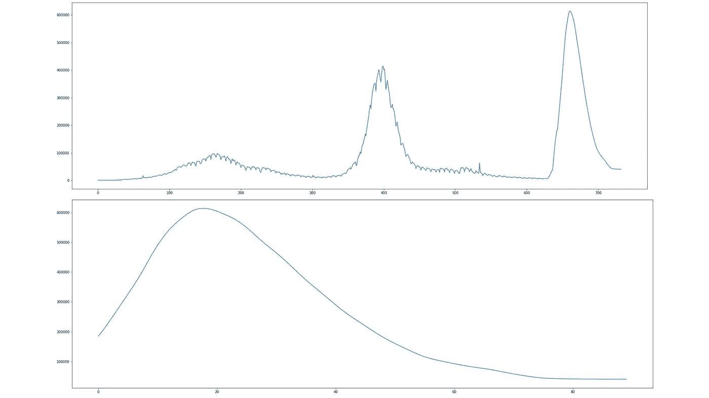
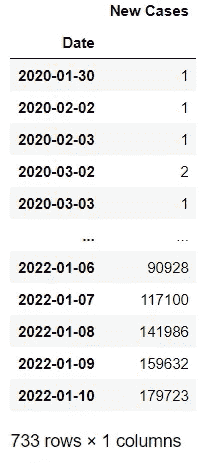
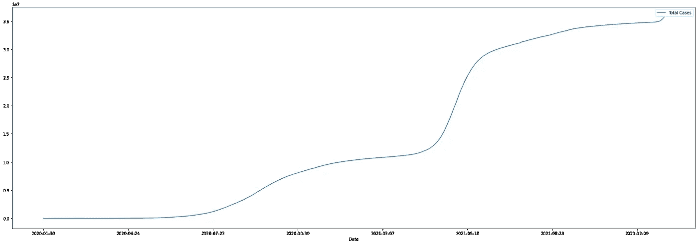
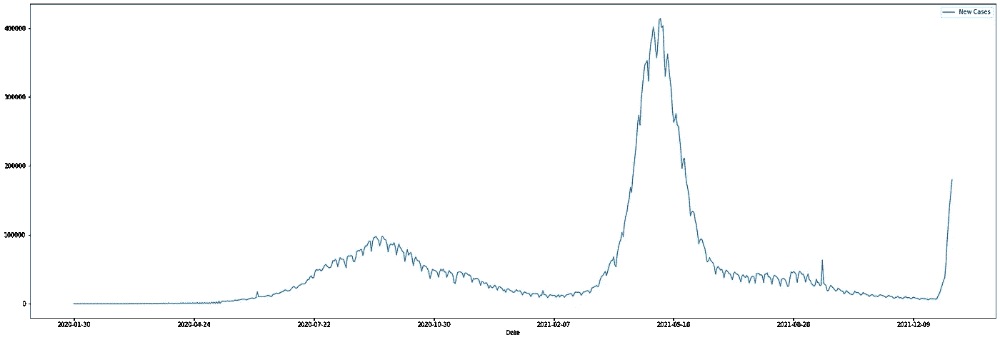
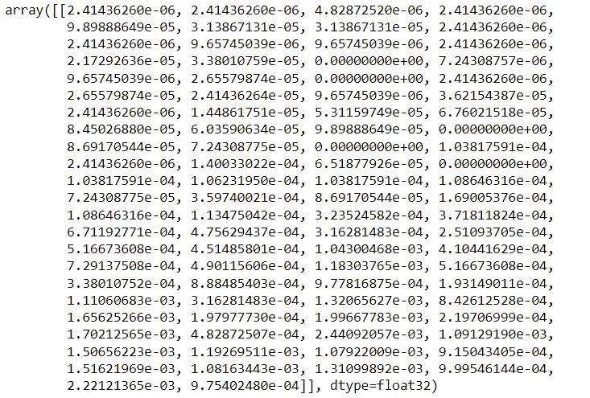
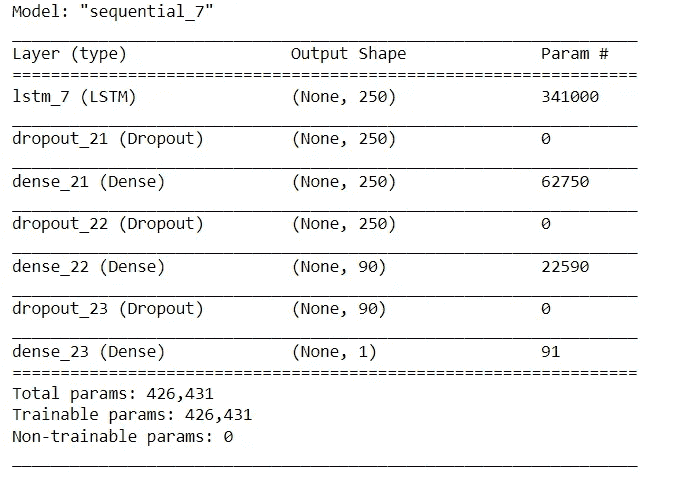
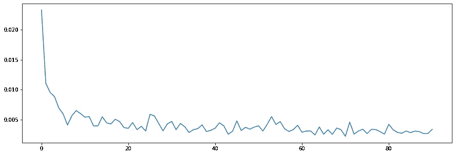
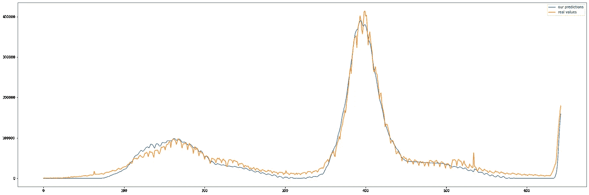
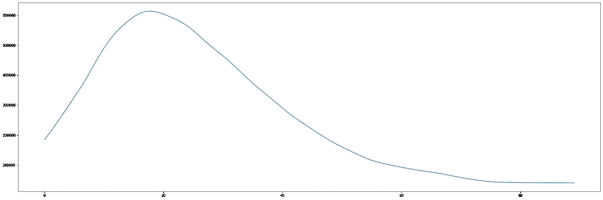
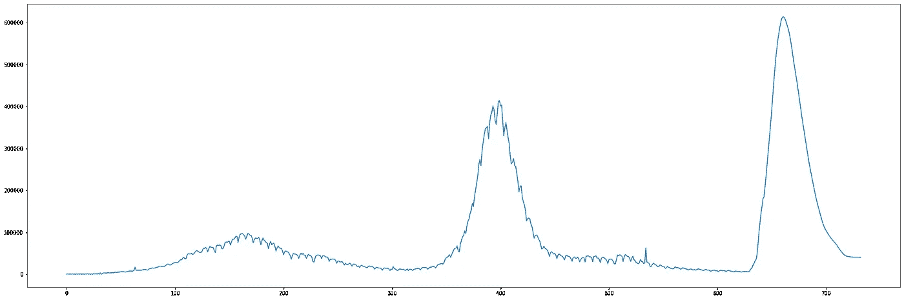

# 又一个陡峭的曲线？与 LSTM 一起预测印度的新冠肺炎第三次浪潮

> 原文：<https://towardsdatascience.com/another-steep-curve-predicting-indias-covid-19-third-wave-with-lstm-ec4fac848d70>

# 又一个陡峭的曲线？与 LSTM 一起预测印度的新冠肺炎第三次浪潮

## 完成项目，预测新的新冠肺炎病例在未来 90 天与 LSTM(代码包括在内)



图片来源:作者。

印度的新冠肺炎病例再次急剧上升！截至 2021 年 12 月 27 日，仅登记了 6，358 起新病例。但是仅仅在 2022 年 1 月 10 日的 14 天里，就有 168063 个新病例被登记。第三波的曲线非常陡峭，这就是为什么它现在是一个大问题。

因此，我考虑使用人工递归神经网络(RNN)结构长期短期记忆(LSTM)来预测新冠肺炎图在不久的将来(接下来的 90 天)会是什么样子。

# 数据集:

数据集由 DataMeet 从“[新冠肺炎印度数据集”下载。这些数据是社区从不同的政府网站收集、整理和组织的，所有印度人都可以免费使用。](https://projects.datameet.org/covid19/)

Github 库:【https://github.com/datameet/covid19 

该数据集拥有知识共享署名 4.0 国际公共许可证。数据集于 2022 年 1 月 10 日下载，包含截至同一日期的数据。

我们正在使用文件 *all_totals。JSON* 文件在*数据*目录下。预处理步骤演示了我如何处理来自这个 JSON 文件的数据，以便将其用于 LSTM 架构。

# 方法学

让我们讨论一下我如何执行项目的方法。之后的结果部分将讨论我们从整个项目中得到的结果。

## 导入库:

让我们为项目导入必要的库。

```
import json
import numpy as np
import pandas as pd
import matplotlib.pyplot as plt
from sklearn.preprocessing import MinMaxScaler
from tensorflow.keras.models import Sequential
from tensorflow.keras.layers import LSTM,Activation,Dense,Dropout
%matplotlib inline
scaler = MinMaxScaler()
from tensorflow.keras.callbacks import EarlyStopping
```

## 数据预处理:

来自数据集 all_totals。JSON，我创建了一个数据框架，包含每天登记的新案例。

```
f = open('all_totals.json')
# returns JSON object as a dictionary
data = json.load(f)total_cases_list = []
new_cases_list = []

pre_total_cases = 0
for row in data["rows"]:
    if "total_confirmed_cases" in row["key"]:
        temp_list = []
        temp_list.append(row["key"][0][0:10]) # Appending the date (the time part is trimmed)
        temp_list.append(row["value"]) # Appending the value on that date
        total_cases_list.append(temp_list)

        temp_list_2 = []
        temp_list_2.append(row["key"][0][0:10])
        temp_list_2.append((row["value"] - pre_total_cases)) # Appending the value on that date
        new_cases_list.append(temp_list_2)

        pre_total_cases = row["value"]

df_total = pd.DataFrame(total_cases_list, columns = ["Date", "Total Cases"])
df_new = pd.DataFrame(new_cases_list, columns = ["Date", "New Cases"])
```

名为 *df_new* 的数据帧包含从**2020–01–30 开始每天登记的新案例(某些日期缺失)。**

让我们将“日期”字段作为索引。

```
df_total = df_total.set_index("Date")
df_new = df_new.set_index("Date")
```

让我们删除文件中的一些错误值:

```
#deleting two faulty valuesdf_total.drop('2021-09-16', inplace=True, axis=0)
df_total.drop('2021-09-17', inplace=True, axis=0)
df_total.drop('2021-07-21', inplace=True, axis=0)
df_total.drop('2021-07-22', inplace=True, axis=0)df_new.drop('2021-09-16', inplace=True, axis=0)
df_new.drop('2021-09-17', inplace=True, axis=0)
df_new.drop('2021-07-21', inplace=True, axis=0)
df_new.drop('2021-07-22', inplace=True, axis=0)
```

这是数据帧现在的样子:



数据集摘要。图片来源:作者。

让我们来看看在印度登记的新冠肺炎病例总数曲线:



印度登记的病例总数。图片来源:作者。

这是印度新增新冠肺炎病例的曲线图:



印度登记的新病例。图片来源:作者。

现在，我们将构建训练数据集和训练标签。训练数据集将是时间序列数据。我们选择 90 天作为时间序列数据的窗口大小。

```
day = 90 # Number of days (window size)
```

现在让我们创建训练数据集和训练标签。

```
k = 0array = []
array_temp = []
train_data = []
train_labels = []for i in range(len(df_new)):
    array_temp.append(df_new.iloc[i]['New Cases'])array_temp = np.array(array_temp).reshape(-1,1)
array_temp = scaler.fit_transform(array_temp)
array_temp = array_temp.tolist()for i in array_temp:
    array.append(i[0])for i in range(len(array)):
    try:
        train_data.append(array[k:day+k]) # Creating inner lists with 'day' days of data
        train_labels.append([array[day+k]])
        k+=1
    except:
        breaklength = max(map(len, train_data))
train_data=np.array([xi+[None]*(length-len(xi)) for xi in train_data]).astype('float32')length = max(map(len, train_labels))
train_labels = np.array([xi+[None]*(length-len(xi)) for xi in train_labels]).astype('float32')
```

我们使用[最小最大缩放器](https://scikit-learn.org/stable/modules/generated/sklearn.preprocessing.MinMaxScaler.html)将我们的数据带入 0-1 范围。然后我们对它进行了整形，使它只有一列和 *n* 行数( *n* =数组中的元素数)。之后，我们将数组转换为列表。

然后，我们创建了训练数据。对于一个列表中的每 90 个点，第 91 个点将是它们的标签。然后我们创建了一个包含 90 分的列表列表。我们创建了另一个包含标签的列表。稍后，所有这些列表都被转换成 NumPy 数组和 NumPy 数组或数组。

训练和标注数据集的形状如下所示:

```
print(train_data.shape)
print(train_labels.shape)
```

形状:

**(644，90)
(643，1)**

让我们扩展 LSTM 体系结构的训练数据集的维度。

```
train_data = train_data[:len(train_labels)]
train_data = np.expand_dims(train_data,1)
train_data.shape
```

形状: **(643，1，90)**

现在让我们看看一行训练数据是什么样子的。

```
train_data[1]
```



训练数据集的一行。图片来源:作者。

让我们看看标签数据集中的一行是如何:

```
train_labels[1]
```

输出:*数组([0.0027741]，dtype=float32)*

## 建筑:

让我们现在就建造 LSTM 建筑

```
model = Sequential()model.add(LSTM(250,input_shape=(1,day)))
model.add(Dropout(0.5))model.add(Dense(250,activation='relu'))
model.add(Dropout(0.5))model.add(Dense(day,activation='relu'))
model.add(Dropout(0.5))model.add(Dense(1,activation='relu'))model.compile(loss='mean_squared_error',optimizer='adam')model.summary()
```



LSTM 建筑概要。图片来源:作者。

## 培训:

现在让数据适合模型。

```
E = 1000
callback = EarlyStopping(monitor='loss', mode='min', patience=20)
H = model.fit(train_data,train_labels,epochs=E, verbose=0, callbacks=[callback])
```

训练步骤完成后，让我们绘制损失值。

```
loss = H.history['loss']
epochs = range(0,len(loss))
plt.figure(figsize=(15,5))
plt.plot(epochs,loss)
```



每个时期的损失值图。图片来源:作者。

让我们把 LSTM 给出的预测和每天新登记的新冠肺炎病例的真实值一起画出来，看看这些预测有多准确。

```
preds = scaler.inverse_transform(model.predict(train_data))
plt.figure(figsize=(30,10))
plt.plot(preds,label='our predictions')
plt.plot(scaler.inverse_transform(train_labels),label='real values')
plt.legend()
```



预测值和实际值(每天新登记的新冠肺炎病例)。图片来源:作者。

从这个图表中，我们可以看到预测值非常准确，模型非常有前途。

## 未来预测:

让我们试着预测一下这条曲线在不久的将来。我们将尝试预测未来 90 天(从 2022 年 1 月 10 日开始)印度将有多少新增新冠肺炎病例。

```
days_to_predict = 90
seed = array[-day:]
#seed
```

我们在这里所做的是，我们正在创建一个**种子。**种子就是*数组*中最近 90 天的数据。我们将使用这个种子来预测第二天的数据。当它将预测它时，我们将更新我们的种子，并使它包含将在下一次预测中使用的预测数据。

我们举个例子。种子首先包含截至 2022 年 1 月 10 日的最近 90 天的数据(每天登记多少个新 covid 病例的值)。使用它，我们将预测 2021 年 1 月 11 日的值。然后，我们将使用 2022 年 1 月 11 日的预测数据作为种子中的数据点，并预测 2022 年 1 月 12 日的值数据，依此类推。

让我们使用这个模型来预测未来 90 天的病例数:

```
for _ in range(days_to_predict):
    current_days = seed[-day:]
    current_days = np.squeeze(current_days)
    current_days = np.expand_dims(current_days,0)
    current_days = np.expand_dims(current_days,0)
    pred = model.predict(current_days)
    seed = np.append(seed,pred)
```

让我们绘制预测值:

```
upcoming_days_prediction = scaler.inverse_transform(seed[-days_to_predict:].reshape(-1,1))
plt.figure(figsize=(30,10))
plt.plot(range(0,days_to_predict),upcoming_days_prediction)
```

让我们将预测值与数据集中的值相加，并绘制完整的图表。

```
# Adding real values and predicted values together
arr_without_pred = scaler.inverse_transform(train_labels)
arr_pred = scaler.inverse_transform(seed[-days_to_predict:].reshape(-1,1))
arr_with_pred = np.concatenate((arr_without_pred, arr_pred))plt.figure(figsize=(30,10))
plt.plot(arr_with_pred)
```

# 结果:

在我们看到结果之前，我希望你喜欢阅读这篇文章。如果你有，请成为灵媒的一员。只要每月 5 美元，你就可以阅读 Medium 上的任何文章(不仅仅是我的文章，任何文章)。单击下面的链接。

[https://samratduttaofficial.medium.com/membership](https://samratduttaofficial.medium.com/membership)

我将从 5 美元中获得一点佣金，这将激励我写更多！

让我们看看对未来 90 天(从 2022 年 1 月 11 日开始)新登记的新冠肺炎病例的预测。



对未来 90 天新登记的新冠肺炎病例的预测。图片来源:作者。

让我们看看每天新登记的新冠肺炎病例的完整图表，以及未来 90 天(从 2022 年 1 月 11 日开始)的预测值。



每天新登记的新冠肺炎病例，以及未来 90 天的预测值。图片来源:作者。

那么，在接下来的 90 天里，该模型总共预测了多少个案例呢？

```
total_new_cases = 0
for i in upcoming_days_prediction:
    total_new_cases += i[0]
    #print(i)
print(total_new_cases)
```

答案是:**23417088**

该模型预测，在未来 90 天内(从 2022 年 1 月 11 日开始)，印度将出现约 2350 万例新新冠肺炎病例。

# 结论

这项研究/项目只是展示了 LSTM 体系结构在预测时间序列数据中的应用。在这种情况下，我们使用印度的新冠肺炎数据进行研究。该模型在进行预测时没有考虑传染性和其他因素。

由于奥米克隆变异体的传播率远高于新冠肺炎的三角洲变异体(三角洲变异体是第二波疫情期间的主导变异体)，我个人认为，我们将在不久的将来看到一条更陡、更高的曲线。

但我不是卫生工作者或医生。所以对我说的一切都要持保留态度。

【https://github.com/SamratDuttaOfficial/Covid_India_LSTM】储存库:

一定要给 Github 库打一颗星。

# 萨姆拉特·杜塔:

**Github:**[https://github.com/SamratDuttaOfficial](https://github.com/SamratDuttaOfficial)

**Linkedin:**[https://www.linkedin.com/in/SamratDuttaOfficial](https://www.linkedin.com/in/SamratDuttaOfficial)【雇佣我】

**最聪明的朋友(机器学习)不和:**[https://discord.gg/7Bx6PGVy](https://discord.gg/7Bx6PGVy)

给我买杯咖啡:【https://www.buymeacoffee.com/SamratDutta】T22