# 方差分析和克鲁斯卡尔-沃利斯检验，解释

> 原文：<https://towardsdatascience.com/anova-and-kruskal-wallis-tests-explained-2ad828b97125>

## 了解我认为对社会科学领域的研究人员来说最重要的两个测试


来源:[像素](https://www.pexels.com/ko-kr/photo/4175054/)(免费使用)

# 介绍

有数以百计的统计测试帮助我们测试假设和验证假设。甚至有一本叫做 [100 种统计测试](https://www.amazon.com/Statistical-Tests-Third-Gopal-Kanji/dp/141292376X)的书，我推荐作为统计测试的百科全书。在所有这些测试中，我个人认为方差分析(ANOVA)测试和 Kruskal-Wallis 测试是社会科学领域的研究人员和博士生必须了解和学习的两个最重要的测试。为什么我会这么想？

这是因为在社会科学研究中，比较不同人口或群体子集的数值是最常进行的比较之一。想想你最近读的社会科学论文。想想任何分析性的新闻文章或社论。他们是做什么的？例如，如果我们有兴趣了解不同政治观点(例如，支持民主党、支持共和党、中立)的人之间的收入是否存在统计上的显著差异，我们需要使用 ANOVA 检验。如果我们对不同家庭收入群体的孩子在教育程度上的差异感兴趣，我们使用 ANOVA 测试。正如这些例子所说明的，方差分析和方差分析检验的非参数版本，Kruskal-Wallis 检验，是学者们在他们的研究中一直使用和考虑使用的。

在这篇文章中，我向你介绍什么是方差分析测试，它做什么，存在什么类型，它需要满足的假设和一些代码示例。让我们投入进去吧！

# 什么是方差分析测试？

ANOVA 测试是 t 测试的扩展版本，旨在比较两组的平均值，并查看差异是否具有统计学意义。然而，不能对三组或更多组进行 t 检验，这就是 ANOVA 检验发挥作用的时候。有些人可能会说，我们可以对每一组进行单独的 t 检验，但这种方法有一个缺点。进行大量的 t 检验可能会增加假阳性的可能性。

方差分析的无效假设和替代假设如下:

> H0(空):样本的平均值是相等的。
> 
> H1(备选):样本的一个或多个均值不相等

有多种类型的方差分析测试，但我将首先介绍单向方差分析测试，这是最常用的方差分析测试。其他类型将在文章末尾的一个单独的部分介绍。

# 需要满足哪些假设？

不幸的是，方差分析测试不能在任何情况下进行。这是一个参数测试，意味着它由一组参数和假设控制。让我们看看需要满足的一些假设。

*   因变量需要是连续的。这个很简单。回想一下，ANOVA 检验是 t 检验的扩展，它比较不同组的平均值(固有数值)。
*   组之间的差异需要相等。我们称之为“方差齐性”假设。数学上，它可以表示为:σ₁ = σ₂ = σ₃ = … = σ𝒸。
*   样本是从总体中随机选择的，并随机分配给每个组，从而使每个采样实例相互独立。
*   残差近似服从正态分布。

如何验证这些假设的方法将在代码示例中解释。

# 方差分析测试:代码

为了说明这个例子，让我们创建一个虚拟数据集。我们创建三个变量，每个变量对应一个不同的组。每个变量将包含随机整数，其范围由每个 np.random.randint()函数指定。

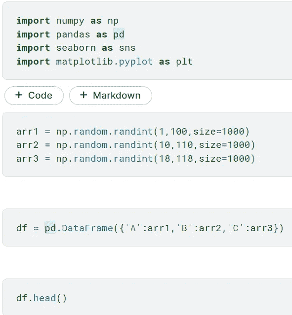

来源:来自作者

数据集的前几行如下所示:

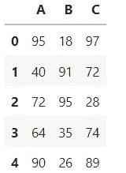

来源:来自作者

我们还创建了该数据的融化版本，因为各种可视化和统计测试需要不同的格式。

```
**# Pandas melt function, as the name suggests, melts the specified columns into two variables where one stores the unique categories of those column labels and the other stores the values that were in each of the column associated with that label**df_melt = pd.melt(df, value_vars=['A', 'B', 'C'])
df_melt.rename(columns={'variable':'group'}, inplace=True)
df_melt.head()
```

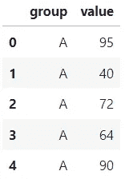

来源:来自作者

我们通过可视化对数据做一些简单的探索。

```
**import** matplotlib.pyplot **as** plt
**import** seaborn **as** sns**# seaborn's boxenplot is similar to box pot but differs in that it displays more granular quantiles than a box plot.**ax = sns.boxenplot(x='group', y='value', data=df_melt, color='#99c2a2')plt.show()
```


来源:来自作者

我们还通过 QQ 图来看各组的分布是否正态分布。

```
**import** numpy **as** np 
**import** scipy.stats **as** stats
**import** matplotlib.pyplot **as** pltfor g in df_melt['group'].unique():
    stats.probplot(df_melt[df_melt['group'] == g]['value'], dist="norm", plot=plt) plt.title("Probability Plot - " +  g)
    plt.show()
```

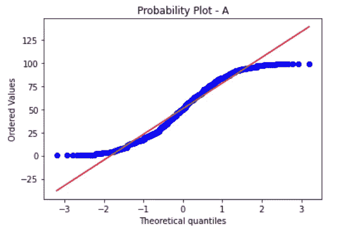

来源:来自作者

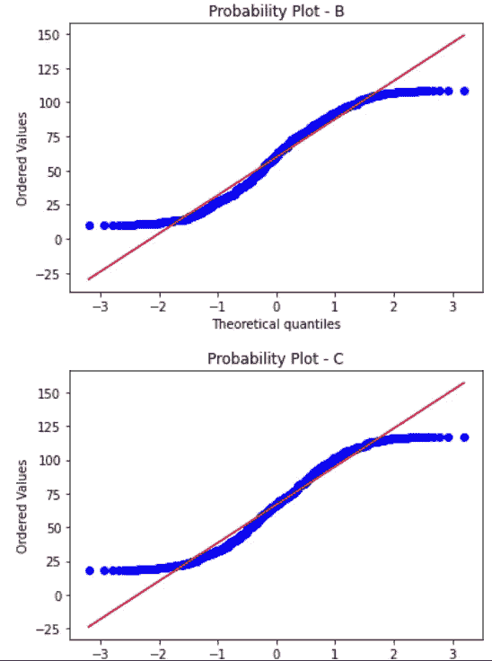

来源:来自作者

对应的三个 QQ 图似乎不太符合正态分布。但是不要被迷惑！这里我们不验证方差分析检验的正态性假设。这个假设是关于“残差”，而不是数据本身的分布。在这里，我们只是出于探索的目的查看每组数据的各个方面，并更好地理解它们。

使用 Python 有三四种不同的方法来执行 ANOVA 测试。

## 方法 1: scipy.stats

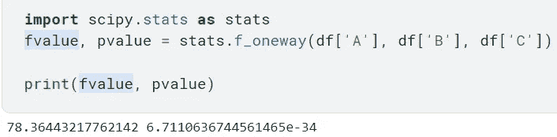

来源:来自作者

## 方法 2:统计模型

在这种方法中，您需要使用普通的最小二乘模型，对于那些比 Python 更熟悉 R 的人来说，它的语法类似于 R 的语法。

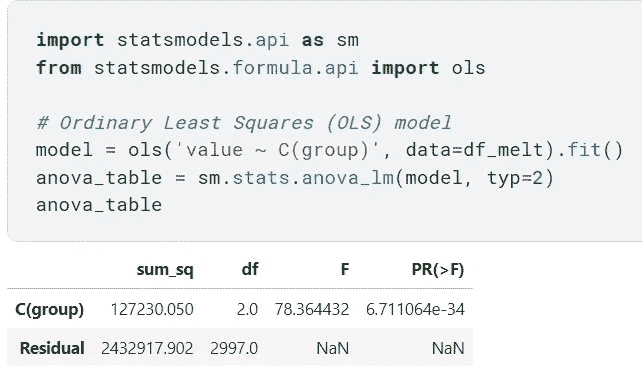

## 方法 3: pingouin

有一个名为 pingouin 的包，包含各种数学运算和统计测试。它有一个非常具体的单向方差分析版本，称为“韦尔奇方差分析”。这与经典的方差分析测试有何不同？与经典的 ANOVA 检验不同，即使不满足方差齐性假设，也可以使用 Welch 的 ANOVA。在这种情况下，韦尔奇的方差分析通常比经典方差分析具有更低的 I 型错误率。如果经典方差分析的所有假设都满足，那么只使用经典方差分析比 Welch 的方差分析更安全。看看这篇[文章](https://www.statisticshowto.com/welchs-anova/)了解更多关于韦尔奇方差分析测试的信息。

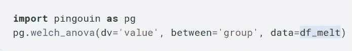

来源:来自作者

## 方法 4: bioinfokit

与 pingouin 类似，bioinfokit 包也有一个“analys”类，它具有各种统计测试功能。

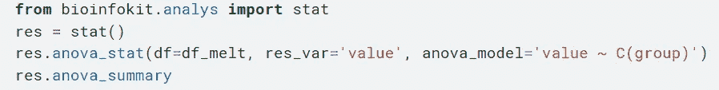

来源:来自作者

无论选择哪种方法，获得的 F 统计量和 p 值都是相同的。在本例中，ANOVA 分析的 p 值具有统计学意义(p < 0.05), and therefore, we can conclude that there are significant differences in values among groups.

# Checking Assumptions

Can we just conclude like above and move on? No! We need to make sure that the ANOVA test we ran was conducted under the correct assumptions.

## Normality of Residuals

If you used method 4 (bioinfokit package) above to run the ANOVA test, you can simply grab the residuals from the ANOVA test and plot both the QQ plot and histogram.

```
**## QQ-plot of residuals** import statsmodels.api as sm
import matplotlib.pyplot as pltsm.qqplot(res.anova_std_residuals, line='45')
plt.xlabel("Quantiles")
plt.ylabel("Std Residuals")
plt.show()**## Histogram of residuals** plt.hist(res.anova_model_out.resid, bins='auto', histtype='bar', ec='k') 
plt.xlabel("Residuals")
plt.ylabel('Frequency')
plt.show()
```

If the visualizations above are not clear enough to give us a sense of whether the normality assumption is met or not, we can proceed with using a statistical test for checking normality, the Shapiro Wilk test.

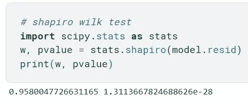

Source: From the Author

The variable “model” in the Shapiro Wilk test above is the OLS model from method 2 that uses the statsmodel package to run the ANOVA test. The p-value is smaller than 0.05 and so we reject the null hypothesis and the normality assumption does not hold.

## Homogeneity of Variances

Bartlett’s test is one test that allows us to check this homogeneity of variances assumption. It is part of the Scipy package’s stats class.

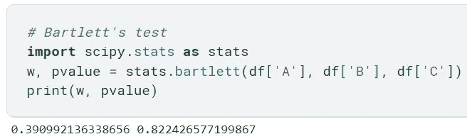

Source: From the Author

P-value is about 0.82 which is greater than 0.05 and so we fail to reject the null hypothesis. We assume that the different groups have equal variances.

There is another test called the Levene’s test that allows us to check the homogeneity of variances when the data did not pass the normality test in the previous part. This test is offered by the bioinfokit package and you can find more information from [这里是](https://pypi.org/project/bioinfokit/0.3/))。

# 克鲁斯卡尔-沃利斯试验

由于方差分析测试所需的假设并没有全部得到满足，我们将注意力转向 Kruskal-Wallis 测试，这是单向方差分析测试的非参数版本。术语非参数意味着方法不受参数和基本假设的约束。

该测试的无效假设和替代假设是:

> 零假设(H0):所有组的中位数是相等的。
> 
> 另一个假设(Ha):所有组的中位数并不相等。


来源:来自作者

p 值小于 0.05，因此我们拒绝零假设。我们说，在一些对之间的中位数存在一些统计上的显著差异。就像 ANOVA 测试一样，它没有告诉我们哪些配对在中位数上有这些统计上的显著差异。因此，我们需要进行事后检验，进行成对比较，以确定在方差分析中哪些配对导致了这一结果。Tukey 的测试是一个统计测试，我们用它来进行这些成对的比较。在这篇[文章](https://www.statology.org/tukey-test-python/)中阅读更多关于这个测试的内容。

# 结论

在本文中，我向您介绍了方差分析测试和克鲁斯卡尔-沃利斯测试。它们是两个有用的统计测试，允许我们比较不同组的平均值或中位数，并查看差异是否具有统计显著性。下一次你阅读学术论文时，你将不会被方法论部分吓倒，这部分通常会包括作者分析的统计测试。

如果你觉得这篇文章有帮助，请考虑通过以下链接注册 medium 来支持我: )

joshnjuny.medium.com

你不仅可以看到我，还可以看到其他作者写的这么多有用和有趣的文章和帖子！

# 关于作者

*数据科学家。加州大学欧文分校信息学专业一年级博士生。*

*密歇根大学刑事司法行政记录系统(CJARS)经济学实验室的前研究领域专家，致力于统计报告生成、自动化数据质量审查、构建数据管道和数据标准化&协调。Spotify 前数据科学实习生。Inc .(纽约市)。*

他喜欢运动、健身、烹饪美味的亚洲食物、看 kdramas 和制作/表演音乐，最重要的是崇拜我们的主耶稣基督。结账他的 [*网站*](http://seungjun-data-science.github.io) *！*