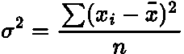
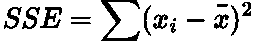
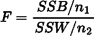
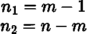
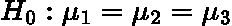
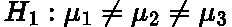
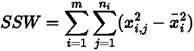
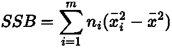
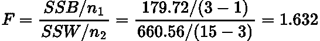

# 方差分析测试简单解释

> 原文：<https://towardsdatascience.com/anova-test-simply-explained-c94e4620ec6f>

## 方差分析统计检验及其概念的简单解释。


由 [Kaysha](https://unsplash.com/@kaysha?utm_source=medium&utm_medium=referral) 在 [Unsplash](https://unsplash.com?utm_source=medium&utm_medium=referral) 上拍摄的照片

# 介绍

你们中的许多人可能听说过 **Z 测试**和 **T 测试；**我甚至已经就这些话题发表了两篇博文，你可以点击这里查看:

</z-test-simply-explained-80b346e0e239>  </statistical-t-test-simply-explained-b510045d69e>  

这些测试使我们能够确定**两个总体或样本均值在统计上是否有显著差异**。然而，如果我们想测试三个样本之间的平均值呢？

在这个场景中，一个人必须进行**三个**不同的 T 测试，如果有四组，我们将需要**六个**测试。随着小组数量的增加，所需的测试数量迅速增加。

这就是方差分析测试的用武之地！ **ANOVA(方差分析)**测试使用方差来衡量多组平均值的差异。

ANOVA 测试是一个**综合**测试**测试**，因为它可能会告诉你方法不同，但不会告诉你有多少或哪些具体方法显著不同。

在这篇文章中，我们将解释方差分析的一些先决条件的概念，执行假设检验的过程，并通过一个示例问题，我们将使用方差分析！

# 方差分析假设

*   从人群中抽取样本是一个正态分布。
*   各组被独立采样**。**
*   用于样本的总体具有**等于** **的方差。**

# 关键概念

我们现在将浏览一些我们需要理解的关键概念，以进行 ANOVA 测试。有些事情一开始看起来很抽象，但我保证当我们最后看一个例子时，它们会变得更有意义！

## **差异**

ANOVA 测试中的主要概念是**方差**，它是数据的**扩散/分散**的度量。对于正态分布，方差为[定义为:](https://www.youtube.com/watch?v=9cnSWads6oo)



作者在 LaTeX 中生成的方程。

其中*为数据的平均值， ***x_i*** 为单个数据点， ***n*** 为数据点数， ***σ*** 为方差。*

> *注意:分母可以是 **n-1** 取决于我们考虑的是总体还是样本。有一个很棒的 stats stack 交换线程很好地解释了这种差异。*

## ***平方和***

*方差用于计算**平方和(误差)(SSE)** 。这只是上面方差方程的分子:*

**

*作者在 LaTeX 中生成的方程。*

*在 ANOVA 测试中，您执行三种不同的 SSE:*

*   ***组内平方和(SSW):** 这只是每个样本内的 SSE。*
*   ***组间平方和(SSB):** 这是每个样本的均值和全局/大均值(每组均值的均值！).*
*   ***总平方和(SST):** 这是通过将所有样本组合在一起而完成的整个数据集的 SSE。*

*一个已知的结果是 ***SST = SSB + SSW。****

## *f 统计量*

*ANOVA 检验的检验统计量是[**F-统计量**](https://www.statology.org/anova-f-value-p-value/) ，计算如下:*

**

*作者在 LaTeX 中生成的方程。*

*其中***n1***和***N2***是每个平方和(组间和组内)的**自由度**:*

**

*作者在 LaTeX 中生成的方程。*

*其中 ***m*** 为组数 ***n*** 为数据点总数。*

*F 统计量实际上是两个卡方值除以其相应自由度的**比率。**卡方分布也是正态分布中随机变量的**平方。**因此，我们在方差分析测试中使用 F 分布是有意义的，因为我们正在对正态分布变量求平方并对它们进行分割！*

*要了解更多关于 f 分布和 Chi 分布的信息，请查看我以前的帖子:*

*</chi-square-distribution-simply-explained-87f707ba631a>  </f-distribution-simply-explained-45d0e6768a4>  

# 假设检验步骤

让我们简要回顾一下进行统计假设检验的基本步骤。

*   列出你的 [null、 ***H_0*** ，以及候补、 ***H_1*** ，假设。](https://support.minitab.com/en-us/minitab-express/1/help-and-how-to/basic-statistics/inference/supporting-topics/basics/what-is-a-hypothesis-test/)
*   设置一个[**显著性水平**](https://en.wikipedia.org/wiki/Statistical_hypothesis_testing) 并计算出相应的 [**临界值**](https://support.minitab.com/en-us/minitab-express/1/help-and-how-to/basic-statistics/inference/supporting-topics/basics/what-is-a-critical-value/) **(或** [**P 值**](https://www.investopedia.com/terms/p/p-value.asp) **)** 供你分配。在我们的例子中，它是 f 分布。
*   计算 [**检验统计量**](https://en.wikipedia.org/wiki/Test_statistic) ，在我们的例子中这将是 F 统计量。
*   将测试统计值与临界值进行比较，并决定**拒绝或拒绝无效假设。**

> 要进一步了解这些主题，请点击提供的链接或参考我在文章顶部链接的 T-Test 和 Z-Test！

# 示例问题

现在让我们把所有的理论付诸实践吧！

我们正在调查三种不同类型的药丸对减肥的效果。通过给三组不同的人服用这三种药丸中的一种，我们观察到以下重量减轻(以 kg 计) :

```
 ** Group 1     Group 2     Group 3**
              --------------------------------
                10          11           20        
                23          12           27
                20          28           14
                15          14           29
                11          30           31
```

> 请注意，上表的格式在手机上可能会出现异常！

这是一个**单向** ANOVA 测试，因为我们只是在观察一个变量(药丸类型)是如何影响各组的。如果我们想知道运动和药片如何影响减肥，这将是一个双向方差分析测试。

## 假设和显著性水平

让我们阐明我们的假设:

*   Null、**、 *H_0、*、**三种药丸减肥效果相同。所以，各组之间的平均值没有显著差异:



作者在 LaTeX 中生成的方程。

*   备选，***h1***，至少其中一种药丸比其他药丸减肥效果更好或更差。因此，不同组之间的平均值有很大的不同:



作者在 LaTeX 中生成的方程。

对于这个测试，我们将使用 **5%** 的显著性水平，这是标准。

## 同ＳＯＵＴＨ-ＳＯＵＴＨ-ＷＥＳＴ

现在我们使用公式计算每组[的平方和](https://online.stat.psu.edu/stat415/lesson/13/13.2)



作者在 LaTeX 中生成的方程。

其中 ***n_i*** 为每组的数据点数， ***m*** 为组数， ***x̄_i*** 为每组的平均值， ***x_i，j*** 为数据点数。

将这个公式应用于我们的数据，我们得到:

```
 **Group 1 (Mean 15.8)**   **Group 2 (Mean 19)**    **Group 3 (Mean 24.2)**
      -----------------------------------------------------------
      (10-15.8)^2           (11-19)^2            (20-24.2)^2        
      (23-15.8)^2           (12-19)^2            (27-24.2)^2
      (20-15.8)^2           (28-19)^2            (14-24.2)^2
      (15-15.8)^2           (14-19)^2            (29-24.2)^2
      (11-15.8)^2           (30-19)^2            (31-24.2)^2
      ------------------------------------------------------------  **Total**     126.8                340                  193.76 **SSW = 126.8 + 340 + 193.76 = 660.56**
```

## 单边带传输

现在我们使用下面的公式计算组[之间的平方和:](https://online.stat.psu.edu/stat415/lesson/13/13.2)



作者在 LaTeX 中生成的方程。

其中 ***n*** 为每组数据点数， ***m*** 为组数，***【x̄_i】***为每组平均值，***【x̄】***为大平均值。

```
 **Global Mean: 19.67** **Group 1 (Mean 15.8)**   **Group 2 (Mean 19)**    **Group 3 (Mean 24.2)**          --------------------------------------------------------------------
    5(15.8-19.67)^2      5(19-19.67)^2         5(24.2-19.67)^2
       = 74.88              = 2.24                 = 102.6 **SSB = 74.88 + 2.24 + 102.6 = 179.72**
```

> 这些公式来源于[这里](https://online.stat.psu.edu/stat415/lesson/13/13.2)。如果你想查看 SSW 和 SSB 的完整推导，请确保[查看该链接！](https://online.stat.psu.edu/stat415/lesson/13/13.2)

## 统计量和临界值

因此，我们的 F 统计量是:



作者在 LaTeX 中生成的方程。

我们可以将其与临界值进行比较，临界值可以使用 [F 分布表](https://users.sussex.ac.uk/~grahamh/RM1web/F-ratio%20table%202005.pdf)找到。我们知道我们的自由度是 **2** 和 **12** (根据上式)，因此临界值是 **3.89。**

因此， **1.632 < 3.89** ，我们未能拒绝零假设，每种减肥药的效果都差不多！

你可以看到，每组的平均值与大平均值的差异越大，它们在统计上的差异就越大。这可以从数学上看出来，因为 SSB 的值将增加，导致更大的 F 统计量。

# 结论

在本文中，我们描述了 ANOVA 测试背后的关键概念，并通过一个简单的单向测试的例子。ANOVA 检验主要用于测量三个或更多组之间的总体/样本均值的差异。

# 和我联系！

*   要在媒体上阅读无限的故事，请务必在此注册！T3*💜*
*   [*当我在这里发布注册邮件通知时，可以获得更新！*](/subscribe/@egorhowell) 😀
*   [*领英*](https://www.linkedin.com/in/egor-howell-092a721b3/) 👔
*   [*推特*](https://twitter.com/EgorHowell) 🖊
*   [*github*](https://github.com/egorhowell)*🖥*
*   *<https://www.kaggle.com/egorphysics>**🏅***

> ***(所有表情符号由 [OpenMoji](https://openmoji.org/) 设计——开源表情符号和图标项目。许可证: [CC BY-SA 4.0](https://creativecommons.org/licenses/by-sa/4.0/#)****