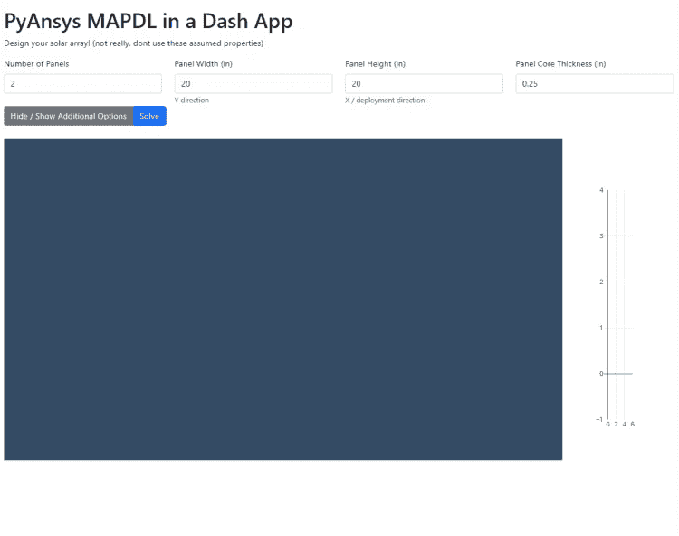
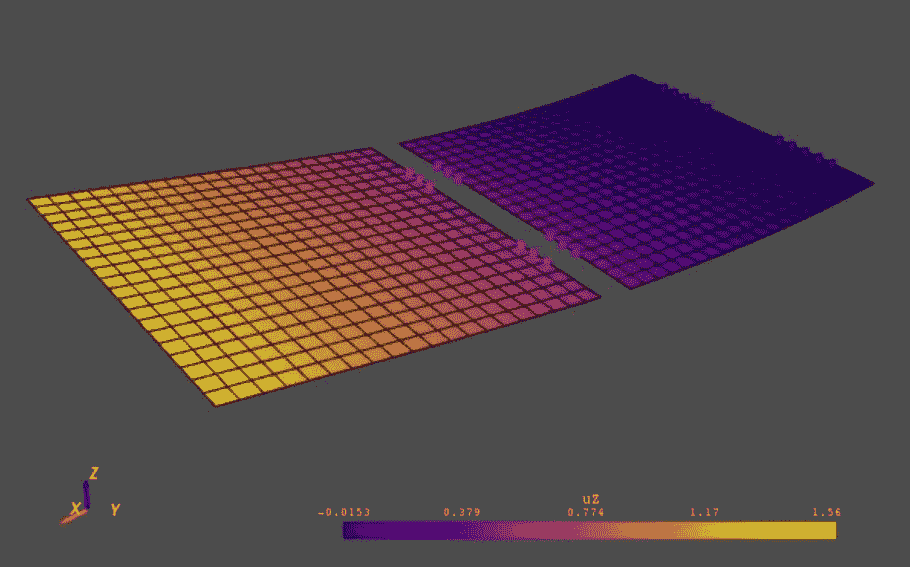
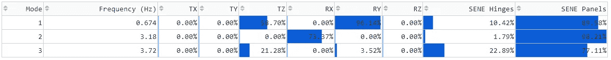

# Python Web 应用程序中的 ANSYS，第 2 部分:用 PyMAPDL 进行预处理和求解

> 原文：<https://towardsdatascience.com/ansys-in-a-python-web-app-part-2-pre-processing-solving-with-pymapdl-50428c18f8e7>

## 将 PyAnsys 与 Plotly 的 Dash 和 Dash-VTK 组件集成，以构建 Ansys 结构分析 web 应用程序

ANSYS [最近宣布](https://www.ansys.com/blog/ansys-gets-into-open-source-with-github?utm_campaign=brand&utm_source=marketing-automation&utm_medium=email-single&utm_content=digital_weekly-blog_211015_blog-weekly_roundup_en_global&campaignID=)支持一个开源项目: [PyAnsys](https://www.ansys.com/blog/ansys-gets-into-open-source-with-github?utm_campaign=brand&utm_source=marketing-automation&utm_medium=email-single&utm_content=digital_weekly-blog_211015_blog-weekly_roundup_en_global&campaignID=) 。PyAnsys 被拆分成多个包: [PyMAPDL](https://mapdldocs.pyansys.com/user_guide/index.html) 用于与 Ansys multiphysics 仿真和方程解算器的实例进行交互，以及 [PyDPF-Core](https://github.com/pyansys/pydpf-core) ( &它的简化兄弟 [PyDPF-Post](https://github.com/pyansys/pydpf-post) )用于后处理 Ansys 结果文件。这是 Python Web 应用程序中 Ansys 的姊妹文章，第 1 部分:使用 PyDPF 进行后处理。

[](/ansys-in-a-python-web-app-part-1-post-processing-with-pydpf-44d2fbaa6135)  

在本文中，我将使用 PyMAPDL，Dash & Dash-VTK 构建一个 web 应用程序，该应用程序构建一个模型，运行模态分析，并呈现一些结果。你可以在[这个 GitHub 库](https://github.com/shkiefer/pyAnsys_MAPDL_dash)里看到完整的文件(笔记本和 Dash app)。这就是它的作用:



PyMAPDL Web 应用程序正在运行！图片作者。

# 普洛特利的破折号&破折号-VTK

[Plotly 的 Dash](https://dash.plotly.com/introduction) 开源框架被描述为一个仅用 python 就能构建全功能网络应用的框架。我非常喜欢用它来构建我希望其他用户(除了我自己)会使用的应用程序。

虽然自首次亮相以来它已经发展了很多，但你可以阅读 2017 年的公告文章，以了解 Dash 的更多背景信息:

[](https://medium.com/plotly/introducing-dash-5ecf7191b503)  

你还可以在本文中看到更多关于 Dash_VTK 的内容:

[](/3d-mesh-models-in-the-browser-using-python-dash-vtk-e15cbf36a132)  

# PyMAPDL

MAPDL 代表机械 Ansys 参数化设计语言，几十年来一直是 Ansys 机械解算器的脚本接口。在 Ansys Mechanical(工作台应用程序/用户界面)之前，APDL 是一种很容易将仿真参数化的方法。即使有了“新的”Workbench Mechanical UI，MAPDL 在添加 UI 所没有的功能时仍然非常有用(通过“命令片段”)。PyMAPDL 是 PyAnsys 包，用于通过 Python 与 Ansys 实例进行通信。根据 PyAnsys 文档:

> 借助 PyMAPDL，将 Ansys MAPDL 多物理解算器的模拟功能直接集成到新的应用程序中比以往任何时候都更容易，这要归功于 APDL 和 Python 用户都很熟悉的 API。该软件包提供了一个 Python 友好的接口来驱动管理低级 APDL 命令提交的软件，同时通过高性能 gRPC 接口交换数据。

当您启动一个 MAPDL 实例时，它确实需要一个适当的许可证来启动服务器，并且会一直持有该许可证，直到服务器实例退出(或终止)为止。让我们看看这在 Jupyter 笔记本上是什么样子的(我使用的是 [VS 代码‘交互窗口’&‘Python 代码文件’](https://code.visualstudio.com/docs/python/jupyter-support-py))

在这个例子中，我们使用 PyMAPDL，就像普通的 MAPDL 脚本一样。首先我们创建`mapdl`实例(可选地指定许可类型),然后开始使用 pythonic 格式执行 MAPDL 命令。在这个例子中，我们将创建一个非常简单的航天器太阳能电池翼展开模型(尽管非常简单)。首先，我们定义一些材料和截面，关节属性作为铰链的表示)，然后是几何图形(通过创建一个区域，然后使用`agen`命令复制一个偏移)。然后我们将贝壳网格化。从第 87 行开始，我使用一个辅助函数`make_sbc`来创建一些‘远程点’，然后用`combin250` 6 自由度弹簧作为我们的铰链表示。最后设定边界条件和模态分析参数，输出要求并求解。完整文件请参见 github 资源库。



第一模式平面外位移图。图片作者。

到目前为止，这感觉就像编写一个 MAPDL 脚本。在集成到应用程序之前，让我们对其进行一些功能化处理。在这里，我们设置该函数，允许用户定义面板宽度(`panel_w`)和高度(`panel_h`)以及面板数量(`n_panels`)和一些其他属性。我们在函数中创建 mapdl 对象(它启动实例并提取许可证)。`agen`命令和铰链弹簧表示创建已更新，以考虑用户定义的面板数量。我们像往常一样进行网格划分和求解，但随后我们从已求解的`mapdl`对象中提取出`grid`和`result`对象。我们还将 mapdl 对象传递给另一个辅助函数`get_sene_comps` ，该函数从铰链和面板组件中提取每种模式的相对应变能部分，并在 pandas 数据帧中返回数据。然后我们退出`mapdl`对象来释放许可证，并在返回`grid`、`result`和`df_sene`对象之前杀死实例。

运行分析就像定义参数和调用函数一样简单:

```
panel_w = 20.
panel_h = 20.
tc = 0.25
r, g, df_sene = make_pv_array(panel_w=panel_w, panel_h=panel_h, tc=tc)
```

通过这种功能化的分析，是时候构建 web 应用程序了。

# PyMAPDL Dash Web 应用程序

对于 web 应用程序，我们希望将一些输入参数暴露给我们的函数，并能够绘制第一模式的变形形状，并以易于理解的格式呈现相对应变能。对于这个应用程序，我希望用户主要更改`panel_h`、`panel_w`、`n_panels`和`tc`输入，因此我们将使用 4 个始终可见的数字输入来使这些变得明显。然而，我们仍然希望用户能够在需要时更改其他参数，因此我们将这些参数隐藏在一个`collapse`组件中。让我们来看看布局定义的用户输入部分。

我们的主要输入在第 8、14、21 和 28 行(要点)。然后我们有几个按钮。第一个是打开和关闭折叠以显示附加选项，另一个是使用所有设置的参数执行求解。solve 按钮将是我们主回调的输入。从第 36 行开始，我们有 Collapse 对象，它包含附加选项的网格布局:非结构质量、面板厚度、铰链有效刚度、面板之间的间隙、图中的变形比例因子，以及打开或关闭元素边缘的开关。紧接在折叠下方，我们有一个最初隐藏的进度条，我们将使用它来更新求解的状态，后面是用于显示实际 3D 模型和颜色条的`dash_vtk.View`和`dcc.Graph`组件(如前一篇 pyAnsys 文章中所解释的)。在这下面我们有一个`html.Div`元素，我们将在一个汇总表中传递它。

边缘切换和折叠的回调非常简单，所以我将重点放在主回调上。这里我们将使用一个相对较新的破折号特性:[【长回调】](https://dash.plotly.com/long-callbacks)。虽然这个玩具示例可能在大约 30 秒内(在浏览器超时之前)返回结果，但更复杂/详细的分析可能不会。我们必须设置一个缓存管理器，在这个例子中我们将使用更简单的`diskcache` 。这在 [dash 文档](https://dash.plotly.com/long-callbacks)中有很好的解释。

`Outputs`、`Inputs` 和`States` 看起来都很正常。我们有 1 个“solve”按钮作为唯一的输入，还有许多其他的`State` 对象，用于在按钮被按下时收集用户定义的设置。我们将添加`prevent_initial_callback=True`,以防止解决方案在我们希望之前启动。现在我们来看看 long_callback 使用的特殊特性:`running` 和`progress`。running 参数允许我们在回调运行时(3 个中的第 2 个)和回调完成时(3 个中的第 3 个)定义回调来设置组件属性(3 个中的第 1 个)。在这里，我们在回调运行时禁用“solve”按钮(并在使用`disabled=False`完成时启用它)。我们还让进度条在回调运行时可见，而不是在回调完成时可见(用`style={visibility: ‘hidden’}`)。progress 参数让我们在回调运行时更新一些进度指示器。我们可以用一个特殊的参数`set_progress` 来实现这一点，该参数成为传递给回调函数的第一个参数(在`Input` 和`State` 组件值之前)。该参数是一个函数，我们向其传递的值对应于`running` 参数列表中组件属性的顺序。它只接受一个输入，所以当我们调用`set_progress()`函数时，我们将两个属性(进度条组件的`value` 和`max` 属性)放在一个`tuple` 中。因此，要将进度条设置为 1/10 的进度，我们将在回调中的适当位置调用`set_progress((1,10))`。

好了，现在我们已经通过了，我们可以进入回调函数了。在前面，我只是检查没有一个参数是`None` (这不应该发生在`prevent_initial_call=True`)。然后，我们将进度设置为 1/10，然后调用我们的函数来构建、网格化和运行我们的太阳能电池阵列 FEM。这个函数在笔记本版本上做了一点调整，这样我们就可以传入`set_progress` 函数并继续增加进度，一些额外的辅助函数用于提取模态有效质量并与应变能表合并。`make_pv_array()`函数的每个输入都是从`State` 对象中提取的参数。我们得到了我们的结果对象，网格，和应变能分解的数据帧(现在是模态有效质量)。我们需要一个助手函数(`plot_nodal_disp`)将 pyMAPDL 结果对象的平面外位移分配到 vtk 网格本身(作为一个点数组)。这个函数只是确保数据集具有与网格相同数量的元素，如果网格中有额外的节点，结果将被设置为 0。(同时确保数据/范围的顺序保持不变)。在这之后，我们有了带有`uz` 标量数据的网格，并使用其中的最小/最大值来帮助创建颜色条，并确保`dash_vtk` 图的最小/最大值与颜色条上的最小/最大值相同。然后，我们将网格转换为`mesh_state` 对象，并创建一个破折号`DataTable`来表示模态有效质量和应变能。使用另一个辅助函数(来自 Dash 示例)在每一列中创建条来轻松识别高模态质量自由度和应变能的贡献者，这有点不可思议。在下面的例子中，我们可以很快看到第一种模式是悬臂模式(高`TZ` & `RY`),面板刚度贡献了大部分应变能。第二种模式是扭转模式(高`RX`)，同样由面板刚度(高`SENE Panels`)控制。为了显著增加这些模式，我们希望增加面板的刚度(而不是增加铰链的刚度)。



花哨的数据表突出了模态质量和应变能%。图片作者。

# 你看到光了吗？

重复我在上一篇文章中提到的:我认为当目标用户不是模拟专家时，将 pyAnsys 打包成 web 应用程序是最强大的。这个例子非常简单，但是更高级的 MAPDL 脚本可以转换成函数。这里的输入和输出是为特定用途定制的。在典型的有限元分析中，你必须从大量潜在的结果中筛选出你想要的洞察力。这对于模拟专家来说可能是微不足道的，但对于其他工程师来说就不是那么回事了。将 pyMAPDL 集成到典型 Ansys 平台之外的应用程序中的几个用例:

1.  相当标准化的产品，但可能需要小的明确的变化或调整，以满足某些性能参数(刚度、强度等)
2.  为业务开发团队提供初步模型课程，这样他们就可以运行快速布局/调整交易，从而在不召集“大人物”的情况下获得初步设计

最后，我想分享一下为什么我喜欢网络应用程序(而不是。exe):大家用的工具都一样。它总是最新和最棒的版本，你不必担心过时的(或有错误的)旧版本。

谢谢你能走到这一步！(抱歉没奖)。查看完整文件的 GitHub repo 。