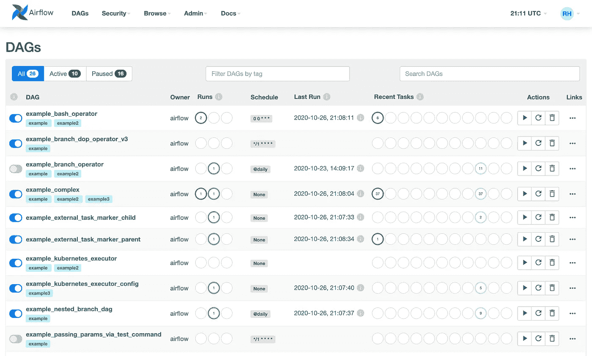
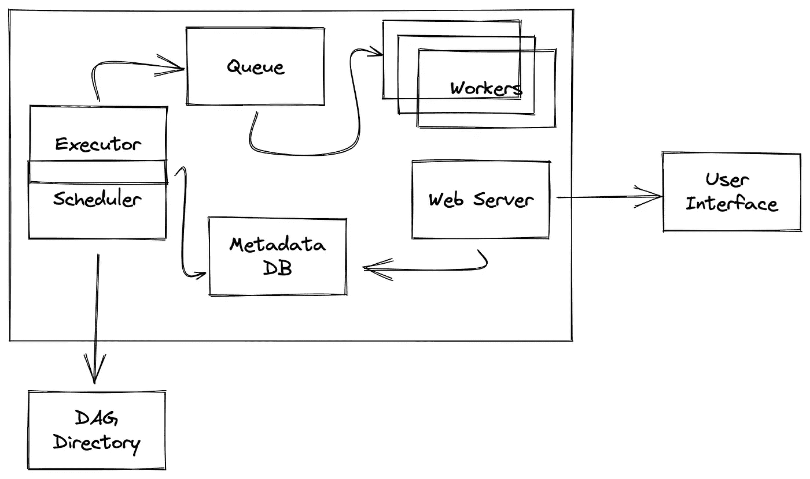

# 阿帕奇气流架构

> 原文：<https://towardsdatascience.com/apache-airflow-architecture-496b9cb28288>

## 深入探讨 Apache Airflow 架构及其如何编排工作流


由 [Unsplash](https://unsplash.com/s/photos/blocks?utm_source=unsplash&utm_medium=referral&utm_content=creditCopyText) 上的 [La-Rel Easter](https://unsplash.com/@lastnameeaster?utm_source=unsplash&utm_medium=referral&utm_content=creditCopyText) 拍摄的照片

就管道调度和执行而言，Apache Airflow 是最常用的框架之一，并且在过去几年中已经在数据工程社区中获得了巨大的吸引力。

该技术本身由许多不同的组件组成，这些组件协同工作以执行特定的操作。在今天的文章中，我们将讨论 Apache Airflow 的整体架构，并了解不同的组件如何相互交互，以便将数据管道带入生活。

# 主要组件

Airflow 可以构建、安排和执行工作流程。每个工作流被表示为由任务组成的有向无环图(DAG)。现在，这些任务将执行某些操作，它们之间也可能有一些依赖关系。

例如，假设我们希望将外部数据库中的数据接收到 Google Cloud Big Query(这是一个托管数据仓库服务)中，然后执行几个转换步骤。在这种情况下，我们将构建一个包含两个任务的 DAG 第一个任务负责将数据从外部数据库复制到 BigQuery，第二个任务执行转换步骤。另外，第二任务将依赖于第一任务的成功执行。

现在，Airflow 由几个不同的组件组成，这些组件执行特定的操作并协同工作，以便让用户设计、构建、调度和执行工作流。在接下来的几节中，我们将介绍 Airflow 的架构，并讨论它的一些最重要的组件。

## 调度程序

本质上执行两个特定任务的调度程序；它调度和触发工作流，此外，它还向执行者提交所有调度的工作流。

为了确定是否可以触发任何任务，调度程序需要运行一个负责监控 DAG 文件夹(包含 DAG 的所有 Python 文件都应该位于该文件夹中)的子进程。默认情况下，调度程序将每分钟进行一次查找(但这可以在气流配置文件中进行调整)。

调度程序使用执行器来运行准备好的任务。

## 执行者

执行者负责运行任务。一个气流装置在任何给定时间只能有一个执行器。执行器在气流配置文件(`airflow.cfg`)的`[core]`部分定义。举个例子，

```
[core]
executor = KubernetesExecutor
```

注意，本质上有两种类型的执行者；本地和远程。当地执行者包括`[DebugExecutor](https://airflow.apache.org/docs/apache-airflow/stable/executor/debug.html)`、`[LocalExecutor](https://airflow.apache.org/docs/apache-airflow/stable/executor/local.html)`和`[SequentialExecutor](https://airflow.apache.org/docs/apache-airflow/stable/executor/sequential.html)`。一些远程执行者是`[CeleryExecutor](https://airflow.apache.org/docs/apache-airflow/stable/executor/celery.html)`和`[KubernetesExecutor](https://airflow.apache.org/docs/apache-airflow/stable/executor/kubernetes.html)`。

本地执行器在调度程序的进程内部本地运行任务。另一方面，远程执行者远程执行他们的任务(例如，在 Kubernetes 集群中的一个 pod 中)，通常使用一个工人池。

## 长队

一旦调度器识别出可以被触发的任务，它将按照它们应该被执行的正确顺序把它们推入任务队列。

然后，气流工作者将从队列中取出任务，以便执行它们。

## 工人

气流工用来执行分配的任务。

## 元数据数据库

这是一个由执行器、调度程序和 web 服务器用来存储它们的状态的数据库。默认情况下，SQLite 数据库会加速运行，但是 Airflow 可以使用 SQLAlchemy 支持的任何数据库作为其元数据数据库。尽管一般来说用户倾向于对 Postgres 有强烈的偏好。

## 网络服务器

这是一个 Flask web 服务器，它公开了一个用户界面，允许用户管理、调试和检查工作流及其任务。



气流用户界面—来源: [Apache 气流文档](https://airflow.apache.org/docs/apache-airflow/stable/ui.html#dags-view)

# 大局

下图说明了我们之前讨论的不同组件如何相互交互以及交换数据和消息以执行特定任务。



简而言之的气流建筑——来源:作者

Web 服务器本质上需要与工作器、DAG 文件夹和元数据数据库通信，以便分别获取任务执行日志、DAG 结构和任务状态。

工作者需要与 DAG 文件夹通信，以便推断 DAG 的结构并执行其任务，还需要与元数据数据库通信，以便读取和存储关于连接、变量和 XCOM 的信息。

调度程序必须与 DAG 文件夹通信以推断 DAG 的结构并调度它们的任务，还必须与元数据数据库通信以写入关于 DAG 运行和相关任务的信息。此外，它需要与任务队列进行通信，它将在任务队列中推送准备好被触发的任务。

# 最后的想法

Airflow 是一个强大的工具，让用户(主要是工程师)设计、构建、调试、调度和执行各种工作流。在今天的教程中，我们学习了气流中一些最重要的组成部分，它们协同工作以执行特定的操作。

在开始使用一个框架或工具之前，花时间去理解它的基本架构总是非常重要的。大多数情况下，这将帮助您编写更有意义、更高效的代码。

[**成为会员**](https://gmyrianthous.medium.com/membership) **阅读介质上的每一个故事。你的会员费直接支持我和你看的其他作家。你也可以在媒体上看到所有的故事。**

<https://gmyrianthous.medium.com/membership>  

**相关文章你可能也喜欢**

</airflow-dags-decorators-b5dc03c76f07>  </hashicorp-vault-airflow-cfdddab31ea>  </run-airflow-docker-1b83a57616fb> 