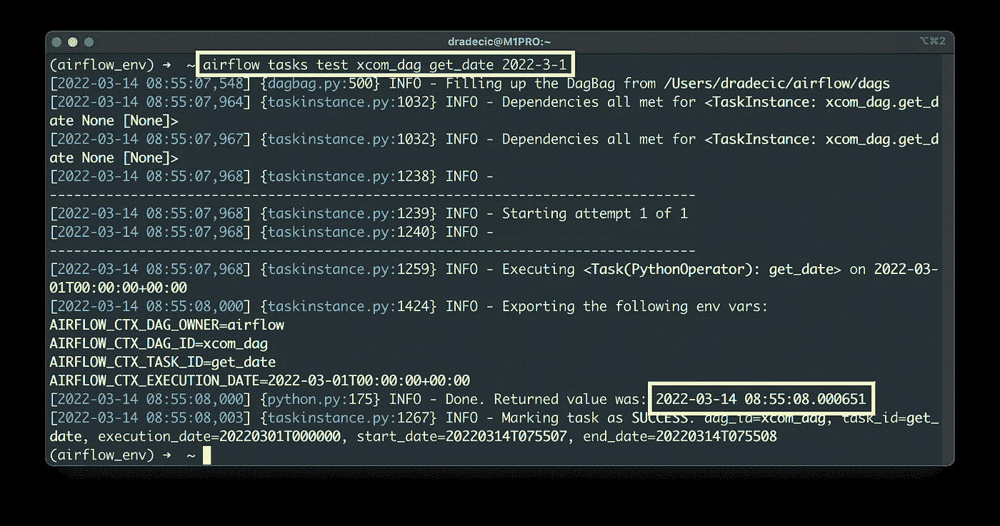
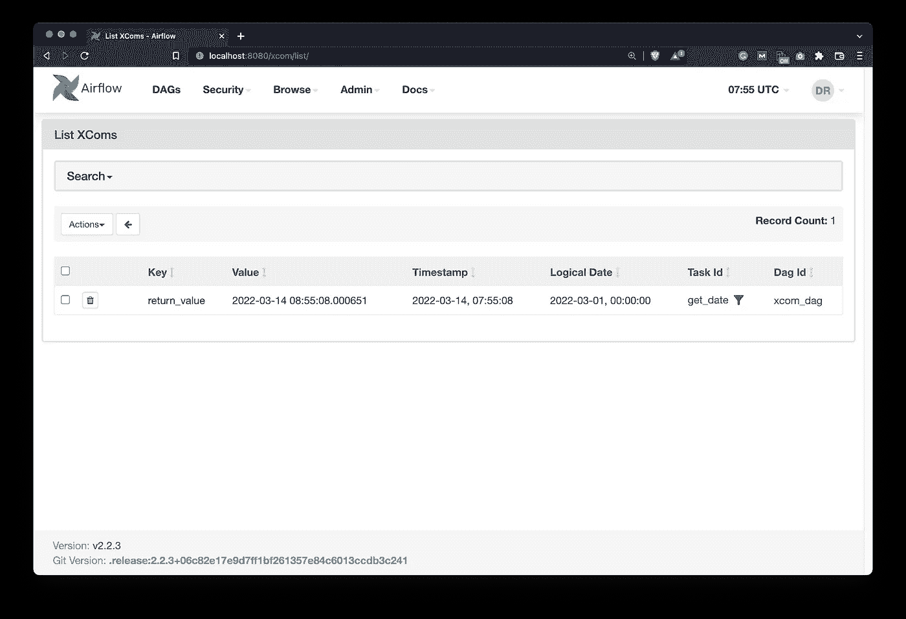
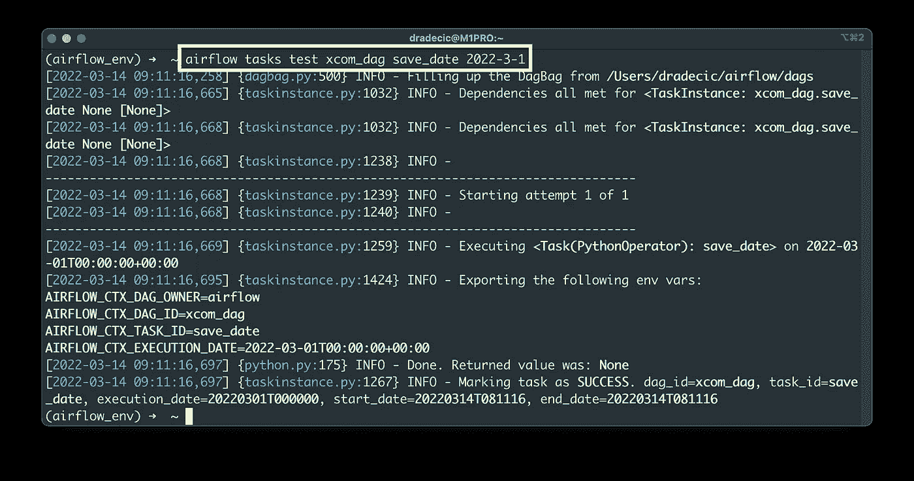

# Apache Airflow for Data Science —如何使用 Airflow XComs 在任务之间进行通信

> 原文：<https://towardsdatascience.com/apache-airflow-for-data-science-how-to-communicate-between-tasks-with-airflow-xcoms-22b4cd075562>

## 学习使用 XComs 在气流任务之间发送和接收数据


由 [Gustavo Quepón](https://unsplash.com/@unandalusgus?utm_source=medium&utm_medium=referral) 在 [Unsplash](https://unsplash.com?utm_source=medium&utm_medium=referral) 上拍摄的照片

编写气流 Dag 和任务非常有趣，但是如何在它们之间交换数据呢？这就是 XComs(“交叉通信”)的用武之地，它是一种允许任务相互“交谈”的机制。

今天，您将学习如何将数据推送到 Airflow XComs，以及如何通过编写由两个任务组成的 DAG 来提取数据。两者都将利用`PythonOperator`做一些非常基本的事情。您还将了解什么时候不应该使用 XComs，以及它的局限性。

不想看书？请观看我的视频:

# 如何将一个值推送到气流 XComs

让我们从给气流 XComs 推一个值开始。这可以通过多种方式来实现，但是到目前为止最明确的方式是将`do_xcom_push=True`指定为任务参数。

首先，我们将编写一个样板文件来处理库导入并声明 Airflow DAG:

```
from datetime import datetime
from airflow.models import DAG
from airflow.operators.python import PythonOperator with DAG(
    dag_id='xcom_dag',
    schedule_interval='@daily',
    start_date=datetime(2022, 3, 1),
    catchup=False
) as dag:
    pass
```

开始执行任务。`task_get_date`任务将调用一个 Python 函数`get_date()`，并将其返回值推送到 Airflow 的 XComs。该函数只返回字符串格式的日期:

```
from datetime import datetime
from airflow.models import DAG
from airflow.operators.python import PythonOperator def get_date() -> str:
    return str(datetime.now()) with DAG(
    dag_id='xcom_dag',
    schedule_interval='@daily',
    start_date=datetime(2022, 3, 1),
    catchup=False
) as dag: task_get_date = PythonOperator(
        task_id='get_date',
        python_callable=get_date,
        do_xcom_push=True
    )
```

我们可以通过终端测试任务来验证一切工作正常:

```
airflow tasks test xcom_dag get_date 2022-3-1
```

任务被标记为成功，日期返回:



图 1-通过终端测试气流任务(图片由作者提供)

有两种方法可以测试该值是否被推送到 Airflow 的 XComs。第一种方法是在 Airflow 的元数据数据库中发出一条 SQL 语句。第二种更简单的方法是打开 Airflow 的主页，进入*管理* — *XComs* :



图 2 —在 Airflow 后端推送的 XCom(图片由作者提供)

您可以看到存储在 XComs 中的返回值。问题仍然是——如何把它弄出来？

# 如何通过气流得到 XCom 值

我们现在将编写另一个任务——`task_save_date`——它调用`save_date()` Python 函数。这次情况有所不同，你应该记住以下几点:

*   **指定** `**ti**` **参数**——它代表*任务实例*，允许你拉取存储在气流 XComs 中的值。
*   **`**xcom_pull()**`**方法**——用于从一个或多个气流任务中提取返回值列表。注意第一个参数的复数形式。指定要从中提取存储在 XComs 中的值的任务 id 列表。**
*   ****这是一个列表** —用 Python 的列表索引符号访问被拉取值的成员。**

**以下是任务和函数的代码:**

```
from datetime import datetime
from airflow.models import DAG
from airflow.operators.python import PythonOperator def get_date() -> str:
    ... def save_date(ti) -> None:
    dt = ti.xcom_pull(task_ids=['get_date'])
    if not dt:
        raise ValueError('No value currently stored in XComs.') with open('/Users/dradecic/airflow/data/date.txt', 'w') as f:
        f.write(dt[0]) with DAG(
    ...
) as dag: task_get_date = PythonOperator(
        ...
    ) task_save_date = PythonOperator(
        task_id='save_date',
        python_callable=save_date
    )
```

**现在让我们来测试一下:**

```
airflow tasks test xcom_dag save_date 2022-3-1
```

**如您所见，没有出现异常:**

****

**图 3-通过终端(2)测试气流任务(图片由作者提供)**

**假设一切顺利，您将看到一个新的`date.txt`文件被创建。我这边看起来是这样的:**

****

**图 4 —保存的价值(作者图片)**

**这就是你如何使用 XComs 在气流任务之间进行通信。有什么你应该知道的限制吗？接下来让我们讨论这些。**

# **气流 XComs 限制**

**XComs 看起来像是在 Airflow 中任务间通信的万能解决方案，但是有一些限制您应该知道。Airflow 不是一个数据处理框架，所以避免在任务之间发送巨大的熊猫数据帧。**

**如果试图在任务之间交换大型数据集，很可能会遇到内存问题。在 Spark 中处理大数据集，并且仅使用气流来触发 Spark 作业。**

**在一天结束时，气流是一个管弦乐队，它应该只用于这一目的。**

# **结论**

**今天，您已经学习了气流 XComs 的基础知识。现在，您已经具备了在 Dag 中的任务之间进行有效通信所需的一切。请记住，Airflow 不是一个数据处理框架，而是一个数据编排器。不要使用 XComs 来交换庞大的数据集，这样就可以了。**

**在接下来的文章中，您将学习在 Airflow 中使用`HttpSensor`和`HttpOperator`与 REST APIs 通信的正确方式。敬请关注，我会确保在几天内发表这篇文章。**

## **推荐阅读**

*   **[学习数据科学先决条件(数学、统计和编程)的 5 本最佳书籍](https://betterdatascience.com/best-data-science-prerequisite-books/)**
*   **[2022 年学习数据科学的前 5 本书](https://betterdatascience.com/top-books-to-learn-data-science/)**
*   **[如何在本地安装 Apache air flow](https://betterdatascience.com/apache-airflow-install/)**

## **保持联系**

*   **雇用我作为一名技术作家**
*   **订阅 [YouTube](https://www.youtube.com/c/BetterDataScience)**
*   **在 [LinkedIn](https://www.linkedin.com/in/darioradecic/) 上连接**

***喜欢这篇文章吗？成为* [*中等会员*](https://medium.com/@radecicdario/membership) *继续无限制学习。如果你使用下面的链接，我会收到你的一部分会员费，不需要你额外付费。***

**<https://medium.com/@radecicdario/membership> ** 

***原载于 2022 年 3 月 14 日 https://betterdatascience.com*<https://betterdatascience.com/apache-airflow-xcoms/>**。****