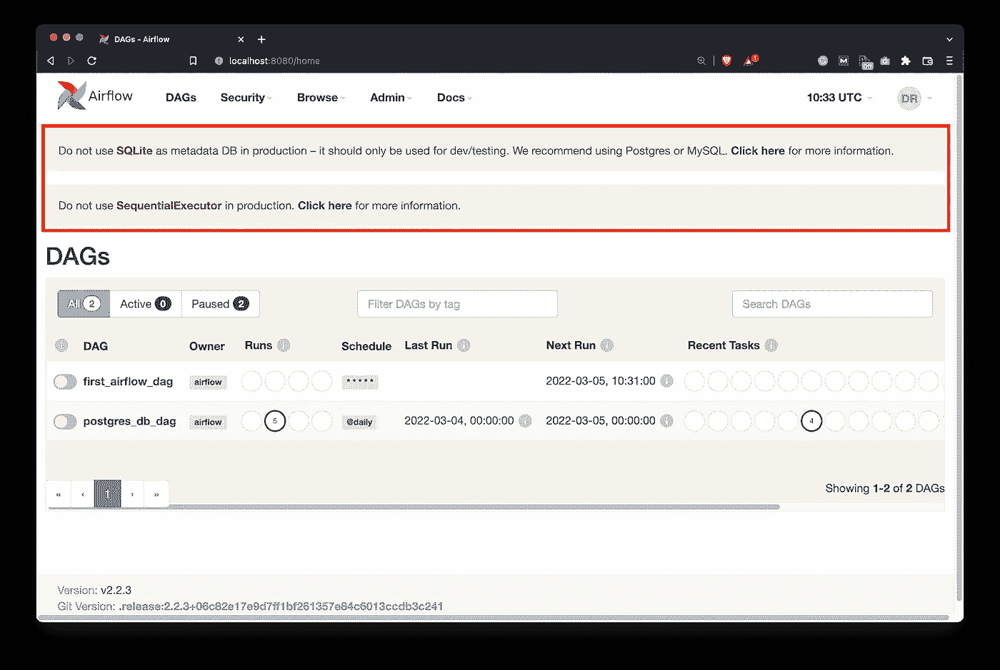
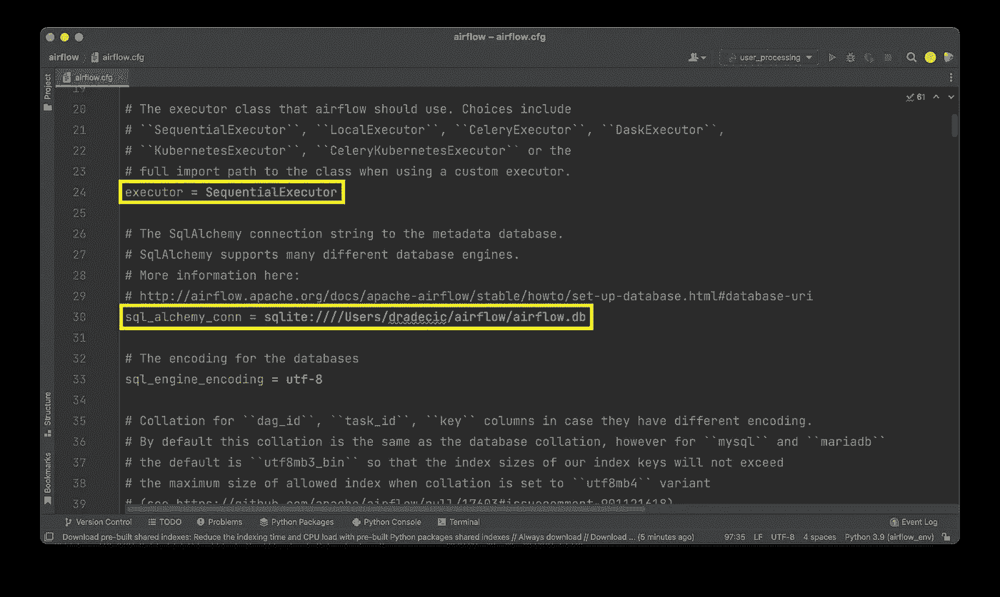
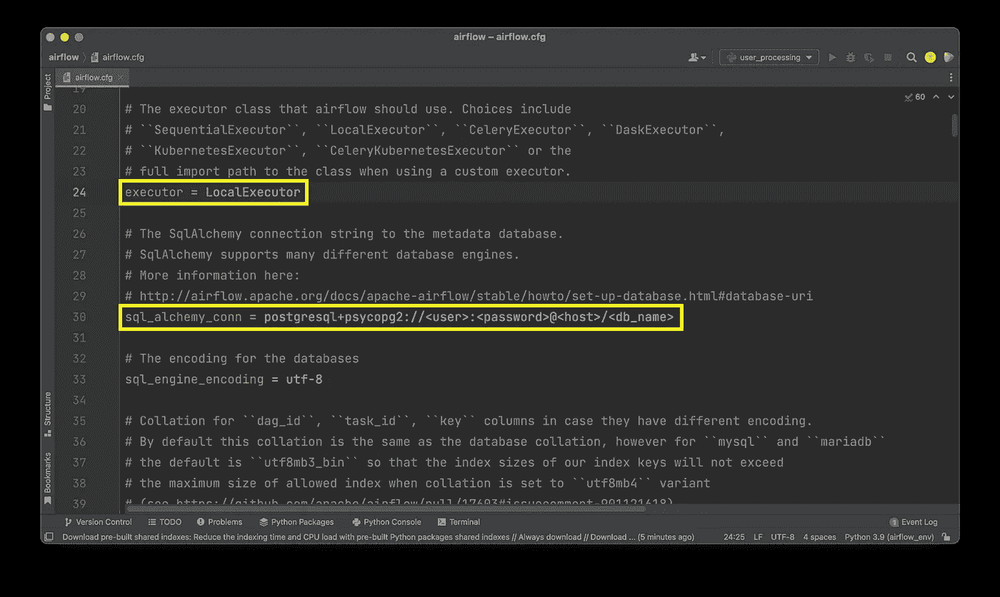
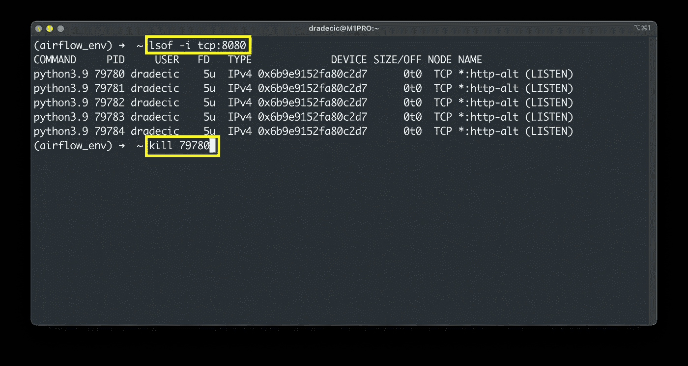
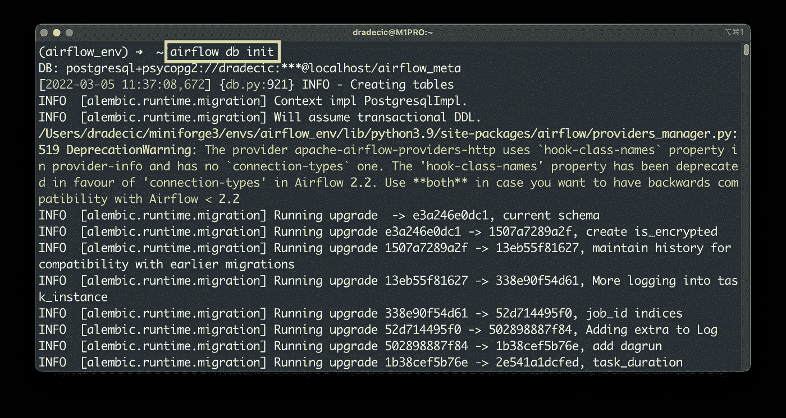
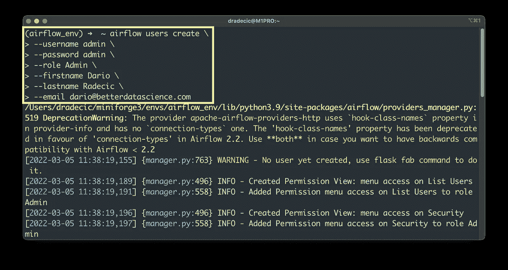
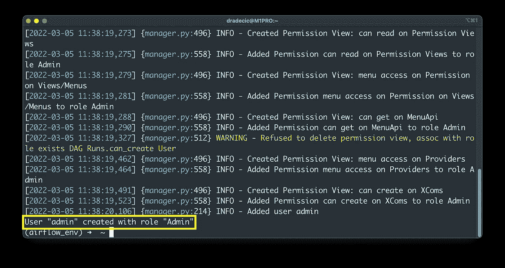
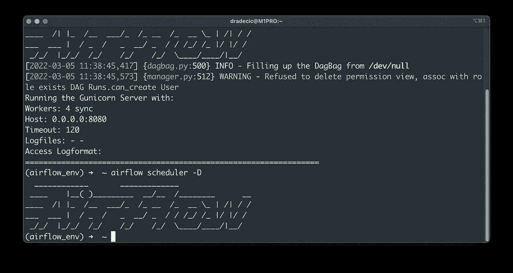
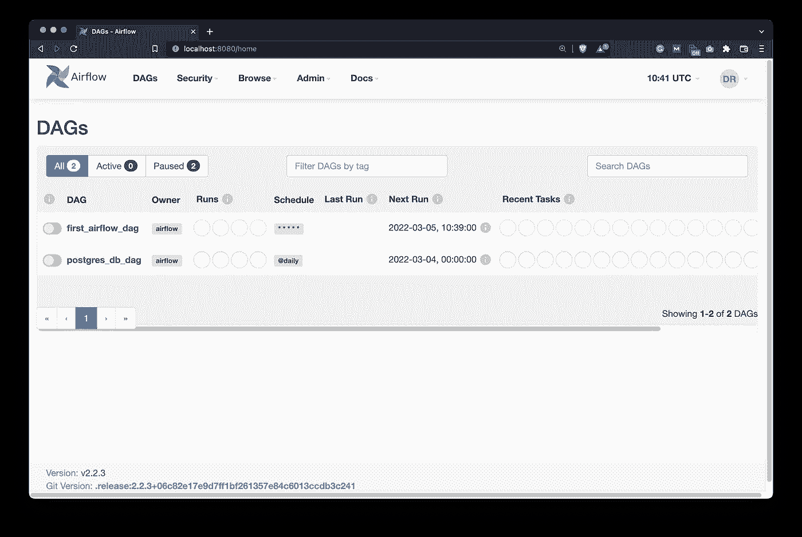
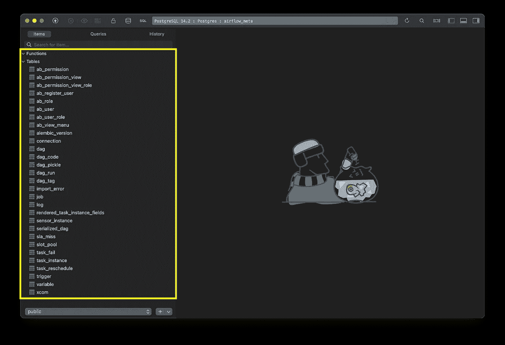

# Apache Airflow for Data Science —如何将 Airflow 元数据数据库迁移到 Postgres 并实现并行执行

> 原文：<https://towardsdatascience.com/apache-airflow-for-data-science-how-to-migrate-airflow-metadata-db-to-postgres-and-enable-e6658266c337>

## Apache Airflow 默认情况下不并行运行任务——但是有一个简单的修复方法


马丁·桑切斯在 [Unsplash](https://unsplash.com?utm_source=medium&utm_medium=referral) 上的照片

Apache Airflow 允许您管理复杂的数据管道并并行运行任务——甚至分布在许多节点上——但不是默认的。股票气流配置带有 SQLite 元数据数据库和`SeqentialExecutor`。顾名思义，它按顺序运行任务，一个接一个。

简单地说，这意味着默认情况下，您的 Airflow 安装不是生产就绪的。今天，我们将通过将 Airflow metastore 数据库迁移到 Postgres 并使用`LocalExecutor`在单台机器上实现并行执行来解决这个问题。如果您计划将您的工作负载分布在不同的节点上，请尝试`CeleryExecutor`，但这是另一个话题。

不想看书？请观看我的视频:

# 修改气流配置文件(airflow.cfg)

如果您要打开 Airflow webserver 主页，您会看到以下两条警告消息:



图 1-当前关于气流的警告信息(图片由作者提供)

它抱怨元数据数据库，因为 SQLite 不应该在生产中使用。它也不喜欢`SequentialExecutor`，原因很明显。我们必须在寻址执行器之前迁移元数据数据库，因为 SQLite 数据库不支持并行性。

打开位于你的根气流目录的`airflow.cfg`文件。在那里，从第 24 行开始，您会看到指定了以下两个值:



图 2 —执行器和数据库配置值(作者图片)

按如下方式更改这些值:

```
executor = LocalExecutor 
sql_alchemy_conn = <postgres_connection>
```



图 3 —更新的执行器和数据库配置值(图片由作者提供)

是的，你需要安装 Postgres，并且你需要为气流创建一个新的数据库。您在上面看到的只是一个模板，您可以用它来编写连接字符串。

完成后，您必须初始化数据库并创建管理员用户。让我们接下来做那件事。

# 初始化气流数据库并创建用户

没有最佳的方法来停止运行在守护模式下的进程。但是，我们知道它运行在端口 8080 上。使用`lsof`命令列出在特定端口上运行的进程，然后杀死它们:

```
lsof -i tcp:8080 
kill <pid>
```



图 4-切断通过终端的气流(图片由作者提供)

您应该只终止第一个进程，在同一端口上运行的其他进程将自动终止。

从这里，运行以下命令来初始化数据库:

```
airflow db init
```



图 5 —初始化气流数据库(图片由作者提供)

初始化过程将在几秒钟后完成，这意味着接下来我们可以创建管理员用户:

```
airflow users create --username admin --password admin --role Admin --firstname <fname> --lastname <lname> --email <email>
```



图 6 —创建一个数据库管理员用户(图片由作者提供)

几秒钟后，您应该会看到下面的*成功*消息:



图 7 —创建一个数据库管理员用户(2)(图片由作者提供)

太棒了—我们已经成功地迁移了数据库并创建了管理员用户。剩下唯一要做的就是重启 Airflow 服务器和调度程序，所以接下来让我们开始吧。

# 重启阿帕奇气流

运行以下两个命令，以守护模式运行 Airflow 服务器和调度程序:

```
airflow webserver -D
airflow scheduler -D
```



图 8 —启动气流和调度程序(图片由作者提供)

打开主页后，您不会看到任何警告消息:



图 9——air flow 主页——无警告信息(图片由作者提供)

元数据数据库迁移和气流执行器的更改是成功的，这意味着您已经准备好在一台机器上并行运行任务。

但是气流实际上在元数据数据库中存储了什么呢？事实证明有很多桌子。这些部件负责保持空气流通:



图 10 —在 Airflow metastore 中创建的表格(图片由作者提供)

这就是我今天想讲的全部内容，接下来让我们总结一下。

# 结论

是的，我知道，我们今天还没有写任何代码——但这就是重点。您已经知道如何用 Airflow 编写一个基本的数据管道，您面临的首要问题是速度。例如，一个接一个地抓取五个独立的页面是没有意义的。您可以并行处理这个过程，为自己节省一些时间。

好了，现在您可以并行化该过程，因为我们负责维护和配置任务。在下一篇文章中，您将编写第一个利用并行性的 DAG，敬请关注。

# 推荐阅读

*   [学习数据科学先决条件(数学、统计和编程)的 5 本最佳书籍](https://betterdatascience.com/best-data-science-prerequisite-books/)
*   [2022 年学习数据科学的前 5 本书](https://betterdatascience.com/top-books-to-learn-data-science/)
*   [如何在本地安装 Apache air flow](https://betterdatascience.com/apache-airflow-install/)

# 保持联系

*   雇用我作为一名技术作家
*   在 YouTube[上订阅](https://www.youtube.com/c/BetterDataScience)
*   在 [LinkedIn](https://www.linkedin.com/in/darioradecic/) 上连接

喜欢这篇文章吗？成为 [*中等会员*](https://medium.com/@radecicdario/membership) *继续无限制学习。如果你使用下面的链接，我会收到你的一部分会员费，不需要你额外付费。*

[](https://medium.com/@radecicdario/membership) [## 通过我的推荐链接加入 Medium-Dario rade ci

### 作为一个媒体会员，你的会员费的一部分会给你阅读的作家，你可以完全接触到每一个故事…

medium.com](https://medium.com/@radecicdario/membership) 

*原载于 2022 年 3 月 8 日 https://betterdatascience.com**的* [*。*](https://betterdatascience.com/apache-airflow-parallelism/)