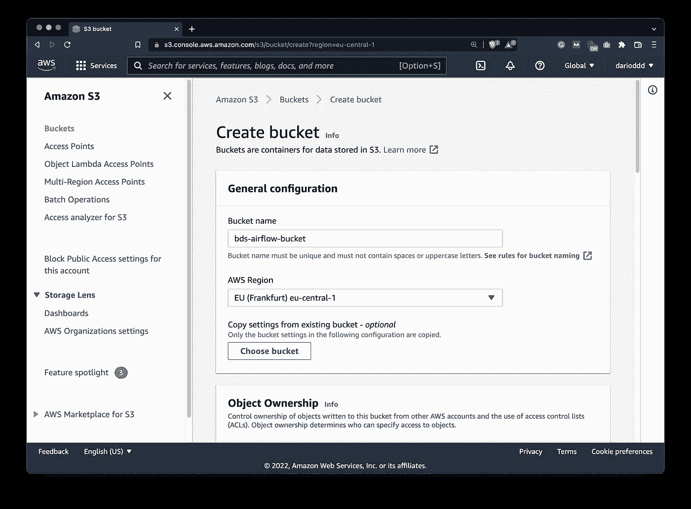
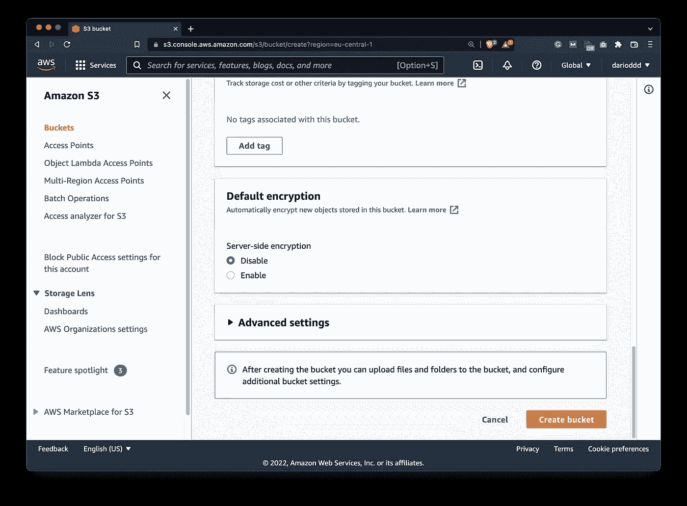
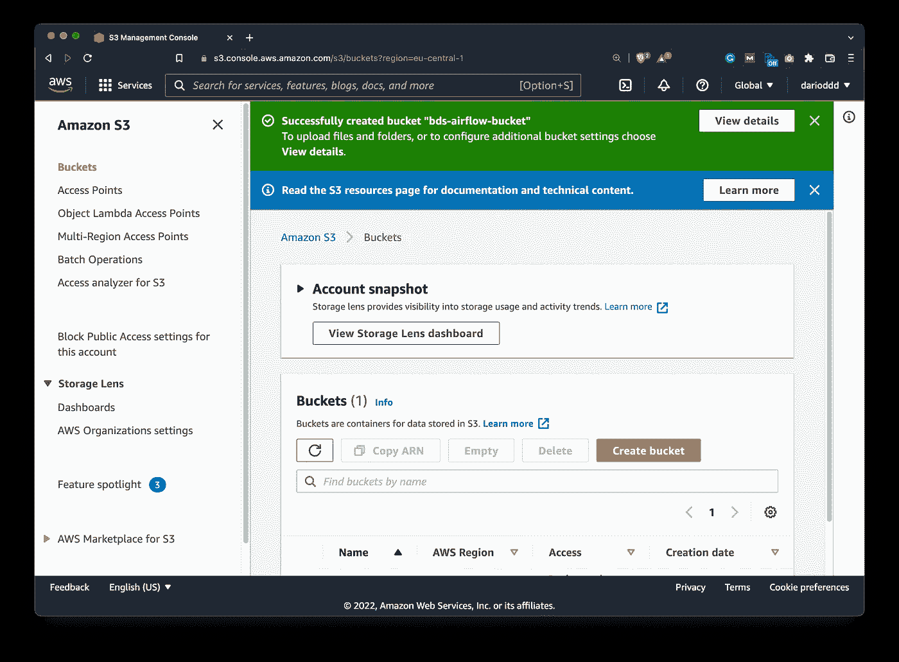
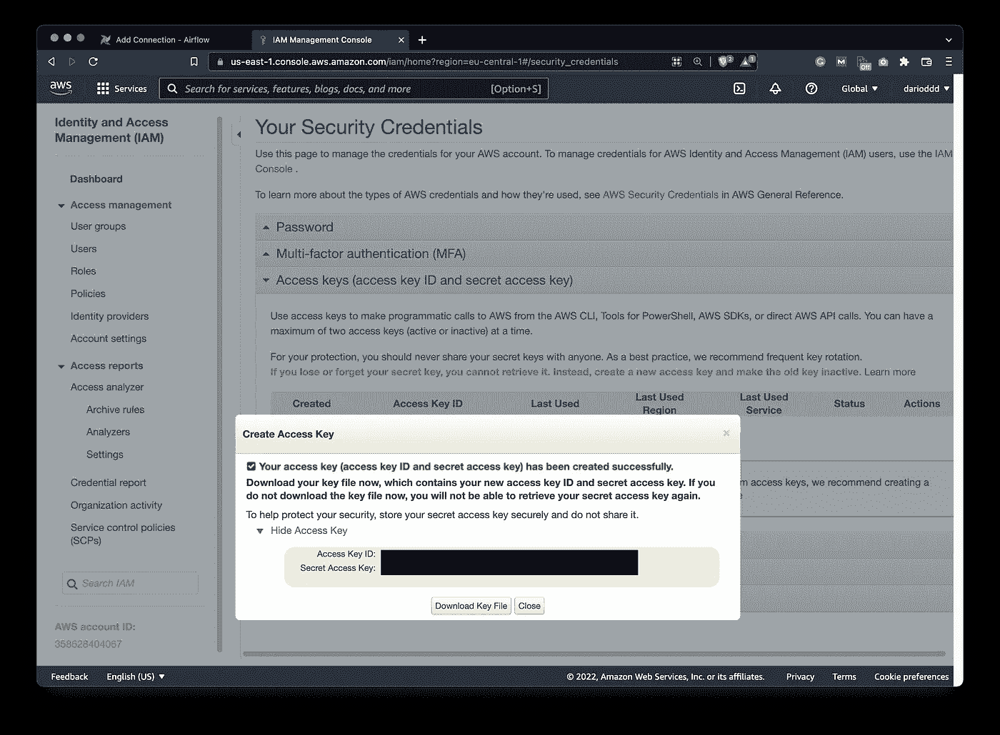
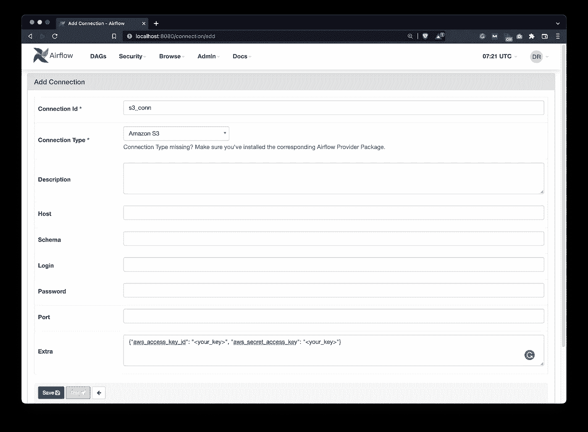
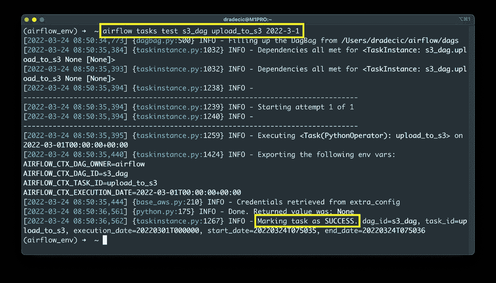
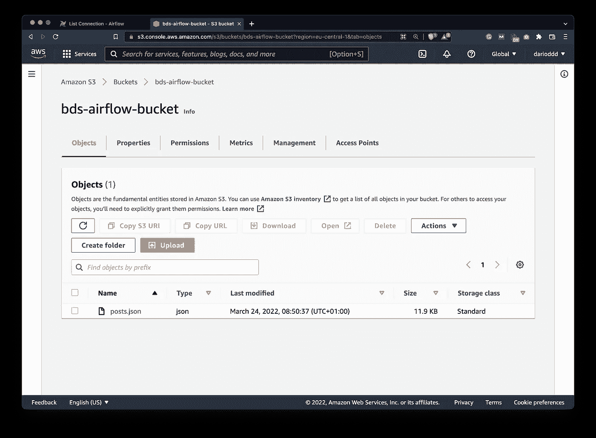

# Apache Airflow for Data Science —如何将文件上传到亚马逊 S3

> 原文：<https://towardsdatascience.com/apache-airflow-for-data-science-how-to-upload-files-to-amazon-s3-5bdf6fcb1cea>

## **设置一个 S3 桶并用 Apache Airflow 上传本地文件**


由[乔舒亚·科尔曼](https://unsplash.com/@joshstyle?utm_source=medium&utm_medium=referral)在 [Unsplash](https://unsplash.com?utm_source=medium&utm_medium=referral) 上拍摄的照片

到目前为止，我们已经编写了几个气流 Dag，但是它们都在本地存储数据，要么存储到文件，要么存储到数据库。如果你想把数据存储在云端呢？嗯，你很幸运——今天你将学习如何用几行代码使用亚马逊 S3。

Amazon*Simple Storage Service*(S3)是一个可扩展的对象存储解决方案，你可以开始免费使用，如果你需要，可以相对便宜地扩展。本文假设您已经建立了一个 AWS 帐户，因为我们不会经历这个过程。从设置存储桶到下载安全凭证的所有其他内容都将在下面介绍。

不想看书？请观看我的视频:

# 如何在亚马逊 S3 上创建一个桶

首先，打开你的 AWS 控制台，进入 *S3* — *桶* — *创建桶*。您将看到以下屏幕:



图 1 —在亚马逊 S3 上创建一个桶(图片由作者提供)

您可以随意命名您的存储桶。注意不能使用特殊字符和大写字母。保持其他选项不变(不建议生产使用),并滚动到屏幕底部。

一旦到达，点击大橙色*创建桶*按钮:



图 2——在亚马逊 S3 上创建一个桶(图片由作者提供)

如果您指定的名称符合条件且未被占用，将立即创建您的存储桶:



图 3——在亚马逊 S3 上创建一个桶(图片由作者提供)

看到这有多简单了吗？现在，让我们获取凭证并设置气流连接。

# 如何在气流中创建 S3 连接

在做任何事情之前，确保安装 Apache Airflow 的 Amazon provider 否则，您将无法创建 S3 连接:

```
pip install 'apache-airflow[amazon]'
```

安装完成后，重启 Airflow 服务器和调度程序，你就可以开始工作了。

再次打开 AWS 页面，点击右上角你的用户名(我的是 *darioddd* )，选择*安全凭证*。在*访问键*下，点击*创建新的访问键*。这将产生两件事:

*   访问密钥 ID
*   秘密访问密钥



图 4 —获取 S3 访问密钥 ID 和秘密访问密钥(图片由作者提供)

您可以随意下载 CSV 格式的密钥文件，但现在这不是强制性的。

前往 Airflow webserver，然后进入*管理* — *连接*。单击加号定义一个新的。以下是您应该指定的内容:

*   **连接 Id** —任意字符串，您可以随意命名。
*   **连接类型** —亚马逊 S3
*   **Extra** —类似 JSON 的对象，带`aws_access_key_id`和`aws_secret_access_key`键。你知道什么是关键值。



图 5-在气流中设置 S3 连接(图片由作者提供)

就配置而言，这就是您需要做的一切。接下来让我们写下实际的气流 DAG。

# 如何编写一个气流 DAG 上传文件到 S3

在`~/airflow/dags`文件夹中新建一个 Python 文件。我已经把我的命名为`s3_upload.py`。我们将从库导入和 DAG 样板代码开始。注意这里有一个新的导入- `S3Hook` -它将负责与 S3 桶通信:

```
from datetime import datetime
from airflow.models import DAG
from airflow.operators.python import PythonOperator
from airflow.hooks.S3_hook import S3Hook with DAG(
    dag_id='s3_dag',
    schedule_interval='@daily',
    start_date=datetime(2022, 3, 1),
    catchup=False
) as dag:
	pass
```

上传文件的任务可以归结为使用一个`PythonOperator`来调用一个函数。`upload_to_s3()`函数接受三个参数——确保它们是正确的:

*   `filename` - string，你要上传的文件的完整路径。任何文件都可以，但是我使用的是在 [Airflow REST API 文章](https://betterdatascience.com/apache-airflow-rest-api/)中下载的文件。
*   `key` - string，上传文件将获得的名称。例如，`posts.json`将文件上传到 S3 的斗根。你也可以指定路径，比如`/data/posts/posts.json`，S3 会自动为你创建文件夹结构。
*   `bucket_name` -字符串，您要将文件上传到的存储桶的名称。

同一个函数首先创建一个`S3Hook`类的实例，并使用之前建立的连接。然后，您可以调用`load_file()`方法将本地文件上传到 S3 存储桶:

```
from datetime import datetime
from airflow.models import DAG
from airflow.operators.python import PythonOperator
from airflow.hooks.S3_hook import S3Hook def upload_to_s3(filename: str, key: str, bucket_name: str) -> None:
    hook = S3Hook('s3_conn')
    hook.load_file(filename=filename, key=key, bucket_name=bucket_name) with DAG(
    dag_id='s3_dag',
    schedule_interval='@daily',
    start_date=datetime(2022, 3, 1),
    catchup=False
) as dag: # Upload the file
    task_upload_to_s3 = PythonOperator(
        task_id='upload_to_s3',
        python_callable=upload_to_s3,
        op_kwargs={
            'filename': '/Users/dradecic/airflow/data/posts.json',
            'key': 'posts.json',
            'bucket_name': 'bds-airflow-bucket'
        }
    )
```

一切看起来都很好，所以让我们测试这个任务:

```
airflow tasks test s3_dag upload_to_s3 2022-3-1
```



图 6 —测试 S3 上传任务(图片由作者提供)

任务成功完成，这意味着您应该在 S3 存储桶中看到上传的文件:



图 7 —验证文件是否上传到 S3(图片由作者提供)

任务完成。在结束之前，我们先做个总结。

# 结论

Apache Airflow 使云存储工作变得轻而易举。在短短几分钟内，您已经创建了一个新的 S3 桶，配置了一个气流连接，并编写了一个将本地文件上传到云的气流任务。这是一个巨大的里程碑，因为大多数企业都将 S3 用于这样或那样的事情。

请继续关注下面的文章，在这篇文章中，我们将从 S3 桶中下载一个文件。

## 推荐阅读

*   [学习数据科学先决条件(数学、统计和编程)的 5 本最佳书籍](https://betterdatascience.com/best-data-science-prerequisite-books/)
*   [2022 年学习数据科学的前 5 本书](https://betterdatascience.com/top-books-to-learn-data-science/)
*   [如何在本地安装阿帕奇气流](https://betterdatascience.com/apache-airflow-install/)

## 保持联系

*   雇用我作为一名技术作家
*   订阅 [YouTube](https://www.youtube.com/c/BetterDataScience)
*   在 [LinkedIn](https://www.linkedin.com/in/darioradecic/) 上连接

*喜欢这篇文章吗？成为* [*中等会员*](https://medium.com/@radecicdario/membership) *继续无限制学习。如果你使用下面的链接，我会收到你的一部分会员费，不需要你额外付费。*

<https://medium.com/@radecicdario/membership>  

*原载于 2022 年 3 月 24 日 https://betterdatascience.com**的* [*。*](https://betterdatascience.com/apache-airflow-amazon-s3/)