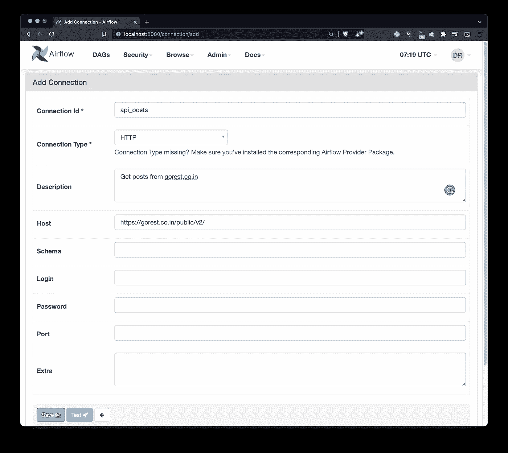
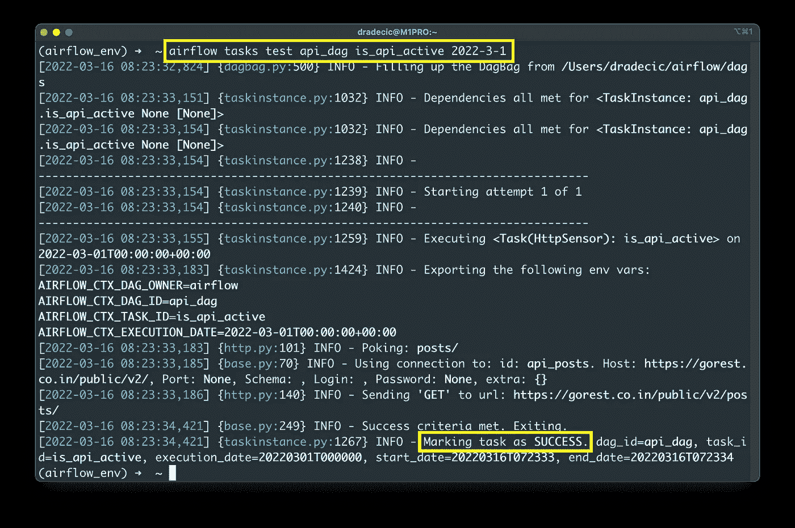
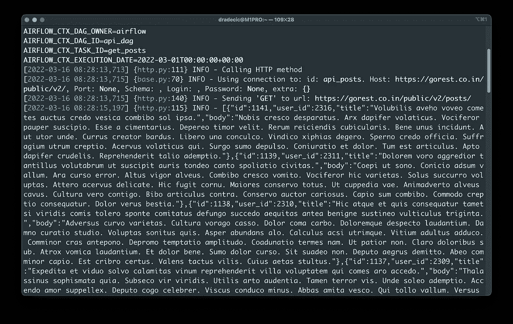
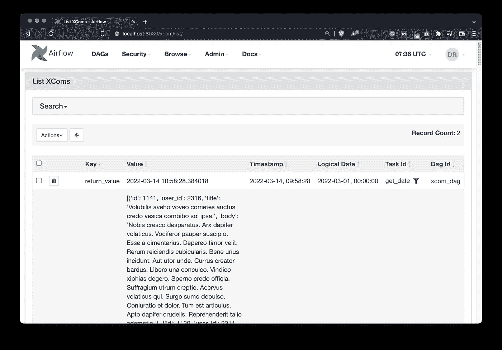
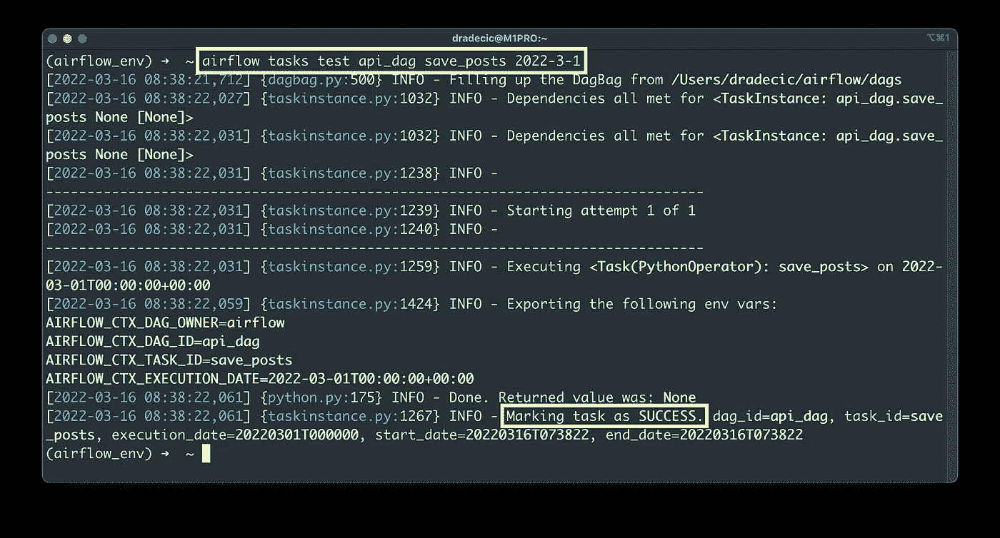
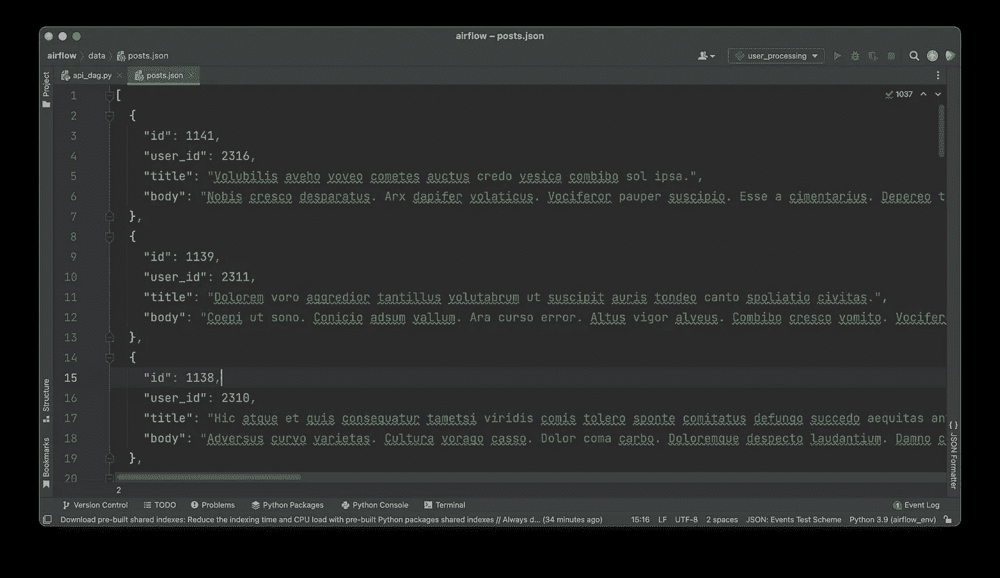

# Apache air flow for Data Science——如何使用 REST APIs

> 原文：<https://towardsdatascience.com/apache-airflow-for-data-science-how-to-work-with-rest-apis-8f4e20bee7d>

## **在 5 分钟内构建连接到远程 REST API 的数据管道**


照片由[砂光机 Weeteling](https://unsplash.com/@sanderweeteling?utm_source=medium&utm_medium=referral) 在 [Unsplash](https://unsplash.com?utm_source=medium&utm_medium=referral) 上拍摄

90%的数据管道有什么共同点？您已经猜到了——从 REST APIs 中提取和转换数据。如果您是 Apache Airflow 的狂热用户，有多种方法可以实现这一点。在[早期的文章](https://betterdatascience.com/apache-airflow-run-tasks-in-parallel/)中，您看到了如何用`PythonOperator`处理 API 调用，但是我提到这不是一个推荐的方法。

那么你应该如何完成这项任务呢？嗯，Airflow 有一个专用的`SimpleHttpOperator`内置，它允许你有效地与外部 API 进行通信。今天你会了解到一切。

不想看书？请观看我的视频:

# 如何配置与 REST APIs 通信的气流

首先，您必须使用以下命令安装 HTTP provider for Airflow:

```
pip install 'apache-airflow-providers-http'
```

你不会马上在 Airflow 主页上看到它，所以你必须重启 web 服务器和调度程序。这样做之后，在`dags`文件夹中创建一个新的 Python 文件——我将我的命名为`api_dag.py`。

它将包含我们今天要写的 DAG 的逻辑。现在，粘贴以下样板文件来设置 DAG:

```
import json
from datetime import datetime
from airflow.models import DAG
from airflow.providers.http.sensors.http import HttpSensor
from airflow.providers.http.operators.http import SimpleHttpOperator
from airflow.operators.python import PythonOperator with DAG(
    dag_id='api_dag',
    schedule_interval='@daily',
    start_date=datetime(2022, 3, 1),
    catchup=False
) as dag:
```

下一步是打开气流主页，进入*管理* — *连接*。单击加号添加新连接，并指定连接参数，如下图所示:



图 1-定义气流中的 HTTP 连接(图片由作者提供)

DAG 将从[gorest.co.in](https://gorest.co.in/)网站提取 posts JSON 数据，该网站用作测试目的的虚拟 REST API。您可以随意更改连接 ID 和描述，但请保留图像中显示的连接类型和主机。

现在您已经拥有了提取数据所需的一切，接下来让我们开始吧。

# 写气流 DAG

使用外部 API 时，一个好的做法是先检查它们是否可用。有时您正在连接的网站关闭了，您应该经常检查它。

*为什么？*原因很简单——通过将逻辑分成两个任务(一个检查 API 是否可用，另一个获取数据),您可以知道 DAG 失败是因为 API 没有启动还是因为代码中有错误。不检查 API 是否可用可能会导致您在错误的地方搜索 bug。

使用下面的代码声明一个`HttpSensor` -它检查在气流配置中声明的 API 是否为给定的端点运行- `posts/`:

```
with DAG(...) as dag: # 1\. Check if the API is up
    task_is_api_active = HttpSensor(
        task_id='is_api_active',
        http_conn_id='api_posts',
        endpoint='posts/'
    )
```

这将足以测试任务。使用以下命令:

```
airflow tasks test api_dag is_api_available 2022-3-1
```



图 2-测试 HttpSensor 气流任务(图片由作者提供)

API 已经启动并运行，这意味着接下来我们可以提取数据了。

这个`SimpleHttpOperator`会处理好的。它将向`posts/`端点发出 GET 请求，并将结果作为 JSON 返回:

```
with DAG(...) as dag: # 1\. Check if the API is up
    task_is_api_active = HttpSensor(...) # 2\. Get the posts
    task_get_posts = SimpleHttpOperator(
        task_id='get_posts',
        http_conn_id='api_posts',
        endpoint='posts/',
        method='GET',
        response_filter=lambda response: json.loads(response.text),
        log_response=True
    )
```

让我们也测试一下这个任务:

```
airflow tasks test api_dag get_posts 2022-3-1
```



图 3 —从 Airflow 中的 REST API 收集数据(图片由作者提供)

您可以看到一个包含多个 JSON 对象的 JSON 数组，这表明数据已被成功提取。

我们如何访问它？这是最棒的部分——air flow 在幕后将数据存储在 [XComs](https://betterdatascience.com/apache-airflow-xcoms/) 中( *Admin* — *XComs* ):



图 4 —推送到 XComs 的帖子(图片由作者提供)

这意味着我们现在可以编写另一个任务，使用`PythonOperator`以 JSON 格式在本地保存数据。任务和功能代码显示如下:

```
import json
...def save_posts(ti) -> None:
    posts = ti.xcom_pull(task_ids=['get_posts'])
    with open('/Users/dradecic/airflow/data/posts.json', 'w') as f:
        json.dump(posts[0], f)

with DAG(...) as dag: # 1\. Check if the API is up
    task_is_api_active = HttpSensor(...) # 2\. Get the posts
    task_get_posts = SimpleHttpOperator(...) # 3\. Save the posts
    task_save = PythonOperator(
        task_id='save_posts',
        python_callable=save_posts
    )
```

使用以下 shell 命令测试任务:

```
airflow tasks test api_dag save_posts 2022-3-1
```



图 5 —测试保存帖子的任务(图片由作者提供)

看起来一切顺利，这意味着您应该在`data`文件夹中看到一个`posts.json`文件。以下是它包含的内容:



图 6 —以 JSON 格式保存的帖子(图片由作者提供)

所有获取的帖子都保存在 JSON 文件中，这意味着我们所有的任务都像广告中说的那样工作。在结束之前，我们先做一个简单的总结。

# 结论

今天，您已经学习了如何在 Apache Airflow 中与 REST APIs 进行通信。最佳实践是首先检查 API 是否可用，如果不可用，您就不会认为解析逻辑有问题。我将把任务依赖性和通过 Airflow 服务器运行任务的任务留给您。现在你知道如何去做了，它会成为一个很好的练习。

请继续关注下面的文章，我们将在其中讨论气流和亚马逊 S3 连接。

## 推荐阅读

*   [学习数据科学先决条件(数学、统计和编程)的 5 本最佳书籍](https://betterdatascience.com/best-data-science-prerequisite-books/)
*   [2022 年学习数据科学的前 5 本书](https://betterdatascience.com/top-books-to-learn-data-science/)
*   [如何在本地安装阿帕奇气流](https://betterdatascience.com/apache-airflow-install/)

## 保持联系

*   雇用我作为一名[技术作家](https://betterdatascience.com/contact/)
*   在 YouTube[上订阅](https://www.youtube.com/c/BetterDataScience)
*   在 [LinkedIn](https://www.linkedin.com/in/darioradecic/) 上连接

*喜欢这篇文章吗？成为* [*中等会员*](https://medium.com/@radecicdario/membership) *继续无限制学习。如果你使用下面的链接，我会收到你的一部分会员费，不需要你额外付费。*

[](https://medium.com/@radecicdario/membership) [## 通过我的推荐链接加入 Medium-Dario rade ci

### 作为一个媒体会员，你的会员费的一部分会给你阅读的作家，你可以完全接触到每一个故事…

medium.com](https://medium.com/@radecicdario/membership) 

*原载于 2022 年 3 月 17 日 https://betterdatascience.com**T21*[。](https://betterdatascience.com/apache-airflow-rest-api/)