# Apache Airflow for Data Science —如何在 10 分钟内编写您的第一篇 DAG

> 原文：<https://towardsdatascience.com/apache-airflow-for-data-science-how-to-write-your-first-dag-in-10-minutes-9d6e884def72>

## 通过编写完整的 DAG，学习如何在 Apache Airflow 中使用 Bash 和 Python 操作符


照片由 [Rabih Shasha](https://unsplash.com/@rabihshasha?utm_source=medium&utm_medium=referral) 在 [Unsplash](https://unsplash.com?utm_source=medium&utm_medium=referral) 上拍摄

在[上一篇文章](https://betterdatascience.com/apache-airflow-write-your-first-dag/)中，您已经看到了如何在新的 Python 虚拟环境中本地安装 Apache Airflow，以及如何进行初始设置。今天，您将在 Airflow 中编写您的第一个数据管道(DAG ),这不会花费您超过 10 分钟的时间。

数据管道将从终端获取当前日期时间，对其进行处理，并将其保存到 CSV 文件中。非常简单，但是您将了解 Airflow 的 Bash 和 Python 操作符是如何工作的，以及如何使用 Xcoms 在任务之间进行通信，以及如何调度您的数据管道。让我们直入主题吧！

不想看书？请观看我的视频:

# 你今天要做什么

如标题所示，您将编写实现以下数据管道的第一个 DAG:

1.  从终端获取当前日期时间信息
2.  处理返回的日期时间字符串
3.  将日期时间信息保存到 CSV 文件中

您可以通过终端运行以下命令来获取当前的日期时间信息:

```
date
```

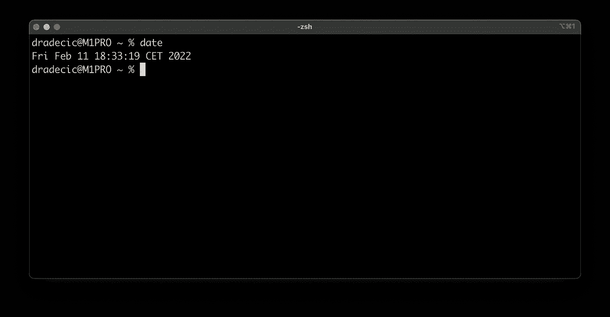

图 1 —如何通过终端获取当前日期时间信息(图片由作者提供)

我们将从在`~/airflow/dags`中创建一个新文件开始。在启动之前创建`dags`文件夹，并在任何代码编辑器中打开它。我用的是 PyCharm，但是你可以随意用别的。在`dags`文件夹中创建一个名为`first_dag.py`的新 Python 文件。

你已经准备好开始了——让我们从样板文件开始。

# 写下你的第一个气流 DAG——样板文件

将下面的代码复制到`first_dag.py`:

```
import os
import pandas as pd
from datetime import datetime
from airflow.models import DAG
from airflow.operators.bash import BashOperator
from airflow.operators.python import PythonOperator
from airflow.models import Variable

with DAG(
    dag_id='first_airflow_dag',
    schedule_interval='* * * * *',
    start_date=datetime(year=2022, month=2, day=1),
    catchup=False
) as dag:
    pass
```

我们做了很多导入，这些是我们将在整个文件中使用的模块和操作符。

每个气流 DAG 都是用 Python 的上下文管理器语法(`with`)定义的。以下是每个参数的描述:

*   `dag_id` -代表 Airflow web 应用程序中 DAG 的唯一 ID。
*   `schedule_interval` -指定 DAG 运行的时间间隔。可以通过字符串`@once`、`@hourly`、`@daily`、`@weekly`、`@monthly`、`@yearly`，或者类似 cron 的表情。例如，`* * * * *`表示 DAG 将每分钟运行一次。[了解更多](https://airflow.apache.org/docs/apache-airflow/1.10.1/scheduler.html)。
*   `start_date` -你的 DAG 第一次运行的日期，我已经在过去设置过了。
*   `catchup` -布尔，气流是否应该在从`start_date`到现在的每个预定间隔内*赶上*。

这样一来，我们就可以开始编写我们的第一个任务了。

# 气流任务#1 —获取当前日期时间

我们将使用 Airflow 的`BashOperator`来执行一个 shell 命令。Airflow 中的每个任务都需要一个 ID，该 ID 在 DAG 级别上必须是唯一的。`bash_command`参数允许您指定将要执行的 shell 命令:

```
import os
import pandas as pd
from datetime import datetime
from airflow.models import DAG
from airflow.operators.bash import BashOperator
from airflow.operators.python import PythonOperator
from airflow.models import Variable

with DAG(
    dag_id='first_airflow_dag',
    schedule_interval='* * * * *',
    start_date=datetime(year=2022, month=2, day=1),
    catchup=False
) as dag:

    # 1\. Get current datetime
    task_get_datetime = BashOperator(
        task_id='get_datetime',
        bash_command='date'
    )
```

返回值保存在内部，您可以通过 Airflow 的 xcoms 检索它，但这是我们稍后将探讨的内容。现在，我们可以测试我们的第一个任务是否通过终端工作。这是您可以使用的命令模板:

```
airflow tasks test <dag_name> <task_name> <date_in_the_past>
```

我们的 DAG 被命名为`first_airflow_dag`，我们正在运行一个 ID 为`get_datetime`的任务，因此该命令可以归结为:

```
airflow tasks test first_airflow_dag get_datetime 2022-2-1
```

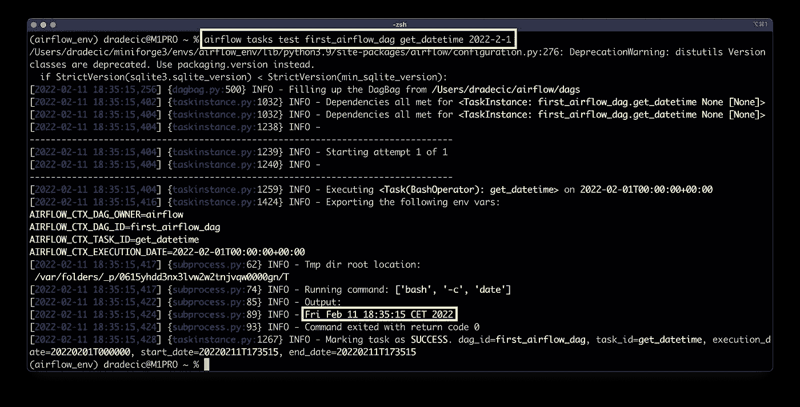

图 2-测试第一个气流任务(图片由作者提供)

可以看到`Fri Feb 11 18:35:15 CET 2022`返回，任务已经成功完成。这就是我们开始处理 datetime 所需的全部内容，所以接下来让我们开始吧。

# 气流任务#2 —处理当前日期时间

对于我们的第二个任务，我们将使用一个调用`process_datetime()`函数的`PythonOperator`。`ti`参数允许我们访问`xcom_pull()`方法，该方法从前面的任务中检索返回值，由`task_ids`参数指定。

不要太担心`xcoms`，因为我们将在接下来的文章中详细介绍它们。

我们将把日期时间转换成一个字符串，然后在空白处把它分成一个列表。目标是从中提取年、月、日、时间和星期几信息。参考*图 2* 查看单个日期时间字符串的样子:

```
import os
import pandas as pd
from datetime import datetime
from airflow.models import DAG
from airflow.operators.bash import BashOperator
from airflow.operators.python import PythonOperator
from airflow.models import Variable

def process_datetime(ti):
    dt = ti.xcom_pull(task_ids=['get_datetime'])
    if not dt:
        raise Exception('No datetime value.')

    dt = str(dt[0]).split()
    return {
        'year': int(dt[-1]),
        'month': dt[1],
        'day': int(dt[2]),
        'time': dt[3],
        'day_of_week': dt[0]
    }

with DAG(
    dag_id='first_airflow_dag',
    schedule_interval='* * * * *',
    start_date=datetime(year=2022, month=2, day=1),
    catchup=False
) as dag:

    # 1\. Get current datetime
    task_get_datetime = BashOperator(
        task_id='get_datetime',
        bash_command='date'
    )

    # 2\. Process current datetime
    task_process_datetime = PythonOperator(
        task_id='process_datetime',
        python_callable=process_datetime
    )
```

让我们来测试一下:

```
airflow tasks test first_airflow_dag process_datetime 2022-2-1
```

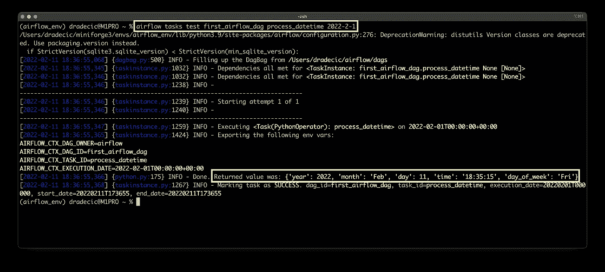

图 3-测试第二个气流任务(图片由作者提供)

我们将暂时离开代码。打开 Airflow 主页—`http://localhost:8080/home`—查看您的 DAG 是否出现在列表中:

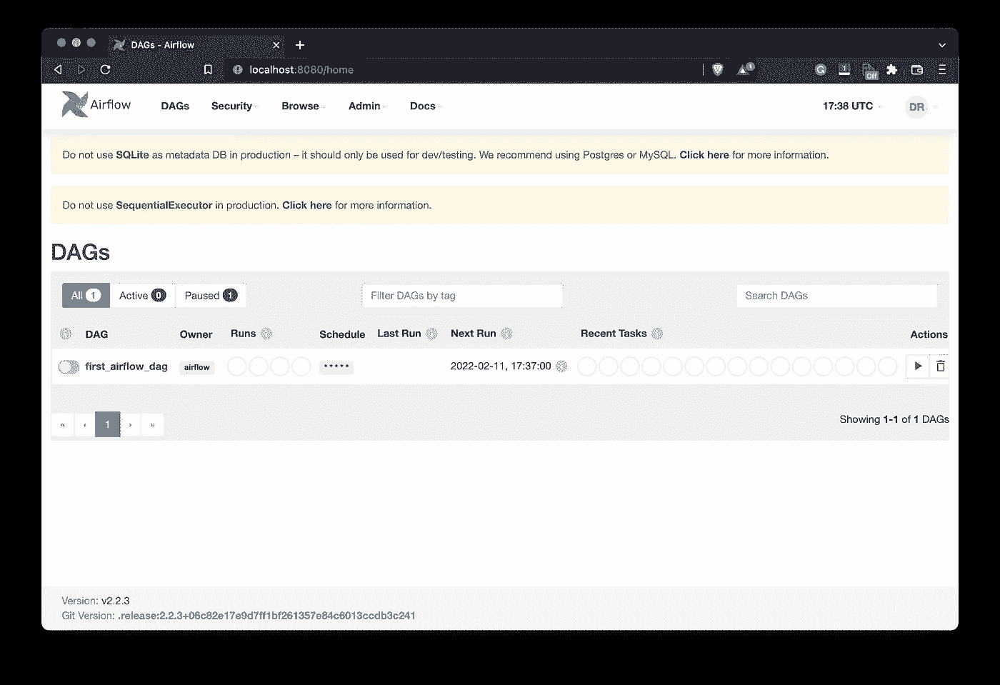

图 4——Airflow web 应用程序主页(图片由作者提供)

点击它并转到*图表视图* —您将看到我们的两个任务列表:

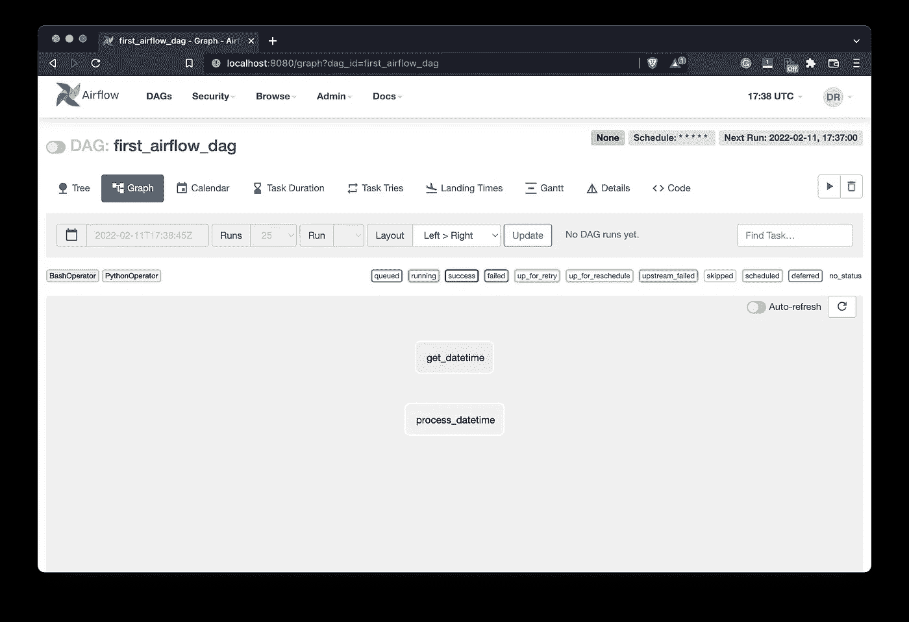

图 5-气流 DAG 图视图(图片由作者提供)

这些任务列在这里，但没有任何联系。稍后您将看到连接和依赖是如何工作的，但是首先，让我们为第三个任务编写代码。

# 气流任务#3 —保存已处理的日期时间

在气流主页上，进入*管理* — *变量*。您应该会看到如下所示的空白列表:

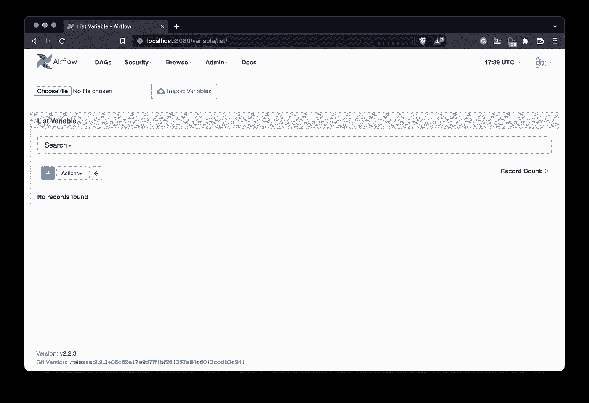

图 6 —气流变量列表(图片由作者提供)

单击加号添加一个新变量。我们将其声明为保存一个路径，该路径指向保存 CSV 文件的位置。我将我的名字命名为`first_dag_csv_path`，并输入`/Users/dradecic/Desktop/datetimes.csv`作为值:

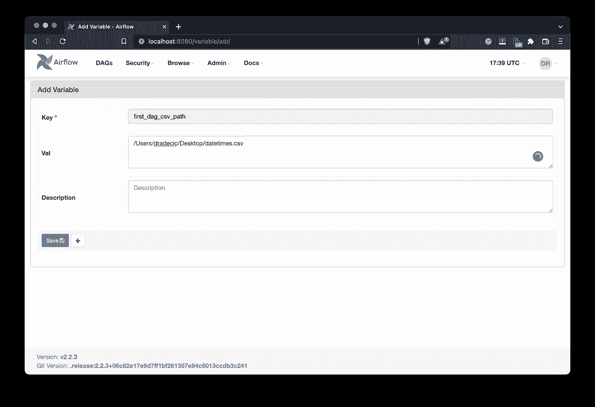

图 7-创建新的气流变量(图片由作者提供)

当然，您应该在您的机器上指定路径，但这是不言而喻的。完成后点击*保存*按钮。您将看到我们的变量被添加到列表中:

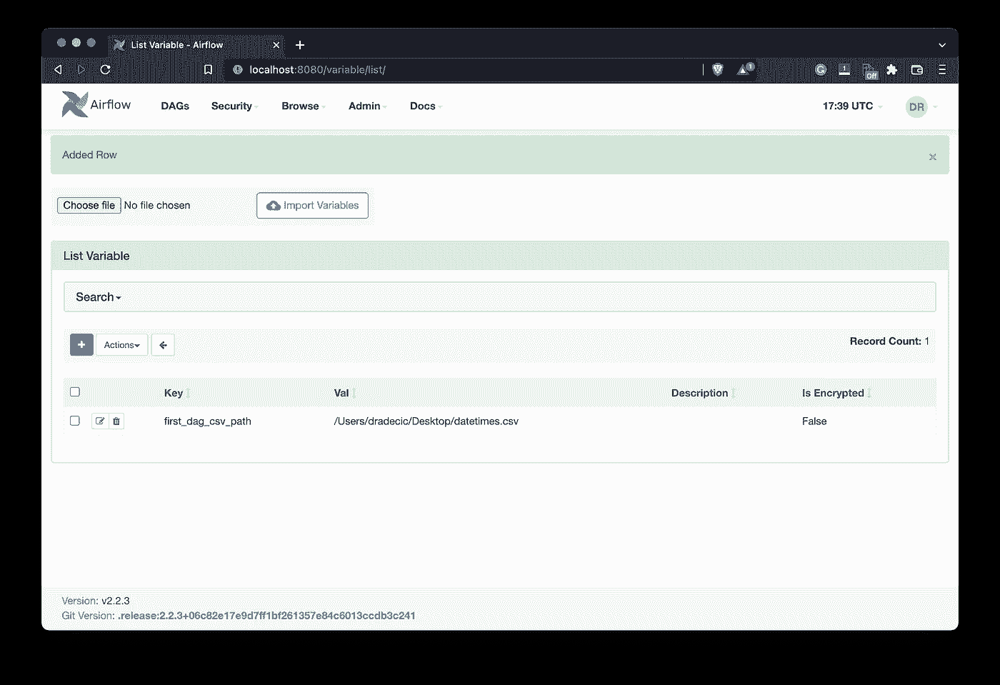

图 8-创建新的气流变量(2)(图片由作者提供)

开始编码。第三个任务将运行一个名为`save_datetime()`的 Python 函数。它使用 xcoms 从前面的任务中提取已处理的 datetime，然后基于它创建一个 Pandas 数据帧。

然后我们可以使用来自 Airflow 的`Variable`类来获取 CSV 文件的路径。如果该文件存在，我们将把参数`df_header`和`df_mode`分别设置为`False`和`'a'`。简单地说，该文件已经存在，所以我们想在其中添加新行，而不是每次都添加标题行。

如果该文件不存在，我们将使用写模式创建它，并且我们还将包括文件头:

```
import os
import pandas as pd
from datetime import datetime
from airflow.models import DAG
from airflow.operators.bash import BashOperator
from airflow.operators.python import PythonOperator
from airflow.models import Variable

def process_datetime(ti):
    dt = ti.xcom_pull(task_ids=['get_datetime'])
    if not dt:
        raise Exception('No datetime value.')

    dt = str(dt[0]).split()
    return {
        'year': int(dt[-1]),
        'month': dt[1],
        'day': int(dt[2]),
        'time': dt[3],
        'day_of_week': dt[0]
    }

def save_datetime(ti):
    dt_processed = ti.xcom_pull(task_ids=['process_datetime'])
    if not dt_processed:
        raise Exception('No processed datetime value.')

    df = pd.DataFrame(dt_processed)

    csv_path = Variable.get('first_dag_csv_path')
    if os.path.exists(csv_path):
        df_header = False
        df_mode = 'a'
    else:
        df_header = True
        df_mode = 'w'

    df.to_csv(csv_path, index=False, mode=df_mode, header=df_header)

with DAG(
    dag_id='first_airflow_dag',
    schedule_interval='* * * * *',
    start_date=datetime(year=2022, month=2, day=1),
    catchup=False
) as dag:

    # 1\. Get current datetime
    task_get_datetime = BashOperator(
        task_id='get_datetime',
        bash_command='date'
    )

    # 2\. Process current datetime
    task_process_datetime = PythonOperator(
        task_id='process_datetime',
        python_callable=process_datetime
    )

    # 3\. Save processed datetime
    task_save_datetime = PythonOperator(
        task_id='save_datetime',
        python_callable=save_datetime
    )
```

让我们来测试一下:

```
airflow tasks test first_airflow_dag save_datetime 2022-2-1
```

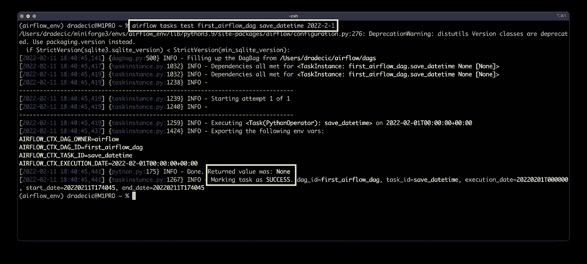

图 9-测试第三气流任务(图片由作者提供)

任务运行成功，并且根据变量值在桌面上创建了 CSV 文件:

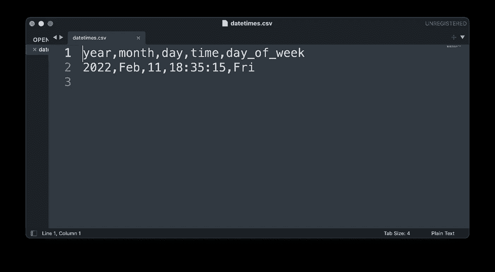

图 10 —以 CSV 格式保存的日期时间信息(图片由作者提供)

我们已经单独实现了所有的小部分，现在是时候连接它们并运行 DAG 了。

# 如何连接气流 DAG

现在，DAG 的*图形视图*如下所示:

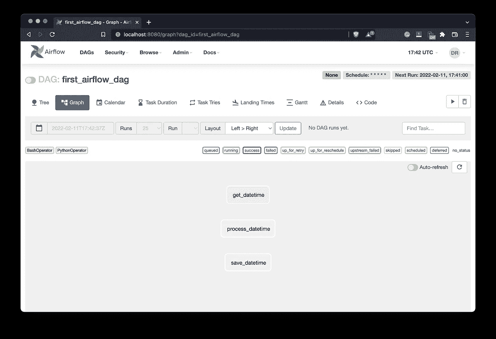

图 11-图表视图中的气流 DAG 任务列表(作者提供的图片)

我们有所有的任务，但是它们没有联系。气流不知道应该先跑哪一个。比如说。在当前状态下运行 DAG 可能会在`get_datetime`之前调用`process_datetime`任务，这没有意义。

您可以使用`set_downstream()`方法或使用位移运算符(`>>`)来连接任务。我们今天将使用后者:

```
 ...
    # 3\. Save processed datetime
    task_save_datetime = PythonOperator(
        task_id='save_datetime',
        python_callable=save_datetime
    )

    task_get_datetime >> task_process_datetime >> task_save_datetime
```

刷新 Airflow 主页，您应该会看到您的任务已连接:

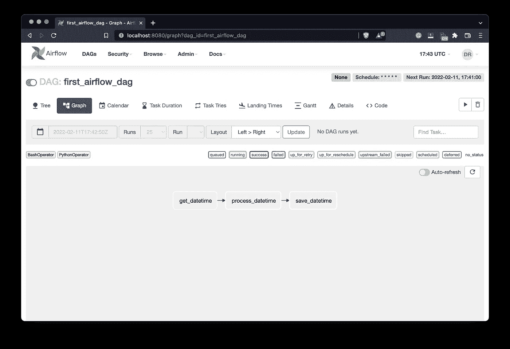

图 12-气流 DAG 中的连接任务(图片由作者提供)

现在，Airflow 知道任务应该以什么顺序运行。我还通过点击 DAG 名称前面的*暂停/取消暂停*开关打开了 DAG。我们现在拥有运行 DAG 所需的一切。

# 如何运行气流 DAG

您的 DAG 将按计划每分钟自动运行。您也可以通过点击*开始*按钮(在*下一次运行*文本下方的按钮)手动触发:

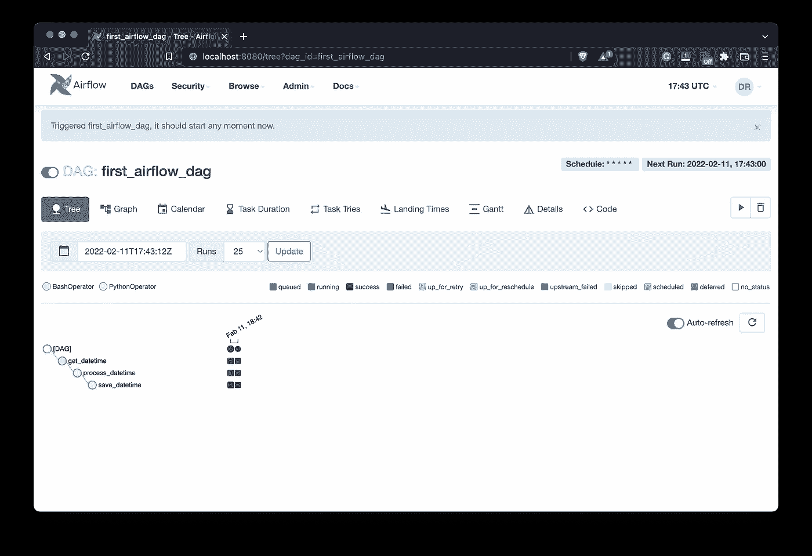

图 13 —气流 DAG 执行(图片由作者提供)

如果一切都是绿色的，那么每个任务已经完成，没有错误。通过检查树视图上方的图例，您可以看到颜色编码是如何工作的。一段时间后，我们将看到越来越多的运行成功完成，因为它每分钟运行一次:

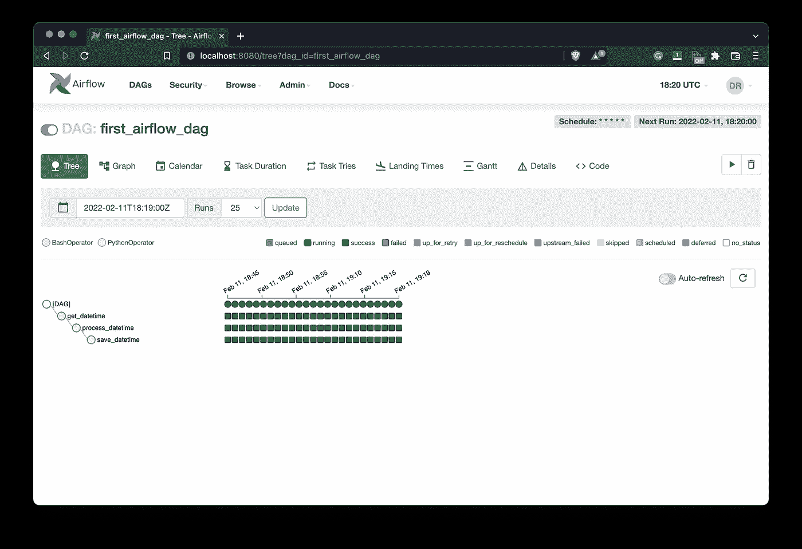

图 14 —气流 DAG 执行(2)(图片由作者提供)

在我这边，生成的 CSV 文件如下所示:

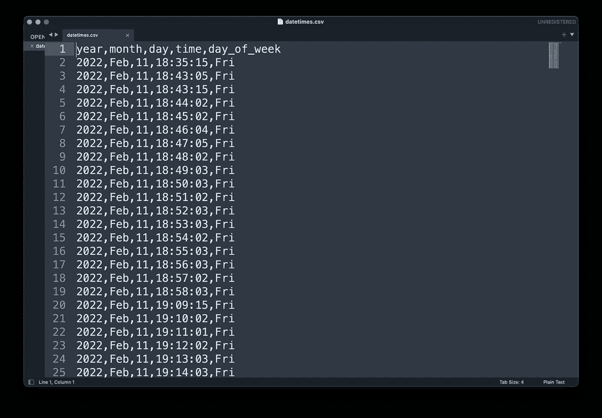

图片 15—datetime . CSV 文件(图片由作者提供)

日期之间有一些差距，但只是因为我不得不离开家不久，所以我的笔记本电脑被关闭。只要气流在运行，您应该每分钟都会看到一个新条目。

# 总结和后续步骤

这是你的第一个带有气流的数据管道——非常基本，但是要记住这些概念。您已经学习了如何运行 shell 命令和 Python 函数，以及如何单独测试每个任务。我知道一下子要处理的事情很多。我建议浏览几次这个管道，然后从头开始实现类似的东西。

例如，您可以编写一个数据管道来读取 CSV 文件，以任何方式对其进行处理，并将结果存储在另一个文件中。尝试不同的时间间隔来保持事情的趣味性。

下次再见，届时您将学习如何在 Airflow 中使用数据库。敬请期待！

## 推荐阅读

*   [学习数据科学先决条件(数学、统计和编程)的 5 本最佳书籍](https://betterdatascience.com/best-data-science-prerequisite-books/)
*   [2022 年学习数据科学的前 5 本书](https://betterdatascience.com/top-books-to-learn-data-science/)
*   [Python 3.10 中的结构模式匹配(Switch 语句)](https://betterdatascience.com/python-structural-pattern-matching/)

## 保持联系

*   雇用我作为一名[技术作家](https://betterdatascience.com/contact/)
*   订阅 [YouTube](https://www.youtube.com/c/BetterDataScience)
*   在 [LinkedIn](https://www.linkedin.com/in/darioradecic/) 上连接

*喜欢这篇文章吗？成为* [*中等会员*](https://medium.com/@radecicdario/membership) *继续无限制学习。如果你使用下面的链接，我会收到你的一部分会员费，不需要你额外付费。*

<https://medium.com/@radecicdario/membership>  

*原载于 2022 年 2 月 23 日*[*https://betterdatascience.com*](https://betterdatascience.com/apache-airflow-write-your-first-dag/)T22。