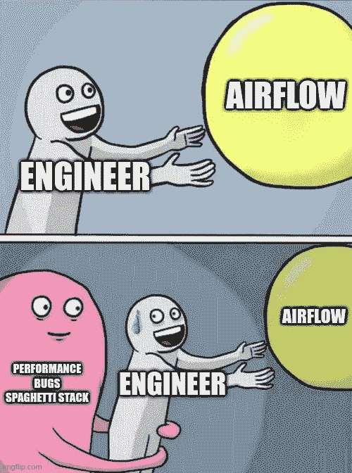
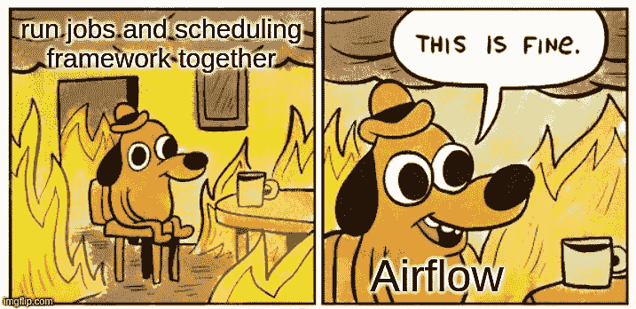
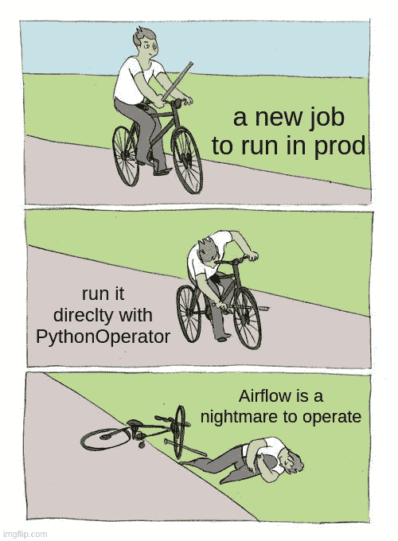

# 阿帕奇气流:使其工作的 10 条规则

> 原文：<https://towardsdatascience.com/apache-airflow-in-2022-10-rules-to-make-it-work-b5ed130a51ad>

## 默认情况下，气流非常宽松，如果没有严格的规则，您很可能会在管道堆栈实现中失败。

如果你不小心，你的捷径会让你付出很大的代价

气流许可的方法挫败了许多贡献者实施他们自己坚持的替代方案，如**提督**、**达格斯特**……所有这些都是通过解释气流缺点的博客帖子介绍的。

Airflow 允许您在不与框架本身隔离的情况下运行您的作业

最初，Airflow 是一种“超级 cron ”,因此运行作业的方式与框架本身紧密相关。今天，您必须克服的最大挑战是消除调度和运行作业之间的耦合。

***现今(2023) GCP、AWS、AZURE 提供托管气流 v2。这足以证明，如果你正确设置和使用框架，它的工作！***

# **十大法则**:

*因此，您可以仅根据要运行的 Dag 和任务的数量(而不是根据您运行的内容)来扩展您的气流部署*

**1) Airflow 是一个编排框架，不是执行框架:**

对于您的工作，您应该只使用在单独的处理解决方案中触发气流计算的运算符**，例如:**

*   一个集装箱:K8S，GKE，EKS，ECS，云跑…
*   无服务器功能:AWS Lambda，云功能
*   火花工作:电子病历，数据处理…
*   一个查询:BigQuery，Redshift，ClickHouse，Trino，Databend …
*   …

因为在 Airflow 中直接运行作业(执行大量的 CPU、内存或 IO 操作)会给 airflow_workers 带来压力。气流应该只运行操作员在单独的处理解决方案中运行的启动和断言任务。

**2)不要在你的工作中使用 PythonOperator(和其他魔法:**

如果你使用 PythonOperator，那么只运行**非常非常简单的代码**，那必须只做简单的 IO 操作(比如转换一个小的 XCOM)，否则用规则 1 的操作符运行你的作业。

**不要使用 VirtualVenvOperator 或 ExternalPythonOperator 或 BashOperator 或 DockerOperator** (除非您在不属于您的气流部署的主机中触发运行)，**您应该使用 KubernetesPodOperator、EmrCreateJobFlowOperator 等运算符…**

**不使用任务流装饰器**(***@ task . kubernetes***...)这对于 POC 来说是个不错的魔术，但是它缺少**关注点分离**(将您的作业逻辑(代码)放在调度逻辑(代码)中是高度耦合的，这会降低您管理气流 DAGS 的能力

明智地选择运算符

**3.1)在创建一个**之前，检查现有的操作员

在 99%的情况下，您不应该创建新的气流操作符，请仔细查找现有的操作符。检查您尝试执行的操作是否可能与现有操作符组合在一起(例如，第一个任务是 SubmitXXOperator，第二个任务是 SensorXXOperator)

如果你真的觉得需要一个新的运营商，问问 GitHub 或 slack 上的 Airflow 社区，大多数情况下他们会给你一个现有运营商的办法。

如果您绝对需要定制一个现有的操作符，扩展一个现有的类，不要从零开始重新创建一切。

*在我目前的公司中，我们只创建了 1 个操作符一个 KubernetesResourceOperator(像 configmap 一样将 yaml 补丁应用到 kubernetes 资源)和一个 BigQueryToXCOMOperator(在 XCOM return_value 中存储查询的第一行小结果)*

**3.2)不要使用每一个现有的运营商(许多是低效的)**

一些开源的 airflow 操作符只是助手(直接运行 python 代码，不触发对外部解决方案的操作)

示例如果您没有使用 KubernetesExecutor 或 celerykubernetexecutor，则 **SimpleHttpOperator** 或 **GCSToGoogleDriveOperator** 使用 python 代码直接在您的 airflow _ worker*上运行操作。*

在这种情况下，最好使用 KubernetesPodOperator(运行一个容器来完成所需的操作),而不要使用这类操作符。

**3.3)使用可延迟模式(异步操作器)**

所有长时间运行的操作符**(KubernetesPodOperator…)**在被触发任务的整个运行过程中都在使用一个 airflow_worker 槽。因此，如果您想要同时运行 50 个 **KubernetesPodOperator** ，并且您的 airflow_worker 最多可以运行 6 个操作符，那么您将需要 9 个 airflow_worker 节点。

但是，如果您在可推迟模式下使用 50**KubernetesPodOperator**，那么您只需要 1 个 airflow _ triggerer 节点和 1 个 airflow_worker 节点

**4)不要在您的气流部署中安装任何自定义依赖:**

唯一允许的依赖项是 Airflow 社区支持的提供者**Apache-air flow-providers-XXX**

比如:

-阿帕奇-气流供应商-cncf-kubernetes
-阿帕奇-气流供应商-谷歌
-阿帕奇-气流供应商-slack

因为只有这些软件包，气流社区才能确保与气流本身的良好兼容性。安装任何其他依赖项都会将部署置于危险的状态，并且在升级时会导致依赖项地狱。

我不建议安装不属于[官方列表](https://airflow.apache.org/docs/#providers-packages-docs-apache-airflow-providers-index-html)的定制气流提供程序(也因为它们大多数是低效的助手操作程序，直接在你的气流工作程序中运行代码) :

-https://pypi.org/project/airflow-dbt/
-https://github . com/great-expectations/air flow-provider-great-expectations

**5) Airflow 不是数据沿袭解决方案:**

Airflow 是一个运行操作符中定义的任务的调度程序，目前 Airflow 确实具有非常有限的(测试版)沿袭功能。这些允许气流与使用开放血统标准(如 Marquez)的第三方解决方案集成。
您应该绝对避免为此重新实施定制/自制的解决方案，无论这有多么诱人。

**6) Airflow 不是数据存储解决方案:**

Airflow 操作人员可以返回数据，Airflow 会将这些数据存储在其内部数据库 airflow_db 中(由 Postgresql 等传统 RDBS 提供支持)。我们把 airflow_db 中存储的数据称为 **XCOM** 。

但是 airflow_DB 不应该存储定制数据，而应该只存储非常小的元数据(比如我们的 BigQueryToXCOMOperator 通常返回一个值，比如时间戳)。

最佳实践是不从操作符返回数据。如果你有一个**特例**，其中操作者必须返回数据(比如一个多行的复杂 json)，你需要使用一个定制的 **xcom_backend** 来写数据，不是在 airflow_db 中，而是在另一个地方(比如 S3 或 GCS)

您的 **custom_xcom_backend** 必须仅用于您明确选择的任务(注意，默认情况下，所有 xcom 都将使用 xcom_backend)

在所有情况下，如果您使用外部处理解决方案(如 **KubernetesPodOperator)运行一个作业，那么该作业负责将结果写入存储**(如 S3、GCS)，路径取决于调度程序提供的上下文。

**7)不要将秘密放在气流变量或连接中:**

Airflow 可以存储 DAG 可以使用模板访问的变量，因此 DAG 将总是在运行时检索变量的最新版本，对于连接也是如此。

但是如果一个变量或者一个连接存储了一个秘密值(比如一个私钥)，不要直接在 Airflow 中注册这个变量或者连接，你必须在一个秘密存储(金库，GCP 秘密管理器……)中注册这个变量或者连接，并且在 Airflow 中使用一个 **secret_backend** 。

您的 **custom_secret_backend** 必须仅检索您定义的变量或连接(注意，默认情况下，Airflow 会首先尝试在 custom_secret_backend 中查找所有变量和连接的秘密，并给出正常 Airflow 变量或连接的警告日志)

**8)你的工作必须在最大程度上不可知的调度:**

如果你重新运行一个任务，它必须是**幂等的**，并且你必须能够在气流之外运行你的任务。

示例:如果您有一个在 S3 上爬行 API 并编写结果的小作业，您必须能够在您计算机上的容器中运行该作业，因为该作业从 env_vars 或 args 获取所有上下文。这确保了气流和实际计算的完全解耦(调度器和任务实现之间的清晰边界)。

一个好的做法是在与 Dag 分开的存储库中对作业进行编码(因为 Dag 只需要知道实现作业的容器的名称和版本)。

然后在作业存储库中:为每个作业关联一个小 docker-compose，以便能够在固定的上下文中运行作业。

**9)不要将不同的气流元素一起展开:**

如果你用官方的头盔文件在 K8S 中部署气流，这是默认行为。

但是如果您选择手动部署，那么您必须隔离 airflow_scheduler、airflow_webserver 和 airflow_workers，以便您可以根据您的使用情况对它们进行扩展。

**10) LocalExecutor 和 KubernetesExecutor 不灵活:**

LocalExecutor 只能垂直扩展，因为您将在与调度程序相同的位置运行任务(具有多个调度程序的 HA 并不意味着您应该有 N 个调度程序来水平扩展您的气流堆栈)。因此，不鼓励在生产环境中使用。

KubernetesExecutor 会直接给 K8S 集群施加压力(每个任务一个新的 pod！非常过分)，用那个执行器更难检测和解决伸缩问题。

**CeleryExecutor** 是一个很好的权衡，所有的操作符都将直接在 airflow_workers 中运行，并且只有当您使用 KubernetesPodOperator 时才在您的 K8S 中创建 pod。

关于-> [气流 e](https://airflow.apache.org/docs/apache-airflow/stable/executor/index.html#executor-types) [执行器](https://airflow.apache.org/docs/apache-airflow/stable/executor/index.html#executor-types) [文档](https://airflow.apache.org/docs/apache-airflow/stable/executor/index.html#executor-types)的更多详细信息

谢谢，非常感谢所有阿帕奇气流委员会成员
我的 Github->[https://github.com/raphaelauv](https://github.com/raphaelauv)

*所有图片由作者提供*