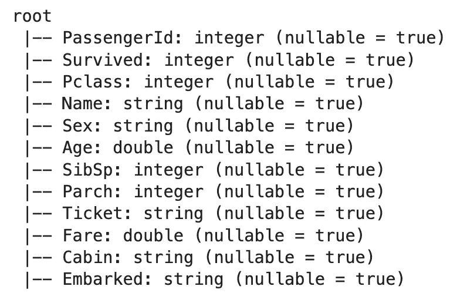
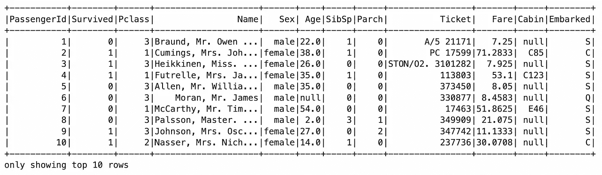
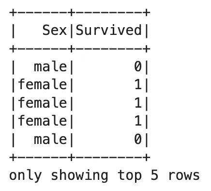
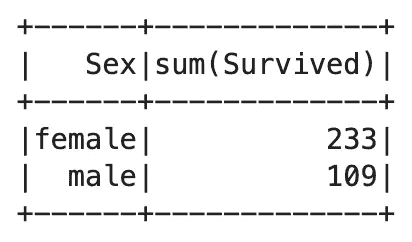
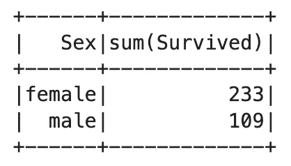
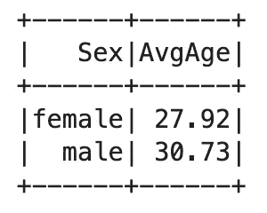
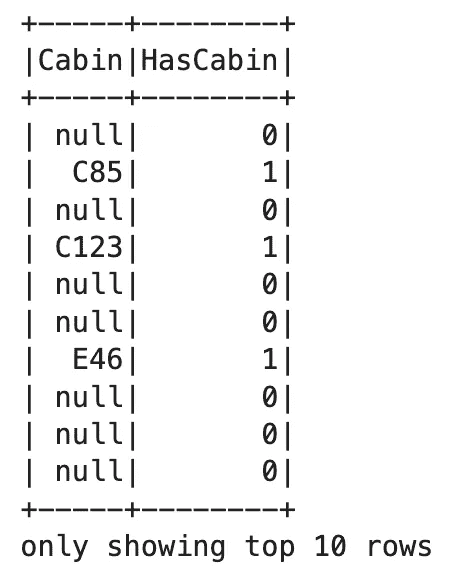
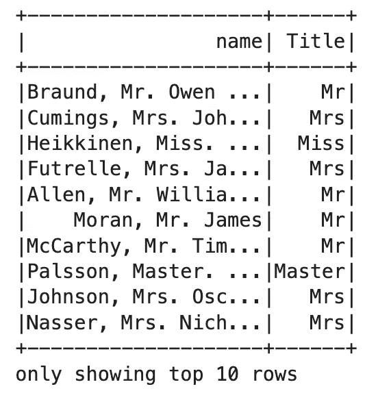
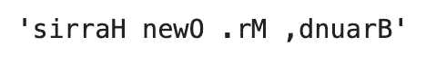
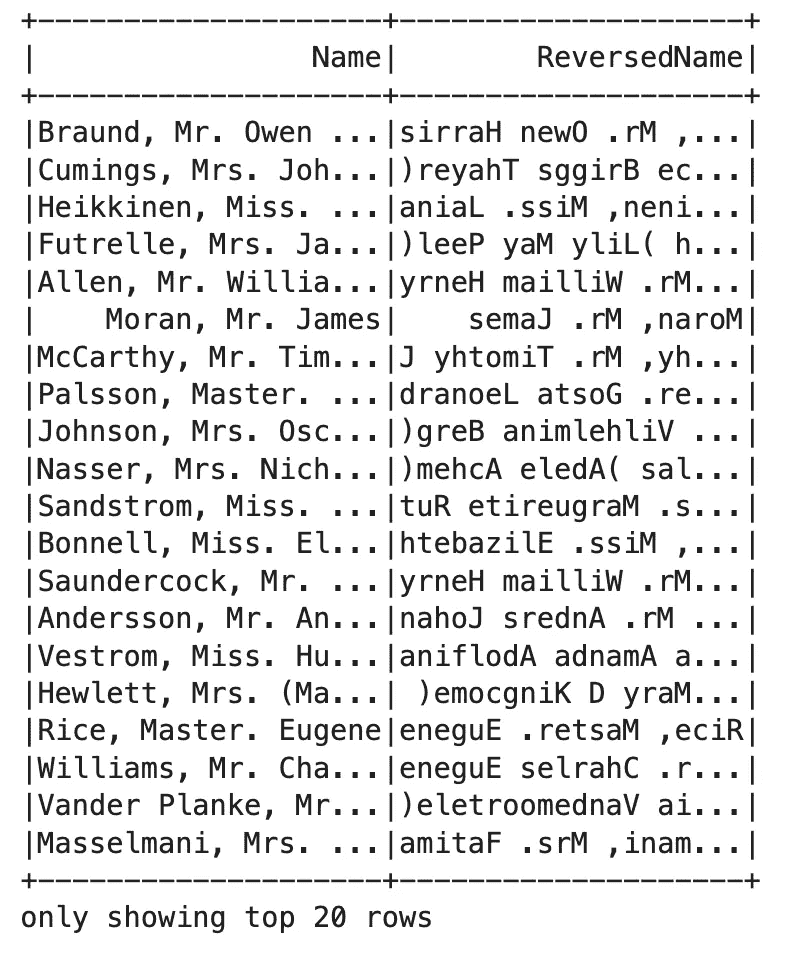

# Apache Spark for Data Science—Spark SQL 实践介绍

> 原文：<https://towardsdatascience.com/apache-spark-for-data-science-hands-on-introduction-to-spark-sql-43177fcf741c>

## spark SQL—10 分钟内从基础到正则表达式和用户定义函数(UDF)


照片由[乔纳斯·弗雷](https://unsplash.com/@jonasfrey?utm_source=medium&utm_medium=referral)在 [Unsplash](https://unsplash.com?utm_source=medium&utm_medium=referral) 上拍摄

Spark 中的数据帧是 [RDDs](https://betterdatascience.com/apache-spark-rdd-basics/) 的自然扩展。它们非常类似于您通常在 Pandas 中看到的数据结构，但是有一个额外的功能——您可以用 SQL 直接操作它们。没错，您可以使用数据语言在本地和集群上处理大型数据集。

今天，我们将保持简单，探索 Spark SQL 的基础知识。您将首先学习如何通过使用函数调用来完全避免 SQL。我喜欢尽可能地使用 SQL，因此本文的大部分内容将围绕聚合函数、条件逻辑、正则表达式和用户定义的函数展开——所有这些都在 SQL 中。

不想看书？请观看我的视频:

# 使用的数据集

为了使事情更加简单，我们将使用泰坦尼克号数据集。从[这个网址](https://raw.githubusercontent.com/datasciencedojo/datasets/master/titanic.csv)下载并保存在你记得的地方:


图片 1 —泰坦尼克号数据集(图片由作者提供)

该数据集包含的功能比虹膜数据集多得多。对于用户定义的函数和正则表达式来说，这些将会派上用场。但首先，让我们看看如何加载它的火花。

# 如何用 Spark DataFrame API 读取 CSV 文件

如果您在笔记本环境中使用 PySpark，请始终使用此代码片段以获得更好的输出格式。否则，如果一次在屏幕上看到的列太多，数据帧可能会溢出:

```
from IPython.core.display import HTML
display(HTML("<style>pre { white-space: pre !important; }</style>"))
```

解决了这个问题后，我们可以初始化一个新的 Spark 会话:

```
from pyspark.sql import SparkSession spark = SparkSession.builder.appName("spark-sql").getOrCreate()
```

要读取 CSV 文件，只需指定`read`模块的`csv()`函数的路径。每当读取 CSV 文件时，`inferSchema`和`header`参数是强制性的。如果没有它们，Spark 会将所有数据类型转换为 string，并将标题行视为实际数据:

```
titanic = spark.read.csv(
    path="file://<dataset-path>", 
    inferSchema=True, 
    header=True
)
titanic.printSchema()
```



图片 2-泰坦尼克号数据集的推断模式(图片由作者提供)

数据类型看起来是正确的，所以让我们打印前 10 行，以验证一切正常:

```
titanic.show(10)
```



图 3——泰坦尼克号数据集的前 10 行(图片由作者提供)

这就是我们开始分析泰坦尼克号数据集所需要的。

## 使用 Spark 函数调用的数据聚合

您不需要使用 SQL 来处理 Spark 数据帧。每样东西都有专用的功能。例如，您可以使用`select()`函数来隔离任何感兴趣的列:

```
titanic.select("Sex", "Survived").show(5)
```



图 4 —使用 Spark 的 DataFrame API 选择列(图片由作者提供)

在那里，您还可以通过对分类变量进行分组并传递聚合函数来聚合数据集。以下示例显示了每个性别的幸存乘客人数:

```
titanic.select("Sex", "Survived").groupBy("Sex").sum().show()
```



图 Spark 中的聚合计算(图片由作者提供)

向前看，你有两个选择。您可以继续链接函数，或者多次重新声明一个变量以提高可读性。如果这两个听起来都不好玩，你绝对应该试试 SQL 语法。

# 如何使用 Spark SQL 查询 Spark 数据帧

在 Spark 中使用 SQL 之前，首先需要创建一个临时视图。这是通过在 DataFrame 上调用`createOrReplaceTempView()`函数，并传入一个视图名(任意一个)来完成的。

创建后，在对`spark.sql()`的调用中传递任何 SQL 语句:

```
titanic.createOrReplaceTempView("titanic")spark.sql("SELECT * FROM titanic").show(5)
```


图片 6——泰坦尼克号数据集的前 5 行(图片由作者提供)

如果您知道`GROUP BY`子句是如何工作的，那么在 SQL 中重新创建上一节中的数据帧要简单得多:

```
spark.sql("""
    SELECT 
        Sex,
        SUM(Survived)
    FROM titanic
    GROUP BY Sex
""").show()
```



图 7 —使用 Spark SQL 进行聚合计算(图片由作者提供)

很简单，对吧？我们可以用类似的方法计算每个性别的平均年龄。`ROUND()`函数将结果四舍五入到两位小数，使结果更具可读性:

```
spark.sql("""
    SELECT
        Sex,
        ROUND(AVG(Age), 2) AS AvgAge
    FROM titanic
    GROUP BY Sex
""").show()
```



图 8 —使用 Spark SQL (2)进行聚合计算(图片由作者提供)

## 带有 CASE 运算符的条件逻辑

`Cabin`栏目问题比较大。它最常见的值是`NULL`，表示乘客没有客舱，或者不知道给定乘客的客舱。

我们可以使用 SQL 的`CASE`操作符让这个列变得有用。下面的示例创建了一个列`HasCabin`，如果`Cabin`不是`NULL`，则该列的值为 1，否则为 0:

```
spark.sql("""
    SELECT
        Cabin,
        CASE 
            WHEN Cabin IS NOT NULL THEN 1
            ELSE 0 
        END AS HasCabin
    FROM titanic
""").show(10)
```



图 SQL 查询中的条件逻辑(作者图片)

## 使用正则表达式的特征工程

正则表达式有时感觉像外语，但它们在数据科学和数据分析中有许多用例。例如，`Name`列在第一个逗号符号后附加了一个标题给每个乘客。我们可以在 Spark SQL 中使用正则表达式来提取它:

```
spark.sql("""
    SELECT
        name,
        REGEXP_EXTRACT(name, ' ([A-Za-z]+)\.') AS Title
    FROM titanic
""").show(10)
```



图 10 —使用正则表达式提取乘客标题(作者图片)

这里最困难的部分是提出合适的正则表达式。对于不同的用例，比如电话号码和电子邮件地址，网上有很多这样的信息，所以请记住这一点。没有必要重新发明轮子。

# 如何在 Spark SQL 中使用用户定义函数(UDF)

Spark SQL 没有附带您需要的函数？这就是用户定义函数发挥作用的地方。在 PySpark 中，您可以创建一个 Python 函数，并用 PySpark SQL `udf()`包装它，将其注册为用户定义的函数。

今天我们保持简单，声明一个反转字符串的 Python 函数。稍后将使用该函数来反转名称。不是特别有用的功能，但这不是重点。

下面是该函数的声明和用法示例:

```
def reverse_name(name):
    return name[::-1]

reverse_name("Braund, Mr. Owen Harris")
```



图 11-使用 Python 反转字符串(图片由作者提供)

要在 PySpark 中使用它，首先必须将 Python 函数注册为用户定义的函数。第一个参数指定您将在 SQL 中使用的名称，第二个参数是 Python 函数本身。

注册后，您可以在 Spark SQL 中自由使用它:

```
spark.udf.register("reverse_name", reverse_name)spark.sql("""
    SELECT 
        Name,
        reverse_name(Name) AS ReversedName
    FROM titanic
""").show()
```



图 12 —在 Spark SQL 中使用 UDF(图片由作者提供)

没有比这更简单的了。用户定义的函数是一个值得在另一篇文章中讨论的主题，所以今天我就不深入讨论了。

# Python 中 Spark SQL 概述

现在，您已经拥有了 Spark SQL 的基础知识，只需几分钟。您已经学到了很多—从阅读 CSV 文件到使用正则表达式和用户定义函数进行特征提取。一下子要处理的东西太多了，所以你可以随意浏览这些材料，直到他们完全理解为止。

在 Spark 中，用户自定义函数让一切皆有可能。即使您不知道如何在 SQL 中做一些事情，您也可以轻松地将逻辑包装在 Python 函数中，并在 SQL 语句中使用 UDF。这肯定是我们将在以后的文章中探讨的一个领域。

接下来，我们将把[字数](https://betterdatascience.com/apache-spark-word-count/)的解决方案从 RDDs 改写成 DataFrames，敬请关注。

*喜欢这篇文章吗？成为* [*中等会员*](https://medium.com/@radecicdario/membership) *继续无限制学习。如果你使用下面的链接，我会收到你的一部分会员费，不需要你额外付费。*

<https://medium.com/@radecicdario/membership>  

## 推荐阅读

*   [学习数据科学先决条件(数学、统计和编程)的 5 本最佳书籍](https://betterdatascience.com/best-data-science-prerequisite-books/)
*   [2022 年学习数据科学的前 5 本书](https://betterdatascience.com/top-books-to-learn-data-science/)
*   [用 Python 打印列表的 7 种方法](https://betterdatascience.com/python-list-print/)

## 保持联系

*   雇用我作为一名[技术作家](https://betterdatascience.com/contact/)
*   在 YouTube[上订阅](https://www.youtube.com/c/BetterDataScience)
*   在 [LinkedIn](https://www.linkedin.com/in/darioradecic/) 上连接

*原载于 2022 年 4 月 21 日 https://betterdatascience.com*<https://betterdatascience.com/apache-spark-sql/>**。**