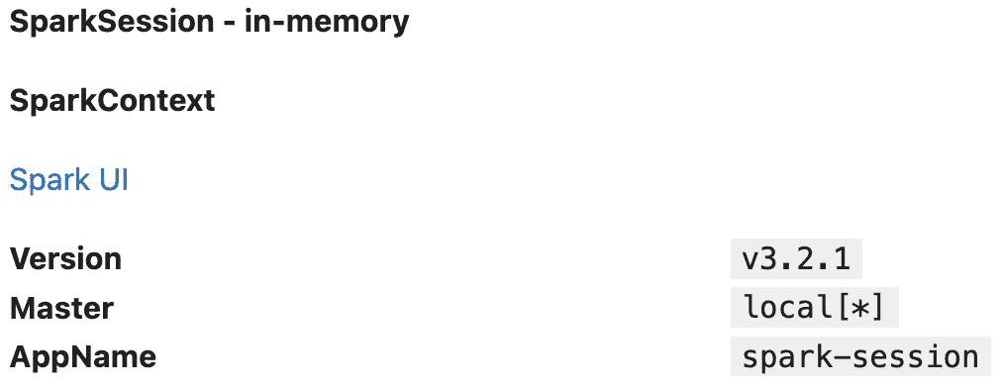
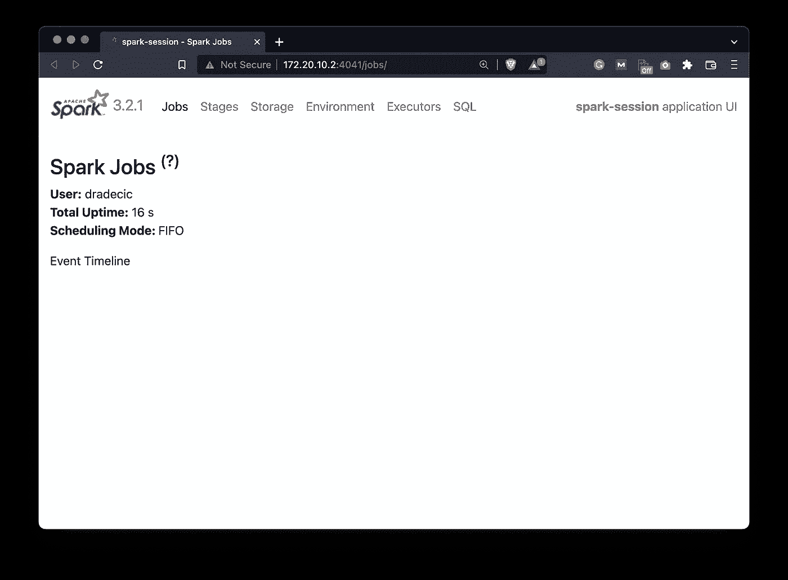
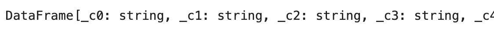
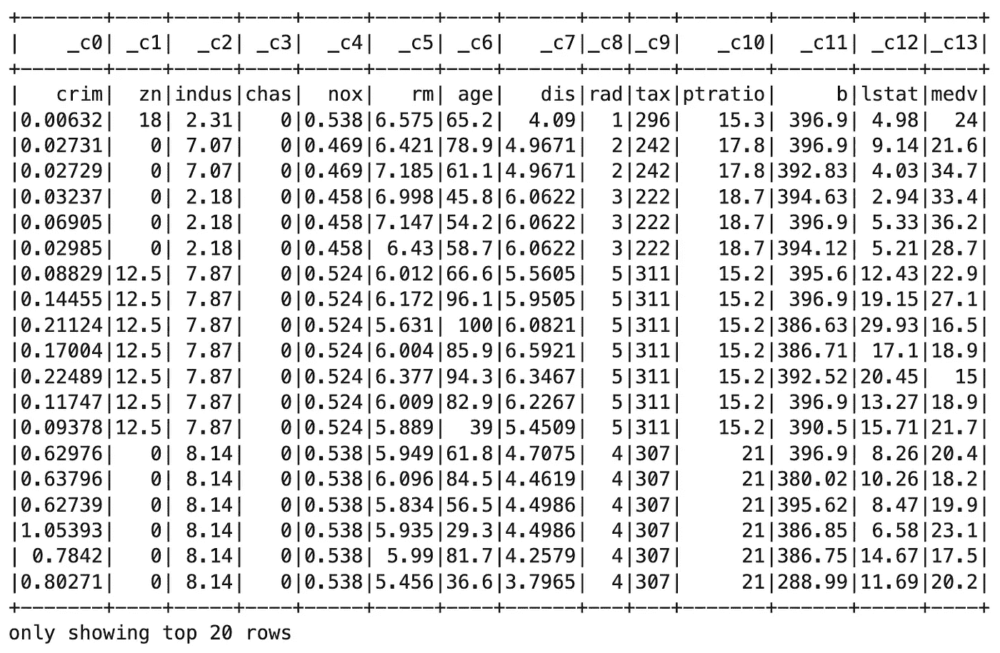
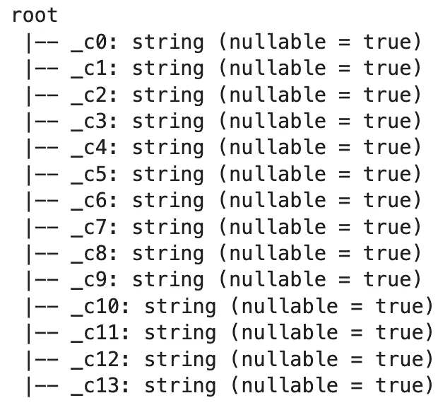
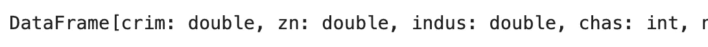
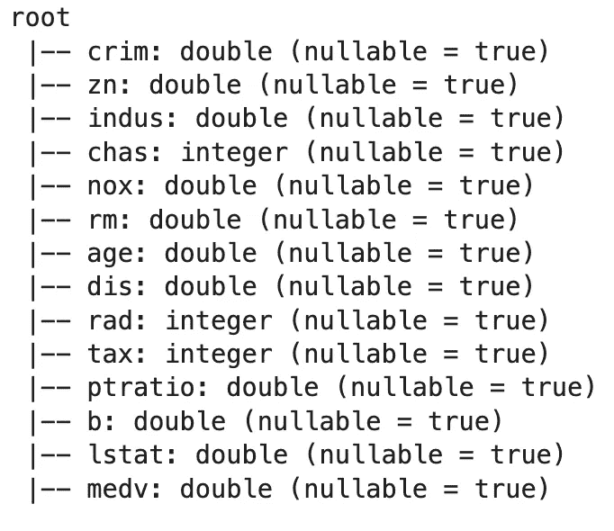

# Apache Spark for Data Science —如何安装和使用 PySpark

> 原文：<https://towardsdatascience.com/apache-spark-for-data-science-how-to-install-and-get-started-with-pyspark-6367a1ea3de8>

## **本地安装 PySpark 并加载您的第一个数据集——仅需 5 分钟**


照片由[杰兹·蒂姆斯](https://unsplash.com/@jeztimms?utm_source=medium&utm_medium=referral)在 [Unsplash](https://unsplash.com?utm_source=medium&utm_medium=referral) 上拍摄

在大数据的世界里，知道如何高效地处理庞大的数据集是必须的。这就是 Apache Spark 的切入点。这是一个数据处理框架，用于在大型数据集上执行数据处理任务。Spark 还允许您在多台计算机上分配数据处理任务。

Spark 是用 Scala 编写的，但是你不需要了解 Scala 就可以使用 Spark。它附带了一个名为 *PySpark* 的 Python API，这就是我们今天要用的。这个 API 不是很 Pythonic 化，因为它们使用了 camel case 命名约定。这对 Python 用户来说有点眼疼，但这是你必须习惯的。

我的目标是编写一个完整的 Spark 系列，涵盖重要的主题，如 Python 中的 Spark、Spark SQL、使用 Spark 的机器学习、流和不同提供商(如 Amazon EMR 和 DataBricks)上的云中的 Spark。

要开始使用 PySpark，我们首先需要创建一个新的 Python 虚拟环境并安装库。让我们接下来做那件事。

不想看书？请观看我的视频:

# Apache Spark 的虚拟环境设置(PySpark)

让我们首先打开一个新的终端窗口，并创建一个新的 Python 虚拟环境。我使用 Anaconda 来管理环境。如果您使用的是`pyenv`或类似的东西，过程会有所不同:

```
conda create --name spark_env python=3.9 -y
conda activate spark_env
```

从这里我们可以安装库。我总是喜欢安装 Numpy 和 Pandas，但是今天它们不是必需的。我们将使用 JupyterLab 作为 IDE，所以我们也将安装它。

一旦安装了这些，我们就可以用 Pip 安装 PySpark 了:

```
conda install -c conda-forge numpy pandas jupyter jupyterlab
pip install pyspark
```

一切都安装好了，让我们启动 Jupyter:

```
jupyter lab
```

最后一步是下载数据集。Spark 通常用于大型数据集，但为了简单起见，在这一点上，我们将使用一个小型数据集。我选择了[波士顿房价数据集](https://www.kaggle.com/datasets/vikrishnan/boston-house-prices)，所以下载它并把它放在某个地方，最好是放在你的笔记本所在的文件夹里。

这就是我们开始使用 PySpark 所需的全部内容。接下来让我们探索一下基础。

# 如何用 Python 启动 Spark 会话

好了，现在你应该已经下载了数据集并运行 Jupyter 了。打开一个空白的 Jupyter 笔记本—在开始使用 Spark 之前，有一件重要的事情是您一直想做的。

它与视觉有关。Spark 数据框不会打印为熊猫数据框。如果列太多，它们很可能会溢出到新的一行，这看起来很糟糕。在所有使用 Spark 的笔记本电脑中编写以下代码来缓解该问题:

```
from IPython.core.display import HTML
display(HTML("<style>pre { white-space: pre !important; }</style>"))
```

从这里我们可以开始 Spark 会话。您可以将该会话视为 Spark SQL 的入口点。这是您在使用 Spark SQL 应用程序和数据管道时首先要创建的东西。

```
from pyspark.sql import SparkSessionspark = SparkSession.builder.appName("spark-session").getOrCreate()
```

会话信息现在存储在`spark`变量中，所以让我们看看它包含了什么:

```
spark
```



图 spark 变量的内容(图片由作者提供)

这里没有什么特别有趣的，因为我们在本地运行 Spark。您可以看到一个指向 Spark UI 的链接，让我们点击它:



图 2 — Spark 用户界面(图片由作者提供)

它几乎是空的，因为我们还没有运行任何代码，但是如果您在文章结尾打开 Spark UI，您会看到很多输出。

让我们回到笔记本，开始处理数据。在阅读数据集时，有几件事你应该知道，所以接下来让我们来看一下。

# 如何用 Spark 和 Python 读取数据集

没有人会停止使用 read CSV 方法，就像你在熊猫身上做的一样:

```
df = spark.read.csv("../BostonHousing.csv") 
df
```



图 3—df 变量的内容(作者提供的图片)

但是你可以看到，它有几个问题。首先，列名是自动生成的，我们不希望这样，因为 CSV 文件有一个标题行。第二，所有的列都被转换成字符串，实际的数据集只包含数字数据。

让我们来看看几个 PySpark 方法来验证这些说法。第一个名为`.show()`，它将在笔记本中显示我们的数据集。默认情况下，它只显示 20 行:

```
df.show()
```



图片 4-波士顿住房数据集的前 20 行(图片由作者提供)

这里可以看到第一个问题。列名是由 PySpark 生成的，所以实际的 CSV 标题行被认为是一个值。因此，所有列都是字符串，而不是浮点和整数。

`.printSchema()`方法将为这种说法提供具体证据:

```
df.printSchema()
```



图 5-默认数据集模式(作者提供的图片)

你可以看到一切都是字符串，这不是我们想要的。有一个简单的解决方法，就是在读取数据集时提供两个额外的参数:

```
df = spark.read.csv("../BostonHousing.csv", header=True, inferSchema=True) 
df
```



图 6-正确读取后的数据集(作者提供的图片)

从输出中，我们可以看到所有列的数据类型不是 int 就是 double。 *Double* 不是 Python 中的实际数据类型。它来自 Scala，但是 Python 不会有任何问题。

我们可以再次打印模式，以验证我们现在拥有正确的数据类型:

```
df.printSchema()
```



图 7-正确读取后的数据集模式(图片由作者提供)

看起来一切正常，这意味着我们今天可以到此为止。我不想讨论使用列和数据聚合的细节。我们将在下一篇文章中讨论这个问题。

# Apache Spark for Data Science 概述

今天，我们已经为 Apache Spark 系列的后续文章奠定了基础。您已经成功安装了 PySpark，并了解了如何加载数据集。下一步是学习如何使用它们，这也是接下来的文章将要讨论的内容。

下一篇文章将向您展示如何用类似 Pandas 的语法操作和处理数据，下一篇文章将向您展示如何用类似 SQL 的命令做同样的操作。Spark 完全可以接受这两者，你会选择哪一个取决于个人偏好。如果您每天都要编写大量的 SQL，那么为什么不使用 Spark SQL 呢？

请继续关注即将到来的文章，我会确保在几天内发布它们。

喜欢这篇文章吗？成为 [*中等会员*](https://medium.com/@radecicdario/membership) *继续无限制学习。如果你使用下面的链接，我会收到你的一部分会员费，不需要你额外付费。*

[](https://medium.com/@radecicdario/membership)  

## 推荐阅读

*   [学习数据科学先决条件(数学、统计和编程)的 5 本最佳书籍](https://betterdatascience.com/best-data-science-prerequisite-books/)
*   [2022 年学习数据科学的前 5 本书](https://betterdatascience.com/top-books-to-learn-data-science/)
*   [用 Python 打印列表的 7 种方法](https://betterdatascience.com/python-list-print/)

## 保持联系

*   雇用我作为一名技术作家
*   订阅 [YouTube](https://www.youtube.com/c/BetterDataScience)
*   在 [LinkedIn](https://www.linkedin.com/in/darioradecic/) 上连接

*原载于 2022 年 4 月 7 日 https://betterdatascience.com**的* [*。*](https://betterdatascience.com/apache-spark-introduction/)